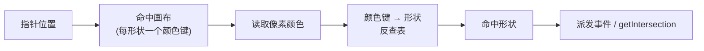

import { Canvas, Controls, Meta } from '@storybook/addon-docs/blocks';
import * as HitDetection from './hit-detection.stories';

<Meta of={HitDetection} name="Docs" />

# 命中检测

命中检测回答一个问题：**指针落在了哪个形状上？** 它决定了 `click`、`mousemove`、`tap` 等事件的 `target`，也是拖拽、悬停、选区交互的基础。

Konva 不用几何运算判断命中，而是给每个 Layer 维护一张与可见画布平行的**命中画布**（hit canvas）：每个可命中形状在命中画布上用自己的**颜色键**（一个全局唯一的颜色）画一遍；指针事件发生时，Konva 只需读取命中画布上指针位置那一个像素的颜色，经颜色键反查就拿到命中形状。因此命中是**像素级精确**的——弯曲的路径、透明叠加、不规则边缘都自动正确，不需要你写任何包含点判断。

这条机制最直接的推论是：**可见图形未必等于可点击区域。** 命中画布上的路径可以和可见画布不同，于是有了三个核心抓手——自定义命中区域（`hitFunc`）、描边命中宽度（`hitStrokeWidth`）、以及用 `listening` 把形状整块移出命中画布。



命中检测常用属性与方法（已与 Konva 10.3 文档核对）：

| 属性 / 方法 | 所属 | 默认值 | 作用 |
| --- | --- | --- | --- |
| `listening` | Node | `true` | 是否进入命中画布；`false` 时被 `getIntersection` 与事件忽略 |
| `hitFunc` | Shape | 未设置（用 `sceneFunc`） | 自定义命中区域路径 |
| `hitStrokeWidth` | Shape | `'auto'`（= `strokeWidth`） | 命中画布上描边的粗细 |
| `perfectDrawEnabled` | Shape | `true` | 填充+描边+透明度的正确合成；`false` 提速但可能有伪影 |
| `hitGraphEnabled` | Layer | `true`（**已废弃**） | 用 `layer.listening(false)` 代替 |
| `strokeHitEnabled` | Shape | `true`（**已废弃**） | 用 `hitStrokeWidth` 代替 |
| `getIntersection(pos)` | Stage / Layer | — | 查询某点最上层的可命中形状，无命中返回 `null` |

## 命中画布与颜色键

命中画布是理解一切命中行为的钥匙。它的生命周期和可见画布绑定：每次 `layer.batchDraw()` 重绘时，Konva 同步把所有 `listening: true` 的形状按各自的 `hitFunc`（未设置则用 `sceneFunc`）画到命中画布上，用形状的颜色键作为填充色。事件触发时，Konva 在命中画布上取指针位置的颜色，反查到形状——这就是 `event.target` 的来源。

三个推论值得记住：

- **全局合成模式不影响命中。** `globalCompositeOperation` 只作用于可见画布；命中画布始终按默认合成，所以即便形状用了混合模式，事件依然正常派发。
- **`visible: false` 的形状不可命中。** 它既不绘制到可见画布，也不进入命中画布。
- **命中画布的重绘有成本。** 形状多时，命中画布的同步重绘是性能开销之一，这正是 `listening(false)` 能提速的原因。

实例把这套机制可视化：一个五角星放在铺满舞台的背景之上。**在画布上移动指针**，读数「命中目标」实时显示 `stage.getIntersection()` 的返回值——也就是命中画布在那个像素检测到的形状。把「显示命中区域」打开，半透明青色覆盖层会标出星形在命中画布上的实际范围，让你直接对比「看得见的星形」和「点得中的区域」。

<Canvas of={HitDetection.Interactive} />
<Controls of={HitDetection.Interactive} />

| 读者操作 | 可观察证据 |
| --- | --- |
| 移动指针 | 红点与读数「命中目标」跟随指针，反映 `getIntersection` 的实时结果 |
| 「命中区域」选 `circle` | 命中范围变成半径 96 的大圆；指针落在星臂空隙仍读「星形」 |
| 「命中区域」选 `compact` | 命中范围缩成半径 22 的小圆；指针落在星尖反而读「背景」 |
| 「命中区域」选 `star` | 命中范围与可见星形重合（默认行为） |
| 关掉「星形可命中」 | 星形整块从命中画布移除；指针移到星形上方仍读「背景」 |
| 打开「显示命中区域」 | 青色覆盖层标出当前命中范围，可直观对比可见图形与可点击区域 |
| 打开 Show code | 看到该 Canvas 实际执行的 `example.ts` |

程序里无需等事件也能主动查询命中——`stage.getIntersection(pos)` 和 `layer.getIntersection(pos)` 直接读命中画布，返回最上层的可命中形状或 `null`：

```ts
const shape = stage.getIntersection({ x: 50, y: 50 });
// 返回指针位置最上层的可命中形状；listening:false 的节点被跳过，无命中返回 null
```

> **用 `getIntersection`，少用 `getAllIntersections`。** `getAllIntersections(pos)` 返回某点的**全部**命中形状，但它要清空一张临时画布、重画容器内每个形状，文档明确说「performs very poorly」。日常点击检测只用 `getIntersection`（取最上层那个）。

## 自定义命中区域

默认情况下，命中画布画的路径就是 `sceneFunc`——你看到什么，就能点什么。当默认区域不合适时，有两个独立调节命中的入口：整体替换路径的 `hitFunc`，和只调描边命中粗细的 `hitStrokeWidth`。

### hitFunc

`hitFunc` 接收一个绘制函数，签名为 `(context) => void`，内部像写 `sceneFunc` 一样定义路径，末尾调用 `context.fillStrokeShape(shape)` 收尾。Konva 用这条路径在命中画布上画颜色键，可见画布则仍由 `sceneFunc` 负责——于是命中区域可以更大、更小，或完全是另一种几何。

```ts
// 让这条细星形的命中区域变成一个大圆——更好点中
star.hitFunc(function (context) {
  context.beginPath();
  context.arc(0, 0, 80, 0, Math.PI * 2);
  context.closePath();
  context.fillStrokeShape(this);
});
```

最常见的用法是**给难以点中的形状放大命中区**：细线条、小图标、星形的尖角空隙。实例的「命中区域」控件就是切换 `hitFunc`：选 `circle` 时星形的命中区变成大圆，指针落在星臂之间也能命中；选 `compact` 时反过来缩成小圆，连星尖都点不中。把「显示命中区域」打开，青色覆盖层画的就是 `hitFunc` 定义的那条路径。

写 `hitFunc` 时注意：路径围绕形状的**本地原点** `(0,0)` 绘制（与 `sceneFunc` 一致），平移和旋转由形状自身的 `x` / `y` / `rotation` 负责，不要在 `hitFunc` 里再叠加。末尾的 `context.fillStrokeShape(shape)` 不能省——命中画布靠它把颜色键填进路径。

### hitStrokeWidth

`hitStrokeWidth` 只调节**描边**在命中画布上的粗细，独立于可见的 `strokeWidth`。默认 `'auto'` 表示与可见描边同宽；设成数字则命中描边按该宽度绘制，让细线、未闭合路径更容易被点中。

```ts
line.strokeWidth(1);            // 可见描边 1px（很细）
line.hitStrokeWidth(20);        // 命中描边 20px（容易点中）
line.hitStrokeWidth('auto');    // 默认：命中宽度 = strokeWidth
```

这对 `Konva.Line` 尤其有用：一条 1 像素的折线默认几乎点不中，把 `hitStrokeWidth` 调大就能舒适命中，而不必加粗可见线条。老版本的 `strokeHitEnabled`（默认 `true`）是它的前身，现已废弃——设 `strokeHitEnabled(false)` 会完全不把描边画进命中画布，等价于只让填充可命中，新代码请改用 `hitStrokeWidth`。

## 关闭命中与性能

让形状或整层不参与命中，既是交互需要（让指针穿透装饰层），也是性能手段（命中画布的同步重绘是实打实的开销）。统一用 `listening` 控制：

```ts
shape.listening(false);   // 移出命中画布：不触发事件，getIntersection 也跳过
layer.listening(false);   // 整层不绘制命中画布——大幅减少每次重绘的工作量
```

`listening` 在三个层面都有效，且语义一致——`false` 即「不进入命中画布」：

- **形状级** `shape.listening(false)`：单个形状不可命中、不可触发事件，但仍正常绘制。实例关掉「星形可命中」就是这一层。
- **层级** `layer.listening(false)`：整层跳过命中画布的绘制。对只用来展示、不需要交互的 Layer（背景、装饰、只读图表），这是收益最大的优化——每次重绘省掉一整张命中画布的绘制。它替代了已废弃的 `layer.hitGraphEnabled(false)`、`disableHitGraph()`。
- **组级** `group.listening(false)`：组及其所有子节点一起移出命中画布。

> **`listening` 会沿祖先链生效。** 一个形状真正可命中，要求它自己和**所有祖先**的 `listening` 都为 `true`。用 `node.isListening()` 判断真实状态——它会向上查到 Stage；只读 `node.listening()` 只看自身。

`visible` 与 `listening` 都能让形状不可命中，区别在于：`visible: false` 连可见画布一起隐藏；`listening: false` 仍然画出来，只是不参与命中。需要「看得见但点不穿」时用 `listening`。

与命中相关的渲染性能还有一项：`perfectDrawEnabled`（默认 `true`）。当一个形状同时有填充、描边且整体设了 `opacity < 1` 时，默认会借助缓冲画布正确合成重叠的填充与描边；设成 `false` 跳过这层缓冲可提速，但边缘可能出现细微伪影。它影响的是可见画布的合成质量，不改变命中行为。

## 常见问题

- **形状能看见，但 `click` / `mousemove` 不触发，`getIntersection` 也返回 `null`。**
  依次检查：该形状或它的某个祖先（Group / Layer）是否设了 `listening(false)`；形状是否 `visible(false)`（隐藏即不可命中）；`hitFunc` 是否漏写了 `context.fillStrokeShape(shape)`（路径没被画进命中画布）。三者都不会报错。

- **细线 / 小图标几乎点不中。**
  用 `hitStrokeWidth(20)` 加宽描边的命中区（线条），或用 `hitFunc` 画一个更大的命中几何（图标）。不要靠加粗可见 `strokeWidth`——那会改变外观。

- **自定义 `hitFunc` 后命中位置偏了。**
  `hitFunc` 的路径要围绕形状本地原点 `(0,0)` 画，位移 / 旋转交给形状的 `x` / `y` / `rotation`。在 `hitFunc` 里手动加坐标偏移会与 Konva 自身的变换叠加，导致命中区与可见图形错位。

- **整层都不需要交互，怎么提速？**
  `layer.listening(false)` 直接跳过该层命中画布的绘制。这是替代已废弃 `hitGraphEnabled(false)` 的官方做法。注意：关闭后该层所有形状都不再触发事件。

## 总结回顾

摘要：

Konva 的命中检测靠每层一张独立的命中画布：每个可命中形状用自己的颜色键画一遍，指针事件发生时读取命中画布上指针像素的颜色反查出形状，因此命中是像素级精确的，且可见图形未必等于可点击区域。要改变可点击区域，用 `hitFunc` 整体替换命中路径（常见于放大细小形状的命中区），或用 `hitStrokeWidth` 单独调节描边的命中粗细。`listening` 在形状、组、层三级统一控制是否进入命中画布——`false` 即被 `getIntersection` 与事件忽略；层级关闭是最大的性能优化，替代已废弃的 `hitGraphEnabled`。日常点查询用 `stage.getIntersection(pos)`，避免慢速的 `getAllIntersections`。`globalCompositeOperation` 不影响命中，`visible:false` 则连可见带命中一起移除。

一句话：

> Konva 在可见画布之外维护一张按颜色键绘制的命中画布——你能点什么，取决于命中画布上画了什么，而非你看到了什么。

知识要点：

- 命中画布与颜色键如何配合，得出事件 `target`？
- `hitFunc` 与 `sceneFunc` 的关系是什么？默认未设置时命中区域由谁决定？
- `hitStrokeWidth` 的默认值是什么？为什么对细线特别有用？
- `listening(false)` 在形状级和层级分别有什么效果？替代了哪个已废弃 API？
- 一个形状「真正可命中」需要满足什么祖先链条件？用什么方法判断？
- 主动查询某点的命中形状，该用哪个方法？为什么少用 `getAllIntersections`？
- `visible(false)` 与 `listening(false)` 在命中检测上的区别是什么？

## 参考资料

- [Konva API — Konva.Node（listening / isListening / getIntersection）](https://konvajs.org/api/Konva.Node.html)
- [Konva API — Konva.Shape（hitFunc / sceneFunc / hitStrokeWidth / perfectDrawEnabled）](https://konvajs.org/api/Konva.Shape.html)
- [Konva API — Konva.Layer（listening / getIntersection / toggleHitCanvas）](https://konvajs.org/api/Konva.Layer.html)
- [Konva API — Konva.Stage（getIntersection / getPointerPosition）](https://konvajs.org/api/Konva.Stage.html)
- [Konva 文档 — Listen/Don't listen to events（listening 属性）](https://konvajs.org/docs/events/Listen_for_Events.html)
- [Konva 文档 — Binding Events（事件绑定与命中目标）](https://konvajs.org/docs/events/Binding_Events.html)
