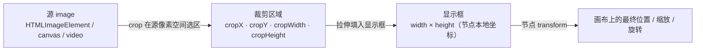

import { Canvas, Controls, Meta } from '@storybook/addon-docs/blocks';
import * as KonvaImage from './image.stories';

<Meta of={KonvaImage} name="Docs" />

# 图片

`Konva.Image` 把一张已经加载好的位图（或 `canvas`、`video`）画进节点树。它和 `Rect`、`Circle` 一样继承自 `Konva.Shape`，共享填充、描边、阴影与变换能力；它的特殊性在于「尺寸」分成了三层：**源**（原始位图）、**显示框**（节点的 `width`/`height`）、以及一层可选的**裁剪区域**（在源像素空间取一块）。把这三层关系理清，加载、裁剪、缩放的结果就都能提前预测。

最值得先建立的直觉是：图片在画布上的最终样子，是「先从源里取一块、再把这块拉伸填进显示框、最后整体随节点 transform 落到画布上」。所以同一个源，只要改显示框比例或裁剪区域比例，就能得到完全不同的画面，而源本身始终没动。



| 属性 / 默认 | 含义与回查 |
| --- | --- |
| `image`（无默认） | 源对象：`HTMLImageElement`、`HTMLCanvasElement`、`HTMLVideoElement`；设为 `undefined` 时节点什么都不画 |
| `width` / `height`（未设时回退到源固有尺寸） | 显示框尺寸（节点本地坐标）；都未设且源也无尺寸时为 `0`，画不出图形 |
| `crop` `{ x, y, width, height }`（默认全 `0`） | 在**源像素**空间选矩形；可传复合对象，也可用 `cropX`/`cropY`/`cropWidth`/`cropHeight` 单独设 |
| `cornerRadius`（默认 `0`） | 圆角，单值或四元数组 `[tl, tr, br, bl]`；设了非零值会按圆角路径裁剪图像 |
| `x` / `y`（默认 `0`） | 显示框左上角相对父容器（继承自 `Node`） |

## 加载图片

`Konva.Image` 自己**不负责下载**——它只接收一个已经可用的源。最常见的做法是先 `new Image()`，等 `onload` 触发再把已加载的元素交给 `Konva.Image`。关键在于：浏览器解码是异步的，若在 `onload` 之前就构造节点并把 `src` 设进去，画面初次绘制时源还没数据，节点会画成空的。Konva 会监听源的 `load` 事件并自动请求重绘，所以更稳妥的写法是「先把 image 交给节点、再设 `src`」，让 Konva 帮你挂上 load 监听；但把构造放进 `onload` 里同样是官方示例的常见形态。

```ts
import Konva from 'konva';

// 写法 A：在 onload 里构造节点（官方示例形态）。
const imageObj = new Image();
imageObj.onload = () => {
  const yoda = new Konva.Image({
    x: 50,
    y: 50,
    image: imageObj,   // 已加载的 HTMLImageElement
    width: 106,
    height: 118,
  });
  layer.add(yoda);     // add 会触发自动重绘
};
imageObj.src = '/assets/yoda.jpg';

// 写法 B：先建节点再设 src，依赖 Konva 的 load 自动重绘。
const other = new Image();
const node = new Konva.Image({ x: 200, y: 50, image: other, width: 100, height: 100 });
layer.add(node);
other.src = '/assets/yoda.jpg';   // 加载完成后 Konva 自动 _requestDraw
```

如果不想自己写 `new Image()` + `onload`，可以用静态方法 `Konva.Image.fromURL(url, callback, onError)`：它内部建 `Image`、设 `crossOrigin = 'Anonymous'`、加载完成后回调给你一个已带源的 `Konva.Image` 实例。注意它不会替你设 `width`/`height`，节点尺寸默认回退到源固有尺寸。

```ts
Konva.Image.fromURL('/assets/darth-vader.jpg', (darthNode) => {
  darthNode.setAttrs({ x: 200, y: 50, scaleX: 0.5, scaleY: 0.5 });
  layer.add(darthNode);
});
```

`image` 属性除了 `HTMLImageElement`，还接受 `HTMLCanvasElement` 和 `HTMLVideoElement`——这意味着你可以把一个离屏 canvas 当作图片源（下面实例就是这么做的，既自包含又让裁剪来源一目了然），也可以把 `video` 元素接进来逐帧呈现。替换 `image()` 后，因为 `_attrsAffectingSize` 包含 `image`，若 `width`/`height` 未显式设置，节点尺寸会跟随新源重新派生。

## 显示尺寸

`Konva.Image` 的 `width`/`height` 是**显示框**，单位是节点本地坐标，和源图的固有像素数是两件事：源是 4000×3000 的大图，显示框照样可以设成 100×80。源图通过 Canvas 2D 的 `drawImage` 拉伸到这个框里，因此显示框的比例就是最终画面的比例——把一个正方形源塞进 `200×100` 的框，画面会被纵向压扁。

```ts
const img = new Konva.Image({
  image: source,
  width: 200,    // 显示框宽（不是源宽）
  height: 100,   // 显示框高
});
```

未显式设置 `width`/`height` 时，Konva 用 `getWidth()` / `getHeight()` 取值，它们会回退到 `image.width` / `image.height`——也就是源的固有尺寸（对 `HTMLImageElement` 是自然宽高）。所以「不设宽高」和「按 1:1 的源像素显示」等价。两个都没有时为 `0`，和 `Rect` 一样什么都画不出来。需要等比缩放时，设 `width`/`height` 或用 `scaleX`/`scaleY` 都行，二者关系见下面的「变换」一节。

## 裁剪

裁剪解决的是「只画源的一部分」。四个属性 `cropX`、`cropY`、`cropWidth`、`cropHeight` 定义一个矩形，**坐标单位是源像素**，不是显示框坐标、也不是画布坐标。这块源区域会被 `drawImage(image, cropX, cropY, cropWidth, cropHeight, 0, 0, width, height)` 拉伸填进节点的 `width × height` 显示框——所以裁剪区域和显示框是两个独立的矩形，比例不必相同：裁剪区是 160×120、显示框是 220×220，画面就会被非等比拉伸。

可以传复合对象一次设四个值，也可以单独设：

```ts
const img = new Konva.Image({
  image: source,
  x: 20, y: 20,
  width: 220, height: 220,            // 显示框
  crop: {                              // 源像素空间选区
    x: 40, y: 30,
    width: 160, height: 120,
  },
});
// 等价于分别设置：
// img.cropX(40); img.cropY(30); img.cropWidth(160); img.cropHeight(120);
```

下面实例把这套关系做成可观察证据。左侧是一张「彩色四象限 + 网格」的源图（本身就是一个 canvas，顺便证明 canvas 可作 image 源），上面叠了一个红色虚线框标出当前裁剪区域；右侧是应用了 `crop` 的 `Konva.Image`，显示框固定为 220×220。拖动四个裁剪控件，就能看到「源里取哪一块」与「显示框里被拉伸成什么样」的对应关系。

<Canvas of={KonvaImage.Interactive} />
<Controls of={KonvaImage.Interactive} />

| 读者操作 | 可观察证据 |
| --- | --- |
| 拖「cropX / cropY」 | 左侧红框在源图上平移，右侧裁剪结果同步换内容 |
| 拖「cropWidth / cropHeight」 | 红框缩放，右侧结果随之放大 / 缩小；读数「有效缩放 x / y」= `显示框 / 裁剪区` |
| 让裁剪区比例 ≠ 显示框比例（默认 160×120 → 220×220） | 右侧画面被非等比拉伸，两个有效缩放值不相等 |
| 把裁剪区移到某个象限 | 右侧只显示该象限的色块与标号，证明 crop 取的是源像素区域 |
| 打开 Show code | 看到该 Canvas 实际执行的 `example.ts` |

读数最能说明问题：「有效缩放 x」= `RESULT_BOX / cropWidth`，「有效缩放 y」= `RESULT_BOX / cropHeight`。裁剪区越窄，有效缩放越大（放大显示）；裁剪区比例和显示框比例不一致时，两个缩放值不等，画面就被拉伸——这是裁剪不保留宽高比的直接量化证据。

一个必须知道的边界：Konva 内部用 `if (cropWidth && cropHeight)` 判断是否走裁剪分支，也就是说**只有 `cropWidth` 和 `cropHeight` 同时为非零正值时裁剪才生效**。只设了 `cropX`/`cropY` 而没设宽高，节点会按「不裁剪」绘制整张源图。另外，裁剪区应当落在源的实际范围内——超出部分会按 Canvas 2D 的 `drawImage` 行为处理（通常表现为透明），不会自动夹紧。

## 位置与变换

`Konva.Image` 的位置、缩放、旋转、偏斜、层级都继承自 `Konva.Node`，完整机制在「[变换](?path=/docs/transform--docs)」一课展开，这里只说它和图片两层尺寸的交互顺序：在 `_sceneFunc` 里，Konva 先按 `crop` 把源区域画进 `(0, 0, width, height)` 的本地显示框，再由节点 transform 把这个本地框整体映射到画布上。也就是说，`scaleX`/`scaleY` 缩放的是**已经裁剪并填好图的显示框**，而不是源像素；`rotation` 旋转的是这个框；`x`/`y` 是显示框左上角相对父容器。

```ts
const img = new Konva.Image({
  image: source,
  width: 200, height: 200,
  crop: { x: 0, y: 0, width: 100, height: 100 },  // 先取源左上 100×100
  scaleX: 1.5, scaleY: 1.5,                        // 再把显示框整体放大 1.5 倍
  rotation: 45,                                    // 再绕中心旋转 45°
});
```

「等比缩放」有两条路：固定 `width = height = 源比例`、用 `scaleX = scaleY`；两者在纯缩放场景等价，差别在于 `width`/`height` 改的是显示框尺寸、`scale` 改的是 transform，后者会同时影响子节点和描边（受 `strokeScaleEnabled` 控制）。

## 最佳实践

- **让显示框匹配你想要的最终比例。** 裁剪区决定「取哪块」，显示框决定「画多大、什么比例」；想要等比显示，就让显示框比例等于裁剪区比例，或直接让 `width/height` 跟随源并用 `scaleX/scaleY` 等比缩放。
- **用离屏 canvas 作源做预生成。** 需要复用同一张程序化生成图、或想把复杂绘制缓存成一张位图时，把结果画到一个 `HTMLCanvasElement` 再交给 `Konva.Image`，省去每帧重绘开销。
- **跨域图片设 `crossOrigin`。** 用 `fromURL` 会自动设 `crossOrigin = 'Anonymous'`；自己 `new Image()` 又想把图导出（`toDataURL`）或读像素时，也要在设 `src` 之前设 `crossOrigin = 'anonymous'`，否则 canvas 会被污染、导出报错。
- **批量换源走 `image(newSource)`。** 切图时直接 `node.image(next)`，Konva 会触发 `imageChange`、重新挂 load 监听并请求重绘，不必销毁重建节点。

## 常见问题

- 设了 `cropX` / `cropY` 却没有裁剪效果
  Konva 仅在 `cropWidth` 和 `cropHeight` 同时为非零正值时才走裁剪分支。补上 `cropWidth` / `cropHeight`（或用 `crop: { x, y, width, height }` 一次设全）即可生效。
- 图片画不出来，画面空白
  依次检查：源是否已加载（`HTMLImageElement` 要在 `onload` 之后或依赖 Konva 的 load 自动重绘）、节点是否 `layer.add` 且图层是否 `stage.add`、`width`/`height` 是否为 `0`（未设且源也没尺寸时就是 `0`）。
- 裁剪或换图后画面没刷新
  Konva 默认 `autoDrawEnabled`，改属性会自动 `batchDraw`；若你关过 `Konva.autoDrawEnabled`，需手动 `layer.batchDraw()`。`Konva.Image.fromURL` 回调里新增节点后同样依赖自动重绘。
- 导出 `toDataURL` 报 canvas 污染错
  源图跨域且未设 `crossOrigin`。在设 `src` 之前设 `image.crossOrigin = 'anonymous'`，或改用 `Konva.Image.fromURL`（它默认带 `crossOrigin = 'Anonymous'`），并要求服务端返回允许跨域的 CORS 头。

## 总结回顾

摘要：

`Konva.Image` 接收一个已加载的源（`HTMLImageElement` / `HTMLCanvasElement` / `HTMLVideoElement`），把它画进节点树的 `width × height` 显示框；可选的 `crop` 在源像素空间取一块矩形，再拉伸填进显示框，因此裁剪区域比例与显示框比例不必相同——比例不一致时画面会被非等比拉伸。加载是异步的，`onload` 后构造或依赖 Konva 的 load 自动重绘都行，也可用 `Konva.Image.fromURL` 省掉样板。位置、缩放、旋转继承自 `Node`，作用在「已经填好图的显示框」上，完整变换机制在变换课展开。

一句话：

> 源决定取什么、显示框决定画多大、crop 决定从源里取哪一块——三层独立，crop 用的是源像素。

知识要点：

- `image` 属性接受哪几种源？加载为什么要等 `onload`？
- `width` / `height` 指什么？未设时回退到什么？
- `cropX` / `cropY` / `cropWidth` / `cropHeight` 的坐标单位是什么？裁剪何时才会生效？
- 裁剪区域和显示框比例不一致时画面会怎样？有效缩放怎么算？
- `scaleX` / `scaleY` 缩放的是源像素还是显示框？

## 参考资料

- [Konva 教程 — Image（创建、加载与尺寸）](https://konvajs.org/docs/shapes/Image.html)
- [Konva API — Konva.Image](https://konvajs.org/api/Konva.Image.html)
- [Konva 源码 — shapes/Image.ts（裁剪与显示框的 drawImage 实现）](https://github.com/konvajs/konva/blob/master/src/shapes/Image.ts)
- [Konva 示例 — Scale Image To Fit（crop 的等比适配用法）](https://konvajs.org/docs/sandbox/Scale_Image_To_Fit.html)
