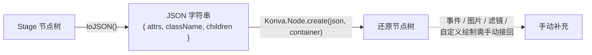

import { Canvas, Controls, Meta } from '@storybook/addon-docs/blocks';
import * as Serialization from './serialization.stories';

<Meta of={Serialization} name="Docs" />

# 序列化

Konva 能把整棵节点树（`Stage` 到每一个 `Shape`）压成一个 JSON 字符串，再把这串 JSON 还原成等价的节点树。这套往返由两个入口完成：`node.toJSON()` 负责序列化，`Konva.Node.create(json, container)` 负责还原。它们让你可以保存画布快照、撤销重做、或在前后端之间传递场景结构。

关键在于理解序列化**只保存结构和属性**——`className`（节点类型）、非默认值的 `attrs`（位置、填充、半径等）、以及递归的 `children`。它**不**保存事件监听器、图片对象、滤镜和自定义绘制函数，因为这些既无法无损压进 JSON，也会让产物臃肿。还原后这些内容需要手动接回。



| 入口 / 默认 | 回查要点 |
| --- | --- |
| `node.toJSON()` | 返回 **JSON 字符串**，内部走 `JSON.stringify(toObject())` |
| `node.toObject()` | 返回普通对象 `{ attrs, className, children? }` |
| `Konva.Node.create(json, container)` | 静态方法；`json` 接受字符串或对象；`container` 仅还原 `Stage` 时用，注入到 `attrs.container` |
| 序列化范围 | `className` + **非默认** `attrs` + 递归 `children` |
| 不序列化 | 事件、图片（`Konva.Image` 的 `image`）、滤镜、自定义 `sceneFunc`、DOM 引用（如 `container`） |
| `className` 解析 | 用 `Konva[className]` 查找；未注册的类回退成 `Shape` |
| 默认值省略 | 属性值与默认值相同时不写进 `attrs`，还原时用默认值补上，行为不变 |

## 序列化：toObject 与 toJSON

每个节点（`Konva.Node`）都有 `toObject()` 和 `toJSON()`。`toObject()` 返回一个普通对象，`toJSON()` 只是在它外面套一层 `JSON.stringify`。两者产出的内容完全一致，区别只在前者给对象、后者给字符串。

序列化对象的结构固定是 `{ attrs, className }`；`Container`（`Stage` / `Layer` / `Group`）会额外加 `children: []` 并递归子节点，因此一次 `stage.toJSON()` 就能捕获从舞台到每个形状的完整拓扑。

```ts
import Konva from 'konva';

const stage = new Konva.Stage({ container, width: 320, height: 200 });
const layer = new Konva.Layer();
stage.add(layer);

layer.add(
  new Konva.Circle({
    x: 160, y: 100, radius: 40,
    fill: '#4f7cff', draggable: true,
  }),
);

// { attrs: { width: 320, height: 200 }, className: 'Stage', children: [...] }
const obj = stage.toObject();

// 同样内容的 JSON 字符串
const json = stage.toJSON();
```

上面 `Circle` 序列化后的形态大致是：

```json
{
  "attrs": { "x": 160, "y": 100, "radius": 40, "fill": "#4f7cff", "draggable": true },
  "className": "Circle"
}
```

两个细节决定了你看到的 JSON 长什么样：

- **`attrs` 只保留非默认值。** `toObject()` 会用每个属性的 getter 取出默认值，只有「当前值 ≠ 默认值」时才写进 `attrs`。所以一个没设任何属性的 `Layer` 序列化出来是 `{ attrs: {}, className: 'Layer' }`——这不是丢了，而是这些属性还原时会自动用默认值补上。
- **非普通对象被跳过。** `Konva.Image` 的 `image`（一个 DOM `HTMLImageElement`）、`Stage` 的 `container`（DOM 元素）这类值不是普通对象也不是数组，会被序列化直接忽略。这正是图片和 DOM 引用无法随 JSON 还原的根本原因。

`id` 和 `name` 是普通属性，会被序列化，还原后可以继续用 `findOne('#id')` / `find('.name')` 查到。

## 从 JSON 还原

`Konva.Node.create(json, container)` 是 `toJSON()` 的逆运算。它读出 `className`，用 `new Konva[className](attrs)` 构造节点，再递归 `add` 子节点，重建整棵树。

```ts
// 从字符串还原
const restored = Konva.Node.create(json) as Konva.Stage;

// 从已有对象还原
const restored = Konva.Node.create(obj) as Konva.Stage;
```

还原 `Stage` 时必须显式传入第二个参数 `container`：`Stage` 的 `container` 是 DOM 元素引用，不会被序列化进 JSON，`create` 内部会把你传入的容器写进 `attrs.container`，新舞台才能挂接到页面。

```ts
const restored = Konva.Node.create(json, containerEl) as Konva.Stage;
```

非 `Stage` 节点（`Layer`、`Group`、`Shape`）不需要这个参数——还原后用 `add` 挂到你已有的容器上即可。

下面的实例演示完整往返。调整「圆数」会重建源舞台并重新序列化；切换「显示模式」到 **restored** 会销毁源舞台，再由 `Konva.Node.create(json, wrapper)` 从 JSON 还原成显示舞台。读数取自序列化产出的 JSON 本身：字符长度证明它是一段可保存的字符串，顶层 `className` 应为 `Stage`，节点总数随圆数变化证明子节点被递归捕获，首个圆的 `fill` 证明属性往返无损。

<Canvas of={Serialization.Interactive} />
<Controls of={Serialization.Interactive} />

| 读者操作 | 可观察证据 |
| --- | --- |
| 调整「圆数」 | 「JSON 字符长度」与「JSON 节点总数」同步增减 |
| 把圆数设为 0 | 节点总数回到最小（Stage + Layer），「首个圆 fill」变为 `—` |
| 切换「显示模式」到 restored | 画面与源舞台一致；圆仍可拖拽（`draggable` 被序列化） |
| 打开 Show code | 看到该 Canvas 实际执行的 `example.ts` |

## 不可序列化的内容

`toJSON()` 只保存结构和属性，下面这些在还原后会丢失，必须手动接回：

| 内容 | 为什么丢失 | 还原后接回 |
| --- | --- | --- |
| 事件监听器 | 函数无法序列化 | `node.on('click', handler)` |
| `Konva.Image` 的 `image` | DOM 元素是非普通对象，被跳过 | `node.setImage(htmlImage)` |
| 自定义绘制 `sceneFunc` | 函数无法序列化 | `node.setSceneFunc(fn)` |
| 滤镜 `filters` | 函数数组无法序列化 | `node.filters([Konva.Filters.Blur])` 后 `node.cache()` |

典型做法是还原后用 `findOne` / `find` 找到目标节点，再把上述能力逐个挂回去：

```ts
const stage = Konva.Node.create(json, containerEl) as Konva.Stage;

// 接回事件
stage.findOne<Konva.Circle>('#circle-0')?.on('click', () => {
  console.log('clicked');
});

// 接回图片：需要先加载好 HTMLImageElement，再 setImage
const imageNode = stage.findOne<Konva.Image>('.avatar');
if (imageNode) {
  imageNode.setImage(loadedImage);
}
```

注意 `draggable`、`visible`、`listening` 这类**属性**不在丢失名单里——它们会被序列化，还原后行为保持。

## 最佳实践

- **复杂场景优先存应用状态，而非整棵树。** 当节点带大量事件、图片和滤镜时，`toJSON()` 只能保住结构，还原后接回的逻辑会比「从状态重建」更脆弱。保存关键状态（位置、数量、id），自己写 `create(state)` 和 `update(state)`，通常更可控。
- **用 `toJSON()` 做整树快照，用状态快照做增量。** 整树 JSON 适合「另存为 / 复位」这类低频操作；撤销重做更适合只存变化的状态差异，避免每次都序列化庞大且含函数的树。
- **自定义形状类要挂到 `Konva` 命名空间。** `Konva.Node.create` 用 `Konva[className]` 查找构造器；自定义类没注册时会回退成 `Shape` 并打印警告，丢失原本的绘制逻辑。

## 常见问题

- 还原后节点的事件不响应了
  `toJSON()` 不序列化事件监听器。还原后需要重新 `node.on(event, handler)` 绑定；如果事件很多，把这步收进一个 `reattach(stage)` 函数统一处理。
- 还原的 `Stage` 没有出现在页面上
  漏传了第二个参数 `container`。`Stage` 的 `container` 是 DOM 引用，不会进 JSON；`Konva.Node.create(json, containerEl)` 才会把新舞台挂接到指定 DOM 元素。
- 控制台警告 `Can not find a node with class name "..."`，还原形状变成空白
  自定义形状的类没有挂到 `Konva` 命名空间，`create` 在 `Konva[className]` 查不到就回退成 `Shape`。把自定义类注册成 `Konva.MyShape = MyShape`（或在创建前确保类已在全局可用），再序列化与还原。
- `toObject()` 结果里缺了我设过的属性
  该属性的当前值恰好等于默认值，被序列化省略了。这是预期行为——还原时构造器会用默认值补上，不影响结果；只有当你需要「显式留痕」时才要在序列化前把属性改成一个非默认值。

## 总结回顾

摘要：

Konva 用 `node.toJSON()` 把节点树序列化成 JSON 字符串，内容来自 `toObject()` 产出的 `{ attrs, className, children }` 结构：`className` 记录类型，`attrs` 只保留非默认属性，`children` 递归捕获整棵子树。`Konva.Node.create(json, container)` 是逆运算，按 `className` 用 `Konva[className]` 构造节点再递归 `add`；还原 `Stage` 时必须传入第二个 `container` 参数。事件、图片、滤镜和自定义绘制函数不被序列化，需要在还原后用 `on` / `setImage` / `filters` / `setSceneFunc` 手动接回。复杂场景更适合只存关键应用状态、自己编写重建逻辑，而不是整树往返。

一句话：

> 序列化保存结构和非默认属性，但不保存事件、图片与函数——还原后必须手动接回。

知识要点：

- `toJSON()` 与 `toObject()` 各自返回什么？结构里有哪些键？
- 哪些属性会进 `attrs`，哪些会被省略？为什么默认值不在里面？
- `Konva.Node.create` 还原 `Stage` 时第二个参数 `container` 为什么不能省？
- 还原后哪些内容会丢失、分别用什么方法接回？
- 自定义类未注册到 `Konva` 命名空间时，还原会发生什么？

## 参考资料

- [Konva 数据与序列化：最佳实践](https://konvajs.org/docs/data_and_serialization/Best_Practices.html)
- [Konva.Node API（toJSON / toObject / create）](https://konvajs.org/api/Konva.Node.html)
- [Konva.Container API（toObject 递归 children）](https://konvajs.org/api/Konva.Container.html)
- [Konva 概览：为什么内置序列化](https://konvajs.org/docs/overview.html)
