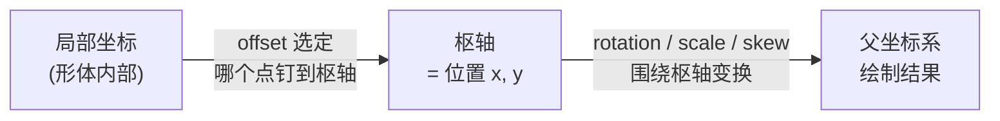

import { Canvas, Controls, Meta } from '@storybook/addon-docs/blocks';
import * as Transform from './transform.stories';

<Meta of={Transform} name="Docs" />

# 变换

Konva 里每个节点都自带一组变换属性：位置 `x`/`y`、缩放 `scaleX`/`scaleY`、旋转 `rotation`、偏斜 `skewX`/`skewY`，加上决定它们支点的偏移 `offsetX`/`offsetY`。Konva 把这些属性组合成一张 2D 仿射变换矩阵，属性一变就重绘节点。与这些坐标变换正交的另一条轴是**层级 z-index**：它不改任何坐标，只决定同一父节点下的子节点谁压在谁上面。

最值得先建立的直觉是**变换枢轴**：节点的位置 `(x, y)` 就是它的变换支点，旋转、缩放、偏斜都围绕这一点发生；而 `offset` 决定形体的**哪个局部点**被钉在这个支点上。矩形的 `(x, y)` 默认是左上角，所以不设 `offset` 时它绕左上角旋转；把 `offset` 设成 `(width/2, height/2)`，形体中心就被钉到支点，旋转自然绕中心进行。抓住「位置 = 支点，offset = 钉哪个点」这一条，下面每个属性都能提前预测结果。

旋转角度默认以**度**为单位（`Konva.angleDeg` 默认 `true`，设成 `false` 全局切到弧度）。变换属性默认值如下：

| 属性 | 默认值 | 作用 |
| --- | --- | --- |
| `x` / `y` | `0` | 节点在父坐标系里的位置，即变换枢轴 |
| `scaleX` / `scaleY` | `1` | 缩放倍数；负值翻转 |
| `rotation` | `0` | 旋转角度（默认度） |
| `skewX` / `skewY` | `0` | 偏斜量 |
| `offsetX` / `offsetY` | `0` | 钉在枢轴上的局部点 |



## 变换属性

位置、变换原点、缩放、旋转、偏斜五项共同组成一张仿射矩阵，它们围绕同一个枢轴协作。下面这一个实例把五项全部接上控件：橙色十字是变换枢轴（始终位于 `(x, y)`），灰色虚线框是「只应用位置与 `offset`、不旋转/缩放/偏斜」的同位置参照，用来对比变换围绕枢轴的效果。

<Canvas of={Transform.Playground} />
<Controls of={Transform.Playground} />

| 读者操作 | 可观察证据 |
| --- | --- |
| 调「位置 x / y」 | 主矩形、参照框和橙色枢轴一起平移；枢轴始终钉在 `(x, y)` |
| 调「原点 offsetX / offsetY」 | 形体相对枢轴滑动（参照框同步滑动），为旋转 / 缩放选好支点 |
| 调「旋转 °」 | 主矩形围绕枢轴转动；参照框留在原地 |
| 调「缩放 scaleX / scaleY」 | 主矩形围绕枢轴放大 / 缩小；负值翻转；参照框不变 |
| 调「偏斜 skewX / skewY」 | 主矩形沿轴向倾斜；参照框不变 |
| 打开 Show code | 看到该 Canvas 实际执行的 `example.ts` |

下面逐项展开。每个成员只改变一个属性，参照框和枢轴会让「围绕枢轴变换」直接可见。

### 位置

`x` 和 `y` 是节点在父坐标系里的坐标，也是旋转、缩放、偏斜围绕的变换枢轴。它对不同形状指向不同部位：矩形类（`Rect`、`Text`、`Image`、`Sprite`）的 `(x, y)` 是左上角；圆类（`Circle`、`Ellipse`、`Star`、`Ring`、`Wedge`）的 `(x, y)` 是中心。这一点在「[矩形、圆与椭圆](?path=/docs/basic-shapes--docs)」已用同一个 `x` 做过对照。

```ts
rect.x(120);                        // 设置 x
rect.y(80);                         // 设置 y
rect.move({ x: 10, y: 0 });         // 在当前位置上相对位移
rect.absolutePosition({ x: 120, y: 80 }); // 读写绝对坐标（含父级变换）
```

实例里把「位置 x / y」调一调，能看到主矩形、参照框和橙色枢轴整体平移——枢轴始终就是 `(x, y)` 本身。相对位移用 `move({ x, y })`，它把当前位置加上给定增量；要读写含父级变换的绝对坐标用 `absolutePosition()`。

### 变换原点

`offsetX`/`offsetY` 不改变 `(x, y)`，它把形体的**某个局部点**钉到枢轴上，从而决定旋转、缩放、偏斜的支点位置。默认 `0`：矩形类的左上角钉在枢轴（所以绕左上角旋转）。把它设成 `(width/2, height/2)`，形体中心就钉在枢轴，旋转自然绕中心。

代价是形体会在画布上滑动：设了 `offset` 后，形体的局部原点 `(0, 0)` 被画到 `(x - offsetX, y - offsetY)`。要让矩形视觉上绕某个中心点变换，把 `offset` 设成 `(width/2, height/2)`，再把 `x`/`y` 设成那个**中心**坐标即可。

实例里先调「旋转 °」到 `30`（默认 `offset` 为 `0`，矩形绕左上角甩出去）；再把「原点 offsetX / offsetY」调到 `60 / 40`（矩形中心 = `120/2, 80/2`），主矩形立刻回到以枢轴为中心、原地打转的姿态——这就是「换支点」的可观察证据。橙色枢轴自始至终没动，动的只是形体相对枢轴的钉点。

### 缩放

`scaleX`/`scaleY` 默认 `1`，以枢轴为中心放大或缩小形体。负值翻转：`scaleX = -1` 水平镜像、`scaleY = -1` 垂直镜像。缩放同样围绕枢轴，所以 `offset` 不同时，放大缩小的「不动点」也不同。

实例里调「缩放 scaleX / scaleY」：值大于 1 形体远离枢轴涨大，`0` 到 `1` 之间向枢轴收缩，负值翻转；参照框保持原尺寸不动，对比一目了然。注意缩放会同步放大描边与虚线（见「常见问题」）。

### 旋转

`rotation` 默认以**度**为单位（`Konva.angleDeg` 默认 `true`，设成 `false` 切到弧度）。它围绕枢轴旋转，所以 `offset` 决定绕哪个点转。相对旋转用 `rotate(theta)`，在当前角度上再加 `theta`（同样受 `angleDeg` 影响）。

```ts
rect.rotation(45); // 设为 45°
rect.rotate(15);   // 在当前基础上再加 15°
```

实例里调「旋转 °」，主矩形围绕橙色枢轴转动，参照框留在原位——枢轴、参照框与旋转后的形体三者一起，把「围绕哪个点转」讲清楚。配合「变换原点」一起调，还能看到同一角度下换支点的差别。

### 偏斜

`skewX`/`skewY` 默认 `0`，让形体沿某个轴向剪切倾斜，同样以枢轴为不动点。`skewX` 让纵向边倾斜，`skewY` 让横向边倾斜。偏斜用得比位置 / 旋转 / 缩放少，但在做斜体字、速度感形变时很直接。

实例里调「偏斜 skewX / skewY」，主矩形像被推了一把似地倾斜，参照框不参与偏斜，对比出形变量。

## 层级

z-index 只在同一父节点（`Layer` 或 `Group`）的子节点之间排序，不改坐标。索引大的后绘制、显示在上方。`layer.add()` 按调用顺序追加，后加的在顶；Konva 会把同一父节点下的索引维持为连续的 `0..n-1`。

| 方法 | 作用 | 返回 |
| --- | --- | --- |
| `zIndex(n)` | 设 / 取节点在兄弟中的索引 | `Number` |
| `moveUp()` / `moveDown()` | 上 / 下移一格 | `Boolean`（已在边界返回 `false`） |
| `moveToTop()` / `moveToBottom()` | 移到最顶 / 最底 | `Boolean` |
| `moveTo(newContainer)` | 换到另一个父容器 | `Konva.Node` |

下面的实例用两个重叠矩形演示：蓝色是主形状，琥珀色是参考形状，两者在同一个 Layer。切换「主形状置顶」，分别调用 `moveToTop()` 与 `moveToBottom()`，读数给出两者的 `zIndex` 当前值。

<Canvas of={Transform.Stacking} />
<Controls of={Transform.Stacking} />

```ts
main.moveToTop();    // main.zIndex() → 1，other → 0
main.moveToBottom(); // main.zIndex() → 0，other → 1
main.zIndex(2);      // 也可直接指定索引，Konva 自动重排兄弟
```

注意 `moveTo(newContainer)` 与上面几个不同：它改变节点的**父节点**（容器迁移），不只是顺序；迁移后 z-index 在新父节点下重新计算。

## 最佳实践

- **绕中心变换用 offset + 位置。** 想让矩形绕中心旋转 / 缩放，把 `offsetX`/`offsetY` 设成 `width/2`/`height/2`，再把 `x`/`y` 设成目标中心坐标。这比手动算三角函数简单，且 `rotation`/`scale`/`skew` 共用同一个支点。
- **多个节点成组变换。** 把一组节点放进 `Konva.Group`，对 Group 设一次 `position`/`rotation`/`scale`，子节点整体跟随——这比逐个节点设属性更稳，详见「[分组](?path=/docs/group--docs)」。
- **跨层级的遮挡看 Layer 顺序。** z-index 只在同一个父节点内有效；两个形状分别在不同 `Layer` 上时，由 Layer 在 Stage 中的顺序决定谁在上，调子节点的 `zIndex` 不会跨层生效。

## 常见问题

- **缩放后描边变粗、虚线变形。**
  `scaleX`/`scaleY` 会连描边和 `dash` 一起拉伸。要保持线宽不变，按缩放比例反向调整 `strokeWidth`（例如 `scaleX = 2` 时把描边减半），或把该形状先 `cache()` 成位图再缩放。
- **调了 `zIndex` 却没置顶，形状还在下面。**
  先确认目标形状和挡住它的形状是否在**同一个父节点**（同一 `Layer` 或 `Group`）。z-index 只在兄弟之间排序；跨 `Layer` 的遮挡由 Layer 本身在 Stage 里的顺序决定，要改 Layer 的顺序，或把两者放进同一父节点。

## 总结回顾

摘要：

Konva 节点的位置、缩放、旋转、偏斜和偏移组成一张 2D 仿射矩阵，属性一变就重绘。位置 `(x, y)` 是变换枢轴，`offset` 决定形体的哪个局部点钉在枢轴上，旋转 / 缩放 / 偏斜都围绕这一点发生；矩形类 `(x, y)` 是左上角、圆类是中心。`scaleX`/`scaleY` 负值翻转，`rotation` 默认以度为单位（由 `Konva.angleDeg` 控制）。与坐标变换正交的层级 z-index 只在同一父节点的子节点间排序，索引大的显示在上，常用 `zIndex`/`moveToTop`/`moveToBottom` 调整。实例用一个矩形把五项变换属性接上控件，橙色枢轴和灰色参照框让「围绕枢轴变换」直接可见；另一个实例用两个重叠矩形演示层级方法的效果。

一句话：

> 位置 `(x, y)` 是变换枢轴，`offset` 决定钉在枢轴上的局部点，z-index 只管同一父节点内的先后。

知识要点：

- 哪个属性是变换枢轴？它对不同形状分别指向哪里？
- `offset` 改变什么、不改变什么？怎样让矩形绕中心旋转？
- `scaleX`/`scaleY` 为负值时会发生什么？
- `rotation` 默认用什么单位？怎样切到另一种？
- `zIndex` 在什么范围内有效？跨 `Layer` 的遮挡由什么决定？

## 参考资料

- [Konva API — Konva.Node（变换属性与 zIndex 方法）](https://konvajs.org/api/Konva.Node.html)
- [Konva 文档 — Position vs Offset（位置与偏移）](https://konvajs.org/docs/posts/Position_vs_Offset.html)
- [Konva API — 全局 `angleDeg`（角度单位）](https://konvajs.org/api/Konva.html)
