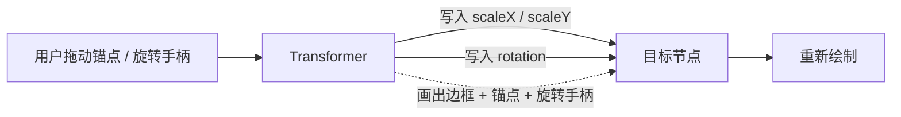

import { Canvas, Controls, Meta } from '@storybook/addon-docs/blocks';
import * as Transformer from './transformer.stories';

<Meta of={Transformer} name="Docs" />

# 变换器

`Konva.Transformer` 是一种特殊的节点：把它挂到 Layer 上、再通过 `nodes([...])` 附加到目标节点，它就会在目标周围画出**边框、缩放锚点和旋转手柄**，让用户用鼠标或触摸直接拖拽来变换目标。它本身不改变目标的 `width` / `height`，而是改写目标的 `scaleX` / `scaleY`（缩放）和 `rotation`（旋转）。理解这一点，是预测一切变换器行为的前提。

可以把变换器想成一层「可交互的壳」：用户拖壳上的锚点 → 变换器计算新的包围盒 → 把结果写成 `scale` 和 `rotation` 写回目标节点 → 节点重新绘制。目标的原始尺寸始终不变，所以「缩小一半」是 `scaleX = 0.5`，而不是 `width` 减半。



变换器常用属性与默认值（已与 Konva 10.3 源码核对）：

| 属性 | 默认值 | 作用 |
| --- | --- | --- |
| `resizeEnabled` | `true` | 是否显示缩放锚点（总开关） |
| `rotateEnabled` | `true` | 是否显示旋转手柄 |
| `enabledAnchors` | 八个全部 | 显示哪些缩放锚点 |
| `keepRatio` | `true` | 拖角点时保持宽高比 |
| `shiftBehavior` | `'default'` | Shift 键如何影响比例 |
| `centeredScaling` | `false` | 相对中心缩放（而非对边） |
| `flipEnabled` | `true` | 允许拖过零点翻转 |
| `anchorSize` | `10` | 锚点边长 |
| `padding` | `0` | 边框与节点之间的间距 |
| `borderEnabled` | `true` | 是否画边框 |
| `borderStroke` / `anchorStroke` | `'rgb(0, 161, 255)'` | 边框 / 锚点描边色 |
| `anchorFill` | `'white'` | 锚点填充色 |
| `rotateAnchorOffset` | `50` | 旋转手柄到边框的距离 |
| `rotateAnchorAngle` | `0` | 旋转手柄绕边框的角度（0=正上） |
| `rotationSnaps` | `[]` | 旋转吸附角度（度） |
| `rotationSnapTolerance` | `5` | 吸附容差（度） |
| `ignoreStroke` | `false` | 计算包围盒时忽略描边 |

## 附加与变换

变换器的用法只有三步：创建 `Konva.Transformer`、把目标节点通过 `nodes` 附加进去、把变换器自己 `add` 到 Layer。变换器是「特殊的 Group」，它和目标节点可以同处一个 Layer。

```ts
const layer = new Konva.Layer();
stage.add(layer);

const rect = new Konva.Rect({ width: 150, height: 100, fill: '#4f7cff' });
layer.add(rect);

// 附加目标：构造时传入 nodes，或之后用 transformer.nodes([...])。
const transformer = new Konva.Transformer({ nodes: [rect] });
layer.add(transformer);
```

> **给 `nodes()` 传新数组。** `nodes()` 要求传入一个**新的数组实例**，内部按引用比较判断是否变化。直接 `push` 旧数组、或重复传同一个引用，变换器可能不更新。多选时常用 `tr.nodes(tr.nodes().concat(newNode))`。

下面的实例把一个矩形居中，并附加变换器。直接拖动锚点缩放、拖动顶部圆点旋转；读数实时反映目标的 `scaleX` / `scaleY` / `rotation`，并给出「基础宽×高」与「有效宽×高」（= 基础 × scale）。

<Canvas of={Transformer.Interactive} />
<Controls of={Transformer.Interactive} />

| 读者操作 | 可观察证据 |
| --- | --- |
| 拖角点（如 `top-left`） | `scaleX`、`scaleY` 同步变化；基础宽高恒定，有效宽高按比例缩放 |
| 拖边中点（如 `middle-right`） | 仅对应方向的 scale 变化（默认不锁比） |
| 拖顶部旋转手柄 | `rotation°` 随之变化，边框与锚点跟随旋转 |
| 切「锚点集合」为 `corners` | 只剩四个角点，边中点锚点消失 |
| 关「启用旋转」 | 顶部旋转手柄消失，无法旋转 |
| 切「锁定比例」 | 拖角点时宽高比是否被锁定 |
| 切「中心缩放」 | 缩放朝向中心而非固定对边 |
| 调「锚点尺寸」「内边距」 | 锚点方块变大 / 变小，边框与节点的间距变化 |
| 打开 Show code | 看到该 Canvas 实际执行的 `example.ts` |

读数最能说明核心机制：无论怎么拖，**「基础宽×高」永远是 `150×100`**，真正改变的只有 `scaleX` / `scaleY` 与 `rotation`。这正是变换器与「直接改 `width` / `height`」的根本区别。

## 缩放

缩放由三组配置共同决定：**显示哪些锚点**（`enabledAnchors`）、**拖动时如何约束**（`keepRatio`、`shiftBehavior`、`centeredScaling`、`flipEnabled`）、**能缩到多大 / 多小**（`boundBoxFunc`）。

`enabledAnchors` 接受八个锚点名组成的数组，未列出的锚点会被隐藏（对应的缩放方向也随之不可用）。八个名字固定为：

```
top-left   top-center   top-right
middle-left             middle-right
bottom-left bottom-center bottom-right
```

实例中「锚点集合」控件就是切换这个数组：`corners` 只留四角、`edges` 只留四边中点、`none` 全部隐藏。`resizeEnabled` 是更彻底的总开关——设为 `false` 时所有缩放锚点连同它们的交互能力一起消失（默认 `true`）。

`keepRatio`（默认 `true`）让拖动**角点**时保持宽高比；拖**边中点**时永远只改单方向、不受它影响。`shiftBehavior` 决定 Shift 键如何叠加：

| `shiftBehavior` | 不按 Shift | 按住 Shift |
| --- | --- | --- |
| `'default'`（默认） | 遵循 `keepRatio` | 强制保持比例（即使 `keepRatio: false`） |
| `'none'` | 遵循 `keepRatio` | Shift 被忽略 |
| `'inverted'` | 遵循 `keepRatio` | 反而打破比例（`keepRatio` 暂时失效） |

> **Alt 键始终触发中心缩放。** `centeredScaling`（默认 `false`）把缩放支点从「固定对边」改成「节点中心」。无论它设成什么，**按住 Alt 拖锚点都会临时按中心缩放**——这是内置快捷行为，不需要额外开关。

`flipEnabled`（默认 `true`）决定拖过零点时是否翻转。开启时，把锚点拖过对边会让 `scale` 变为负值、节点镜像翻转；关闭后变换器取绝对值，节点只会缩小到零、不会翻到反面。

`boundBoxFunc(oldBox, newBox)` 在每次缩放时被调用，`box` 是 `{ x, y, width, height, rotation }` 的**绝对坐标包围盒**。返回 `oldBox` 拒绝本次缩放，返回修改后的 `newBox` 做钳制——常用来限制最小尺寸：

```ts
const transformer = new Konva.Transformer({
  nodes: [rect],
  boundBoxFunc(oldBox, newBox) {
    if (newBox.width < 50 || newBox.height < 50) {
      return oldBox; // 小于 50×50 就拒绝
    }
    return newBox;
  },
});
```

`ignoreStroke`（默认 `false`）影响包围盒的计算：描边较粗时，默认包围盒会把描边算进去；设为 `true` 则忽略描边，变换器边框更贴合形状的几何边界。

## 旋转

`rotateEnabled`（默认 `true`）控制是否显示旋转手柄。关闭后顶部圆点消失，只能缩放不能旋转。旋转手柄的位置和外观由几个属性共同决定：

- `rotateAnchorOffset`（默认 `50`）：手柄到边框的垂直距离，值越大手柄离边框越远。
- `rotateAnchorAngle`（默认 `0`）：手柄绕边框一周的位置角度，`0` = 正上方中点、`90` = 右侧中点、`180` = 正下方中点、`-90` = 左侧中点。
- `rotateLineVisible`（默认 `true`）：是否画那条连接边框到手柄的虚线。
- `rotateAnchorCursor`（默认 `'crosshair'`）：鼠标悬停在手柄上时的光标样式。

`rotationSnaps` 接受一组角度（度），旋转经过这些角度时会「吸附」过去；`rotationSnapTolerance`（默认 `5`）是吸附生效的容差角度。常用来吸附到 0/45/90 度：

```ts
const transformer = new Konva.Transformer({
  nodes: [rect],
  rotationSnaps: [0, 45, 90, 135, 180, 225, 270, 315],
  rotationSnapTolerance: 5,
});
```

## 外观

边框和锚点的样式都可以单独配置。边框相关：

- `borderEnabled`（默认 `true`）：是否画边框；设为 `false` 只留锚点。
- `borderStroke`（默认 `'rgb(0, 161, 255)'`）、`borderStrokeWidth`（默认 `1`）、`borderDash`（默认不虚线）：边框的颜色、粗细、虚线模式。
- `padding`（默认 `0`）：边框与目标节点之间的留白，正值让边框比节点大一圈。

锚点相关：

- `anchorSize`（默认 `10`）：每个锚点方块的边长。
- `anchorFill`（默认 `'white'`）、`anchorStroke`（默认 `'rgb(0, 161, 255)'`）、`anchorStrokeWidth`（默认 `1`）、`anchorCornerRadius`（默认 `0`）：锚点的填充、描边、描边粗细、圆角。

如果想让某个锚点长得不一样，用 `anchorStyleFunc(anchor)`：它在每个锚点的默认属性赋值之后被调用，参数就是那个 `Konva.Rect`。旋转手柄的名字是 `'rotater'`，可以用 `anchor.hasName('rotater')` 把它挑出来单独美化：

```ts
const transformer = new Konva.Transformer({
  nodes: [rect],
  anchorStyleFunc(anchor) {
    if (anchor.hasName('rotater')) {
      anchor.fill('rgb(0, 161, 255)');
      anchor.cornerRadius(8); // 把旋转手柄变成圆点
    }
  },
});
```

实例中调「锚点尺寸」与「内边距」，可以直接看到 `anchorSize` 与 `padding` 的视觉效果。

## 变换事件

变换器在拖拽过程中会在**目标节点**和**变换器自己**上派发三个事件，顺序固定：

| 事件 | 触发时机 |
| --- | --- |
| `transformstart` | 按下锚点 / 旋转手柄，开始变换 |
| `transform` | 拖动过程中持续派发（高频） |
| `transformend` | 松开，结束本次变换 |

在事件回调里读目标的 `scaleX()`、`scaleY()`、`rotation()` 就能拿到实时变换结果。实例的读数就是这样产生的：监听矩形上的 `transform` 事件，把 scale 和 rotation 派发出去。

```ts
rect.on('transform', () => {
  console.log(rect.scaleX(), rect.scaleY(), rect.rotation());
});
rect.on('transformend', () => {
  // 变换结束后提交一次最终状态
});
```

> **手动改了目标后要 `forceUpdate()`。** 变换器在附加时记录一次包围盒。如果你之后用代码改了目标的尺寸、旋转或子节点，必须调用 `transformer.forceUpdate()` 让它重算边框和锚点位置，否则变换器会停留在旧位置。

## 常见问题

- **拖锚点缩放后，读 `rect.width()` / `rect.height()` 怎么没变？**
  变换器改的是 `scaleX` / `scaleY`，不是 `width` / `height`。要得到实际显示尺寸，用 `rect.width() * rect.scaleX()`；实例读数里的「有效宽×高」就是这么算的。

- **变换器没有出现（看不到边框和锚点）。**
  依次检查：变换器是否 `layer.add(transformer)` 加进了 Layer；是否通过 `nodes([...])` 附加了目标；目标与变换器是否在**同一个 Stage**。三者缺一不可，且漏掉任一项都不会报错。

- **用代码改了节点尺寸，变换器边框位置不对。**
  变换器只在附加时量一次目标。改完目标后调用 `transformer.forceUpdate()` 让它重算，再 `layer.batchDraw()` 重绘。

## 总结回顾

摘要：

`Konva.Transformer` 是一个附加到目标节点的特殊 Group，画出边框、缩放锚点和旋转手柄让用户直接拖拽变换。它改写的是目标的 `scaleX` / `scaleY` 与 `rotation`，原始 `width` / `height` 不变——所以「缩小一半」是 `scale = 0.5`。缩放行为由 `enabledAnchors`（哪些锚点）、`keepRatio` / `shiftBehavior`（比例约束）、`centeredScaling`（Alt 也触发）、`flipEnabled`（翻转）、`boundBoxFunc`（尺寸钳制）共同决定；旋转由 `rotateEnabled`、`rotateAnchorOffset` / `rotateAnchorAngle`、`rotationSnaps` 控制；边框与锚点的样式可逐项配置，还能用 `anchorStyleFunc` 单独美化旋转手柄。变换过程中目标节点持续派发 `transformstart` / `transform` / `transformend`，手动改了目标后要 `forceUpdate()` 让变换器跟上。

一句话：

> 变换器把用户的拖拽翻译成目标节点的 `scale` 与 `rotation`——边框和锚点只是这层翻译的可视化外壳。

知识要点：

- 变换器附加目标用哪两个步骤？为什么 `nodes()` 要传新数组？
- 拖锚点改变的是目标的哪些属性？`width` / `height` 会变吗？
- `enabledAnchors` 的八个名字分别是什么？
- `keepRatio` 与三种 `shiftBehavior` 如何叠加？Alt 键有什么固定行为？
- `boundBoxFunc` 的参数和返回值是什么？怎么用它限制最小尺寸？
- `transformstart` / `transform` / `transformend` 在哪三个时机触发？
- 用代码改了目标后，怎样让变换器的边框跟上？

## 参考资料

- [Konva API — Konva.Transformer](https://konvajs.org/api/Konva.Transformer.html)
- [Konva 教程 — Select and Transform: Basic Demo](https://konvajs.org/docs/select_and_transform/Basic_demo.html)
