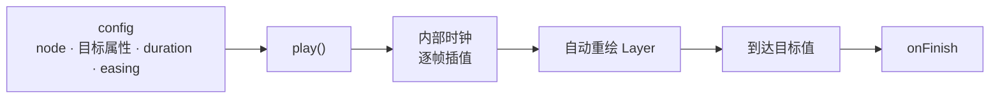

import { Canvas, Controls, Meta } from '@storybook/addon-docs/blocks';
import * as Tween from './tween.stories';

<Meta of={Tween} name="Docs" />

# 补间与缓动

Tween（补间）让一个节点的属性在设定时长内从当前值平滑过渡到目标值，缓动函数（easing）决定这段过渡的速度曲线。声明四样东西就够了：目标节点、要补间的属性及其终点值、时长 `duration`、缓动函数 `easing`。Konva 的 Tween 自带内部时钟和动画循环——每帧把插值结果写回节点并自动重绘所在 Layer，因此你不需要像「[帧动画](?path=/docs/animation--docs)」那样手写逐帧重绘。它唯一不会替你做的是启动：创建后必须调用 `play()` 才会开始。



关键配置项与默认值（`duration` 和 `easing` 的默认值取自 Konva 源码）：

| 配置项 | 类型 | 默认值 | 说明 |
| --- | --- | --- | --- |
| `node` | `Node` | — | 目标节点，必须已加入 Layer |
| `duration` | `Number` | `0.3` | 时长，**秒**；传 `0` 会被当作 `0.001` |
| `easing` | `Function` | `Konva.Easings.Linear` | 缓动函数 |
| `yoyo` | `Boolean` | `false` | 到达终点后反向，循环往返 |
| `onFinish` / `onReset` / `onUpdate` | `Function` | — | 到达终点 / 重置 / 每帧回调 |
| 其他数值或颜色属性 | — | — | 补间目标，如 `x`、`rotation`、`fill` |

## 创建补间

一个 Tween 由「目标节点 + 一组属性终点值 + 时长 + 缓动函数」组成。下面这行最小代码把一个圆在 2 秒内沿 `x` 移动到 400，使用 `EaseInOut` 缓动；调用 `play()` 启动，Konva 自动逐帧重绘其所在 Layer。

```ts
const tween = new Konva.Tween({
  node: circle,
  duration: 2,                      // 秒；不写默认 0.3
  easing: Konva.Easings.EaseInOut,  // 不写默认 Linear
  x: 400,                           // 任何数值 / 颜色属性都能作为终点值
});
tween.play();                       // 不调用就不会动
```

下面的实例把这套创建流程接上控件：圆球沿轨道往返补间（`yoyo: true`），可切换缓动函数与时长，上方同步绘制所选缓动的「进度–时间」曲线（蓝），并叠加 `Linear` 参考线（灰虚线）——曲线陡处圆球快、平缓处圆球慢、过冲处圆球冲过终点再回来。

<Canvas of={Tween.EasingDemo} />
<Controls of={Tween.EasingDemo} />

| 读者操作 | 可观察证据 |
| --- | --- |
| 切换「缓动函数」 | 曲线形状改变；圆球运动节奏同步变化（如 `ElasticEaseOut` 冲过终点振荡，`BounceEaseOut` 落地式弹跳） |
| 调「时长 s」 | 单程耗时随之变长 / 变短；曲线横向不变（归一化时间），圆球速度变化 |
| 看读数「进度 %」 | `yoyo` 往返时进度从 0→100 再回到 0，印证自动循环 |

可补间的属性几乎涵盖节点的全部数值属性：`x`/`y`、`rotation`、`scaleX`/`scaleY`、`skewX`/`skewY`、`offsetX`/`offsetY`、`opacity`、`radius`、`width`/`height` 等；颜色属性 `fill`、`stroke`、`shadowColor` 走 RGBA 通道插值（例如 `fill` 从 `'red'` 补到 `'blue'`）；数组属性如 `Line.points` 也可逐项插值。只要这个属性是节点上已有的数值或颜色，就能作为 Tween 配置里的终点值。

## 缓动函数

缓动函数把「已经过的时间比例」映射成「已经完成的进度比例」，也就是速度曲线。`Linear` 把两者画成等号——匀速；其他函数让进度先慢后快、先快后慢或两端带回弹，曲线形状直接决定运动手感。Konva 在 `Konva.Easings` 下提供 16 个函数，按家族分成六组：

| 家族 | 函数 | 曲线特征 |
| --- | --- | --- |
| 线性 | `Linear` | 匀速，进度与时间成正比 |
| 二次缓动 | `EaseIn` / `EaseOut` / `EaseInOut` | 起步慢 / 收尾慢 / 两端慢中间快 |
| 强二次缓动 | `StrongEaseIn` / `StrongEaseOut` / `StrongEaseInOut` | 同上，弯曲程度更明显 |
| 回冲 | `BackEaseIn` / `BackEaseOut` / `BackEaseInOut` | 起步先朝反方向 / 收尾冲过终点再回 / 两端都回冲 |
| 弹性 | `ElasticEaseIn` / `ElasticEaseOut` / `ElasticEaseInOut` | 弹簧式振荡，振幅逐次衰减 |
| 弹跳 | `BounceEaseIn` / `BounceEaseOut` / `BounceEaseInOut` | 落地反弹式多次小跳 |

`In` / `Out` / `InOut` 后缀是一套统一约定：`In` 把缓动效果放在**开头**（进入阶段），`Out` 放在**结尾**（离开阶段），`InOut` 两端都有。对基本缓动这对应「加速 / 减速 / 两端慢」；对 `Back` / `Elastic` / `Bounce`，它指回弹或振荡集中发生在哪一端——例如 `BackEaseOut` 是冲过终点再回来，`BackEaseIn` 是起步先朝反方向蓄力。把上面实例的「缓动函数」逐个切换，对照曲线和圆球运动，这套约定就会一目了然。

## 播放控制

创建后的 Tween 是一个可控对象，六个方法（都返回 `this`，可链式调用）覆盖全部播放状态：

| 方法 | 作用 |
| --- | --- |
| `play()` | 正向播放，或从当前位置继续 |
| `pause()` | 暂停在当前位置 |
| `reverse()` | 切换为反向播放（向起点方向） |
| `reset()` | 跳回起点 |
| `finish()` | 跳到终点 |
| `seek(t)` | 跳到指定时间，`t` 单位是**秒**（`0`–`duration`） |
| `destroy()` | 销毁补间，停止其内部动画并释放资源 |

下面的实例用固定 `EaseInOut` 的单向补间演示这六个方法：选择「执行方法」即对圆球调用对应 API；选 `seek` 时由「seek 位置 s」决定跳到哪里。

<Canvas of={Tween.Playback} />
<Controls of={Tween.Playback} />

```ts
tween.play();      // 从起点正向播放到终点
tween.pause();     // 在中途停下
tween.reverse();   // 反向往起点走
tween.seek(1);     // 直接跳到第 1 秒的状态（单位是秒）
tween.reset();     // 回到起点
tween.finish();    // 直接到终点
```

`yoyo: true` 让补间到达一端后自动反向、循环往返，适合做持续呼吸或摆动效果；不用 `yoyo` 时，配合 `onFinish` 回调可以在到达终点后触发下一步动作。补间不再使用时调用 `destroy()`，避免它绑定的内部动画继续占用重绘开销。

## 常见问题

- **创建后节点一动不动。**
  Tween 不会自动启动。确认两件事：目标节点已经 `layer.add(node)` 挂到 Layer 上（构造时会校验），并且你调用了 `tween.play()`。
- **把 `duration` 设成 `0` 想瞬间到位，却有一帧极短动画。**
  Konva 把 `duration: 0` 当作 `0.001` 秒处理，并不是真正的瞬移。要做瞬切就直接 `node.setAttrs({ ... })` 设值，不要走 Tween。
- **补间运行着，可缓存（`cache()`）过的节点画面不变。**
  `cache()` 把节点冻结成一张位图，之后补间改的是属性、画面却仍用旧位图。先 `node.clearCache()`（或补间结束后重新 `cache()`），再让补间作用于真实属性；详见「[缓存与性能](?path=/docs/cache-performance--docs)」。
- **在终点再按 `play()`，节点不动。**
  `play()` 是「正向继续」：已经处于终点时没有可前进的余量。先 `reverse()` 反向，或 `reset()` 回起点，再 `play()`。

## 总结回顾

摘要：

Tween 让节点的数值与颜色属性在设定时长内从当前值过渡到目标值，缓动函数决定这条过渡的速度曲线。一个 Tween 由目标节点、一组属性终点值、`duration`（默认 0.3 秒）和 `easing`（默认 `Linear`）组成；它自带内部时钟和动画循环，每帧把插值结果写回节点并自动重绘所在 Layer，因此不用手写逐帧重绘，但创建后必须 `play()` 才会启动。`Konva.Easings` 提供 16 个缓动函数，按 `Linear`、二次缓动、强二次、`Back`（回冲）、`Elastic`（弹性）、`Bounce`（弹跳）六组划分，`In`/`Out`/`InOut` 后缀约定效果集中在开头 / 结尾 / 两端。`play`/`pause`/`reverse`/`reset`/`finish`/`seek`（秒）/`destroy` 覆盖全部播放控制；`yoyo: true` 让它自动往返循环。

一句话：

> 补间是自带时钟与自动重绘的属性插值器：声明目标值、时长和缓动曲线，再调 `play()` 启动。

知识要点：

- 创建一个 Tween 需要哪四样东西？什么情况下它会动起来？
- `duration` 和 `easing` 的默认值分别是什么？`duration: 0` 实际被当成什么？
- 缓动函数改变的是运动的什么？`In` / `Out` / `InOut` 后缀约定什么？
- 哪些属性可以补间？颜色属性走什么插值？
- `seek(t)` 的 `t` 用什么单位？想让补间来回循环该设哪个配置项？

## 参考资料

- [Konva API — Konva.Tween（配置项与方法）](https://konvajs.org/api/Konva.Tween.html)
- [Konva API — Konva.Easings（16 个缓动函数）](https://konvajs.org/api/Konva.Easings.html)
- [Konva 文档 — All Controls（Tween 教程）](https://konvajs.org/docs/tweens/All_Controls.html)
