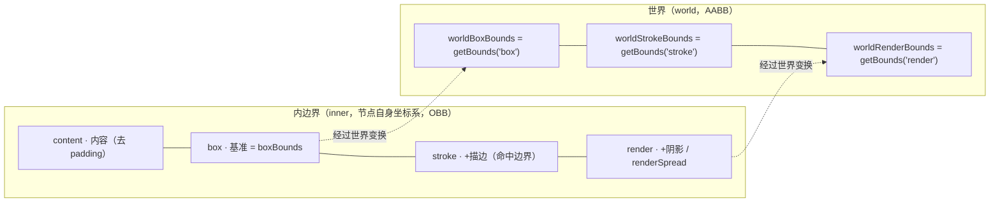

import { Canvas, Controls, Meta } from '@storybook/addon-docs/blocks';
import * as Bounds from './bounds.stories';

<Meta of={Bounds} name="Docs" />

# 包围盒

LeaferJS 里每个 UI 节点都自带一套**盒模型**：从内到外依次是 `content`（内容）→ `box`（基准）→ `stroke`（描边）→ `render`（渲染），后一层总把前一层包住。`boxBounds` 就是这套盒模型在**节点自身坐标系**里的尺寸，`getBounds()` 则把它换算到任意坐标系后返回一个**轴对齐包围盒（AABB）**。

区分两者的关键只有一句话：**`boxBounds` 永远是节点自己的原始尺寸区域，旋转、平移都不改变它；`getBounds('box')` 是这条区域经过所有祖先变换后、在世界坐标系里的轴对齐外接框——旋转会让它变大。** 描边和阴影只影响 `stroke` / `render` 两层，不改变 `box` 本身。

盒模型（内边界）和世界包围盒（AABB）是同一个节点的两种读法，理解它们如何换算就能预测大部分结果：



| 属性 / 方法 | 默认与行为 | 回查要点 |
| --- | --- | --- |
| `node.boxBounds` | `= getBounds('box','inner')`，inner OBB | 旋转 / 平移不变，只反映节点自身宽高区域 |
| `node.renderBounds` | `= getBounds('render','inner')`，inner AABB | `box + 描边 + 阴影 + renderSpread` |
| `node.worldBoxBounds` | `= getBounds('box')`，world AABB | 旋转后变大（轴对齐外接） |
| `node.worldStrokeBounds` | `= getBounds('stroke')`，world AABB | 命中检测的边界 |
| `node.worldRenderBounds` | `= getBounds('render')`，world AABB | 含阴影，渲染层走的世界框 |
| `getBounds(type?, relative?)` | `type='box'`、`relative='world'` | 返回 **AABB**；`type ∈ content/box/stroke/render`，`relative ∈ inner/local/world/page` |
| `getLayoutBounds(type?, relative?, unscale?)` | 同上默认 | 返回 **OBB**，额外带 `scaleX/scaleY/rotation/skewX/skewY` 布局字段 |
| `getLayoutPoints(type?, relative?)` | 同上默认 | 返回 OBB 的四个角点 `[左上, 右上, 右下, 左下]` |
| `renderSpread` | `0` | 手动外扩渲染边界（CSS 式四值），补阴影测量不足 |

## 边界类型：content / box / stroke / render

四种边界类型只在**节点自身坐标系（inner）**里讨论，它们层层嵌套、永远满足 `content ≤ box ≤ stroke ≤ render`：

- **content**：内容边界，去掉 `padding` 后真正承载内容（主要是 `Text` 测量实际文字区域）。
- **box**：基准边界，等于节点自身的 `width × height` 区域（含 `padding`），也就是 `boxBounds`。所有向外扩展都以它为起点。
- **stroke**：笔触边界，`box` 加上描边外扩；它同时是**可响应交互事件的边界**。
- **render**：渲染边界，`stroke` 再加上阴影、`blur`、滤镜和 `renderSpread`，即任何会画到屏幕上的像素都被它包住。

描边让 `stroke` 外扩多少由 `strokeAlign` 决定（`@leafer-ui/bounds` 的 `__updateStrokeSpread`）：`center` 向两侧各扩 `strokeWidth/2`，`outside` 向外扩完整的 `strokeWidth`，`inside` 不外扩（描边画在 `box` 内部，`strokeBounds` 仍等于 `boxBounds`）。阴影和 `blur` 只进 `render`，不进 `stroke`。

```ts
import { Leafer, Rect } from 'leafer-ui';

const leafer = new Leafer({ view: '#stage', fill: '#fff' });
const rect = new Rect({
  x: 40, y: 40, width: 200, height: 120,
  fill: '#6366f1', stroke: '#1e293b', strokeWidth: 12, strokeAlign: 'center',
});
leafer.add(rect);

// 四种内边界尺寸（在节点自身坐标系里，未旋转时与上方属性一一对应）：
rect.getBounds('content', 'inner'); // 内容边界（普通 Rect 无 padding，回退为 box）
rect.getBounds('box', 'inner');     // 200 × 120，恒等于自身宽高区域
rect.getBounds('stroke', 'inner');  // 212 × 132，center 各外扩 strokeWidth/2 = 6
rect.getBounds('render', 'inner');  // 至少 212 × 132；有阴影时更大
```

边界是只读对象（出于性能与安全考虑不能直接改）。要硬性放大渲染边界（例如自定义绘制超出阴影测量），给节点设 `renderSpread`，它接受 CSS 式四值：`renderSpread: 20` 或 `[10, 20, 10, 20]`（上右下左）。

## boxBounds 与 getBounds 的区别

`boxBounds` 和 `getBounds()` 是日常最容易混淆的两个入口，差别在**坐标系**和**是否带变换**：

- `node.boxBounds` ≡ `node.getBounds('box', 'inner')`，是节点在**自身坐标系**里的基准框（OBB 维度）。它描述「这个节点本身有多大」，**旋转、平移、祖先缩放都不影响它**——你转一个矩形，`boxBounds` 读数纹丝不动。
- `node.getBounds()` ≡ `node.getBounds('box', 'world')`，把 `box` 经过自身和所有祖先的变换后，换成**世界坐标系里的轴对齐外接框（AABB）**。矩形一旋转，AABB 就要把斜着的矩形整个框住，所以**会比 `boxBounds` 大**。

`getBounds` 的两个参数各自决定「取哪层边界」和「换算到哪个坐标系」：

| `relative` | 坐标系含义 | 典型用途 |
| --- | --- | --- |
| `'inner'` | 节点自身坐标系，不含任何变换 | 读节点原始尺寸（即 `boxBounds`） |
| `'local'` | 父节点坐标系，含自身变换 | 在父容器内布局、对齐 |
| `'world'` | 世界坐标系，含全部祖先变换 | 跨层级命中、碰撞、渲染分块 |
| `'page'` | zoom 层坐标系 | 在缩放 / 平移后的「视口页」里取坐标 |

`relative` 还可以传一个具体的节点（`getBounds('box', otherNode)`），把结果换算到那个节点的坐标系下，省掉手动矩阵换算。

需要**带旋转方向**的尺寸时用 `getLayoutBounds`：它返回 **OBB**（定向包围盒），除了 `x/y/width/height` 还带 `scaleX/scaleY/rotation/skewX/skewY`；配 `getLayoutPoints` 能拿到 OBB 的四个真实角点。一句话区分：`getBounds` 永远轴对齐（旋转后变大），`getLayoutBounds` 保留旋转（尺寸不变、带方向）。

下面的实例把这些差异一次摆出来。矩形带描边、可旋转，蓝虚线框是 `worldBoxBounds`（基准的世界 AABB），橙实线框是 `worldRenderBounds`（含描边的世界 AABB），左下角读数同步给出三种尺寸。

<Canvas of={Bounds.Interactive} />
<Controls of={Bounds.Interactive} />

| 读者操作 | 可观察证据 |
| --- | --- |
| 调大「旋转角度」 | 矩形绕中心旋转；`boxBounds（inner）` 读数恒为 `200 × 120`，`worldBoxBounds` 与 `worldRenderBounds` 读数都增大，蓝虚框把斜矩形整个框住 |
| 调大「描边宽度」 | `boxBounds` 与 `worldBoxBounds` 不变，只有 `worldRenderBounds` 增大，橙实框超出蓝虚框 |
| 「描边宽度」调到 `0` | 描边消失，橙实框与蓝虚框完全重合（`render` 退化为 `box`） |
| 切「描边对齐」为 `inside` | 描边画进矩形内部，`worldRenderBounds` 回缩接近 `worldBoxBounds` |
| 打开 Show code | 看到该 Canvas 实际执行的 `example.ts` |

## 包围盒的用途：命中、碰撞与布局

包围盒不只是读数，它直接驱动三类行为：

**命中检测用 `strokeBounds`。** 描边层是「可响应交互事件的边界」：指针落点先和节点的世界 `strokeBounds`（或更精细的 `__hitCanvas`）比较，命中后才进 fill / stroke 的像素级判定。所以 `strokeAlign='inside'` 的元素命中区域≈`box`，`center/outside` 才会把命中区往外撑。快速判断「点是否在节点上」用 `leaf.hit(point, radius)`，它内部就建立在 `worldRenderBounds` 与 `boxBounds` 的几何判定上。

**跨层级碰撞用 `worldBoxBounds` + `Bounds`。** 不同父容器下的节点没有共同坐标系，但把它们各自的世界 AABB 喂给 `@leafer/math` 的 `Bounds` 就能比较——这是无视层级的碰撞标准做法：

```ts
import { Bounds, DragEvent } from 'leafer-ui';

rect2.on(DragEvent.DRAG, () => {
  // 即便 rect1、rect2 分属不同 Group / Frame，worldBoxBounds 都已归一到世界坐标
  const moving = new Bounds(rect2.worldBoxBounds);
  rect1.stroke = moving.hit(rect1.worldBoxBounds) ? '#ef4444' : '';
});
```

`Bounds` 提供 `hit`（相交）、`includes`（包含）、`intersect`（求交）、`hitPoint` / `hitRadiusPoint`（点 / 带半径点判定），均可附带矩阵参数。对齐场景同理：要把 A 贴到 B 旁边，读 `getBounds('box','local')` 在父容器里排，或读 `worldBoxBounds` 在全局排。

**布局用 `boxBounds`。** `Box` / `Group` 这类分支的 `boxBounds` 由子元素整体撑出（自动布局以子元素的 box 为输入）；容器自适应大小时，读自身的 `boxBounds.width / height` 才是「真实占用区域」，而非可能被缩放过的 `width`。

## 常见问题

- `getBounds()` 返回的宽高比设置的 `width × height` 大
  返回的是世界坐标系的**轴对齐外接框（AABB）**，节点一旦旋转，AABB 就要把斜矩形整个框住，自然变大。想要带旋转方向的真实尺寸，改用 `getLayoutBounds()`（OBB），或干脆读不随变换改变的 `boxBounds`。
- 改了 `strokeWidth`，命中范围没变大
  命中走 `strokeBounds`；当 `strokeAlign='inside'` 时描边画在 `box` 内部，`strokeBounds` 不外扩，命中区域≈`box`。需要命中区随描边外扩，把 `strokeAlign` 设为 `center` 或 `outside`。
- 读到的 `boxBounds.x / y` 不是 `0`
  对 `Group` / `Box` 这类随子元素自动撑开的容器，`boxBounds.x/y` 反映子元素整体相对容器原点的偏移，可能非 0。要拿容器自身尺寸，读 `boxBounds.width / height` 更稳。

## 总结回顾

摘要：

LeaferJS 给每个节点一套从内到外的盒模型 `content → box → stroke → render`，后层包住前层，描边撑大 `stroke`、阴影和 `renderSpread` 撑大 `render`，而 `box` 始终是节点自身的宽高区域。`boxBounds` 是这条区域在节点自身坐标系里的读数（inner OBB），旋转和平移都不改变它；`getBounds(type, relative)` 则把任意一层换算到 `inner / local / world / page` 任一坐标系，默认返回世界 AABB，旋转后会变大。需要带旋转方向时用 `getLayoutBounds`（OBB）或 `getLayoutPoints`（四角点）。命中检测建立在 `strokeBounds` 上，跨层级碰撞把各节点的 `worldBoxBounds` 交给 `Bounds.hit` 比较，容器自适应尺寸读 `boxBounds.width / height`。

一句话：

> `boxBounds` 是节点自己的尺寸（旋转不变），`getBounds('box')` 是它变换到世界后的轴对齐外接框（旋转变大）；描边和阴影只外扩 `stroke / render`，不动 `box`。

知识要点：

- 四种边界类型 `content / box / stroke / render` 的嵌套关系，以及描边（`strokeAlign`）和阴影各自撑大哪一层？
- `boxBounds` 与 `getBounds()` 的默认行为差别，为什么旋转后 `getBounds` 会变大？
- `getBounds` 的 `type` 和 `relative` 两个参数分别取哪些值，各自决定什么？
- `getBounds`（AABB）、`getLayoutBounds`（OBB）、`getLayoutPoints`（角点）分别什么场景用？
- 命中检测、跨层级碰撞、容器自适应尺寸分别该读哪个包围盒？

## 参考资料

- [获取包围盒（进阶指南）](https://www.leaferjs.com/ui/guide/advanced/bounds.html)
- [bounds（UI 参考手册）](https://www.leaferjs.com/ui/reference/UI/bounds.html)
- [Leafer UI 官方文档](https://www.leaferjs.com/ui/guide/)
