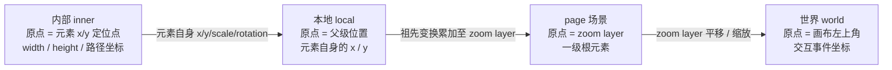

import { Canvas, Controls, Meta } from '@storybook/addon-docs/blocks';
import * as Coordinate from './coordinate.stories';

<Meta of={Coordinate} name="Docs" />

# 坐标体系

LeaferJS 的坐标系是一个**分层的模型**：每个节点自带一套 `x`、`y`、`scaleX`、`scaleY`、`rotation`、`skewX`、`skewY`，这套变换在节点身上定义出一个独立的坐标空间。节点套节点，坐标空间也层层嵌套——判断一个坐标属于哪一层，只需看它的原点 `(0, 0)` 是相对谁定的。

本课聚焦其中最常打交道的三层关系：节点的 `x`/`y` 在**本地坐标**里定位，渲染到画布上时换算成**世界坐标**，两者之间的桥梁就是 `getLocalPoint` / `getWorldPointByLocal` 等换算方法。理解了「原点定在哪 → 坐标属于哪层 → 想换层就调对应方法」，就能预测嵌套、拖拽、命中检测里的坐标行为。



| 坐标系 | 原点位置 | 典型用途 / 回查 |
| --- | --- | --- |
| **inner** 内部 | 元素被 `x`/`y` 定位的那个点 | `width`、`height`、`Path` 的路径坐标；不受自身 `x/y/scale/rotation` 影响 |
| **local** 本地 | **父级**的位置（类似 HTML 的 offset） | 元素自身的 `x`/`y` 在此度量 |
| **page** 场景 | zoom layer（缩放层） | 一级根元素所在的坐标层；视口缩放前的「画布内容」坐标 |
| **world** 世界 | 画布（视口）左上角 | 交互事件坐标、命中检测，类似 HTML 的 `clientX/Y` |

| 换算方法（都可选 `relative` / `distance` / `change`） | 方向 |
| --- | --- |
| `getLocalPoint(world)` | 世界 → 本地 |
| `getWorldPointByLocal(local)` | 本地 → 世界 |
| `getInnerPoint(world)` / `getWorldPoint(inner)` | 世界 ↔ 内部（注意：`getWorldPoint` 入参是**内部**坐标） |
| `getInnerPointByLocal(local)` / `getLocalPointByInner(inner)` | 本地 ↔ 内部 |
| `getPagePoint(world)` / `getWorldPointByPage(page)` | 世界 ↔ page |

## 本地坐标与世界坐标

**本地坐标（local）** 的原点是父级的位置：一个节点的 `x`/`y` 表达的是「相对父级本地原点的位移」。所以 `x`/`y` 就是节点的本地平移分量——LeaferJS 没有独立的 `translate` 属性，位置即 `x`/`y`；运行期要增量移动用 `move(dx, dy)`（在本地系叠加），要在世界系增量移动用 `moveWorld(dx, dy)`。

**世界坐标（world）** 的原点固定在画布左上角，是所有变换累加后的「绝对」位置。把一个节点的本地坐标一路乘上它自身及每一层祖先的变换矩阵，就得到它的世界坐标。纯位移嵌套时这退化成简单的相加；一旦某层有缩放或旋转，就要按矩阵叠加，不能再直接相加。

```ts
import { Leafer, Group, Rect } from 'leafer-ui'

const leafer = new Leafer({ view: canvas })   // 根的本地系 == 世界系，原点在画布左上角

const parent = new Group({ x: 90, y: 70 })    // 父级 x/y：在根的本地系（=世界系）中定位
const child = new Rect({                       // 子节点 x/y：在父级的本地系中定位
  x: 48, y: 38, width: 66, height: 66, fill: '#4f7cff',
})
parent.add(child)
leafer.add(parent)
// 子节点的世界坐标 ≈ (90 + 48, 70 + 38) = (138, 108)
```

关键直觉：**移动父级，子节点的 `x`/`y` 不变，但它的世界位置随父级一起变**；移动子节点，只改它自己的 `x`/`y`，世界位置也跟着变，但父级纹丝不动。下面的实例把这条关系做成可调闭环。

<Canvas of={Coordinate.Interactive} />
<Controls of={Coordinate.Interactive} />

| 读者操作 | 可观察证据 |
| --- | --- |
| 调整「父级位移 X / Y」 | 整组（虚线面板 + 子节点）在世界中平移；「子节点本地」读数**不变**，「世界坐标」与「世界原点 getLocalPoint」读数同步变化 |
| 调整「子节点本地 X / Y」 | 仅子节点在面板内移动；「子节点本地」与「世界坐标」读数都变，且 世界坐标 ≈ 父级位移 + 子节点本地 |
| 观察左上角红色 L 形标记 | 始终钉在画布左上角——世界原点 `(0, 0)` 不随任何节点移动 |
| 打开 Show code | 看到该 Canvas 实际执行的 `example.ts`，含 `getWorldPointByLocal` / `getLocalPoint` 的真实调用 |

边界：当父级或子节点带 `scaleX/scaleY/rotation/skew` 时，世界坐标不再是简单相加，而是按变换矩阵叠加（缩放会拉大位移、旋转会改变方向）。本课为看清主关系只用了位移；完整变换矩阵的叠加规则见「变换」课。

## 坐标换算

LeaferJS 的换算方法按命名成对出现，记住两条规律即可覆盖全部：

- **`getXxxPoint(world)`**：传入一个**世界坐标**点，返回它在某坐标系（`Local`/`Inner`/`Page`/`Box`）里的位置——世界 → 某层。
- **`getWorldPointByXxx(xxx)`**：传入某坐标系里的点，返回它的**世界坐标**——某层 → 世界。

所有方法都接受三个可选参数：`relative`（把指定元素当作世界系，用于在任意两节点的坐标系之间直接换算）、`distance`（按距离/长度而非点位换算，忽略平移分量）、`change`（直接写回传入的点对象，省去新建对象的开销）。

### 本地与世界：getLocalPoint / getWorldPointByLocal

这是最常用的一对，方向相反、互为逆运算。

```ts
// 本地 → 世界：子节点本地坐标点在世界中的位置
const world = child.getWorldPointByLocal({ x: child.x, y: child.y })

// 世界 → 本地：世界原点在子节点本地系中的位置（约等于本地坐标的相反数）
const originLocal = child.getLocalPoint({ x: 0, y: 0 })
```

上面实例的读数后两行正是这两个调用的真实输出：拖动父级位移，「世界坐标」一行随父级同步走，而「子节点本地」一行不动——这就是本地与世界的区别；把「世界坐标」喂回 `getLocalPoint` 又会回到「子节点本地」的值，证明两者可逆。

边界：`getWorldPointByLocal` 的入参是子节点的**本地**坐标（相对父级）；若手里是子节点**内部**坐标（如路径点），改用 `getWorldPoint(inner)`。

### 内部坐标与 page 坐标

**内部坐标（inner）** 的原点是元素被 `x`/`y` 定位的那个点，`width`、`height` 和 `Path` 的路径坐标都在此度量——可以把它想象成「房间内部」，不受元素自身 `x/y/scale/rotation` 影响。世界 ↔ 内部用 `getInnerPoint(world)` 和 `getWorldPoint(inner)`。注意它与 **box 坐标**（包围盒坐标系，原点是内容左上角）的细微区别：当内容不从 `(0,0)` 起笔时（常见于 `Path`）两者会错开，这层细节留给「包围盒」课。

**page 坐标（场景坐标）** 的原点是 zoom layer（缩放层），类似 HTML 的 page 坐标系，一级根元素就位于此层。世界 ↔ page 用 `getPagePoint(world)` 和 `getWorldPointByPage(page)`。它和世界坐标的差，正是视口的平移与缩放——这部分机制见「视图控制」与「分层渲染与视口」课。

## 最佳实践

- **高频换算避免对象分配。** 拖拽跟随、逐帧命中等场景里反复调换算方法，每次返回新对象会产生 GC 压力。传入一个可复用的点对象并设 `change: true`，结果直接写回该对象。
- **跨节点比较坐标用 `relative`。** 要把 A 节点本地系的点放到 B 节点本地系，不必先转到世界再转回；给换算方法传 `relative: B`，把 B 当作世界系一次完成，省去手动逐级换算。
- **设值后立即读世界坐标，先同步布局。** 改了 `x`/`y` 后世界矩阵按渲染节奏更新，立刻换算会读到旧值；调一次 `leafer.updateLayout()` 触发同步布局，或在 `leafer.nextRender(() => …)` 回调里读。

## 常见问题

- **`getWorldPoint(point)` 传的是本地坐标，结果不对。**
  `getWorldPoint` 的参数是**内部坐标**（inner），不是本地坐标；本地 → 世界要用 `getWorldPointByLocal`。两者只差一个命名，是最容易传错的一对。

- **把节点的 `x` / `y` 当成世界坐标。**
  `x`/`y` 是相对父级的**本地坐标**，父级一动世界位置就跟着变。要世界位置用 `getWorldPointByLocal({ x: node.x, y: node.y })`，或直接读 `node.worldBoxBounds.x / .y`。

- **改了 `x` / `y` 后立刻换算，读到的世界坐标是上一帧的旧值。**
  设值后世界矩阵按渲染节奏更新，不会立即重算。立即换算前调一次 `leafer.updateLayout()`，或把换算放进 `leafer.nextRender(() => { … })` 回调里读。

- **LeaferJS 里找不到 `translate` 属性。**
  本地平移**就是** `x`/`y`，没有独立的 `translate` 字段。要增量平移用 `node.move(dx, dy)`（本地系）或 `node.moveWorld(dx, dy)`（世界系）；`translate` 只作为底层矩阵方法（`Matrix.translate`）存在。

## 总结回顾

摘要：

LeaferJS 的坐标系分层嵌套，每层原点决定坐标归属：**内部坐标**（inner）原点在元素的 `x/y` 定位点，承载 `width/height` 与路径；**本地坐标**（local）原点在父级位置，节点的 `x/y` 在此度量——`x/y` 即本地平移分量，没有独立的 `translate`，增量移动用 `move` / `moveWorld`；**page** 原点在 zoom layer；**世界坐标**（world）原点在画布左上角，是交互事件的坐标层。世界坐标由本地坐标经自身及所有祖先的变换矩阵累加得到，纯位移时退化为相加。换算按 `getXxxPoint(world)`（世界 → 某层）与 `getWorldPointByXxx(xxx)`（某层 → 世界）成对出现，最常用的是 `getLocalPoint` 与 `getWorldPointByLocal` 这对互逆方法。

一句话：

> `x`/`y` 是相对父级的本地坐标，世界坐标由各级变换矩阵累加而成，两层之间用 `getLocalPoint` / `getWorldPointByLocal` 互转。

知识要点：

- LeaferJS 的四种坐标系各以什么为原点？
- 节点的 `x` / `y` 属于哪一层？它和 `translate` 是什么关系？
- 嵌套节点的世界坐标如何由本地坐标叠加得到？纯位移和带缩放/旋转时有何不同？
- 世界 → 本地、本地 → 世界 分别用哪个方法？为什么 `getWorldPoint` 的入参不是本地坐标？
- 改了 `x`/`y` 后立刻换算读到旧值，该怎么处理？
- `relative` / `distance` / `change` 三个可选参数各解决什么问题？

## 参考资料

- [Leafer UI 官方文档 · 坐标体系](https://www.leaferjs.com/ui/guide/basic/coordinate.html)
- [Leafer UI 官方文档 · 坐标转换（指南）](https://www.leaferjs.com/ui/guide/property/point/)
- [Leafer UI 官方文档 · 转换坐标（API 参考）](https://www.leaferjs.com/ui/reference/property/point/)
- [Leafer UI 官方文档 · position（x / y / offsetX / around）](https://www.leaferjs.com/ui/reference/property/position.html)
