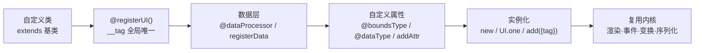

import { Canvas, Controls, Meta } from '@storybook/addon-docs/blocks';
import * as CustomElement from './custom-element.stories';

<Meta of={CustomElement} name="Docs" />

# 自定义元素

LeaferJS 的内置图形（`Rect`、`Star`、`Text` …）都由同一套机制注册。你可以用 `registerUI()` 注册自己的 UI 元素类，给它一个全局唯一的 `__tag`，再继承任意内置元素，从而**原样复用内核的渲染、命中、事件、变换、填充描边和 JSON 序列化**。自定义元素只写差异：新增的数据属性、定制的数据层、以及（按需）覆盖的绘制逻辑。一句话理解：注册拿到一个可被 `tag` 反查的类，继承拿到一整棵能力树，剩下的只是声明你独有的属性。



| 输入 / API | 默认 / 形式 | 回查要点 |
| --- | --- | --- |
| `@registerUI()` / `Class.registerUI()` | 装饰器 / 静态方法 | 注册元素；以原型上的 `__tag` 为键存入 `UICreator` |
| `__tag` | 字符串，全局唯一 | 序列化、`UI.one`、`leafer.add({tag})` 都靠它反查到类 |
| `@dataProcessor(XxxData)` / `registerData(XxxData)` | 装饰器 / 静态方法 | 绑定数据层类；元素的 `__` 自动成为其实例，避免污染父类数据 |
| `@boundsType(default)` | 默认值任意 | 值变化**触发重排 + 重绘**；会导出到 JSON |
| `@surfaceType(default)` | 默认值任意 | 值变化**只触发重绘**（不改包围盒）；会导出 |
| `@dataType(default)` | 默认值任意 | 值变化**不触发自动更新**；会导出 |
| `@createAttr(default)` | 默认值任意 | 仅生成 get/set，**不导出**到 JSON |
| `addAttr(name, default, fn)` | `fn` 默认 `boundsType` | 命令式注册属性的入口，等价上面的装饰器 |
| `UI.one(json)` / `UICreator.get(tag, data)` | 按 `tag` 创建 | 从 JSON 或 tag 还原元素；`leafer.add({tag, ...})` 同理 |
| 数据层变量命名 | `_key` / `__key` | 单下划线=私有计算变量可写；业务标志用双下划线前缀；无下划线=自动生成的 get/set 不可手写 |

## 注册：@registerUI 与 `__tag`

注册一个自定义元素只需两件事：用 `@registerUI()` 标记类，并定义全局唯一的 `__tag` getter。注册的本质是把类以 `__tag` 为键存进 `UICreator` 的列表——之后所有按 tag 创建、序列化还原的入口都查这张表。继承谁，就复用谁的能力：继承 `Rect` 拿到矩形几何，继承 `Group` 拿到子节点容器，继承 `UI` 只拿到最通用的属性骨架。

```ts
import { Leafer, Rect, registerUI } from 'leafer-ui';

@registerUI()                       // 1. 注册元素
class Custom extends Rect {          // 2. 继承内置元素，复用其渲染 / 事件 / 变换
  public get __tag() {               // 3. 全局唯一 tag，序列化与按 tag 创建都靠它
    return 'Custom';
  }
}

const leafer = new Leafer({ view: canvas, fill: '#fff' });
leafer.add(new Custom({ width: 100, height: 100, fill: '#4f7cff', draggable: true }));
```

不用装饰器时，用等价的命令式 API：`class Custom extends Rect { get __tag() { return 'Custom' } }`，再 `Custom.registerUI()`。两者效果一致；下方实例的 Show code 正是用命令式写法注册的 `StarBadge` 元素——继承 `Group`，新增自定义属性 `score`，把若干内置 `Star` 作为子节点摆放出来。

<Canvas of={CustomElement.Interactive} />
<Controls of={CustomElement.Interactive} />

| 读者操作 | 可观察证据 |
| --- | --- |
| 调整「自定义属性 score」 | 星星数量随之增减（0–5 颗）；读数「子星数」同步变化 |
| 拖动元素 | 元素跟随移动，证明继承了 Group 的命中、事件与交互能力 |
| 打开 Show code | 看到 `registerUI / registerData / addAttr` 三步注册与 `setScore` 数据钩子 |
| 看读数 | `__tag='StarBadge'`、数据层 `StarBadgeData ✓`、`tag 已注册 ✓` |

**边界：** `__tag` 必须全局唯一，重复注册同名 tag 会被 `UICreator` 警告并覆盖。装饰器语法需要在 `tsconfig.json` 中开启 `experimentalDecorators: true`；不便改编译配置时直接用命令式 `Class.registerUI()`。注册只是“登记”，元素能否渲染仍取决于它继承的基类与绘制逻辑。

## 数据层与自定义属性

每个元素都有一个 `__` 数据实例，承载属性的计算状态（`ui.__.width`、`ui.__.fill` …）。自定义元素要用 `@dataProcessor(自定义Data类)` / `registerData(自定义Data类)` 指定自己的数据层——**继承类时务必定义独立的数据层**，否则新增属性会写到被继承元素的 Data 原型上，污染所有同类节点。数据类 extends 对应基类的 Data（`Group → GroupData`、`Rect → RectData`）；没有特殊计算逻辑时，定义一个空类即可。

自定义属性用属性处理器装饰器声明，区别在于**值变化时触发什么**：

```ts
import { registerUI, dataProcessor, boundsType, Rect, RectData } from 'leafer-ui';

class CustomData extends RectData {}          // 空数据类：仅隔离数据层

@registerUI()
class Custom extends Rect {
  public get __tag() { return 'Custom'; }

  @dataProcessor(CustomData)
  declare public __: CustomData               // 绑定数据层，隔离父类

  @boundsType(0)                              // 值变化触发重排 + 重绘，并导出到 JSON
  declare public left: number
}

const c = new Custom({ left: 50, width: 100, height: 100, fill: 'blue' });
console.log(c.toJSON());                      // { tag: 'Custom', left: 50, width: 100, ... }
```

命令式等价：先 `Custom.registerUI()`、`Custom.registerData(CustomData)`，再 `Custom.addAttr('left', 0, boundsType)`（第三个参数省略时默认 `boundsType`）。

### 响应式属性：数据层的 `set<Key>` 钩子

需要属性变化时自动重建内容（重画路径、重建子节点）时，在数据类里定义 `set` + 属性名的方法：它会被框架自动连接成该属性的写入钩子。钩子内用 `this.__leaf` 访问元素实例。这正是 `StarBadge` 的 `score` 能在赋值后自动重建星星的原理。

```ts
class StarBadgeData extends GroupData {
  protected _score = 0;                        // 单下划线：私有计算变量
  protected setScore(value: number): void {    // 自动成为 score 的 setter
    this._score = value;                       // 先存值（不要调用 super.setScore）
    (this.__leaf as StarBadge).createStars();  // 再触发元素的重建逻辑
  }
}
```

变量命名约定：无下划线的名字预留给框架自动生成的 get/set，不能手写；`_key` 是私有计算变量，可读写；业务标志位用双下划线前缀 `__key`。

## 选择继承基类

自定义元素“画什么”几乎全由继承的基类决定。先按目标选基类，再决定要不要覆盖绘制：

- **只加数据、不改形状** → 继承 `Rect` / `Star` 等现成图形，或继承 `UI` 拿通用骨架。
- **组合多个子元素** → 继承 `Group`，在构造器或方法里 `add` 子节点。
- **命令式分段画路径** → 继承 `Pen`，用 `setStyle` + 命令方法画多样式组合。

### 继承 UI 与覆盖 `__updatePath`

继承 `UI`（或任意图形）可拿到全部通用属性；要画自定义几何形状，覆盖 `__updatePath()`，把路径命令写入 `this.__.path`。内置的 `Star`、`Polygon`、`Ellipse` 都是这么定义形状的——它们本身是最好的范本。

```ts
import { UI, registerUI, dataProcessor, UIData, PathCommandDataHelper } from 'leafer-ui';

const { moveTo, lineTo, closePath } = PathCommandDataHelper;

class CrossData extends UIData {}

@registerUI()
class Cross extends UI {
  public get __tag() { return 'Cross'; }

  @dataProcessor(CrossData)
  declare public __: CrossData

  public __updatePath(): void {                // 覆盖形状：用 helper 写命令到 this.__.path
    const { width: w, height: h } = this.__;
    const t = Math.min(w, h) / 3;              // 十字厚度
    const path: number[] = this.__.path = [];
    // 沿十字外轮廓走一圈：M 起笔，L 连线，Z 闭合
    moveTo(path, w / 2 - t / 2, 0);
    lineTo(path, w / 2 + t / 2, 0);
    lineTo(path, w / 2 + t / 2, h / 2 - t / 2);
    lineTo(path, w, h / 2 - t / 2);
    lineTo(path, w, h / 2 + t / 2);
    lineTo(path, w / 2 + t / 2, h / 2 + t / 2);
    lineTo(path, w / 2 + t / 2, h);
    lineTo(path, w / 2 - t / 2, h);
    lineTo(path, w / 2 - t / 2, h / 2 + t / 2);
    lineTo(path, 0, h / 2 + t / 2);
    lineTo(path, 0, h / 2 - t / 2);
    lineTo(path, w / 2 - t / 2, h / 2 - t / 2);
    closePath(path);
  }
}
```

> 路径命令的扁平数组写法、坐标含义与 `__drawPathByBox` 的区别，见 [路径与画笔](?path=/docs/path-and-pen--docs)。本课只关注“自定义元素在哪里覆盖绘制”：覆盖 `__updatePath()` 即可让继承来的图形换成你定义的几何。

### 继承 Group 组合子节点

继承 `Group` 得到一个容器，可在构造器或方法里动态 `add` / `removeAll` 子节点。本课实例的 `StarBadge` 即是此类：`createStars()` 根据 `score` 清空并重建若干 `Star` 子节点。基于 `Group` 的自定义元素若不需要导出子节点的 JSON，可在构造器里设 `this.childlessJSON = true`，序列化时只保留元素自身的属性。

### 继承 Pen 命令式画路径

要画多颜色、多填充的分段路径，继承 `Pen`，用 `setStyle` 切换样式后发命令；属性变化时 `clearPath` 重画。完整用法见 [路径与画笔](?path=/docs/path-and-pen--docs) 的 Pen 小节，自定义元素里只是把这套流程包进类、由数据钩子驱动重画。

## 实例化与序列化

注册过的元素有三种创建方式，结果等价：

```ts
import { Leafer, UI } from 'leafer-ui';

// 1. 直接构造（最常用）
const a = new StarBadge({ score: 4, x: 100, y: 100 });

// 2. 从 JSON 按 tag 还原（UI.one 读 data.tag 反查注册类）
const json = a.toJSON();                       // { tag: 'StarBadge', score: 4, x: 100, y: 100, ... }
const b = UI.one(json);

// 3. add 时传带 tag 的纯数据对象（内部调 UICreator.get(tag, data)）
leafer.add({ tag: 'StarBadge', score: 5, x: 200, y: 100 });
```

`toJSON()` 导出所有可导出属性（`@dataType` / `@boundsType` / `@surfaceType` 声明的，`@createAttr` 不导出）并附带 `tag`；`UI.one(json)` 与 `leafer.add({tag, ...})` 都凭 `tag` 找回类再实例化，所以**注册名必须稳定**——改名等于换了一种元素。需要按 tag 查找已存在的节点时，用 `parent.findTag('StarBadge')`。

## 最佳实践

- **先选基类，再写差异。** 形状来自现成图形就继承它（`Rect` / `Star`）；要组合子元素继承 `Group`；要分段命令式画路径继承 `Pen`。基类选对，大部分能力是白拿的。
- **继承必定义独立数据层。** 哪怕是空类，也要 `class XxxData extends 对应Data {}` 并 `@dataProcessor(XxxData)`，避免自定义属性污染被继承元素的原型。
- **属性按副作用选装饰器。** 影响包围盒（尺寸、位置、自定义几何参数）用 `@boundsType`；只改外观用 `@surfaceType`；纯数据用 `@dataType`；不希望导出的内部状态用 `@createAttr`。
- **`__tag` 当作公开契约。** 一旦上线，不要改名、不要复用旧名；它同时是序列化键和 `UI.one` / `add({tag})` 的查找键。

## 常见问题

- **`new Custom()` 报 “not register xxx”，或 `UI.one({tag})` 返回 `undefined`。**
  类没有被注册。检查是否调用了 `@registerUI()` 或 `Class.registerUI()`，以及 `__tag` getter 返回的字符串是否和 JSON 里的 `tag` 完全一致（区分大小写）。
- **给自定义属性赋值，画面没反应。**
  看用的是哪个装饰器：`@dataType` 不会触发任何更新，需要手动重绘或改用 `@boundsType` / `@surfaceType`；要“赋值即重建”，在数据层定义 `set<Key>` 钩子并在其中调用元素的重建方法。
- **装饰器语法 `@registerUI()` 编译报错。**
  在 `tsconfig.json` 的 `compilerOptions` 里加 `"experimentalDecorators": true`；不能改配置时，改用命令式 `Class.registerUI()` / `Class.registerData(Data)` / `Class.addAttr(name, default, fn)`，效果完全一致。
- **新增属性污染了所有 Rect / Group 节点。**
  忘了定义独立数据层。给自定义元素加 `@dataProcessor(XxxData)`（命令式 `Class.registerData(XxxData)`），让 `__` 指向自己的数据类。
- **`ui.__.xxx` 读不到自定义属性。**
  自定义属性必须先经装饰器（或 `addAttr`）注册，才会在数据层生成 get/set。只在类上写了 `declare` 字段而没注册，不会进入数据层。

## 总结回顾

摘要：

LeaferJS 的自定义元素用 `registerUI()` 注册、用全局唯一的 `__tag` 标识，继承任意内置元素即可复用内核的渲染、命中、事件、变换与 JSON 序列化。自定义元素只声明差异：用 `@dataProcessor` / `registerData` 绑定独立数据层（隔离父类数据），用 `@boundsType` / `@surfaceType` / `@dataType` / `addAttr` 注册自定义属性——三者的区别是值变化时触发重排、重绘还是不触发；要赋值即重建，在数据层定义 `set<Key>` 钩子。绘制按基类分工：继承 `UI` 覆盖 `__updatePath` 定义几何，继承 `Group` 组合子节点，继承 `Pen` 命令式画分段路径。注册后元素可用 `new`、`UI.one(json)`、`leafer.add({tag, ...})` 三种方式创建，`toJSON()` 凭 `tag` 可还原。

一句话：

> 注册拿到一个可被 `__tag` 反查的类，继承拿到一整棵内核能力树，剩下的只是声明你独有的数据属性与绘制差异。

知识要点：

- 注册一个自定义元素需要哪两件事？`__tag` 有什么作用？
- `@dataProcessor` / `registerData` 为什么不能省略？
- `@boundsType`、`@surfaceType`、`@dataType` 在值变化时分别触发什么？
- 怎样让一个自定义属性在赋值后自动重建元素内容？
- 继承 `UI` / `Group` / `Pen` 分别适合画什么？覆盖绘制的方法是什么？
- `new`、`UI.one(json)`、`leafer.add({tag, ...})` 三种创建方式分别用在什么场景？

## 参考资料

- [Leafer UI 官方文档 · 自定义元素（注册元素）](https://www.leaferjs.com/ui/en/reference/display/custom/base/register.html)
- [Leafer UI 官方文档 · 自定义元素（定义数据）](https://www.leaferjs.com/ui/en/reference/display/custom/base/data.html)
- [Leafer UI 官方文档 · 自定义元素（添加属性）](https://www.leaferjs.com/ui/en/reference/display/custom/base/attr.html)
- [Leafer UI 官方文档 · 自定义元素（继承扩展）](https://www.leaferjs.com/ui/en/reference/display/custom/extends.html)
- [Leafer UI 官方示例合集](https://www.leaferjs.com/examples/)
