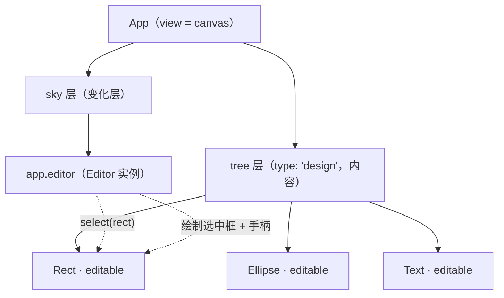

import { Canvas, Controls, Meta } from '@storybook/addon-docs/blocks';
import * as EditorBasics from './editor-basics.stories';

<Meta of={EditorBasics} name="Docs" />

# 启用编辑器

LeaferJS 内置一个图形编辑器（`@leafer-in/editor`）：它给被选中的元素套上一个可变换的选中框，并开箱提供悬停高亮、点击选中、框选、拖拽移动和缩放旋转手柄。编辑器不是独立画布，而是运行在 `App` 的**天空层（sky）**里，俯瞰**内容层（tree）**中的场景元素。

三个对象的关系决定了启用方式：

- **`App`** 是顶层壳，把多个 `Leafer` 当作「层」叠在一起协同渲染。
- **`tree`** 是内容层（默认 `type: 'design'`），承载你的 `Rect` / `Text` 等场景元素。
- **`sky`** 是变化层，编辑器实例 `app.editor` 就挂在这里，它绘制选中框并响应交互。

预测结果只需一句话：**把 `editor` 配置传给 `App`，就会自动创建 `app.editor` 实例与 `tree` / `sky` 两层；给元素标上 `editable: true`，再用 `app.editor.select(target)` 选中，选中框立刻套住目标。**



| 关键输入 / 方法 | 默认与行为 | 回查要点 |
| --- | --- | --- |
| `new App({ editor })` | `editor: {}` 即启用，自动建 `tree`（design）、`sky`、`app.editor` | `editor` 配置为真值才触发；省略则不建编辑器 |
| `editable`（UI 属性） | 未设置（falsy） | 点击 / 框选只命中 `editable: true` 的元素；编程式 `select` 不受此限 |
| `editor.select(target)` | 设 `editor.target`，套上选中框 | 传单个元素或数组；选中框随目标位置 / 尺寸更新 |
| `editor.cancel()` | 清空 `target`，选中框消失 | `editor.list` 归零，`editor.editing` 变 `false` |
| `editor.list` / `editor.editing` | `list` 是当前选中数组，`editing` = `list.length > 0` | 读这两个值即可判断选中状态 |
| `editor.config` 默认项 | `hover` / `boxSelect` / `multipleSelect` / `moveable` / `rotateable` 等均为 `true` | 这些默认行为即「开箱即用」的来源 |

## 启用编辑器

编辑器必须在 `App` 中使用。最简办法是把 `editor` 配置传给 `App`：引擎会自动创建 `app.editor` 实例、`tree` 层（默认 `type: 'design'`）与 `sky` 层，并把编辑器加到 sky 层。前提是先 `import '@leafer-in/editor'`——这一行会注册 `Creator.editor` 与 editor 插件，否则 `app.editor` 为空。

```ts
import { App, Rect } from 'leafer-ui';
import '@leafer-in/editor'; // 注册编辑器插件，必须引入

const app = new App({
  view: canvas,
  editor: {}, // 自动创建 app.editor + tree + sky
});

app.tree.add(new Rect({ editable: true, fill: '#FEB027', width: 120, height: 80 }));
```

下面的实例把启用与选中合在一起：场景里有三个 `editable` 元素（矩形 / 椭圆 / 文字），编辑器已挂载并默认选中矩形。用「选中元素」控件切换 `editor.select()` 的目标，观察紫色选中框（`#836DFF` 描边 + 白色控制点）在元素间移动；选「无选中」则调用 `editor.cancel()` 让框消失。

<Canvas of={EditorBasics.Interactive} />
<Controls of={EditorBasics.Interactive} />

| 读者操作 | 可观察证据 |
| --- | --- |
| 切换「选中元素」到椭圆 / 文字 | 选中框移动到对应元素，读数「选中元素」「选中数量」同步变化 |
| 切换「选中元素」到「无选中」 | 选中框消失，读数「编辑中」变「否」、「选中数量」变 `0` |
| 鼠标悬停元素 | 元素出现紫色悬停高亮（编辑器默认行为，非选中框） |
| 直接点击画布中的元素 | 选中框跳到被点元素，读数跟随更新（`EditorEvent.SELECT` 派发） |
| 打开 Show code | 看到该 Canvas 实际执行的 `example.ts` |

### 通过 App 配置自动启用

推荐做法。传 `editor: {}` 即用全部默认配置；也可传部分配置覆盖默认项（如 `editor: { boxSelect: false }`）。`view` 可以是选择器、DOM 容器或 `<canvas>` 元素，编辑器内部会读取其尺寸并处理像素比。

```ts
const app = new App({
  view: '#stage',
  tree: {},   // 可选；省略时 editor 触发自动创建（type: 'design'）
  sky: {},    // 可选；省略时 editor 触发自动创建
  editor: {}, // 启用编辑器，全部走默认配置
});
```

### 手动挂载编辑器

`editor: {}` 背后做的事可以手动拆解：先建好层，再 `new Editor()` 加到 sky 层并赋给 `app.editor`。只有需要自定义层的创建顺序、或在不传 `editor` 配置的场景里按需挂载时才用它。

```ts
import { App, Rect } from 'leafer-ui';
import { Editor } from '@leafer-in/editor';

const app = new App({ view: '#stage' });
app.tree = app.addLeafer({ type: 'design' }); // 内容层
app.sky = app.addLeafer();                     // 变化层

app.tree.add(new Rect({ editable: true, fill: '#FEB027', width: 120, height: 80 }));

// 关键三步：建实例 → 挂到 sky → 赋给 app.editor
app.sky.add((app.editor = new Editor()));
```

## 标记可编辑元素与选中

挂上编辑器只是第一步；元素还要标 `editable: true` 才能被**点击 / 框选**命中。选择器在事件路径上找第一个 `editable` 的元素作为目标，所以未标记的元素点击无反应。编程式 `editor.select(target)` 直接设 `target`，不经过选择器的 `editable` 过滤，但仍建议统一标 `editable`，保持交互一致。

```ts
import { EditorEvent } from '@leafer-in/editor';

const rect = new Rect({ editable: true, fill: '#ef4444', width: 120, height: 80 });
app.tree.add(rect);

app.editor.select(rect); // 选中：套上选中框，editor.list === [rect]
app.editor.cancel();     // 取消：清空选中，editor.list === []

// 用户点击改变选中时派发 EditorEvent.SELECT，可据此同步外部 UI
app.editor.on(EditorEvent.SELECT, (e) => {
  console.log(e.editor.list); // 当前选中的元素数组
});
```

`editable` 还可设为 `'single'`，表示该元素只允许单独选中、不参与多选；锁定元素（`locked: true`）也会被多选过滤掉。选中与变换手柄的细节是独立主题，见 [8.1.2 选中与变换手柄](?path=/docs/select-transform--docs)。

## 编辑器开箱即用的行为

启用后无需额外代码，以下默认行为即生效（默认值来自 `editor.config`）：

- **悬停高亮**（`hover: true`）：鼠标移到 `editable` 元素上时显示紫色描边轮廓。
- **点击选中**（`select: 'press'`）：按下即选中命中元素；按住多选键（`multipleSelectKey`）可累加。
- **框选**（`boxSelect: true`、`multipleSelect: true`）：在空白处拖拽画框，框内 `editable` 元素被多选。
- **拖拽移动 / 缩放 / 旋转 / 翻转 / 斜切**（`moveable` / `resizeable` / `rotateable` / `flipable` / `skewable` 均为 `true`）：拖元素本体移动，拖选中框手柄变换。
- **键盘方向键微调**（`keyEvent: true`、`arrowStep: 1`）：方向键按 `arrowStep` 移动选中元素，配合加速键按 `arrowFastStep` 移动。

这些配置都可按需关闭，例如纯展示场景可 `editor: { hover: false, boxSelect: false }` 关掉悬停与框选。手柄样式、吸附、框选模式等深入调整属于后续课程。

## 常见问题

- 点击元素没有反应，选中框不出现
  元素没设 `editable: true`。选择器只在事件路径里找 `editable` 为真的元素，未标记的元素点击命中也会被跳过。给需要可选中的元素加上 `editable: true`；若希望整个场景默认可编辑，可在创建时统一带上该属性。

- `app.editor` 是 `undefined`
  没有引入 `@leafer-in/editor`。`import '@leafer-in/editor'`（或 `import { Editor } from '@leafer-in/editor'`）会执行模块注册 `Creator.editor` 与 editor 插件；漏掉这行，`new App({ editor })` 时没有创建器可用，`app.editor` 不会被赋值。

- 编程式 `editor.select(rect)` 能选中，点击却选不中同一个元素
  这是预期差异：`select()` 直接设 `target`，不检查 `editable`；而点击 / 框选走选择器，需要 `editable: true` 才命中。给该元素补上 `editable: true` 即可让两种方式一致。

## 总结回顾

摘要：

LeaferJS 的图形编辑器运行在 `App` 的 sky 层，俯瞰 tree 层中的场景元素。把 `editor` 配置传给 `App` 会自动创建 `app.editor` 实例与 `tree`（design）、`sky` 两层，前提是先引入 `@leafer-in/editor` 注册插件；也可手动 `new Editor()` 挂到 sky 层。元素需标 `editable: true` 才能被点击 / 框选命中，`editor.select(target)` / `editor.cancel()` 控制编程式选中，`editor.list` 与 `editor.editing` 反映选中状态。启用后悬停高亮、点击选中、框选、拖拽与变换手柄等默认行为全部生效，可按需通过 `editor.config` 关闭。

一句话：

> 传 `editor` 给 `App`、引入 `@leafer-in/editor`、给元素标 `editable`，编辑器就能选中元素并套上可变换的选中框。

知识要点：

- 用 `App` 启用编辑器需要哪三样（插件引入、`editor` 配置、`tree`/`sky` 层）？
- `editor: {}` 自动创建了哪些对象？手动挂载的等价写法是什么？
- 为什么元素必须 `editable: true` 才能被点击选中？编程式 `select` 为何不受此限？
- 如何选中、取消选中，并读取当前选中的元素与是否在编辑中？
- 编辑器开箱即用提供了哪些默认行为？

## 参考资料

- [Leafer UI 官方文档 · 编辑器](https://www.leaferjs.com/ui/plugin/in/editor/)
- [App（分层组织多个 Leafer）](https://www.leaferjs.com/ui/guide/basic/app.html)
- [Editor.select / list / cancel（编辑器 API）](https://www.leaferjs.com/ui/plugin/in/editor/Editor/select.html)
- [editable（元素可编辑属性）](https://www.leaferjs.com/ui/reference/UI/editable.html)
- [@leafer-in/editor 源码（config.ts / Editor.ts）](https://github.com/leaferjs/leafer)
