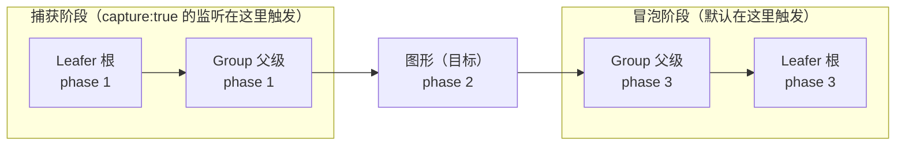

import { Canvas, Controls, Meta } from '@storybook/addon-docs/blocks';
import * as Events from './events.stories';

<Meta of={Events} name="Docs" />

# 事件系统

LeaferJS 提供一套类 DOM 的事件机制：**每个节点都是事件目标**，`on` 绑定、`off` 解绑、`once` 绑定一次；交互事件（指针、拖拽、键盘）会沿着节点树从根到目标**捕获**一遍，再从目标回到根**冒泡**一遍；**命中检测**决定 `target` 是谁；**按键状态**（`ctrlKey` 等）附在每个事件对象上。

记住这条主线就能预测大多数行为：一次点击 → 引擎先做命中检测找到 `target`（事件路径 `path` 上最深、最上层的节点）→ 沿路径 capture → target → bubble 派发 → 每个节点的匹配监听被调用，`e.target` 始终是最初命中的节点、`e.current` 是当前监听所在的节点。下面的实例把这条主线全部可视化：右下读数会实时显示事件类型、目标、当前节点、阶段、坐标和按键。



| 关键输入 | 默认 | 含义与回查要点 |
| --- | --- | --- |
| `on(type, listener, options)` | — | 绑定。`type` 可空格分隔多类型、传数组或对象 map；`options` 传 `true`=捕获、`'once'`=一次、或 `{ capture, once }`。 |
| `once(type, listener, capture?)` | — | 绑定一次，触发后自动解绑。 |
| `off(type?, listener?, options?)` | — | 无参=解绑全部；只传 `type`=清该类型；`type+listener`=精确解绑。 |
| `on_` / `off_` | — | `on_` 可绑定 `this` 并返回 `id`，`off_(id)` 按 id 解绑（支持数组）。 |
| `bubbles` | `true` | UI/交互事件默认沿节点树传播。 |
| `phase` | — | 只读：`1` 捕获 / `2` 目标 / `3` 冒泡，与 DOM 一致。 |
| `stop()` / `stopNow()` | — | `stop` 当前节点监听跑完后停止传播；`stopNow` 立即停止（含本节点后续监听）。 |
| `hitBox` | `false` | 命中按包围盒（`true`，透明区域也算）还是按实际路径（`false`，默认）。 |
| `hitFill` / `hitStroke` | `'path'` | 填充 / 描边的命中类型：`'path'`、`'pixel'`（像素级，过滤透明）、`'all'`、`'none'`。 |
| `hittable` | `true` | 元素是否参与命中（类似 CSS `pointer-events`）。 |
| `hitChildren` | `true` | 分支的子元素是否参与命中。 |
| `hitSelf` | `true` | 元素自身是否接收事件。 |
| `hitRadius` | `0` | 元素额外的命中半径（px）。 |
| `pointer.hitRadius` | `5` | 全局拾取半径，在 Leafer / 应用配置里改（区别于单个元素的 `hitRadius`）。 |
| `ctrlKey` / `shiftKey` / `altKey` / `metaKey` | — | 修饰键状态，每个交互事件都带；`e.left` / `e.right` / `e.middle` 读鼠标按键。 |

## 绑定事件

`on` 是入口。事件类型用字符串（如 `'click'`、`'pointer.enter'`），回调的参数就是事件对象。`Rect`、`Group`、`Leafer` 等所有节点都继承自 `Eventer`，都有 `on / off / once / emit / hasEvent`。

```ts
import { Leafer, Rect } from 'leafer-ui'

const leafer = new Leafer({ view: window })
const rect = new Rect({ width: 100, height: 100, fill: '#32cd79' })
leafer.add(rect)

// 基本绑定：第二个参数是回调，事件对象带 type / target / current / phase / x / y 等
rect.on('click', (e) => console.log(e.type, e.target.tag))
// 空格分隔一次绑多个类型，共用一个回调
rect.on('pointer.enter pointer.leave', (e) => { /* 悬停切换 */ })
// 对象写法：批量绑定，每项可为 [回调, options]
rect.on({ click: onClick, double_click: [onClick, { capture: true }] })
```

解绑用 `off`，`once` 绑定一次。需要绑定 `this` 或事后精确回收时用 `on_` / `off_`。

```ts
rect.off('click', onClick)   // 精确解绑（回调引用要一致）
rect.off('click')            // 清除该类型的全部监听
rect.off()                   // 解绑所有类型

rect.once('click', onClick)  // 触发一次后自动解绑

const id = rect.on_('click', this.onClick, this) // 绑定 this，返回 id
rect.off_(id)                                    // 按 id 解绑，可传数组
```

下面的实例把绑定、事件类型、事件流、命中和按键串在一起。它在一个 `Group` 容器里放一个可拖动图形：`Group` 上监听 `click` 等指针事件（`capture` 开关决定阶段），图形上监听 `pointer.enter/leave` 与 `drag.*`。试着悬停、点击、拖动，再切换右下控件。

<Canvas of={Events.Interactive} />
<Controls of={Events.Interactive} />

| 读者操作 | 可观察证据 |
| --- | --- |
| 悬停图形 | 图形高亮、读数「事件」出现 `pointer.enter`，「目标/当前」都是图形，阶段=`2 目标` |
| 移开图形 | 读数出现 `pointer.leave`，图形恢复底色 |
| 点击图形（capture 关） | 读数「事件」=`click`，「目标」=图形，「当前」=`Group`，阶段=`3 冒泡` |
| 打开「捕获阶段 capture」再点图形 | 阶段变为 `1 捕获`——同一监听可挂在捕获或冒泡阶段 |
| 双击图形 | 读数出现 `double_click` |
| 按住 Ctrl（或 Shift）点击图形 | 读数「按键」出现 `Ctrl`（或 `Shift`） |
| 拖动图形 | 读数依次出现 `drag.start` → `drag` → `drag.end` |
| 选「星形」+ 关 `hitBox`，点透明拐角 | 「目标」=`Group`（星形路径未命中，事件穿透到容器） |
| 打开「包围盒命中 hitBox」再点同一拐角 | 「目标」变回 `Star`（包围盒命中） |
| 打开 Show code | 看到该 Canvas 实际执行的 `example.ts` |

## 事件类型

交互事件按输入来源分成几个类，都继承自 `UIEvent`，因此都带 `x/y`、`path`、修饰键和 `target/current/phase`。事件类型可以直接写字符串，也可以用类的静态常量（如 `PointerEvent.CLICK === 'click'`）。

| 类（继承链） | 常用事件类型字符串 |
| --- | --- |
| `PointerEvent`（指针） | `pointer.down` `pointer.up` `pointer.move` `pointer.over`/`out` `pointer.enter`/`leave` `click` `double_click` `tap` `double_tap` `long_press` `long_tap` `pointer.menu`（右键菜单） |
| `DragEvent`（拖拽，继承 PointerEvent） | `drag.before_drag` `drag.start` `drag` `drag.end` `drag.over`/`out` `drag.enter`/`leave` `drag.animate` |
| `MoveEvent`（视图平移，继承 DragEvent） | `move.start` `move` `move.end`；`moveType` 区分 `'drag'`（元素拖动）与 `'move'`（视图平移） |
| `DropEvent`（放置，继承 PointerEvent） | `drop`；配合 `DragEvent.setData/setList` 传递拖拽数据 |
| `KeyEvent`（键盘，继承 UIEvent） | `key.down` `key.hold` `key.up`（另有 `key.before_down`/`before_up` 拦截用） |

> 进阶手势 `RotateEvent`（`rotate`）、`ZoomEvent`（`zoom`）、`SwipeEvent`（`swipe.left/right/up/down`）同理，用于双指旋转 / 缩放 / 滑动场景。

### PointerEvent

最常用的一组。`pointer.enter`/`leave` 在指针进入 / 离开元素时触发（悬停反馈），`click` / `double_click` 在点击 / 双击时触发。`pointer.over`/`out` 与 `enter`/`leave` 的区别对应 DOM：前者会在子元素间切换时反复触发，后者只在整个元素的进出边界时触发。

```ts
rect.on('pointer.enter', (e) => (rect.fill = '#ff8a5b'))
rect.on('pointer.leave', (e) => (rect.fill = '#32cd79'))
rect.on('double_click', (e) => console.log('双击', e.target.tag))
```

### DragEvent 与 MoveEvent

元素设 `draggable: true` 后，按下并移动超过 `dragDistance`（默认 `2`px）就进入拖拽，依次触发 `drag.start` → `drag`（每帧）→ `drag.end`。位移读数有三套坐标系：原始的 `moveX/moveY`（本帧）、`totalX/totalY`（累计），以及 `getLocalMove(relative?)` / `getInnerMove()` / `getPageMove()` 换算到指定节点。

```ts
rect.draggable = true
rect.on('drag', (e) => {
  console.log('本帧', e.moveX, e.moveY, '累计', e.totalX, e.totalY)
  const local = e.getLocalMove(group) // 相对 group 坐标系的位移
})
```

`MoveEvent` 继承自 `DragEvent`，描述**视图平移**（拖空白处移动整个画布），用 `e.moveType === 'move'` 与元素拖动（`'drag'`）区分——这在做「拖元素 vs 拖画布」时是关键判断（视图缩放与平移的完整用法见「视图控制」课）。

### KeyEvent 与按键状态

修饰键不是某个事件独有，而是**每个交互事件都带**：`e.ctrlKey`、`e.shiftKey`、`e.altKey`、`e.metaKey`，外加 `e.left`/`right`/`middle`（鼠标按键）和 `e.spaceKey`。判断组合键用 `e.isHoldKeys(['Ctrl+S'])`。原始键盘事件用 `KeyEvent`（`key.down`/`hold`/`up`），`e.code` 是 `KeyboardEvent.code` 风格（如 `'KeyA'`、`'Enter'`、`'Space'`）。全局查「某键是否正按住」用 `Keyboard.isHold(code)`、`Keyboard.isHoldSpaceKey()`。

```ts
import { KeyEvent, Keyboard } from 'leafer-ui'

leafer.on(KeyEvent.DOWN, (e) => console.log(e.code, e.key))

rect.on('click', (e) => {
  if (e.ctrlKey && e.shiftKey) doSomething()       // 组合键
  if (e.isHoldKeys(['Ctrl+S'])) save()              // 快捷键判断
})

if (Keyboard.isHold('Space')) { /* 空格按住中 */ }
```

## 事件流

事件沿命中路径 `path` 派发：`path[0]` 是 `target`（最深、最上层命中节点），向上是各级父级，到 `Leafer` / `App` 根。派发顺序固定为 **捕获（根 → target，`phase=1`）→ 目标（`phase=2`）→ 冒泡（target → 根，`phase=3`）**。默认监听挂在冒泡阶段；给 `on` 传 `capture: true`（或直接传 `true`）就改挂捕获阶段。

```ts
// 同一次点击图形：capture 关 → Group 在冒泡阶段收到（phase=3）；
// capture 开 → Group 在捕获阶段收到（phase=1），先于图形自身。
group.on('click', (e) => console.log(e.phase, e.target.tag, e.current.tag), true)
```

事件对象上 `e.target` 恒为最初命中的节点、`e.current` 是当前监听所在的节点——在父级监听里两者不同，这正是「冒泡到了父级」的证据。需要中断传播时：`e.stop()` 在当前节点所有监听跑完后停止向上下游传播；`e.stopNow()` 立即停止（连本节点后续监听也不执行）；`e.stopDefault()` 阻止默认行为。

回到上方实例：打开「捕获阶段 capture」再点击图形，读数阶段会从 `3 冒泡` 切到 `1 捕获`，而 `target` 仍是图形——这就是同一个监听在两种阶段的区别。

## 命中检测

命中检测决定 `target` 是谁，进而决定谁的事件会触发。默认按**实际路径**命中（图形的真实轮廓），所以星形透明拐角处点击不会命中星形。把 `hitBox` 设为 `true` 改为按**包围盒**命中，透明区域也算。

```ts
new Star({ corners: 5 })                       // 默认路径命中：透明拐角穿透
new Star({ corners: 5, hitBox: true })          // 包围盒命中：拐角处也命中
new Ellipse({ hitFill: 'pixel' })               // 像素级命中，过滤 PNG/SVG 透明像素
```

家族里几个开关各管一层：`hittable`（元素整体是否参与命中，类似 `pointer-events: none`）、`hitChildren`（分支的子元素是否参与）、`hitSelf`（元素自身是否接收事件）、`hitRadius`（给单个元素加命中半径）。需要让事件穿透到下层时，还有 `hitThrough`（`'parent'` / `'leafer'` / `'app'`，控制穿透到哪一层）。

回到上方实例：选「星形」、关掉 `hitBox`，点击星形的透明拐角，读数「目标」会变成 `Group`（事件穿透到容器）；打开 `hitBox` 再点同一位置，「目标」变回 `Star`。

## 最佳实践

- **默认就用冒泡 + 父级监听。** 把监听挂在容器（`Group` / `Leafer`）上，靠 `e.target` 区分实际命中的子元素，比为每个子元素各绑一份监听更省、也更易统一回收。只有需要「先于目标处理」时才用 `capture: true`。
- **命中形状不规则就用路径命中，需要大点击区就用 `hitBox` / `hitRadius`。** 星形、PNG 图标的透明区域默认不会被点上；若要「点附近也算」，优先加 `hitRadius`（不改变视觉），需要整个包围盒都响应再上 `hitBox`。
- **用 `on_` / `off_` 管理带 `this` 的监听。** 回调里要用实例成员时，`on_(type, fn, this)` 自动绑定并返回 id，事后 `off_(id)` 精确解绑，避免 `off` 找不回原回调造成的泄漏。
- **拖拽读数用相对坐标系。** 拖动时优先 `e.getLocalMove(relative)` 把位移换算到目标父级的坐标系，避免画布有缩放 / 平移时 `moveX/moveY` 与视觉不一致。

## 常见问题

- **父级绑了 `click`，点子元素时 `e.current` 是父级、`e.target` 是子元素？**
  正常。事件冒泡到父级触发监听，`e.current` 是监听所在的节点（父级），`e.target` 恒为最初命中的节点（子元素）。要按命中目标分流，判断 `e.target` / `e.target.tag`。
- **`pointer.enter` / `leave` 和 `pointer.over` / `out` 有什么区别？**
  `enter`/`leave` 只在指针进出元素整体边界时触发一次；`over`/`out` 会在指针于元素及其子元素之间移动时反复触发（与 DOM 的 `mouseenter`/`mouseover` 区别一致）。做悬停高亮用 `enter`/`leave` 更稳。
- **星形 / 不规则图形的透明区域点不上？**
  默认按实际路径命中，透明拐角不算命中。要整块响应给 `hitBox: true`；只想略微放大点击区给 `hitRadius: N`；PNG 图标按透明像素过滤用 `hitFill: 'pixel'`。
- **拖动一直不触发 `drag`？**
  元素要先 `draggable: true`，且按下后移动距离要超过 `dragDistance`（默认 `2`px）才会进入拖拽——太小的移动只算点击。另外拖拽事件目标是可拖动元素本身，会冒泡到父级。
- **怎么让某元素完全不响应交互？**
  `node.hittable = false`（元素及其命中被跳过，类似 `pointer-events: none`）；只想让子元素不响应而容器本身响应，用容器 `hitChildren = false`。

## 总结回顾

摘要：

LeaferJS 的事件系统是类 DOM 模型：每个节点都是事件目标，用 `on` / `off` / `once` / `on_` / `off_` 绑定与解绑，事件类型覆盖指针（`click`、`pointer.enter/leave`…）、拖拽（`drag.start/drag/end`，继承 PointerEvent）、视图平移（`MoveEvent`）、放置（`drop`）与键盘（`key.down/up`）。交互事件沿命中路径 `path` 按「捕获 → 目标 → 冒泡」三阶段派发，`phase` 为 `1/2/3`；`e.target` 是命中目标、`e.current` 是当前监听节点，`stop` / `stopNow` 控制传播。命中检测决定 `target`：默认按实际路径命中，`hitBox` 改包围盒，`hittable` / `hitChildren` / `hitSelf` / `hitRadius` / `hitThrough` 各管一层。修饰键状态附在每个事件上（`ctrlKey` 等），可用 `isHoldKeys` 判断组合键、`Keyboard.isHold` 全局查询按键。

一句话：

> 事件沿命中路径「捕获 → 目标 → 冒泡」流转，`target` 由命中检测决定、修饰键随事件携带——绑定用 `on`，阶段用 `capture`，命中用 `hitBox` / 路径。

知识要点：

- 怎样用 `on` / `off` / `once` 绑定与解绑？`on_` / `off_` 解决什么问题？
- 交互事件有哪些家族？`click` / `drag` / `key.down` 各属于哪个类？
- 事件流的三个阶段是什么？`phase` 的 1/2/3 各代表什么？怎样把监听挂到捕获阶段？
- `e.target` 与 `e.current` 有何区别？怎么停止传播？
- `hitBox` 默认值是什么？星形透明拐角在两种命中方式下分别命中谁？
- 怎样读取修饰键状态、判断组合键、查询某键是否按住？

## 参考资料

- [Event 基础（事件流三阶段）| Leafer UI 官方文档](https://www.leaferjs.com/ui/guide/event/basic/Event.html)
- [事件处理（on / off / on_ / off_）| LeaferJS](https://www.leaferjs.com/book/leafer-ui/advance/event.html)
- [PointerEvent | Leafer UI 官方文档](https://www.leaferjs.com/ui/guide/event/ui/Pointer.html)
- [DragEvent | Leafer UI 官方文档](https://www.leaferjs.com/ui/guide/event/ui/Drag.html)
- [DropEvent | Leafer UI 官方文档](https://www.leaferjs.com/ui/guide/event/ui/Drop.html)
- [命中属性 hittable / hitBox / hitChildren | Leafer UI 官方文档](https://www.leaferjs.com/ui/reference/property/hit.html)
- [应用配置（pointer.hitRadius 等交互参数）| Leafer UI 官方文档](https://www.leaferjs.com/ui/reference/config/app/base.html)
