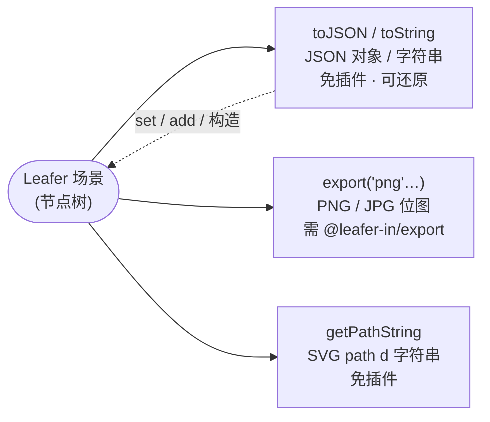

import { Canvas, Controls, Meta } from '@storybook/addon-docs/blocks';
import * as ExportCourse from './export.stories';

<Meta of={ExportCourse} name="Docs" />

# 导出

LeaferJS 的「导出」是把同一棵节点树转成三种可传输产物：**结构化的 JSON、位图图片、SVG 路径字符串**。三者的入口都挂在节点上，但归属不同：`toJSON()` / `getPathString()` 内置在基类，开箱即用；`export()`（导出 PNG/JPG）由 `@leafer-in/export` 插件注入，不导入则是个空占位。

理解导出的关键，是先分清「产物形态」与「是否需要插件」：JSON 给你还原场景的能力（序列化 / 反序列化），图片给你截图与下载的能力，SVG 路径给你把任意图形转成 `d` 字符串、喂给 `<path>` 或 `Path` 元素的能力。下方实例把三种导出同时跑在一排形状上，调整控件时读数会分别证明它们的产物。



| 对象 / 输入 | 类型 | 默认 | 回查要点 |
| --- | --- | --- | --- |
| `toJSON(options?)` | `{ matrix?: boolean }` | `undefined`（不含 matrix） | 递归序列化，输出含 `tag` + `children`；免插件；`{ matrix: true }` 额外加本地变换矩阵 |
| `toString(options?)` | 同上 | 同上 | 等价 `JSON.stringify(toJSON(options))`，直接得到字符串 |
| `export(filename, options?)` | `Promise<IExportResult>` | — | 需 `import '@leafer-in/export'`；filename 含 `.` 触发下载，不含 `.` 返回 base64；options 传 `true` 取 Blob、传数字取质量 |
| `syncExport(filename, options?)` | `IExportResult` | — | 同 `export` 的同步版，不等待网络资源，适合无图片资源的场景 |
| `getPathString(curve?, pathForRender?, floatLength?)` | `string` | — | 免插件；返回 SVG path `d` 字符串；对应 `getPath()` 返回命令数组 |
| `IExportOptions.pixelRatio` | `number` | `1` | 放大导出图片的物理像素，`result.width/height` = 逻辑尺寸 × pixelRatio |
| `IExportResult` | — | — | `{ data, width, height, renderBounds?, trimBounds?, error? }`；`data` 形态随 filename 变化 |

## 三种导出：JSON、图片与 SVG 路径

三种产物共用一棵节点树作为输入，差别只在「读出什么」与「要不要插件」。下面的实例把三种导出同时跑在一排形状上：切形状会改 `getPathString` 的路径和 JSON 里的 `tag`，调数量会改 JSON 的字符数，调像素比会改导出图片的物理尺寸。

<Canvas of={ExportCourse.Interactive} />
<Controls of={ExportCourse.Interactive} />

| 读者操作 | 可观察证据 |
| --- | --- |
| 切「形状」（Rect / Ellipse / Star / Polygon） | SVG 路径字符数与「SVG 示例」首段同步变化（矩形 4 段、星形 10 段、多边形 6 段） |
| 调「元素数量」1 → 6 | 「JSON 字符数」随之线性增长（toJSON 递归序列化每个子节点） |
| 调「导出像素比」1 → 4 | 「导出 PNG」宽高成比例增长（物理像素 = 逻辑尺寸 × 像素比） |
| 打开 Show code | 看到该 Canvas 实际执行的 `example.ts`（含三种导出的调用） |

### JSON：toJSON / toString 与还原

`toJSON()` 把节点（含整棵子树）序列化成一个纯对象：每层带一个 `tag` 标明元素类型，子节点递归进 `children`。它读的是「输入属性」（你写的 `x/y/width/fill` 等），不是内部计算字段，所以输出干净、可直接存盘。

```ts
import { Leafer, Rect } from 'leafer-ui';

const leafer = new Leafer({ view, fill: '#1e293b' });
leafer.add(new Rect({ x: 100, y: 100, width: 120, height: 80, fill: '#32cd79' }));

leafer.toJSON();
// { tag: 'Leafer', width: …, height: …, fill: '#1e293b',
//   children: [{ tag: 'Rect', x: 100, y: 100, width: 120, height: 80, fill: '#32cd79' }] }

leafer.toString();          // = JSON.stringify(toJSON())，直接得到字符串
leafer.toJSON({ matrix: true }); // 额外加 matrix:{a,b,c,d,e,f}（本地变换矩阵）
```

还原场景有三条等价路径，都靠 `tag` 字段把纯对象变回对应类的实例：

```ts
// 1) 构造函数第二参数：整体还原一棵树
const leafer2 = new Leafer({ view }, json);

// 2) add() 接受带 tag 的纯 JSON：往现有树上挂子树
leafer.add({ tag: 'Group', x: 20, y: 20, children: [{ tag: 'Rect', width: 60, height: 60, fill: '#ff4d4d' }] });

// 3) set() 合并到已有元素（含 children）
group.set({ x: 20, y: 20, children: [{ tag: 'Rect', width: 60, height: 60, fill: '#ff4d4d' }] });
```

> 边界：`App` 暂不支持直接 `toJSON()` / `set()`。多 `Leafer` 的场景用 `app.tree.toJSON()` 导出、`app.tree.set({ children: json.children })` 导入；`toJSON()` 默认不含变换矩阵，要保留位置缩放需 `{ matrix: true }`。

### 图片：export 导出 PNG/JPG

导出图片的能力由 `@leafer-in/export` 注入：导入前 `leaf.export()` 只是 `Plugin.need('export')` 空占位，什么也不返回。导入后它会在节点上挂真正的 `export()` / `syncExport()`，并把 `leafer.canvas.toDataURL()` 从基类的空实现替换为可用版本。

```ts
import '@leafer-in/export'; // 必须副作用导入，否则 export() 不生效

// 不含点 → 返回 base64 data URL（IExportResult.data），不触发下载
const r1 = await leafer.export('png');
const r2 = await leafer.export('jpg', { quality: 0.9 }); // 数字 = 质量

// 含点 → 浏览器下载文件，data 为 true
leafer.export('scene.png');

// options 传 true → data 是 Blob；pixelRatio 放大物理像素
const r3 = await leafer.export('png', { pixelRatio: 2 });

// 截取整个视图（含视口外的内容）
leafer.export('shot.png', { screenshot: true });
```

`filename` 的形态决定 `data` 是什么——这是最容易踩的差异，单独记一张表：

| `filename` | `options` | `IExportResult.data` | 行为 |
| --- | --- | --- | --- |
| `'png'` / `'jpg'` / `'webp'` | — | base64 data URL 字符串 | 只取数据，不下载 |
| 同上 | `true` | `Blob` | 取二进制，不下载 |
| 同上 | 数字 | base64 data URL 字符串 | 数字作图片质量 |
| `'scene.png'`（含 `.`） | — | `true` / `false` | 浏览器下载文件 |
| `'canvas'` | — | `ILeaferCanvas`（`.view` 为 HTMLCanvasElement） | 拿到离屏画布自行处理 |
| `'json'` | — | `toJSON()` 对象 | 等价走 JSON 通道 |

`width` / `height` 永远是**物理像素**，等于被导出区域的逻辑尺寸 × `pixelRatio`；实例里调「导出像素比」读数成比例变化就是这个关系。`export()` 是异步的，内部会等视图内所有网络图片加载完再渲染到离屏画布；无图片资源、想立刻拿结果可用同步版 `syncExport()`。

> 边界：未导入插件时，免插件的兜底是直接用底层 canvas——`leafer.canvas.view` 是真实 `HTMLCanvasElement`，可 `(leafer.canvas.view as HTMLCanvasElement).toDataURL('image/png')`；导入插件后 `leafer.canvas.toDataURL(type, quality)` 也被替换为同样可用的实现。

### SVG 路径：getPath 与 getPathString

任意 UI 元素都能产出 SVG 路径，无需插件。`getPath()` 返回路径命令数组（`IPathCommandData`），`getPathString()` 把它 stringify 成可直接写进 `<path d="…">` 或 `new Path({ path })` 的字符串。对 Rect / Ellipse / Star / Polygon 这些没有显式 `path` 的图形，方法会按其几何（`width/height/cornerRadius/sides/corners`）现算路径命令。

```ts
const star = new Star({ width: 80, height: 80, corners: 5, innerRadius: 0.5 });

star.getPath();        // 命令数组：[命令码, x, y, 命令码, x, y, …]
star.getPathString();  // "M40 0 L47 24 L72 24 L52 39 L60 63 L40 48 L20 63 L28 39 L8 24 L33 24 Z"

// curve=true 把折线命令贝塞尔曲线化；pathForRender=true 取含 cornerRadius 平滑、箭头的渲染路径
star.getPathString(true);

// asPath() 把元素转成 Path：把算出的命令写回 path 属性，后续可当自由路径编辑
star.asPath();
```

`getPath` / `getPathString` 的坐标是**本地坐标**，不含世界变换矩阵——元素平移、旋转、缩放后路径字符串不变，要随元素变换需自己套 matrix。

> 边界：`toSVG()`（导出整个 `<svg>` 元素）与 `export('svg')` 在接口里已声明，但 2.2.9 的浏览器端实现尚未完整，官方标注 SVG / PDF 导出「后续会支持」。需要矢量路径现在就用 `getPathString()`。

## 常见问题

- 调 `leaf.export('png')` 没反应、返回 `undefined`
  九成是忘了 `import '@leafer-in/export'`。没这个副作用导入，节点上的 `export()` 只是 `Plugin.need('export')` 占位。确认包已装（`@leafer-in/export` 与 `leafer-ui` 同为 2.2.9）、副作用导入已写即可；不想装插件就改用 `leafer.canvas.view.toDataURL('image/png')` 兜底。
- `export('scene.png')` 在浏览器里没下载
  含点的 filename 才触发下载，且依赖插件注入的 `canvasSaveAs`（内部创建 `<a download>` 点击）。先确认插件已导入；若被浏览器拦截弹窗，检查是否有用户手势或下载权限限制。
- 导出的图片是上一帧的内容、对不上当前场景
  `export()` 是异步的，刚 `add()` / 改属性就立即 `export` 可能拿到旧画面。把导出放进 `leafer.nextRender(() => leafer.export(...))`，或用同步版 `syncExport()` 前先 `leafer.updateLayout()` 刷一次布局。
- `toJSON()` 出来的位置和屏幕上对不上
  默认不含变换矩阵。要保留平移 / 缩放 / 旋转，传 `{ matrix: true }`；要世界坐标需结合 `getBounds()` 自行换算。

## 总结回顾

摘要：

LeaferJS 的导出把同一棵节点树转成三种产物：`toJSON()` / `toString()` 递归序列化出含 `tag` + `children` 的 JSON（免插件），还原走 `new Leafer({view}, json)`、`add(json)` 或 `set(json)`，按 `tag` 重建实例；`export()` / `syncExport()` 导出 PNG/JPG 位图，需 `import '@leafer-in/export'`，filename 含点触发下载、不含点返回 base64、`options` 为 `true` 取 Blob、`pixelRatio` 放大物理像素，`width/height` 永远是物理像素；`getPath()` / `getPathString()` 免插件按元素几何生成路径命令或 SVG `d` 字符串，坐标是本地坐标、不含世界变换。`toSVG()` / `export('svg')` 在 2.2.9 尚不完整，矢量需求先用 `getPathString()`。

一句话：

> `toJSON` 与 `getPathString` 开箱即用，`export` 导出图片必须先 `import '@leafer-in/export'`——三者的差别只在产物形态与是否需要插件。

知识要点：

- `toJSON()` 的输出长什么样？为什么说它可还原？三种还原方式分别用在什么场合？
- `export('png')`、`export('test.png')`、`export('png', true)`、`export('png', { pixelRatio: 2 })` 各返回什么、是否触发下载？
- 为什么不导入 `@leafer-in/export` 时 `export()` 没反应？免插件的图片兜底怎么写？
- 导出图片的 `width/height` 是逻辑像素还是物理像素？`pixelRatio` 怎样影响它？
- `getPath()` 和 `getPathString()` 返回的类型有何不同？路径坐标是本地还是世界？
- 2.2.9 里 `toSVG()` / `export('svg')` 能用吗？需要矢量路径现在该用谁？

## 参考资料

- [Leafer UI 文档 — 导出 export](https://www.leaferjs.com/ui/guide/property/export.html)
- [Leafer UI 文档 — JSON 导入导出](https://www.leaferjs.com/ui/reference/property/json.html)
- [Leafer UI 文档 — getPath 路径获取](https://www.leaferjs.com/ui/guide/property/getPath.html)
- [leafer-in/export 包源码（GitHub）](https://github.com/leaferjs/leafer-in/tree/main/packages/export)
