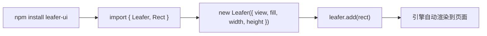

import { Canvas, Controls, Meta } from '@storybook/addon-docs/blocks';
import * as GettingStarted from './getting-started.stories';

<Meta of={GettingStarted} name="Docs" />

# 安装与第一个场景

本课把 LeaferJS 从「装上」到「看见」的最短路径一次走通：装好 `leafer-ui` 包、导入两个核心对象 `Leafer` 与 `Rect`、用 `new Leafer({ view, fill, width, height })` 创建引擎并把画布挂到页面，再用 `leafer.add(rect)` 把第一个图形挂上，引擎随即自动渲染。

这里的对象关系很直接：`Leafer` 是引擎本身，也是节点树的根；它内部拥有一张 `<canvas>`，配置项决定这张画布挂在哪里、多大、什么底色；图形节点（如 `Rect`）作为子节点 `add` 进来后，引擎的渲染循环会自动把它们画到画布上。理解了「配置画布 → 挂节点 → 自动渲染」这条主线，就能预测后续每个操作的结果。



| 配置项 | 默认值 | 说明 / 回查 |
| --- | --- | --- |
| `view` | 未设（需给出） | 画布挂载位置：id 字符串（**不带 `#`**）、`window`、`HTMLElement`（如 div）、`HTMLCanvasElement` |
| `fill` | 未设（透明） | 画布背景色，写入底层 `<canvas>` 的 `background-color`；不给则是透明，不是白色 |
| `width` / `height` | 未设 → 自适应 | 同时给出 = 固定尺寸画布；缺一个、为 `0` 或都不给 = 自动布局，贴合父容器尺寸 |
| `start` | `true` | 是否自动启动渲染循环；设 `false` 后需手动 `leafer.start()` |
| `hittable` | `true` | 画布是否接收指针事件（影响拖拽、点击等交互） |
| `pixelRatio` | `devicePixelRatio` | 画布像素比，影响缓冲分辨率与清晰度 |
| `ground` | —— | 属于 `App` 的多层配置，**不在** `Leafer` 上，见「分层渲染与视口」课 |

## 安装与导入

LeaferJS 在浏览器端的主力包是 `leafer-ui`，它聚合了核心引擎与 Web 端的全部 UI 节点，开箱即用：

```bash
npm install leafer-ui
```

本课只用到两个对象：引擎 `Leafer` 与矩形节点 `Rect`，都从 `leafer-ui` 顶层导入：

```ts
import { Leafer, Rect } from 'leafer-ui'
```

`leafer-ui` 把内核（`@leafer/core`）、Web 渲染层与 UI 节点统一对外暴露，日常使用只需关注 `leafer-ui` 这一个入口；`@leafer-in/*` 编辑器、动画等插件按需另加。

## 创建引擎：new Leafer()

`Leafer` 既是引擎也是节点树的根节点。构造函数接收一个配置对象，其中最关键的是 `view`——它告诉引擎「把画布挂到哪里」；`fill`、`width`、`height` 等决定画布的样貌与尺寸。

```ts
const leafer = new Leafer({
  view: 'leafer',   // 挂到 id="leafer" 的元素
  fill: '#333',     // 画布背景色
  width: 800,
  height: 600,
})
```

### view：把画布挂到页面

`view` 决定画布的归宿，官方支持四种取值：

| 取值 | 行为 |
| --- | --- |
| id 字符串，如 `'leafer'` | 按 `document.getElementById` 查找，**不需要加 `#`** |
| `window` | 画布自适应铺满整个浏览器窗口 |
| `HTMLElement`（如一个 `<div>`） | 引擎新建一张 `<canvas>` 并插入该元素内部 |
| `HTMLCanvasElement` | 直接复用这张已有 `<canvas>` 作为渲染目标，不再另建 |

本课范例用最后一种：外壳 helper 先建好一张 `<canvas>` 插入舞台，再以 `view: canvas` 交给引擎，这样 Storybook 能稳定托管画布生命周期。

`view` 之外还可改用 `canvas` 字段，语义与 `view` 相同；`view` 是更常用的写法。

### fill：画布背景色

`fill` 是画布的底色，会被写入底层 `<canvas>` 的 CSS `background-color`：

```ts
new Leafer({ view: 'leafer', fill: '#1e293b' })
```

默认未设，画布完全透明——叠在深色页面上会「看不见」，需要底色时记得显式给 `fill`。注意它只染画布背景，不影响你之后 `add` 进来的图形；图形有自己的 `fill`。

### 画布尺寸：固定与自适应

`width` / `height` 决定画布大小，有三种工作模式：

- **固定尺寸**：同时给出 `width` 和 `height`，画布尺寸锁定，不随父容器变化。
- **自动布局（自适应）**：两个都不给（或其中任一为 `0`），画布自动贴合父容器尺寸，父容器变了会自动 `resize`。官方首例 `{ view: window }` 即此模式。
- **自动生长**：设 `grow: true`，画布随内容增长；可固定一维、另一维自适应，如 `{ height: 200, grow: true }`。

```ts
// 固定 800 × 600
new Leafer({ view: 'leafer', width: 800, height: 600 })

// 自适应父容器
new Leafer({ view: 'leafer' })
```

运行期可用 `leafer.resize({ width, height })` 改尺寸、`leafer.fill = color` 改背景色，二者都会引发重绘。

## 添加节点：leafer.add()

`Leafer` 作为根节点，本身是一个可容纳子节点的容器（继承自 `Group`）。把图形「挂上去」用 `add`：

```ts
const rect = new Rect({
  x: 100,
  y: 100,
  width: 200,
  height: 200,
  fill: '#32cd79',
  cornerRadius: 12,
  draggable: true,   // Leafer 开箱即用的交互：直接可拖
})

leafer.add(rect)
```

`add` 一旦执行，节点进入节点树，引擎的渲染循环（默认 `start: true` 已启动）会自动把它画到画布上，无需手动调用渲染。多个节点可逐个 `add`，也可用 `leafer.addMany(...)` 批量添加；更复杂的层级通过 `Group` / `Box` 嵌套形成渲染树，这部分留待「节点树结构」课展开。

下面的实例把「配置画布 + 挂第一个节点」合成一个可调闭环。拖动宽高与背景色，观察画布如何变化，并用左下角读数核对实际生效的尺寸与节点数量。

<Canvas of={GettingStarted.Interactive} />
<Controls of={GettingStarted.Interactive} />

| 读者操作 | 可观察证据 |
| --- | --- |
| 调整「画布宽度 / 画布高度」 | 画布按所设尺寸缩放，左下角「实际渲染尺寸」同步更新 |
| 调整「画布背景色」 | 画布底色实时变化（`fill` 写入 `<canvas>` 背景） |
| 用鼠标拖动绿色矩形 | 矩形跟随移动——`draggable: true` 即得，无需自写事件 |
| 打开 Show code | 看到该 Canvas 实际执行的 `example.ts`，含 `new Leafer` 与 `leafer.add` |

## 常见问题

- **`view` 写成 `'#leafer'` 找不到元素。**
  Leafer 用 `document.getElementById` 解析字符串，**不要加 `#`**；写 `view: 'leafer'` 即可。这和 `querySelector` 的选择器写法不同。

- **构造时既没给 `view` 也没给 `width`，页面上没有画布。**
  构造函数仅当配置含 `view` 或 `width` 时才初始化引擎、创建画布。`new Leafer({ fill: 'red' })` 这类调用不会触发初始化。给上 `view`（或先给 `width` 再 `init`）才有画布。

- **自动布局下画布高度塌陷为 0。**
  自适应模式靠监听父容器尺寸来 `resize`；若父容器（如外层 `<div>`）自身没有明确高度，画布会塌陷。给父容器一个确定尺寸（或 `position` + 撑满），画布才能贴合出有效高度。

- **不给 `fill` 时画布「看不见」。**
  默认画布是**透明**而非白色。叠在深色背景上会误以为没渲染；需要底色就显式 `fill`，或给节点自身的 `fill` 来确认内容已画出。

## 总结回顾

摘要：

`leafer-ui` 是浏览器端一站式入口，`npm install` 后导入 `Leafer` 与图形节点即可上手。`new Leafer({ view, fill, width, height })` 创建引擎并把画布挂到页面：`view` 决定挂载位置（id 字符串不带 `#`、`window`、元素或已有 `<canvas>`），`fill` 是画布背景色，`width`/`height` 同时给出为固定尺寸、缺省则自动贴合父容器。再用 `leafer.add(rect)` 把节点挂进节点树，默认 `start: true` 的渲染循环会自动把它画出来。

一句话：

> `Leafer` 是带一张 `<canvas>` 的节点树根，配置好 `view` 再 `add` 节点，引擎自动渲染。

知识要点：

- 怎么安装并导入 `leafer-ui` 的核心对象？
- `view` 接受哪几种取值，id 字符串的写法和 CSS 选择器有何不同？
- `width`/`height` 给与不给时，画布尺寸分别走哪种模式？
- `fill` 默认是什么？它染的是画布还是图形？
- 如何把第一个图形节点挂上引擎并让它自动渲染？

## 参考资料

- [Leafer UI 官方文档 · 安装（Web 版）](https://www.leaferjs.com/ui/guide/install/ui/start.html)
- [Leafer UI 官方文档 · 创建 Leafer 引擎](https://www.leaferjs.com/ui/guide/basic/leafer.html)
- [Leafer UI 官方文档 · 应用与引擎配置（画布）](https://www.leaferjs.com/ui/reference/config/app/canvas.html)
- [npm · leafer-ui](https://www.npmjs.com/package/leafer-ui)
