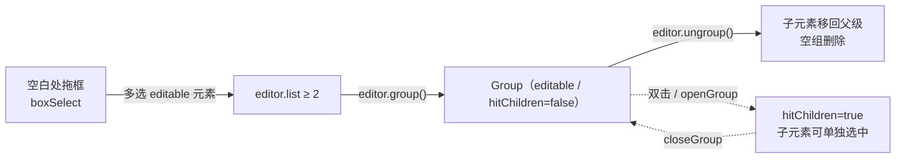

import { Canvas, Controls, Meta } from '@storybook/addon-docs/blocks';
import * as Group from './group.stories';

<Meta of={Group} name="Docs" />

# 框选、打组与解组

LeaferJS 编辑器把"选中多个元素 → 临时成组操作 → 永久编组"做成一条连贯链路，三步共享同一份"当前选中"（`editor.list`）：

- **框选（boxSelect）** 在空白处拖一个矩形框，框内的 `editable` 元素被一次性多选，等价于连续点击多选的批量版。
- **打组（`editor.group()`）** 把当前多选（≥2）消费掉，产出一个 `Group` 容器；原元素从 `tree` 移进组里，组成为新的唯一选中。
- **解组（`editor.ungroup()`）** 反向消费一个选中的 `Group`，把子元素移回组的父级并删掉空组，释放出的子元素成为新选中。

建立预测只需三条直觉：

1. 框选只命中 `editable` 元素，且需要 `boxSelect` 与 `multipleSelect` 同时为真（两者默认都是 `true`）。
2. `group()` 只在**多选**（`editor.multiple`，即 `list.length >= 2`）时执行；产出的 `Group` 被自动设为 `editable: true`、`hitChildren: false`——组的子元素在"关闭"状态下不能被直接点中或框选。
3. `ungroup()` 把子元素移回组的父级；`Box` / `Frame` 这类"叶子型容器"不支持解组，需要用 `Group`。



| 关键输入 / 方法 | 默认与行为 | 回查要点 |
| --- | --- | --- |
| `boxSelect`（编辑器配置） | `true`；可设 `'hit'`（触碰即选，默认）/ `'includes'`（完全包含才选） | 设为 `false` 关闭框选；多选改用按住多选键点击 |
| `multipleSelect`（编辑器配置） | `true` | 与 `boxSelect` 同时为真才可框选多选 |
| `editor.group(userGroup?)` | 需 `editor.multiple`（≥2 选中）才执行 | 返回新 `Group` 并设为 `target`；组自带 `editable: true`、`hitChildren: false` |
| `editor.ungroup()` | 选中含 `Group` 时执行；`Box`/`Frame` 不支持 | 子元素移回组父级，空组删除；返回释放出的子元素列表 |
| `editor.openGroup(group)` / `closeGroup(group)` | 设组的 `hitChildren` 为 `true` / `false` | 打开后才能点中 / 框选组内子元素；双击组等价于 `openGroup` |
| `hitChildren`（Group 属性） | 打组产出时为 `false` | `false` = 组"关闭"，子元素不可单独命中；`true` = 组"打开" |
| `EditorGroupEvent` | `GROUP` / `UNGROUP` / `OPEN` / `CLOSE`（均有前置 `BEFORE_` 变体） | 监听 `editor.on(EditorGroupEvent.GROUP, ...)` 同步外部 UI |

## 框选区域元素

框选是"批量版多选"：在画布**空白处**按下并拖拽，编辑器的 `SelectArea`（选择框矩形，复用 `editor.config.stroke` 配色）跟随鼠标，松开时把矩形覆盖到的 `editable` 元素一次性选中。它不是独立 API，而是 `boxSelect: true` + `multipleSelect: true` 时编辑器的内置拖拽行为；触发位置必须在空白处（命中元素时按下会进入"移动选中元素"而非框选）。

```ts
import { App, Rect } from 'leafer-ui';
import '@leafer-in/editor';

const app = new App({
  view: canvas,
  editor: { /* boxSelect / multipleSelect 默认 true，开箱可框选 */ },
});

app.tree.add([
  new Rect({ editable: true, fill: '#ef4444', width: 80, height: 80 }),
  new Rect({ editable: true, fill: '#3b82f6', width: 80, height: 80 }),
]);
// 在空白处拖拽覆盖两个矩形 → editor.list 变为 [rect1, rect2]
```

框选的"命中尺度"由 `boxSelect` 的取值决定：默认 `true` 等价于 `'hit'`——元素与拖框**有交集**就被选中；设为 `'includes'` 则要求拖框**完全包含**元素才选中（适合密集场景里只挑完全框住的元素）。无论哪种，未标 `editable: true` 的元素都会被跳过，这与单选的命中规则一致（详见 [8.1.1 启用编辑器](?path=/docs/editor-basics--docs)）。

下面的实例把"框选 → 打组 → 解组"串成一条可操作的链路。场景里有四个 `editable` 元素（矩形 / 椭圆 / 五角星 / 六边形），编辑器已挂载。用「操作」控件走完一遍：先「框选全部」（编程式选中，等价于拖框覆盖整个区域），再「打组」，再「解组」，观察选中框与左下角四项读数的同步变化。也可直接在画布空白处拖拽框选、点击单选，读数跟随交互更新。

<Canvas of={Group.Interactive} />
<Controls of={Group.Interactive} />

| 「操作」选择 | 选中框 | 可观察读数 |
| --- | --- | --- |
| 框选全部 | 包围全部四个元素 | 选中数量 `4` / 首个选中类型 `Rect` / tree 直接子节点 `4` / 组内元素数 `0` |
| 打组 | 缩到一个框包住整体（现在是 `Group`） | 选中数量 `1` / 首个选中类型 `Group` / tree 直接子节点 `1` / 组内元素数 `4` |
| 解组 | 还原为四个独立元素各自计入选中 | 选中数量 `4` / 首个选中类型 `Rect` / tree 直接子节点 `4` / 组内元素数 `0` |
| 还原 | 选中框消失 | 选中数量 `0` / 首个选中类型 `无` |
| 空白处拖框（手动） | 拖框过程中出现紫色选择矩形，松开选中覆盖到的元素 | 读数随 `EditorEvent.SELECT` 实时更新 |

> 已打组后再选「框选全部」会选中那个 `Group`（读数「首个选中类型」变 `Group`），而不是组内子元素——这正是 `hitChildren: false` 的后果：组关闭时，真实拖框也命中不到组内子元素。

## 打组

### group()：把多选并入 Group

`editor.group()` 是"多选 → 永久编组"的桥梁。它只在**多选**（`editor.multiple`，即 `list.length >= 2`）时执行：把选中元素按原层级顺序收集，在它们原本所在的父级里**原地插入一个 `Group`**（占据首个元素的位置），再把选中元素逐个 `dropTo(group)` 移入组内。组的 `transform` 直接拷自选中框的世界变换，所以打组前后元素在画布上的位置、缩放、旋转**完全不变**，只是逻辑上多了一层父级。

打组完成后，编辑器把新组设为 `target`（`editor.list === [group]`），并给组打上两个关键属性：`editable: true`（组本身可被选中与变换）、`hitChildren: false`（组"关闭"，子元素不可单独命中）。这意味着打组后选中框从"包住多个独立元素"变成"包住一个组"，你可以拖动这个组进行整体的移动、缩放、旋转。

```ts
import { EditorEvent, EditorGroupEvent } from '@leafer-in/editor';

// 前提：已有 ≥2 个 editable 元素被选中（编程式 select 或用户框选均可）
app.editor.select([rect, ellipse, star]);
const group = app.editor.group(); // 返回新 Group，editor.list === [group]

// 监听 GROUP 事件可在任何来源（用户操作 / 编程调用）打组后同步外部 UI
app.editor.on(EditorGroupEvent.GROUP, (e) => {
  console.log('已打组', e.editTarget); // editTarget 即新创建的 Group
});
```

`group()` 可选接收一个 `userGroup` 参数（`IGroup` 实例或 `IGroupInputData` 配置对象）：传实例则用它承接子元素，传配置对象则 `new Group(userGroup)` 创建。省略时创建一个默认 `Group`。无论哪种，产出的组都会被强制设 `editable: true` 与 `hitChildren: false`。

### 打开与关闭组 openGroup / closeGroup

打组后组处于"关闭"状态（`hitChildren: false`），框选 / 点击只能命中组本身。要编辑组内某个子元素，需要先**打开组**：`editor.openGroup(group)` 把组的 `hitChildren` 置为 `true`，此后子元素可被单独点中、框选与变换；`editor.closeGroup(group)` 反向关闭。双击一个关闭的组会等价触发 `openGroup`（模拟"进入组"的交互），这是编辑器 `checkDeepSelect` 的默认行为。

```ts
// 打开组后才能选中、操作组内子元素
app.editor.openGroup(group);
app.editor.select(rect); // 现在 rect（组内子元素）可被单独选中

app.editor.closeGroup(group); // 用完关闭，恢复"组整体可选、子元素不可命中"
```

打开的组会被记录在 `editor.openedGroupList` 里；当选中切换到组外元素时，编辑器的 `checkOpenedGroups` 会自动关闭这些组。`EditorGroupEvent.OPEN` / `CLOSE`（及前置 `BEFORE_OPEN` / `BEFORE_CLOSE`）在打开、关闭时派发，`editTarget` 指向被操作的组。

## 解组 ungroup()

`editor.ungroup()` 是 `group()` 的逆操作：对当前选中里的每个**分支节点**（`isBranch`，如 `Group`），把它的子元素逐个 `dropTo` 移回组的父级（保持原层级位置），然后删除腾空的组。释放出的子元素成为新的 `target`（`editor.list` 变为这些子元素），所以解组后选中框会从"包住一个组"还原为"包住多个独立元素"。

```ts
// 前提：选中至少一个 Group（或其他可解组的分支节点）
app.editor.select(group);
const released = app.editor.ungroup(); // 返回释放出的子元素数组
// editor.list === released，选中框还原为包住多个独立元素
```

解组有两个边界要注意：一是 `Box` / `Frame` 虽然也是分支（有子元素），但它们是"叶子型容器"，**不支持解组**——`ungroup()` 会把它们当作普通元素原样保留在释放列表里；如需可拆分的容器，请用 `Group`。二是 `ungroup()` 按 `editor.list` 当前选中动作，若选中里没有分支节点（比如只选了几个独立 `Rect`），不会有任何改变。

## 常见问题

- 在空白处拖拽没有出现选择框、框选不生效
  先确认元素标了 `editable: true`，再检查 `editor.config` 的 `boxSelect` 与 `multipleSelect` 是否都为真（默认都是）。注意拖拽起点必须在**空白处**：在元素上按下会进入"移动选中元素"，不会触发框选。另外 `boxSelect` 等配置应在初始化时传入 `new App({ editor: { boxSelect: true } })`，运行时直接改 `editor.config.boxSelect` 在首次选择器激活前可能不生效。

- 调用 `editor.group()` 没有反应、没有产生组
  `group()` 只在**多选**（`editor.list.length >= 2`）时执行，单选或无选中时直接跳过。先 `editor.select([a, b])` 或让用户框选 / 按多选键点击两个以上元素，使 `editor.multiple` 为真，再调用 `group()`。

- 打组后无法点中、框选组里的某个子元素
  这是预期行为：打组产出的 `Group` 自带 `hitChildren: false`，组在"关闭"状态下子元素不可单独命中。先用 `editor.openGroup(group)`（或双击组）打开组，使 `hitChildren` 变 `true`，即可单独操作子元素；操作完用 `closeGroup(group)` 关闭。

- 解组 `Box` / `Frame` 没有效果
  `Box` / `Frame` 是"叶子型容器"，不支持解组，`ungroup()` 会把它们原样保留。需要可拆分的容器时改用 `Group`（`editor.group()` 产出的就是 `Group`）。

## 总结回顾

摘要：

LeaferJS 编辑器的框选、打组、解组共享同一份"当前选中"。框选是 `boxSelect` + `multipleSelect` 同时为真时的内置拖拽行为：在空白处拖框，按 `'hit'`（默认，有交集）或 `'includes'`（完全包含）规则把框内的 `editable` 元素批量多选。`editor.group()` 把多选（≥2）原地并入一个 `Group`，组的 `transform` 拷自选中框、子元素移入组内，组自带 `editable: true` 与 `hitChildren: false`，成为新的唯一选中；`openGroup` / `closeGroup`（或双击）切换组的 `hitChildren` 以控制子元素是否可单独命中。`editor.ungroup()` 反向把组的子元素移回父级并删除空组，但 `Box` / `Frame` 不支持解组。`EditorGroupEvent` 的 `GROUP` / `UNGROUP` / `OPEN` / `CLOSE` 在各操作时派发，用于同步外部 UI。

一句话：

> 框选产生多选，`group()` 把多选并入一个 `hitChildren: false` 的 `Group`，`ungroup()` 把组拆回独立元素——三步只操作同一份 `editor.list`。

知识要点：

- 框选触发的前提条件（`boxSelect` / `multipleSelect` / `editable` / 空白处拖拽）是什么？`'hit'` 与 `'includes'` 有何区别？
- `editor.group()` 何时执行、产出的 `Group` 自动获得哪两个关键属性？为什么打组后选中框从"多个"变"一个"？
- `hitChildren` 的 `false` 与 `true` 分别让组处于什么状态？怎样打开 / 关闭一个组？
- `editor.ungroup()` 把子元素移到哪里、空组如何处理？哪些容器不支持解组？
- `EditorGroupEvent` 有哪些事件常量、`editTarget` 指向什么？

## 参考资料

- [Leafer UI 官方文档 · 编辑器编组（group / ungroup / openGroup / closeGroup）](https://www.leaferjs.com/ui/plugin/in/editor/Editor/group.html)
- [编辑器配置 · 选择（boxSelect / multipleSelect / continuousSelect）](https://www.leaferjs.com/ui/plugin/in/editor/config/select.html)
- [EditorGroupEvent（编组事件常量）](https://www.leaferjs.com/ui/plugin/in/editor/event/EditorGroupEvent.html)
- [Group（display 参考与属性）](https://www.leaferjs.com/ui/reference/display/Group.html)
- [@leafer-in/editor 源码（Editor.ts / EditorHelper.ts / config.ts）](https://github.com/leaferjs/leafer)
