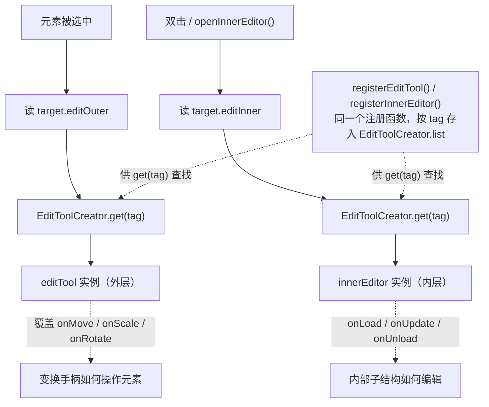

import { Canvas, Controls, Meta } from '@storybook/addon-docs/blocks';
import * as InnerEditor from './inner-editor.stories';

<Meta of={InnerEditor} name="Docs" />

# 内部编辑器与编辑工具

选中一个元素后，LeaferJS 的编辑器把“编辑这个元素”拆成两层：**外层**用变换手柄操作整个元素（移动、缩放、旋转），**内层**进入元素的内部结构做细编辑（文字内容、路径控制点、线条端点）。这两层分别由两类可替换的对象承载——`EditTool`（编辑工具，负责外层）和 `InnerEditor`（内部编辑器，负责内层）。

理解它们的关键只有一句话：**`EditTool` 和 `InnerEditor` 都是一个带 `tag` 的类，注册进同一个表 `EditToolCreator.list`；元素用字符串属性 `editOuter` / `editInner` 声明自己用哪个 `tag`，编辑器据此实例化对应类。** 你写的自定义工具，和内置的 `LineEditTool`、`TextEditor` 走的是同一条机制。

两层各自的触发时机不同，记住这个区分就能预测行为：

- **外层（EditTool）**：元素被**选中**时立即加载，决定变换手柄如何操作它。基类 `EditTool` 提供标准移动 / 缩放 / 旋转；`LineEditTool` 改写了它，让拖 Line 的手柄变成拖端点。
- **内层（InnerEditor）**：元素被**双击**（或编程式 `openInnerEditor`）时才加载，决定“进入元素内部”后做什么。文字内联编辑（`TextEditor`）就是它的内置实例，见 [8.3.1 文字编辑器](?path=/docs/text-editor--docs)。



| 关键输入 / 方法 | 默认与行为 | 回查要点 |
| --- | --- | --- |
| `editOuter`（UI 属性） | 计算默认：普通元素 → `'EditTool'`；Line / `__isLinePath` → `'LineEditTool'`；`pathInputed` / `isPointsMode` 想要 `'PointsEditTool'`（未注册则回退） | 写实例值 `rect.editOuter = 'X'` 覆盖计算默认；改后须 `editor.updateEditTool()` 才生效 |
| `editInner`（UI 属性） | `UI` 基类 = `'PathEditor'`；`Group` = `''`（无）；`Text` = `'TextEditor'` | 仅当名字在注册表中存在时 `openInnerEditor` 才真正打开（`TextEditor` 类需另引 `@leafer-in/text-editor`） |
| `setEditOuter(name)` / `setEditInner(name)` | 元素类的静态方法，改整类元素的 `editOuter` / `editInner` getter | 也可传函数 `ui => name` 按条件返回 |
| `registerEditTool()` / `registerInnerEditor()` | 同一个注册函数，把类按 `tag` 存入 `EditToolCreator.list` | TS 装饰器需 `experimentalDecorators`；JS 用 `Class.registerEditTool()` 静态方法等价 |
| `editor.updateEditTool()` | 卸载旧工具，按 `target.editOuter` 重新加载外层工具 | 只在 `editing`（有选中）时加载 |
| `editor.openInnerEditor(target?, nameOrSelect?, select?)` | 进入内层：按 `target.editInner`（或传入名字）实例化 InnerEditor | 派发 `InnerEditorEvent.OPEN`；可被 `beforeEditInner` 改名 / 取消 |
| `editor.closeInnerEditor(onlyInnerEditor?)` | 退出内层编辑 | `onlyInnerEditor=false` 时退出后重载外层工具 |
| `editor.getEditTool(name)` / `getInnerEditor(name)` | 按名字取 / 惰性创建并缓存工具实例（`editToolList`） | 同一名字返回同一实例，据此写运行时配置 |
| `openInner`（editor 配置） | `'double'`（双击进入） | 设 `'long'` 改为长按；`preventEditInner: true` 禁用 |
| `beforeEditOuter` / `beforeEditInner`（配置钩子） | `({ target, name }) => string | false | void` | 返回字符串改名、`false` 取消 |

## 两层编辑模型

外层和内层共享同一个“注册表 + tag 选择”机制，但触发时机、生命周期方法和可覆盖的行为不同。下面分别看每个成员。

### EditTool 编辑工具

`EditTool` 负责**外层**编辑：元素被选中时，编辑器调用 `updateEditTool()`，读 `target.editOuter` 得到一个 `tag`，从 `EditToolCreator.list` 取出对应类并实例化，挂到 `editor.editTool`。基类 `EditTool` 的 `onMove` / `onScale` / `onRotate` / `onSkew` 把变换手柄的拖动翻译成对选中元素的 `moveWorld` / `scaleOfWorld` / `rotateOfWorld` / `skewOfWorld`——这就是标准选中框的行为。你继承它、覆盖其中任一方法，就能改变手柄操作元素的方式。

注册 + 覆盖 `onMove` 的最小写法（网格吸附工具：拖元素本体时把落点贴到网格）：

```ts
import { EditTool } from '@leafer-in/editor';

class GridSnapEditTool extends EditTool {
  get tag() { return 'GridSnapEditTool'; } // 注册键：editOuter 用这个名字查找
  snapStep = 20;

  // onMove 只在“拖动元素本体”时触发；拖缩放手柄走 onScale。
  onMove(e) {
    const step = this.snapStep;
    const { moveX, moveY, editor } = e;        // moveX / moveY 是世界增量
    const { app, list } = editor;              // list = 当前选中的元素
    app.lockLayout();
    list.forEach((target) => {
      target.moveWorld(moveX, moveY);
      target.x = Math.round(target.x / step) * step; // 吸附本地坐标到步长整数倍
      target.y = Math.round(target.y / step) * step;
    });
    app.unlockLayout();
  }
}
GridSnapEditTool.registerEditTool(); // 静态方法注册，等价于 @registerEditTool() 装饰器
```

下面的实例把这个工具挂到一个可编辑矩形上。切换「编辑工具」会在基类 `EditTool`（自由移动）和自定义 `GridSnapEditTool`（网格吸附）之间热切换——它写 `rect.editOuter` 后调用 `editor.updateEditTool()`，工具立即重载，选中状态不丢。

<Canvas of={InnerEditor.Interactive} />
<Controls of={InnerEditor.Interactive} />

| 读者操作 | 可观察证据 |
| --- | --- |
| 编辑工具 = 网格吸附，拖动矩形本体 | 矩形“跳”着贴到网格交点，读数「矩形位置」始终是步长整数倍 |
| 编辑工具 = 默认，拖动矩形本体 | 矩形随手自由移动，落点不停在网格线上 |
| 调整「吸附步长」 | 背景网格密度同步变化，吸附粒度跟随（gridSnap 时） |
| 直接在画布里点选矩形 | 选中框出现，`editTool` 立即按 `editOuter` 加载（读数「编辑工具」同步） |
| 打开 Show code | 看到该 Canvas 实际执行的 `example.ts`（含注册与 `onMove` 覆盖） |

边界：`onMove` 只管“拖元素本体”；缩放、旋转、斜切分别走 `onScale` / `onRotate` / `onSkew`，未覆盖则沿用基类。`EditTool` 还继承 `InnerEditor` 的 `onLoad` / `onUpdate` / `onUnload`，如果你要给选中框加自定义控制点，就在这些钩子里把 `this.view` 加进 `this.editBox`（`editBox` 自带定位，子点相对它布局）。

### InnerEditor 内部编辑器

`InnerEditor` 负责**内层**编辑：双击元素（或调用 `editor.openInnerEditor()`）时，编辑器读 `target.editInner`，按 `tag` 从同一个注册表实例化一个 InnerEditor，挂到 `editor.innerEditor`，并设 `editor.innerEditing = true`。内置的 `TextEditor` 就是这么实现双击进入文字内联编辑的。

自定义 InnerEditor 的核心是一组生命周期钩子，把你的编辑控件（控制点、按钮）加进编辑器的显示树：

| 钩子 | 时机 | 典型用法 |
| --- | --- | --- |
| `onCreate()` / 构造函数 | 实例创建时（一次） | `this.view.addMany(...)` 建控件，`this.eventIds = [btn.on_(...)]` 订阅事件 |
| `onLoad()` | 进入内层编辑时 | `this.editBox.add(this.view)` 把控件挂上；设初始样式 |
| `onUpdate()` | 元素 / 选区变化时 | 按 `this.editor.element` 的 `boxBounds` / `worldTransform` 重布控制点 |
| `onUnload()` | 退出内层编辑时 | `this.editBox.remove(this.view)` 摘下控件 |
| `onDestroy()` | 实例销毁时 | 清引用 |

官方自定义 InnerEditor 的典型结构（注册一个给 Star 用的内层编辑器，含一个控制点和一个“完成”按钮）：

```ts
import { Box, DragEvent, PointerEvent } from 'leafer-ui';
import { InnerEditor, Editor, registerInnerEditor } from '@leafer-in/editor';

@registerInnerEditor()                   // TS 装饰器；JS 改用 CustomEditor.registerInnerEditor()
export class CustomEditor extends InnerEditor {
  get tag() { return 'CustomEditor'; }
  declare point: Box; declare closeBtn: Box;

  constructor(editor: Editor) {
    super(editor);
    this.point = new Box();
    this.closeBtn = new Box({
      fill: '#FF4B4B', cornerRadius: 20, around: 'top', cursor: 'pointer',
      children: [{ tag: 'Text', text: '完成', padding: [10, 20] }],
    });
    this.view.addMany(this.point, this.closeBtn);     // view 是控件容器
    this.eventIds = [
      this.point.on_(DragEvent.DRAG, () => { /* 拖控制点 */ }),
      this.closeBtn.on_(PointerEvent.TAP, () => this.editor.closeInnerEditor()),
    ];
  }

  onLoad() {
    this.point.set({ ...this.editBox.getPointStyle(), strokeWidth: 1 }); // 复用选中点样式
    this.editBox.add(this.view);                                        // 挂进编辑框
  }
  onUpdate() {
    const { boxBounds, worldTransform } = this.editor.element;          // 单选时 = 被编辑元素
    const { x, y, height } = boxBounds, { scaleX, scaleY } = worldTransform;
    this.point.set({ x: (x + 50) * Math.abs(scaleX), y: y * Math.abs(scaleY) });
    this.closeBtn.set({ x: (x + 50) * Math.abs(scaleX), y: (y + height) * Math.abs(scaleY) });
  }
  onUnload() { this.editBox.remove(this.view); }
  onDestroy() { this.point = this.closeBtn = null as unknown as Box; }
}

Star.setEditInner('CustomEditor');        // 给 Star 类绑定这个内层编辑器
```

坐标换算：`onUpdate` 里直接读 `this.editor.element` 的 `boxBounds`（本地包围盒）和 `worldTransform`，乘上 `scaleX` / `scaleY` 得到编辑框坐标系下的位置——因为 `editBox` 已自带定位，控制点相对它布局即可。需要手工换算时，基类提供 `getEditBoxPoint(editTargetPoint)` / `getEditTargetPoint(editBoxPoint)` 在“元素本地坐标”和“编辑框坐标”之间互转。

边界：基类 `InnerEditor` 的 `mode` 默认是 `'focus'`——进入内层编辑时会把 `selector.hittable` 和 `tree.hitChildren` 关掉，让你不能再去选别的元素，专心编辑内部；若要允许同时选其它元素，改 `mode` 为 `'both'`。内层编辑的实时行为（双击进入、输入框、退出）可见 [8.3.1 文字编辑器](?path=/docs/text-editor--docs)。

## 注册与选择机制

两层共用一个注册表和一个选择规则，把它看清楚就能解释所有“为什么不生效”：

**注册——同一个函数，按 `tag` 存类。** `registerEditTool()` 和 `registerInnerEditor()` 在源码里是同一个函数，都把类存进 `EditToolCreator.list`，键是类上的 `get tag()` 返回值。所以“注册一个 EditTool”和“注册一个 InnerEditor”步骤完全一样，区别只在继承哪个基类、覆盖哪些钩子。两种写法任选其一：

```ts
// TS 装饰器（需在 tsconfig 开 "experimentalDecorators": true）
@registerEditTool()
class MyTool extends EditTool { get tag() { return 'MyTool'; } /* ... */ }

// JS / 不想动 tsconfig：调用继承自基类的静态方法
class MyTool extends EditTool { get tag() { return 'MyTool'; } /* ... */ }
MyTool.registerEditTool();
```

**选择——元素的字符串属性决定用哪个 `tag`。** 选中时读 `editOuter`，双击时读 `editInner`，拿到名字后 `EditToolCreator.list[name]` 命中才实例化；命中不到就什么都不加载（外层回退到基类 `EditTool`，内层直接打不开）。给元素指定工具的两种粒度：

```ts
// 类级：所有 Rect 用同一个工具（改整类的 editOuter getter）
Rect.setEditOuter('GridSnapEditTool');

// 实例级：只影响这一个元素（覆盖该元素的计算默认值）
rect.editOuter = 'GridSnapEditTool';
editor.updateEditTool();          // 改完必须重载工具才生效
```

**驱动——编辑器上的方法。** 外层用 `updateEditTool()` / `unloadEditTool()` 主动重载，内层用 `openInnerEditor()` / `closeInnerEditor()` 进出；`getEditTool(name)` / `getInnerEditor(name)` 取回缓存的实例，可据此在运行时写工具的自定义字段（本课范例就用它把 `snapStep` 写进 `GridSnapEditTool` 实例）。进出内层会派发 `InnerEditorEvent`（`BEFORE_OPEN` / `OPEN` / `BEFORE_CLOSE` / `CLOSE`），事件带 `editTarget` 和 `innerEditor`。`editor.config` 还提供两个拦截钩子 `beforeEditOuter` / `beforeEditInner`，签名都是 `({ target, name }) => string | false | void`——返回字符串改名、返回 `false` 取消。

## 常见问题

- 自定义工具注册了，选中元素却没生效
  三处按顺序查：类的 `get tag()` 是否返回了唯一名字（注册键就是它）；`editOuter` / `editInner` 写的名字和 `tag` 是否一字不差；改完属性有没有调 `editor.updateEditTool()`（外层）或重新 `openInnerEditor()`（内层）。命中检查的标准是 `EditToolCreator.list['你的tag']` 是否存在。

- `Text.editInner` 默认是 `'TextEditor'`，双击文字却进不去编辑
  `'TextEditor'` 这个名字是 `@leafer-in/editor` 设的默认值，但 `TextEditor` **类**由 `@leafer-in/text-editor` 注册。只引入 editor、没引入 text-editor，注册表里没有这个类，`openInnerEditor` 命中不到就不打开。补一行 `import '@leafer-in/text-editor'` 即可。

- 用 `@registerEditTool()` 装饰器，TypeScript 报错
  装饰器是“实验性”语法，TS 需在 `tsconfig.json` 开 `"experimentalDecorators": true`。不想改配置就改用静态方法 `MyTool.registerEditTool()`，效果完全一致（本课范例即采用此写法）。

- `editor.editTool` 是 `undefined`
  编辑器当前没有选中元素（`editing === false`）。`updateEditTool()` 只在有选中时加载工具，先 `editor.select(target)` 再读 `editor.editTool`。

## 总结回顾

摘要：

LeaferJS 把编辑一个元素拆成两层：选中时加载的 `EditTool` 负责外层变换手柄，双击时加载的 `InnerEditor` 负责内层细编辑。两者都是带 `tag` 的类，用同一个注册函数存进同一个表 `EditToolCreator.list`；元素用 `editOuter` / `editInner` 字符串属性声明用哪个 `tag`，编辑器据此实例化。`EditTool` 覆盖 `onMove` / `onScale` / `onRotate` / `onSkew` 改手柄行为，`InnerEditor` 覆盖 `onLoad` / `onUpdate` / `onUnload` 管内部控件。改 `editOuter` 后要 `editor.updateEditTool()` 重载，进内层用 `openInnerEditor()` / `closeInnerEditor()`，`getEditTool` / `getInnerEditor` 取回实例写运行时配置，`beforeEditOuter` / `beforeEditInner` 钩子和 `InnerEditorEvent` 提供拦截与监听。

一句话：

> `EditTool` 和 `InnerEditor` 共用同一个按 `tag` 查找的注册表，元素用 `editOuter` / `editInner` 选工具，自定义只是“注册一个带 `tag` 的子类”这一件事。

知识要点：

- 外层 `EditTool` 和内层 `InnerEditor` 各自何时加载、分别改写哪些方法？
- 注册 `EditTool` / `InnerEditor` 需要哪两步？装饰器写法和静态方法写法为何等价？
- 元素如何通过 `editOuter` / `editInner` 声明用哪个工具？实例级和类级怎么写？
- 为什么改了 `editOuter` 要调 `editor.updateEditTool()`，而进内层用 `openInnerEditor()`？
- 工具不生效时，按什么顺序排查（tag、名字是否匹配、注册表是否命中、是否选中）？

## 参考资料

- [Leafer UI 官方文档 · 编辑工具（注册 EditTool）](https://www.leaferjs.com/ui/plugin/in/editor/editOuter/register.html)
- [Leafer UI 官方文档 · 编辑工具（使用 EditTool）](https://www.leaferjs.com/ui/plugin/in/editor/editOuter/use.html)
- [Leafer UI 官方文档 · 内部编辑器（注册 InnerEditor）](https://www.leaferjs.com/ui/plugin/in/editor/editInner/register.html)
- [Leafer UI 官方文档 · 内部编辑器（使用 InnerEditor）](https://www.leaferjs.com/ui/plugin/in/editor/editInner/use.html)
- [EditTool / InnerEditor 基类参考](https://www.leaferjs.com/ui/plugin/in/editor/EditTool.html)
- [InnerEditorEvent（内层编辑事件）](https://www.leaferjs.com/ui/plugin/in/editor/event/InnerEditorEvent.html)
- [@leafer-in/editor 源码（editor.esm.js：EditToolCreator / InnerEditor / EditTool / openInnerEditor）](https://github.com/leaferjs/leafer)
