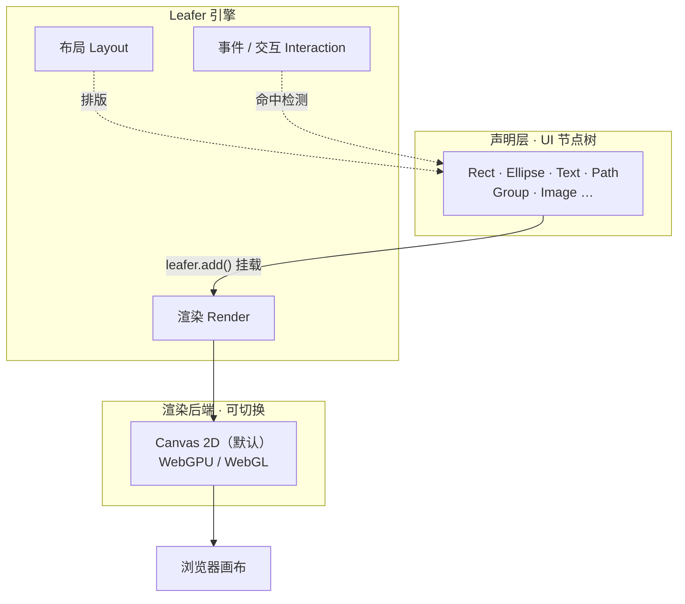

import { Canvas, Controls, Meta } from '@storybook/addon-docs/blocks';
import * as Intro from './intro.stories';

<Meta of={Intro} name="Docs" />

# 认识 LeaferJS

LeaferJS 是一个用 TypeScript 编写的现代 Canvas 引擎。你声明一棵 UI 节点树（矩形、圆、文本、路径、分组……），引擎负责把它们渲染到画布上，并接管事件命中、布局排版和交互状态。它的默认渲染后端是 Canvas 2D，可切换到 WebGPU / WebGL；运行时轻量、零依赖，并附带一整套面向图形编辑场景的 `@leafer-in/*` 插件（框选、打组、吸附、标尺、文字内联编辑……）。

理解 LeaferJS 的关键，是建立「声明式节点 → 引擎渲染」的心智：你不直接调用画笔 API 画像素，而是创建节点、设置属性、把它们挂到一棵树上；引擎侦测属性变化后自动重绘。这意味着切换一个填充色、调整一个圆角，往往只需要给节点重新赋值，剩下的事引擎替你做。

| 关键事实 | 值 / 说明 |
| --- | --- |
| 入口包 | `leafer-ui`（聚合 UI 节点 + 引擎内核 + 交互） |
| 内核包 | `@leafer/core`（引擎内核，可单独使用） |
| 当前版本 | 2.2.9（TypeScript 原生，类型完善） |
| 默认渲染后端 | Canvas 2D（可切换 WebGPU / WebGL，见「渲染后端」一课） |
| 体积 | 约 70KB min+gzip 量级，零运行依赖 |
| 编辑器插件 | `@leafer-in/*`（选中变换、框选打组、吸附对齐、标尺、文字编辑等） |
| 心智模型 | 声明 UI 节点 → Leafer 引擎渲染并管理交互 |



## 声明式节点与渲染

LeaferJS 把画面抽象成一棵节点树。最上层是一个 `Leafer` 实例（对应一块画布），它的子节点是各种 UI 元素。创建节点时直接把样式写进构造参数，挂到树上后引擎就会渲染。

这套模型最实用的特征是**响应式**：节点的属性被赋新值时，引擎的数据代理会侦测到变化并触发一次局部重绘，你不需要自己写渲染循环或调用 `draw()`。最小闭环只有三步——创建画布、声明并挂载节点、按需赋值：

```ts
import { Leafer, Rect } from 'leafer-ui';

const leafer = new Leafer({ view: canvas });   // 接管一块 <canvas>
const rect = new Rect({ width: 120, height: 120, fill: '#4f7cff' });
leafer.add(rect);                              // 挂到树上，引擎随即渲染

rect.fill = '#32cd79';                         // 赋值即重绘，无需手动调用
```

下面的实例把这三步搬进可调面板：调节填充色或圆角只是给节点重新赋值，切换图形则是换一个 UI 节点挂回根节点——无论哪种操作，画面都会即时更新。

<Canvas of={Intro.Interactive} />
<Controls of={Intro.Interactive} />

| 读者操作 | 可观察证据 |
| --- | --- |
| 调整「填充色」 | 图形颜色实时变化，「填充色」读数同步 |
| 切换「图形」 | 矩形 / 圆 / 三角形即时替换，「节点类型」读数同步为 `Rect` / `Ellipse` / `Polygon` |
| 调整「圆角」（矩形） | 矩形四角圆度变化 |
| 打开 Show code | 看到该 Canvas 实际执行的 `example.ts`：没有一行手写重绘代码 |

实例里始终只有一个图形节点挂在 `Leafer` 根上；真实场景下节点会层层组合成树（Group 嵌套 Group），树的结构本身就是「文档对象模型」。给节点属性赋值后引擎自动重绘，正是「声明式节点 → 引擎渲染」的核心；节点的增删、变换、事件与编辑器能力，都在这棵树上展开，后续课程逐一拆解。

## 渲染后端

LeaferJS 默认用浏览器原生的 Canvas 2D 上下文渲染，兼容性最好、零额外配置。需要更高吞吐时，可以切换到 WebGPU 或 WebGL 后端（由对应的渲染后端包提供），上层节点 API 保持一致——这是「声明层与渲染后端解耦」带来的好处。

| 后端 | 特点 | 何时考虑 |
| --- | --- | --- |
| Canvas 2D（默认） | 原生兼容、启动即用、CPU 绘制 | 大多数编辑器、交互图形、首屏 |
| WebGPU / WebGL | GPU 加速，海量元素吞吐更高 | 海量节点、强特效、性能瓶颈时 |

后端的具体切换方式、渲染循环（`maxFPS`、局部渲染 `partRender`）和取舍，由独立的「渲染后端」一课展开。

## 与同类 Canvas 库的差异

LeaferJS 处在「Canvas 引擎」这条赛道，但定位和同类库明显不同。选型时先看目标场景，再看各库的强项：

| 库 | 定位 | 强项 | 典型场景 |
| --- | --- | --- | --- |
| **LeaferJS** | TS 原生的图形编辑 / 无限画布引擎 | 轻量零依赖、UI 节点树、编辑器插件开箱即用、TS 类型完善 | 图形/设计编辑器、可视化搭建、交互图形 |
| PixiJS | 高性能 2D 渲染引擎（WebGL 优先） | 极高渲染性能、滤镜/着色器/粒子、游戏生态成熟 | 游戏、海量元素可视化、视觉特效 |
| Konva | 面向交互的 2D Canvas 场景图 | 事件/拖拽/变换体系成熟、框架集成多 | 交互图表、流程图、图编辑 |
| Fabric.js | 面向设计编辑器的对象模型 | 富对象/序列化/富文本、支持 Node 服务端 | 图片/设计编辑器、电商定制工具 |

一句话区分：**做图形编辑器优先看 LeaferJS，追极致渲染性能或做游戏优先看 PixiJS，做交互图形可看 Konva，做富对象设计编辑器可看 Fabric.js。** 它们并非互斥，社区中也有互补的集成实践；这里只给一个起点判断，不替代实际选型验证。

## 常见问题

- **LeaferJS 能用来做游戏吗？**
  能渲染图形和动画，但 LeaferJS 不内置游戏循环、精灵引擎、物理或音频系统，渲染吞吐也不以「海量粒子 + 着色器特效」为目标。面向高性能游戏时 PixiJS 更合适；LeaferJS 的主线是图形编辑与交互场景。

- **必须配 React / Vue 才能用吗？**
  不需要。LeaferJS 是原生 TypeScript API，独立于前端框架，`new Leafer({ view })` 即可运行。React / Vue 等封装属于可选的集成层，本路线聚焦原生 API。

## 总结回顾

摘要：

LeaferJS 是 TypeScript 原生的现代 Canvas 引擎，默认 Canvas 2D、可选 WebGPU / WebGL，轻量零依赖。核心心智是「声明 UI 节点 → 引擎渲染」：创建节点、写进样式、挂到 `Leafer` 树上，引擎负责渲染、布局与交互；属性赋值会自动触发重绘，切换图形只需换一个节点挂回根。它与 PixiJS（高性能/游戏）、Konva（交互场景图）、Fabric.js（富对象编辑器）定位不同，强项是编辑器能力开箱即用与完善的 TS 类型。

一句话：

> 在 LeaferJS 里你声明节点和属性，引擎负责把画面画出来并保持同步。

知识要点：

- LeaferJS 是什么、默认渲染后端是什么、体积与依赖特征如何？
- 「声明式节点 → 引擎渲染」的响应式模型如何体现？
- 怎样用最小的 `Leafer` + 一个 UI 节点画出图形？
- 与 PixiJS、Konva、Fabric.js 的定位差异在哪里？
- LeaferJS 适合什么场景、不适合什么场景？

## 参考资料

- [LeaferJS 官网](https://www.leaferjs.com/)
- [Leafer UI 官方文档](https://www.leaferjs.com/ui/guide/)
- [LeaferJS 版本更新日志](https://www.leaferjs.com/ui/update/)
- [GitHub 主仓库 leaferjs/leafer](https://github.com/leaferjs/leafer)
- [Canvas 引擎性能基准](https://benchmark.leaferjs.com/leafer/)
