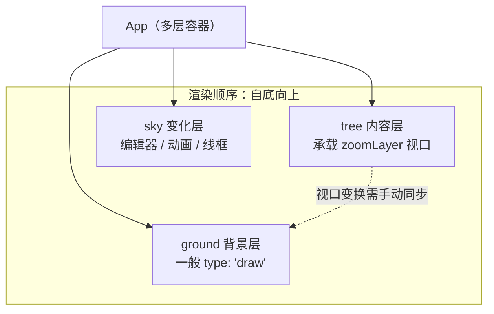

import { Canvas, Controls, Meta } from '@storybook/addon-docs/blocks';
import * as LayerViewport from './layer-and-viewport.stories';

<Meta of={LayerViewport} name="Docs" />

# 分层渲染与视口

`App` 把多个 `Leafer` 实例组织成一层层独立的画布，让背景、内容、编辑器这类更新频率差异很大的内容各自渲染、互不阻塞；视口（`zoomLayer`）则是其中用来统一缩放平移视图的层。两者合起来回答一个工程问题：**如何把一整张可缩放的大画布拆成可控的多层，并在缩放平移后仍能精确定位坐标**。

理解本文后，你应能预测三件事：给 `App` 配 `ground/tree/sky` 会得到几层、改 `zoomLayer` 的 `scaleX/x` 会让哪一层动、以及缩放平移之后一个“内容点”会落在屏幕的哪个像素。



| 概念 / 参数 | 默认值 | 回查要点 |
| --- | --- | --- |
| `App` 的 `ground/tree/sky` | 按需创建（`undefined`） | 三者只是约定命名；可用 `app.addLeafer()` 或 `app.add(new Leafer())` 增加任意自定义层 |
| `Leafer` 的 `type` | `'block'` | `'draw'` 纯绘制无交互（背景/装饰）；`'viewport'` 基础滚轮视口；`'design'` 视口 + 空格/中键平移，缩放范围 0.01~256 |
| `zoomLayer`（缩放平移层） | `app.tree.zoomLayer`（默认即 `tree` 自身） | 改其 `x/y/scaleX/scaleY` 即缩放平移视图；`@leafer-in/view` 提供 `zoom('fit'|'in'|'out'|number|元素)` |
| `move.holdSpaceKey` / `holdMiddleKey` | `false` | `'design'` 类型会开启：按住空格 / 鼠标中键拖拽平移 |
| `zoom.min` / `zoom.max` | 视类型而定（`design`：0.01 / 256） | 视口缩放上下限，`getValidScale` 会把超出值夹回 |
| `wheel.zoomSpeed` | `0.5` | 滚轮缩放速度，取值 0~1 |

## App 与多层结构

`App` 负责承载多个 `Leafer` 实例分层协同工作，将不同更新频率的内容分开渲染以提升性能。此时每个 `Leafer` 相当于一个子 `Group` 元素，交互事件可以在多个 `Leafer` 间穿透。

为了方便记忆，LeaferJS 用现实世界的拟物方式为最常用的三层命名，并支持通过配置自动创建：

- **`ground`（地面层 / 背景层）**：位于最底部，一般用于渲染背景、网格等静态内容，常配 `type: 'draw'`。
- **`tree`（树结构 / 内容层）**：位于中间，相当于 HTML 中的 `body`，承载主要内容与视口变换。
- **`sky`（天空层 / 变化层）**：位于最顶部，一般用来渲染频繁变化的动画、交互线框、图形编辑器实例。

自动创建三层，最省事也最常用：

```ts
import { App, Rect } from 'leafer-ui'

const app = new App({
  view,
  fill: '#F2F2F2',
  ground: { type: 'draw' }, // 背景层：纯绘制，无交互
  tree: {},                 // 内容层
  sky: { type: 'draw' }     // 变化层：纯绘制
})

app.ground.add(background)
app.tree.add(content)
app.sky.add(overlay)
```

需要更多控制时，`app.addLeafer(config)` 可快速创建并添加一层；`app.add(new Leafer(config))` 则完全手工添加。三者可以混用，层与层之间的渲染顺序由添加顺序（即 `zIndex`）决定。

**必要边界**：每层是一个独立的 `Leafer`，拥有**独立的坐标系与独立的 `zoomLayer`**。变换其中一层（例如缩放 `tree`）不会自动影响另一层——这正是“层间坐标映射”要处理的核心问题。此外，`App` 不接收子元素的数据变化事件，需要在对应的 `Leafer` 实例上监听；配置 `editor: {}` 会自动创建 `tree` + `sky` 并挂上 `app.editor`。

## 视口与缩放平移层

视口由 `zoomLayer` 承担：它是一个普通的变换层（`Group`），默认就是 `app.tree.zoomLayer`，也就是 `tree` 自身。修改它的 `x/y/scaleX/scaleY`，就等于平移、缩放整张内容视图。

手动缩放平移最直接：

```ts
app.tree.zoomLayer.set({ scaleX: 2, scaleY: 2 }) // 放大 2 倍
app.tree.zoomLayer.set({ x: 100, y: 50 })        // 平移
```

想要“像设计软件那样”用滚轮、触摸板、空格键拖拽来控制视口，则给 `tree` 配视口类型（`'design'` / `'viewport'` / `'document'`），并引入 `@leafer-in/view`（2.2.9 包名；官方新文档亦称 `@leafer-in/viewport`）。其底层原理就是监听 `MoveEvent` / `ZoomEvent` 改写 `zoomLayer`：

```ts
import { App, MoveEvent, ZoomEvent } from 'leafer-ui'
import '@leafer-in/view'

const app = new App({ view, tree: { type: 'design' } })

// 等价实现（'design' 类型已内置以下逻辑）：
app.tree.on(MoveEvent.BEFORE_MOVE, (e: MoveEvent) => {
  app.tree.zoomLayer.move(app.tree.getValidMove(e.moveX, e.moveY))
})
app.tree.on(ZoomEvent.BEFORE_ZOOM, (e: ZoomEvent) => {
  app.tree.zoomLayer.scaleOfWorld(e, app.tree.getValidScale(e.scale))
})
```

`@leafer-in/view` 还提供 `leafer.zoom(zoomType)`：`'fit'` 适配整页、`'fit-width'` / `'fit-height'` 只适配一轴、`'in'` / `'out'` 步进缩放、传数字设绝对缩放、传元素或数组则聚集到目标。`getValidMove` / `getValidScale` 会按 `move` / `zoom` 配置把越界值夹回，是自定义视口逻辑时最常用的两个守卫方法。

下方实例用 `ground`（背景网格）+ `tree`（内容与标记点 `P`）两层，并通过控件手动驱动 `tree.zoomLayer`，缩放平移整个内容视图。

<Canvas of={LayerViewport.Interactive} />
<Controls of={LayerViewport.Interactive} />

| 读者操作 | 可观察证据 |
| --- | --- |
| 调整「视口缩放」 | 内容层等比缩放，`tree 视口缩放` 读数同步；`P 屏幕坐标` 随之变化，`P 内容坐标` 不变 |
| 调整「视口平移 X / Y」 | 内容层整体平移，`P 屏幕坐标` 随之偏移，`P 内容坐标` 仍不变 |
| 打开「背景层跟随视口」 | `ground 视口缩放` 读数从 `1.00` 变为与 `tree` 一致，背景网格与内容一起缩放平移 |
| 关闭（默认） | 背景网格静止、内容相对网格移动，证明 `ground` 与 `tree` 是独立层 |

## 层间坐标映射

缩放平移之后，事件坐标直接交给图形会出现位置偏移，必须做坐标系转换。LeaferJS 的坐标体系按“起点在哪”区分，最关键的两条是：

- **`world` 世界坐标系**：以画布左上角为起点，类似 HTML 的 client 坐标，**不随视口动**。
- **`page` 场景坐标系**：以缩放层（`zoomLayer`）为起点，类似 HTML 的 page 坐标，**随视口缩放平移而动**。

此外还有相对父元素的 `local`、相对元素自身的 `inner`、相对包围盒的 `box`。转换坐标就是在这几套起点之间换算，引擎替你省去手算矩阵。

常用的转换方法分两类。元素上的方法以“从世界坐标出发”为主：

| 方法 | 转换方向 |
| --- | --- |
| `getPagePoint(world)` | 世界 → page |
| `getLocalPoint(world)` | 世界 → local |
| `getInnerPoint(world)` | 世界 → inner |
| `getBoxPoint(world)` | 世界 → box |
| `getWorldPointByPage(page)` | page → 世界 |
| `getWorldPoint(inner)` | inner → 世界 |

浏览器原生事件（如 `dragstart` / `drop`）的 `clientX/Y` 需要先进入画布坐标系，只能在 `App` / `Leafer` 实例上转换：

| 方法 | 转换方向 |
| --- | --- |
| `getWorldPointByClient(clientPoint)` | 浏览器 client → 世界 |
| `getPagePointByClient(clientPoint)` | 浏览器 client → page |
| `getClientPointByWorld(worldPoint)` | 世界 → 浏览器 client |

为什么多层之间要谈“映射”？因为每层是独立的 `Leafer`，有独立的 `zoomLayer`。`tree` 缩放后，`ground` 的网格并不会自动跟随——这正是上方实例默认状态下你能看到的“内容在网格上滑动”的现象。若希望背景与内容对齐，需要把 `tree` 的视口变换**手动同步**到 `ground`：本例的「背景层跟随视口」开关就是用 `app.ground.zoomLayer.set({ scaleX, scaleY, x, y })` 复制同一变换；在真实编辑器里，更通行的做法是监听 `tree` 视口属性的变化事件，把同一矩阵持续写回 `ground` / `sky`。

```ts
import { PropertyEvent } from 'leafer-ui'

// 监听 tree 视口属性变化，把同一变换同步到 ground，避免多层漂移
app.tree.on(PropertyEvent.CHANGE, (e: PropertyEvent) => {
  if (['x', 'y', 'scaleX', 'scaleY'].includes(e.attrName)) {
    app.ground.zoomLayer.set({
      x: app.tree.x, y: app.tree.y,
      scaleX: app.tree.scaleX, scaleY: app.tree.scaleY
    })
  }
})
```

实例中的读数也印证了这条映射：标记点 `P` 的**内容坐标恒为 `(240, 160)`**，而它的**屏幕坐标**由 `tree` 的视口变换线性决定——`worldX = tree.x + 240 · tree.scaleX`，`worldY = tree.y + 160 · tree.scaleY`，等价于 `marker.getBounds('box', 'world')`。

## 最佳实践

- **按更新频率分层**：静态背景 → `ground`；主要内容 → `tree`；频繁变化的选区/手柄/动画 → `sky`。重算与重绘被限制在各自层内。
- **视口变换统一走 `zoomLayer`**：缩放平移整张视图时改 `zoomLayer` 的 `scaleX/scaleY/x/y`，不要去改单个内容的 `x/y` 来“模拟缩放”，否则坐标映射和命中都会错乱。
- **多层对齐靠事件同步，而非复制节点**：监听 `tree` 视口属性（`PropertyEvent`）或 `LeaferEvent.MOVE`，把同一矩阵写回需要对齐的层，避免逐帧漂移。
- **静态装饰放 `'draw'` 层**：`type: 'draw'` 的层不参与命中检测，大量点阵、网格、装饰放进去可以减少事件与布局开销。

## 常见问题

- 改了 `tree.scaleX`，背景网格没跟着动？
  正常现象。`ground` 是独立的 `Leafer`，默认有自己的 `zoomLayer`。若要网格跟随内容，把同一变换同步到 `ground.zoomLayer`，或监听 `tree` 的视口属性变化事件持续写回。
- 调用 `leafer.zoom('fit')` 不生效，或提示需要 view 插件？
  需要在文件顶部 `import '@leafer-in/view'`。该插件注册了 `Leafer.prototype.zoom`；2.2.9 的包名是 `@leafer-in/view`，官方新文档中亦称 `@leafer-in/viewport`。
- 缩放平移后，用鼠标坐标画图位置偏了？
  缩放平移改变了世界坐标与内容坐标的对应关系。事件处理中用 `e.getPagePoint()`（世界 → page）转换后再交给图形，而不是直接用事件的 `x/y`。处理浏览器原生事件则用 `app.getWorldPointByClient(e)` / `app.getPagePointByClient(e)`。

## 总结回顾

摘要：

`App` 把多个 `Leafer` 组织成 `ground` / `tree` / `sky` 等独立层，按更新频率分开渲染、事件可穿透；视口由 `zoomLayer`（默认即 `tree` 自身）承担，改它的 `scaleX/scaleY/x/y` 即可缩放平移整张内容视图，配视口类型加 `@leafer-in/view` 则获得滚轮/触摸板/空格键拖拽等内置交互。多层各自有独立坐标系，缩放平移后要用 `getPagePoint` / `getWorldPointByClient` 等方法在 world / page / local / inner / box 之间换算；需要背景跟随内容时，监听视口变化把同一矩阵同步到其它层。

一句话：

> 每个 `Leafer` 是一层独立画布，视口只缩放平移 `zoomLayer`，跨层定位永远要换算坐标系。

知识要点：

- `App` 的 `ground/tree/sky` 是什么，分别用来放什么内容？
- 改 `zoomLayer` 的哪些属性可以缩放平移视图？默认的 `zoomLayer` 是谁？
- 想要内置滚轮缩放、空格键平移，要配什么 `type`、引入哪个插件？
- 缩放平移之后，事件坐标为什么不能直接用，要用哪个方法转换？
- 为什么缩放 `tree` 时 `ground` 不会自动跟随，怎样让它对齐？

## 参考资料

- [创建 App（多层结构）— Leafer UI 官方文档](https://www.leaferjs.com/ui/guide/app/multilayer.html)
- [App（ground / tree / sky / zoomLayer）— Leafer UI 官方文档](https://www.leaferjs.com/ui/guide/display/App.html)
- [缩放平移视图（视口类型与实现原理）— Leafer UI 官方文档](https://www.leaferjs.com/ui/guide/advanced/viewport.html)
- [转换坐标（world / page / local / inner / box）— Leafer UI 官方文档](https://www.leaferjs.com/ui/guide/advanced/coordinate.html)
