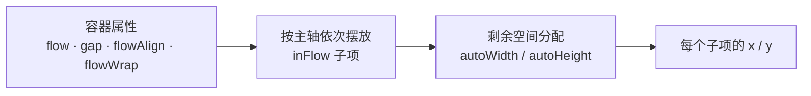

import { Canvas, Controls, Meta } from '@storybook/addon-docs/blocks';
import * as Layout from './layout.stories';

<Meta of={Layout} name="Docs" />

# 自动布局

LeaferJS 的 Flex 式自动布局由 `@leafer-in/flow` 插件提供。给容器设置 `flow` 属性，容器就会沿主轴依次摆放参与布局的子元素，自动算出每个子元素的 `x / y`，不必再手动定位。`Box` 是通用容器，`Flow` 是默认 `flow: 'x'` 的便捷子类；引入插件后，`flow / gap / flowAlign / flowWrap / autoWidth / autoHeight` 等属性对所有 UI 元素可用，但布局只对 `Box`（及其子类）生效。



需要先安装并引入插件，否则 `Box` 没有任何 flex 行为：

```bash
npm i leafer-ui @leafer-in/flow
```

| 属性 | 默认 | 作用 | 取值 |
| --- | --- | --- | --- |
| `flow` | `false`（`Flow` 类为 `'x'`） | 开启布局并决定主轴 | `false` / `true` / `'x'` / `'y'` / `'x-reverse'` / `'y-reverse'` |
| `gap` | `0` | 子项间距 | `number` \| `{ x, y }` \| `'auto'` \| `'fit'` |
| `flowAlign` | `'top-left'` | 内容对齐 | 方向字符串 \| `{ content, x, y }` |
| `flowWrap` | `false` | 主轴放不下时是否换行 | `true` / `false` / `'reverse'` |
| `itemBox` | `'box'` | 子项排版盒基准 | `'box'` / `'stroke'`（含描边） |
| `inFlow` | `true` | 子项是否参与布局 | `boolean` |
| `autoWidth` / `autoHeight` | `undefined` | 弹性权重（flex grow） | `number`（权重） |

## 开启布局：flow 方向

`flow` 是布局的总开关和主轴方向。设成 `'x'` 子项横向排成一行，`'y'` 纵向排成一列；`true` 等价 `'x'`；加 `-reverse` 沿主轴反向排列。子元素的最终位置由容器算出，手写的 `x / y` 会被布局覆盖。

```ts
import '@leafer-in/flow'; // 副作用导入：注册 flow 属性并给 Box 装上布局
import { Leafer, Box, Rect } from 'leafer-ui';

const leafer = new Leafer({ view: window, fill: '#fff' });

const container = new Box({
  flow: 'x',      // 主轴横向；换成 'y' / 'x-reverse' / 'y-reverse' 看不同排列
  width: 320,
  height: 160,
  fill: '#f1f5f9',
  padding: 12,
});
leafer.add(container);

container.add(new Rect({ width: 60, height: 60, fill: '#4f7cff' }));
container.add(new Rect({ width: 60, height: 60, fill: '#22c55e' }));
container.add(new Rect({ width: 60, height: 60, fill: '#f59e0b' }));
```

下面的实例用一个 `Box` 容器装若干固定尺寸方块。切换「排列方向」可以同时看到排列改沿横向 / 纵向 / 反向，以及读数里的「排列方向」与「首项坐标」随之变化。

<Canvas of={Layout.Interactive} />
<Controls of={Layout.Interactive} />

| 读者操作 | 可观察证据 |
| --- | --- |
| 切换「排列方向 flow」 | 方块改沿横向 / 纵向排列，「排列方向」「首项坐标」同步变化 |
| 调「间距 gap」 | 「项间间距」读数与方块间隔同步 |
| 切「对齐 flowAlign」 | 整组在容器内挪位，「首项坐标」改变 |
| 开「换行 flowWrap」并加大「子项数量」 | 「排列行/列数」增加 |
| 调大「末项拉伸 flexGrow」 | 末项沿主轴变长，「末项主轴尺寸」增大 |

## 对齐：flowAlign

`flowAlign` 决定内容在容器里怎么放，默认 `'top-left'`。它有两种写法：

- **方向字符串**（如 `'center'`、`'bottom-right'`）：同时决定「整组在容器内的位置」和「每一行内子项的对齐」。
- **对象** `{ content, x, y }`：把两者拆开。`content` 是整组对齐，`x / y` 取 `'from' | 'center' | 'to'` 单独控制行内轴向对齐。

`flowAlign` 只在容器**有剩余空间**时看得到效果。若子项已用 `autoWidth / autoHeight` 把主轴撑满，对齐就没有可分配的余地。

在上方实例里把「排列方向」保持 `'x'`，依次切「对齐 flowAlign」为 `center`、`bottom-right`，对比「首项坐标」与整组位置的变化。

## 间距：gap

`gap` 控制子项之间的距离，默认 `0`，支持四种写法：

| 写法 | 含义 |
| --- | --- |
| `gap: 10` | 主轴与交叉轴都用 10 |
| `gap: { x: 10, y: 4 }` | 横向 10、纵向 4 分开设 |
| `gap: 'auto'` | 自动拉开子项填满主轴（至少 2 项才有意义） |
| `gap: 'fit'` | 与 `'auto'` 类似，但即使溢出也强制拉开 |

`gap` 作用在「同一行/列内相邻子项」之间；开启换行后，行与行之间的间距用交叉轴的值（`gap.y` 对 `flow: 'x'`）。

在上方实例里调「间距 gap」，看「项间间距」读数如何随之同步。

## 换行：flowWrap

`flowWrap` 默认 `false`：主轴放不下的子项继续溢出到容器外（`Box` 默认不裁剪）。设成 `true` 后，放不下的子项折到下一行（`flow: 'x'`）或下一列（`flow: 'y'`）；`'reverse'` 则反向换行。

换行要可观察，容器的主轴必须有**固定尺寸**——这样引擎才知道「这一行满了」。在上方实例里：保持「排列方向」为 `'x'`，打开「换行 flowWrap」，再把「子项数量」加到 6，观察「排列行/列数」从 1 变成 2。

## 弹性权重：autoWidth / autoHeight

`autoWidth` / `autoHeight` 是子项的弹性权重（flex grow），设成一个正数，该子项就会按权重吃掉主轴上的剩余空间。轴向与 `flow` 方向配合：

- `flow: 'x'` 时：`autoWidth` 是主轴（横向）拉伸权重；`autoHeight` 是交叉轴（纵向）撑满。
- `flow: 'y'` 时：`autoHeight` 是主轴（纵向）拉伸权重；`autoWidth` 是交叉轴（横向）撑满。

```ts
// 两个子项按 1:2 分配横向剩余空间
container.add(new Box({ autoWidth: 1, height: 60, fill: '#4f7cff' }));
container.add(new Box({ autoWidth: 2, height: 60, fill: '#22c55e' }));
```

在上方实例里调大「末项拉伸 flexGrow」，末项会沿主轴变长，「末项主轴尺寸」读数随之增大；设回 `0` 则恢复原始尺寸。注意：弹性分配的前提是容器**有剩余空间**，且容器主轴有固定尺寸。

## Box 与 Flow

`Flow` 是 `Box` 的子类，唯一区别是构造时把 `flow` 默认值从 `false` 改成 `'x'`。给任何 `Box` 写上 `flow` 就具备完全相同的能力：

```ts
import { Flow } from '@leafer-in/flow';

// 两者等价
new Box({ flow: 'x', /* … */ });
new Flow({ /* … */ }); // 默认 flow: 'x'
```

需要横向布局又想少写一行，用 `Flow`；要显式声明方向、或随时切换 `flow`，用 `Box` 更清楚。

## 常见问题

设了 `flow` 子项却不排列？
容器没有明确宽高时，`Box` 会被当作按内容自适应的普通 `Group`，flex 行为与预期不符。给容器写死 `width / height`（或让它有确定的主轴尺寸）即可恢复。

`gap` / `flowAlign` 设了没反应？
多半是没引入 `@leafer-in/flow`。这些属性由插件注册，未引入时它们只是普通属性，不触发任何布局逻辑。确认代码顶部有 `import '@leafer-in/flow'`。

`autoWidth` 没把子项拉伸？
要么容器主轴没有剩余空间（被其他子项或对齐占满），要么容器自身没有固定尺寸。给容器定 `width`（`flow: 'x'`）或 `height`（`flow: 'y'`），并保证有自由空间可分配。

## 总结回顾

摘要：

`@leafer-in/flow` 给 `Box` 装上 Flex 自动布局：`flow` 决定主轴方向与开关，`gap` 控制间距，`flowAlign` 控制对齐，`flowWrap` 控制换行，子项的 `autoWidth / autoHeight` 作为弹性权重分配剩余空间。所有计算由容器完成，子项的 `x / y` 是布局结果而非手写值。可预测布局的前提是容器有明确宽高。

一句话：

> 想让 LeaferJS 自动排子元素，给 `Box` 设 `flow` 并给它固定尺寸，间距、对齐、换行、弹性权重都由容器统一算。

知识要点：

- 怎样开启自动布局？主轴方向由什么决定？
- `gap`、`flowAlign`、`flowWrap` 各自的默认值和常用写法是什么？
- 子项的弹性权重用哪个属性？方向与 `flow` 怎么配合？
- `Box` 和 `Flow` 有什么区别？
- 设了 `flow` 却不排列，首先该查什么？

## 参考资料

- [Leafer UI 官方文档 · Flow 自动布局](https://www.leaferjs.com/ui/guide/plugin/flow/Flow.html)
- [Leafer UI 官方文档 · flowAlign](https://www.leaferjs.com/ui/plugin/in/flow/Flow/flowAlign.html)
- [Leafer UI 官方文档 · flowWrap](https://www.leaferjs.com/ui/plugin/in/flow/Flow/flowWrap.html)
- [GitHub · leafer-in/flow 源码](https://github.com/leaferjs/leafer-in/tree/main/packages/flow)
