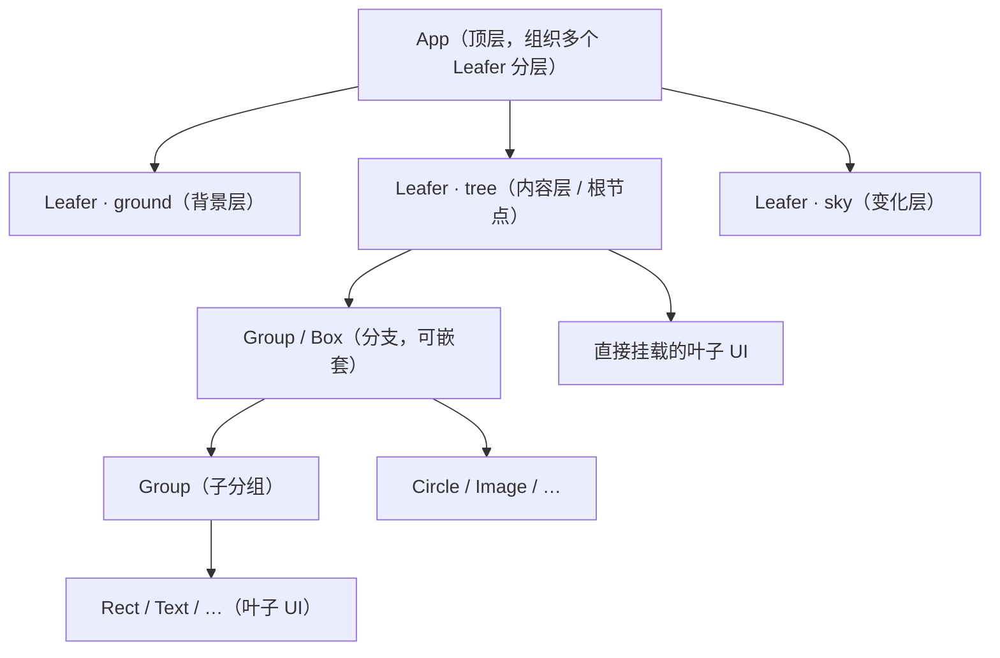

import { Canvas, Controls, Meta } from '@storybook/addon-docs/blocks';
import * as NodeTree from './node-tree.stories';

<Meta of={NodeTree} name="Docs" />

# 节点树结构

LeaferJS 的场景是一棵树：根节点 `Leafer` 持有子元素，子元素再通过 `Group` / `Box` 层层嵌套，最终组成一棵渲染树。树本身负责父子归属与渲染顺序，每个节点知道自己挂在哪里、谁在自己上面、谁在自己下面。

理解这棵树的关键是类继承链：`App extends Leafer extends Group extends UI extends Leaf`。也就是说：

- **所有节点都是 `Leaf`**，都拥有 `parent`、`tag`、`innerId`、`zIndex` 等通用能力。
- **能装子节点的叫分支（Branch）**：`Group` / `Box` / `Leafer` / `App` 都属于分支，共享同一套 `add` / `remove` / `children` / 层级排序逻辑。
- **`Leafer` 是特殊的分支**：它既是树的根，又额外持有 `canvas`、`renderer`、`watcher`，所以属性改了会自动重绘。
- **`App` 是更顶层的壳**：它把多个 `Leafer` 实例当作「层」叠在一起协同渲染。

预测操作结果就靠一句话：**改一个节点的 `zIndex` 或在 `children` 中的位置，只影响它在同级里的渲染顺序；`add` / `remove` 会自动维护 `parent` ↔ `children` 双向引用。**



| 方法 / 属性 | 默认与行为 | 回查要点 |
| --- | --- | --- |
| `add(child, index?)` | `index` 省略 → 追加到末尾 | 自动维护 `parent` / `children`；重复添加会先从原父节点摘除 |
| `addAt` / `addBefore` / `addAfter` | 按 `index` 或参考节点插入 | 插入位置仍受子节点自身 `zIndex` 影响，不是纯物理顺序 |
| `remove(child?, destroy?)` | 无参 → 移除自身；有参 → 移除指定子节点 | `destroy=true` 在移除后同时销毁节点 |
| `removeAll(destroy?)` / `clear()` | 清空全部子节点 | `clear()` 等价于 `removeAll(true)`，会销毁子节点 |
| `zIndex` | 未设置（等同 0） | 同级按升序渲染；相同则按添加顺序，越大越靠上 |
| `parent` / `children` | 由 `add` / `remove` 自动维护 | 直接读这两个字段即可得到父节点与子节点列表 |

## 节点层级与职责

四类节点的职责边界由它们在继承链上的位置决定。分支节点（`Group` / `Box` / `Leafer` / `App`）通过 `@useModule(Branch)` 混入同一套 `add` / `remove` / `__updateSortChildren`，所以增删与排序规则在每一层都一致；区别只在于「有没有自己的画布」「是不是树的根」。

### App

`App` 是最顶层容器，负责把多个 `Leafer` 实例**分层**叠在一起协同渲染，交互事件能在多个 `Leafer` 间穿透。它的 `children` 是 `Leafer[]`，每加入一个 `Leafer` 就相当于多一层独立的画布。

构造时可用真实的分层隐喻命名三个内置层：

- `ground`：地面层（最底，背景内容）。
- `tree`：内容层（中间，承载主场景，就是前面说的「根节点」那棵树）。
- `sky`：天空层（最顶，放频繁变化的动画、交互线框、编辑器等）。

```ts
import { App } from 'leafer-ui';

const app = new App({
  view: '#stage',
  tree: {},            // 内容层：主场景树挂在这里
  sky: {},             // 变化层：高频更新的元素挂在这里
});

app.tree.add(rect);    // 往内容层加元素
app.addLeafer({});     // 快速创建并追加一个自定义层
```

> 多层渲染、视口与坐标系映射是独立主题，见 [9.1 分层渲染与视口](?path=/docs/layer-and-viewport--docs)。单画布场景直接用 `new Leafer({ view })` 即可，不需要 `App`。

### Leafer（Tree / Layer）

`Leafer` 既是**树的根节点**，又是一个**层（Layer）**：它继承自 `Group`，可以直接 `add` 子元素，同时额外持有 `canvas`、`renderer`、`watcher`、`layouter` 等管理功能。绝大多数场景里，你打交道的就是一个 `Leafer` 实例。

```ts
import { Leafer, Rect } from 'leafer-ui';

const leafer = new Leafer({ view: '#stage', fill: '#fff' });
leafer.add(new Rect({ fill: '#ef4444', width: 100, height: 100 }));
```

一个 `Leafer` 拥有独立画布与渲染循环；属性变更后由 `watcher` 检测并触发 `renderer` 自动重绘，无需手动调用渲染。节点的 `leafer` 属性指向它所属的 `Leafer`（`node.leafer`），`node.isLeafer` 用来判断当前节点是不是根。

### Group

`Group` 是通用分支容器：能装子节点、宽高默认随子元素自动变化，但本身没有可见外形，也不会创建新画布。需要带可见背景或裁剪的容器用 `Box`（继承自 `Group`，多了 `fill` / `overflow` 等矩形背景能力）。两者都是分支，增删排序规则一致。

```ts
import { Group, Box, Rect } from 'leafer-ui';

const group = new Group();
const box = new Box({ width: 200, height: 120, fill: '#fef2f2', cornerRadius: 12 });
box.add(new Rect({ fill: '#ef4444', width: 40, height: 40 }));
group.add(box);
```

### Leaf（UI）

具体的可视元素（`Rect` / `Text` / `Image` / `Path` …）都继承自 `UI`，`UI` 又继承自 `Leaf`。它们的 `tag` 是只读的类名（如 `'Rect'`），`innerId` 是内部唯一编号，`innerName` 在未设 `name` 时回退为 `tag + innerId`。叶子节点通常不装子节点；即便挂了子节点，也只有分支（`Group` / `Box` / `Leafer` / `App`）才会真正参与子节点的布局与排序维护。

## 增删与父子关系

增删 API 集中在分支节点上，行为在每一层都相同。核心规则：`add` 会**先把子节点从原父节点摘除**再挂到新父节点上，所以一个节点在同一时刻只会出现在一个 `children` 数组里；`parent` 与 `children` 始终双向一致。

```ts
import { Leafer, Group, Rect } from 'leafer-ui';

const leafer = new Leafer({ view: '#stage' });
const group = new Group();
const a = new Rect({ fill: '#fb923c' });
const b = new Rect({ fill: '#ef4444' });

leafer.add(group);          // group.parent === leafer
group.add([a, b]);          // addMany：group.children === [a, b]
group.addAt(new Rect(), 0); // 在 index 0 插入
group.addBefore(a, b);      // 把 a 插到 b 前面

b.remove();                 // 无参：从父节点移除自身 → group.children === [a, ...]
group.remove(a, true);      // 有参：移除指定子节点并销毁
group.removeAll();          // 清空全部子节点（removeAll(true) 同时销毁）
```

常用判断：`node.isBranch`（是否分支）、`node.isLeafer`（是否根）、`node.parent`（父节点，根为 `null`/`undefined`）、`node.children`（子节点数组）。需要按条件批量取节点用 `find` / `findOne` / `findTag` / `findId`，条件可以是 `tag`、`id`、`name` 或函数。

## 层级排序：zIndex

同级元素的渲染顺序由 `zIndex` 决定，规则简单且可预测：**按 `zIndex` 升序渲染，相同则按添加顺序，值越大越靠上。** `zIndex` 未设置时等同 0。`Group.__updateSortChildren` 在布局时按 `(zIndex 相同 ? 添加顺序 : zIndex 差)` 排序，所以只改 `zIndex` 引擎就会自动重排重绘。

注意 `addAt` / `addBefore` 这类「按位置插入」的方法写入的是 `children` 数组的物理位置，但**最终渲染顺序仍会再按 `zIndex` 排一次**。要精确控制顺序，要么统一让 `zIndex` 留空走添加顺序，要么显式给 `zIndex`，不要混用。

下面的实例把增删、父子路径和 `zIndex` 排序放在一起：调整红色矩形的 `zIndex` 看它在同组里前后切换；切换右侧蓝色组的「保留 / 移除」看整棵子树的增删；切换查看路径读出对应节点的 `parent` 链。

<Canvas of={NodeTree.Interactive} />
<Controls of={NodeTree.Interactive} />

| 读者操作 | 可观察证据 |
| --- | --- |
| 调整「红色矩形 zIndex」 | 红色矩形在 `boxA` 内前后叠压切换，读数「红色渲染序号」同步变化（0 = 最底） |
| 切换「右侧蓝色组」为「移除」 | 右侧整棵子树消失，「可达节点总数」「根直接子节点数」同步下降 |
| 切换「查看路径」 | 读数「选中节点路径」按 `parent` 链回溯，如 `Leafer › Group › Box › Rect`；被移除的节点显示 `(已移除)` |
| 打开 Show code | 看到该 Canvas 实际执行的 `example.ts` |

## 常见问题

- 用 `addAt(child, 0)` 把元素插到最前，画面上却不在最底层
  最终渲染顺序按 `zIndex` 排序，不是物理位置。先把目标元素的 `zIndex` 清空（或设为与同级一致的值），再插入；若需要它一定在最底，显式给一个比同级都小的 `zIndex`。

- `node.remove()` 之后 `node` 还能再 `add` 回去吗
  可以。`remove` 只解除父子关系并清理 `leafer` 绑定，不会销毁节点本身；保留引用后随时能重新 `add`。只有 `remove(child, true)`、`removeAll(true)`、`clear()` 或 `destroy()` 才会销毁节点。

- 直接给一个 `Rect` 加子元素会怎样
  `Rect` 这类叶子不是分支（`isBranch` 为 `false`），不会为子节点维护布局与排序。需要装子节点请用 `Group` / `Box`。

## 总结回顾

摘要：

LeaferJS 的场景是一棵以 `Leafer` 为根的渲染树，`App` 把多个 `Leafer` 叠成分层结构。所有节点都是 `Leaf`，分支节点（`Group` / `Box` / `Leafer` / `App`）共享同一套 `add` / `remove` / 层级排序逻辑；`Leafer` 额外持有画布与渲染循环，改属性即自动重绘。增删会自动维护 `parent` ↔ `children` 双向引用，`zIndex` 决定同级渲染顺序（升序、相同按添加顺序），插入方法的位置仍受 `zIndex` 二次排序影响。

一句话：

> 一个节点在树里的归属由 `parent` / `children` 决定，在同级的上下顺序由 `zIndex` 决定，二者都由 `add` / `remove` 自动维护。

知识要点：

- `App` / `Leafer` / `Group` / `Leaf(UI)` 各自的职责与继承关系是什么？
- `add` / `addAt` / `remove` / `removeAll` 的默认行为和 `destroy` 参数的区别？
- `zIndex` 的默认值与同级排序规则是什么？为什么 `addAt` 不等于最终渲染顺序？
- 如何从一个节点读出它的父节点、子节点列表和从根到自身的路径？

## 参考资料

- [创建 Leafer 应用（根节点与渲染树）](https://www.leaferjs.com/ui/guide/basic/app.html)
- [App（分层组织多个 Leafer）](https://www.leaferjs.com/ui/guide/display/App.html)
- [Group（分支容器）](https://www.leaferjs.com/book/leafer-ui/ui/Group.html)
- [Leafer UI 官方文档](https://www.leaferjs.com/ui/guide/)
