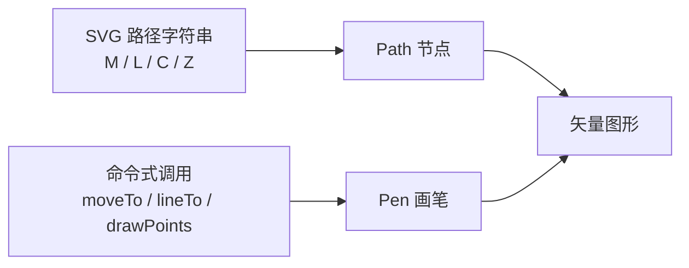

import { Canvas, Controls, Meta } from '@storybook/addon-docs/blocks';
import * as PathAndPen from './path-and-pen.stories';

<Meta of={PathAndPen} name="Docs" />

# 路径与画笔

Path 和 Pen 都用来绘制矩形、圆等基础图形无法直接描述的任意矢量路径，但输入方式相反：**Path 把形状写成一段 SVG 路径字符串**（`path` 属性），**Pen 像 Canvas 2D 那样用命令一步步把形状画出来**（`moveTo` / `lineTo` / `drawPoints` …）。一句话区分：形状已知、能写成字符串（图标、字体字形、设计稿路径）用 Path；形状要靠代码算出来或分段组合（采样曲线、动态生成的多段路径）用 Pen。两者最终都生成同一套路径命令数据，描边、填充、`windingRule` 等样式能力完全一致。



| 输入 / 属性 | 默认 / 取值 | 回查要点 |
| --- | --- | --- |
| `Path.path` | SVG 字符串 或 命令数组 | 大写=绝对坐标，小写=相对；支持 `M L H V C S Q T A Z`，及 Leafer 扩展 `X`（圆角矩形）`P`（弧） |
| `Path.windingRule` | `'nonzero'` | 自相交路径的填充规则；`'evenodd'` 在重叠区域留孔 |
| `Pen.setStyle(data)` | — | 设定描边 / 填充，创建一条带样式的子路径（`pathElement`） |
| Pen 命令方法 | 链式返回 `this` | `moveTo` `lineTo` `bezierCurveTo` `quadraticCurveTo` `closePath` `rect` `arc` `drawPoints` … |
| `drawPoints(points, curve, close)` | `curve = 0` | `points` 为扁平 `[x,y, …]`；`curve` `0`=折线、`0–1`=平滑度、`true`=`0.5`；`close` 是否闭合 |

## Path：用 SVG 路径字符串声明形状

Path 的 `path` 属性接收一段 SVG 路径字符串，引擎解析后渲染。命令字母含义与 SVG 一致：`M` 起笔、`L` 直线、`H`/`V` 水平/垂直、`C` 三次贝塞尔、`S` 平滑三次、`Q` 二次贝塞尔、`T` 平滑二次、`A` 弧、`Z` 闭合；小写为相对坐标。设了 `path` 之后，元素的包围盒由路径几何自动决定（`__usePathBox`），不必手填 `width`/`height`。

```ts
import { Leafer, Path } from 'leafer-ui';

const leafer = new Leafer({ view: canvas, fill: '#fff' });

// 五角星：M 起笔，连续 L 连到其余顶点，Z 闭合
const star = new Path({
  x: 200, y: 150,
  path: 'M 0 -90 L 21 -29 L 86 -28 L 34 11 L 53 73 L 0 36 L -53 73 L -34 11 L -86 -28 L -21 -29 Z',
  windingRule: 'nonzero', // 默认值；自相交路径改 'evenodd' 会在中心留孔
  fill: '#4f7cff',
});

leafer.add(star);
```

自相交路径（如五角星）的填充由 `windingRule` 决定：默认 `'nonzero'` 完全填充，`'evenodd'` 在重叠区域留孔。下方实例切换填充规则即可观察差异。

<Canvas of={PathAndPen.PathDemo} />
<Controls of={PathAndPen.PathDemo} />

| 读者操作 | 可观察证据 |
| --- | --- |
| 切换「填充规则」为 `evenodd` | 五角星中心出现五边形孔洞；`nonzero` 时实心 |
| 打开 Show code | 看到 `STAR_PATH` 字符串与 `new Path({ path, windingRule })` 用法 |

**边界：** `path` 是形状的唯一真源；设了 `path` 后包围盒按路径几何定界，手填 `width`/`height` 不再决定形状大小。路径坐标在 Path 的本地系中度量，原点由 `x`/`y` 定位，需要居中时把 `x`/`y` 设到画布中心。`windingRule` 只影响自相交或重叠子路径的填充，对简单凸路径没有可见区别。

## Pen：用命令式 API 自由绘制

Pen 继承自 Group，并混入了一套与 Canvas 2D 同名的命令式绘图 API。用法分两步：先 `setStyle({...})` 设定描边 / 填充并创建一条带样式的子路径（`pathElement`），再用 `moveTo` / `lineTo` / `drawPoints` 等方法写入路径数据。每个命令都写入 `pen.path`（与 `pathElement.path` 共享同一数组）并触发刷新，链式返回 `this`。

```ts
import { Leafer, Pen } from 'leafer-ui';

const leafer = new Leafer({ view: canvas, fill: '#fff' });

const pen = new Pen();
pen.setStyle({ stroke: '#4f7cff', strokeWidth: 3, fill: 'rgba(79,124,255,0.15)' });
// drawPoints(扁平坐标数组, 平滑度, 是否闭合)：0=折线，0–1=二次贝塞尔平滑度
pen.drawPoints([80, 0, 24, 64, -76, 39, -47, -49, 47, -49, 76, 39, -24, 64], 0.5, true);

leafer.add(pen);
```

下方实例用 Pen 拟合一条穿过 N 个采样点的闭合曲线：调整点数看红色采样点增减，拖动平滑度在折线与平滑曲线之间切换。

<Canvas of={PathAndPen.PenDemo} />
<Controls of={PathAndPen.PenDemo} />

| 读者操作 | 可观察证据 |
| --- | --- |
| 调整「采样点数」 | 红色采样点与拟合曲线随之增减；读数「路径数据长度」同步变化 |
| 拖动「平滑度」从 `0` 到 `1` | 折线逐渐变成平滑的二次贝塞尔曲线 |
| 打开 Show code | 看到 `pen.setStyle(...)` + `pen.drawPoints(...)` 的命令式流程 |

**边界：** 必须先 `setStyle` 再发命令——`setStyle` 创建 `pathElement` 并把 `pen.path` 链接到它的命令数组，没有 `setStyle` 就没有可写的目标。`pen.path` 是只读 getter，不能直接赋值，改图要先 `clearPath()`（等价 `beginPath`，原地清空数组）再重新发命令。Pen 继承 Group，可以像普通容器一样 `add` 其他 UI 节点。

### setStyle 与子路径样式

`setStyle(data)` 不仅设样式，还会新建一个独立的 `Path` 子节点作为当前子路径。连续多次 `setStyle` 可以在同一个 Pen 里拼出多种样式组合——这是 Pen 区别于单个 Path 的核心能力：一段代码画出多颜色、多填充的路径组合，而不必为每段样式各建一个 Path。

```ts
const pen = new Pen();

pen.setStyle({ fill: '#FF4B4B', windingRule: 'evenodd' });
pen.roundRect(0, 0, 100, 100, 30).arc(50, 50, 25); // 红色：圆角矩形 + 圆

pen.setStyle({ stroke: '#4DCB71', strokeWidth: 4, strokeAlign: 'inside' });
pen.moveTo(40, 30).bezierCurveTo(70, 30, 90, 60, 63, 80); // 绿色描边曲线

leafer.add(pen);
```

`setStyle` 接收所有 Path / UI 样式属性（`fill`、`stroke`、`strokeWidth`、`strokeAlign`、`windingRule`、渐变与图片填充等）；也可在其中给 `x`/`y`，给该子路径一个局部偏移。需要把已有的图形节点（`Text`、`Image`、`Ellipse` …）夹进画笔结果时，直接 `pen.add(node)` 即可。

### drawPoints 与平滑曲线

`drawPoints(points, curve, close)` 把一组点连成路径：`curve` 为 `0` 或 `false` 时是折线（`moveTo` + 一串 `lineTo`）；为 `0–1` 的数或 `true` 时用过点二次贝塞尔做平滑，`true` 等价于 `0.5`。`close` 为 `true` 闭合首尾。它特别适合把采样数据（传感器轨迹、数学曲线、用户手写点）快速变成平滑图形，而不必手算每段控制点。

平滑度越大曲线越柔，但会偏离采样点；需要严格过点又要求折线时设 `0`。点数小于 3（坐标数 ≤ 5）时不做平滑，直接连成折线。

## 最佳实践

- **静态形状选 Path，动态形状选 Pen。** 形状来自设计稿、图标库或能写死字符串的，用 Path：一段字符串即一棵可序列化、可复用的路径树；形状要靠循环、采样或交互实时算出来的，用 Pen：命令式更易在代码里拼装。
- **多样式组合优先 Pen。** 一个 Pen 里多次 `setStyle` + 命令，即可画出多颜色、多填充的路径组合，比维护多个 Path 节点更紧凑。
- **改 Pen 路径用 `clearPath` 重画，不要重设 `path`。** `pen.path` 只读；清空再发命令是最可靠的更新方式，配合 `setStyle` 切换样式即可重绘整段。
- **路径坐标尽量以原点为中心定义，再用 `x`/`y` 定位。** 这样缩放、旋转、居中都以路径中心为基准，避免包围盒偏在角落。

## 常见问题

- **Pen 画完什么都不显示。**
  先检查有没有 `setStyle`。`setStyle` 负责创建带样式的 `pathElement`，没有它后续命令无处写入，画面为空。
- **`pen.path = [...]` 赋值不生效。**
  `pen.path` 是只读 getter（返回与 `pathElement` 共享的命令数组）。要改路径，用 `pen.clearPath()` 清空后重新调用 `moveTo`/`lineTo`/`drawPoints` 等命令。
- **给 Path 设了 `width`/`height`，形状大小没变。**
  设了 `path` 后元素进入路径几何定界模式（`__usePathBox`），包围盒由路径本身决定，`width`/`height` 不再控制形状尺寸。要放大缩小，改路径坐标或用 `scale`。
- **`windingRule` 切了没反应。**
  它只影响自相交或重叠子路径的填充。简单凸路径（圆、普通矩形）无论 `nonzero` 还是 `evenodd` 看起来都一样，换成五角星、嵌套路径才能看到差别。

## 总结回顾

摘要：

Path 与 Pen 是 LeaferJS 绘制任意矢量路径的两种入口。Path 用一段 SVG 路径字符串（`path`）声明形状，支持 `M/L/H/V/C/S/Q/T/A/Z` 等命令与 `evenodd` 填充规则，设了 `path` 后包围盒按路径几何自动定界。Pen 继承 Group 并混入 Canvas 2D 同名的命令式 API，先 `setStyle` 设样式与子路径，再 `moveTo`/`lineTo`/`drawPoints` 写命令；多次 `setStyle` 可拼出多样式组合，`drawPoints` 的 `curve` 参数把采样点一键平滑。两者底层生成同一套路径命令数据，描边、填充、`windingRule` 能力一致。

一句话：

> 形状能写成字符串用 Path，形状要靠代码画出来用 Pen，二者殊途同归地生成同一种路径命令数据。

知识要点：

- Path 的 `path` 属性接收什么、支持哪些命令字母？
- 设了 `path` 后，Path 的尺寸由什么决定？
- `windingRule` 在什么情况下才会产生可见差异？
- Pen 为什么必须先 `setStyle` 再画命令？
- 更新 Pen 已有路径时，为什么不能直接给 `pen.path` 赋值？
- `drawPoints` 的 `curve` 参数在不同取值下行为如何？

## 参考资料

- [Leafer UI 官方文档 · Path](https://www.leaferjs.com/ui/guide/display/Path.html)
- [Leafer UI 官方文档 · Pen](https://www.leaferjs.com/ui/guide/display/Pen.html)
- [Leafer UI 官方示例合集](https://www.leaferjs.com/examples/)
