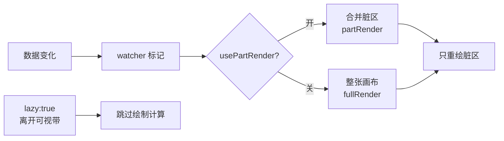

import { Canvas, Controls, Meta } from '@storybook/addon-docs/blocks';
import * as Performance from './performance.stories';

<Meta of={Performance} name="Docs" />

# 性能优化

LeaferJS 能在万级元素下保持流畅，靠的不是「画得更快」，而是「能不画就不画」。一条主线串起三个层次的省画策略：**局部渲染**只重绘真正变化的脏区，**懒渲染**让视口外的元素连绘制计算都跳过，**分层**把更新频率不同的内容拆到不同 Layer。三者之外，再用 `Debug.showRepaint`、`leafer.FPS` 把「到底画了哪一块、画了多快」变成可观察的事实，才能判断优化往哪个方向做。

对象关系上，这三个 lever 分别落在不同层级：`usePartRender` 是引擎/层的渲染配置（`new Leafer({ usePartRender })` 或运行时写 `leafer.config`），`lazy` 是单个元素的属性（`new Rect({ lazy: true })`），分层则是 `App` 多 `Layer` 的事。它们的收益互相叠加：局部渲染管「这一帧画多大」，懒渲染管「哪些元素根本不画」，分层管「把谁和谁放在同一个重绘节奏里」。



> 渲染循环（watcher → renderer → `requestAnimationFrame`）、`maxFPS` 出帧封顶、`partRender`/`fullRender` 的基本判定，都在 [1.3 渲染后端](?path=/docs/render-backend--docs) 讲清了。本课从「怎么用这些机制把性能榨出来」切入，补上懒渲染这个新的 lever，以及诊断手段。

| 输入 | 默认值 | 作用 | 回查要点 |
| --- | --- | --- | --- |
| `usePartRender` | `true` | 开启局部渲染，每帧只重绘脏区 | 改 `false` 走全量 `fullRender`；元素包围盒无法判定时（编辑框、背景网格）才关 |
| `lazy`（元素属性） | `false` | 元素离开「可视区 + 扩展带」就不计算绘制 | 给海量 / 无限画布的元素加 `lazy: true` |
| `lazySpeard`（Leafer config） | `100` | 可视区向外扩展的懒渲染带，四边各加这么多像素 | 调大可提前渲染即将进入视口的元素，避免平移时闪现 |
| `useCellRender` | `false` | 把合并脏区再按网格切成 cell 分别渲染 | 极端密集的脏区才试，常规无需开 |
| `Debug.showRepaint` | `false` | 渲染器把每帧重绘的脏区涂上半透明色块 | 判断局部渲染效果的最直观手段，全局静态开关 |

## 局部渲染：脏区大小决定收益

局部渲染（partRender）的机制在 [渲染后端课](?path=/docs/render-backend--docs) 已讲清，本课聚焦它的**收益判断**：partRender 只重绘脏区，而脏区由「变化元素的渲染边界（包围盒）变化前后」组成，多个变化的脏块再经 `mergeBlocks` 合并。也就是说——**partRender 的收益正比于脏区占画布的比例**。

这带来一条可直接使用的判断：动效**集中**在一角时，合并脏区是个小矩形，partRender 只需重绘画布的零头；动效**分散**到整屏时，合并脏区膨胀到接近全画布，partRender 退化成接近 `fullRender`，省下的工作量所剩无几。同理，关掉 `usePartRender` 后每一帧都全量重画，静态元素再多也得跟着重绘，元素量越大掉帧越明显。

最小代码——构造时开局部渲染（默认即开），或运行时改开关：

```ts
import { Leafer } from 'leafer-ui'

// 默认就开了局部渲染
const leafer = new Leafer({ view, usePartRender: true })

// 运行时关闭：leafer.config 与 leafer.renderer.config 是同一对象引用，下一帧生效
leafer.config.usePartRender = false
```

下面的实例用数百到两千个静态方块当「不参与变化的背景成本」，再让其中一小撮持续闪烁。把「动效分布」在集中 / 分散之间切换，看脏区覆盖与实测 FPS 如何同步变化。

<Canvas of={Performance.Interactive} />
<Controls of={Performance.Interactive} />

| 读者操作 | 可观察证据 |
| --- | --- |
| 「动效分布」从 集中 切到 分散 | 「脏区覆盖」从个位数跳到接近 100%，实测 FPS 同步下跌 |
| 关闭「局部渲染」 | 每帧全量重绘，FPS 比集中 + 局部渲染时低一截，且不再随分布变化 |
| 增大「方块总数」 | 局部渲染开时静态方块不参与重绘，FPS 几乎不动；关掉后 FPS 随之下降 |
| 打开「显示重绘区」 | 集中分布只见角落小色块、分散分布色块铺满整画布、关局部渲染则整张画布每帧被涂满 |

边界：`Debug.showRepaint` 是 `Debug` 的全局静态标志（跨所有 Leafer 实例共享），实例用完记得复位为 `false`，否则高亮会泄漏到其它画布。另外，当某个 Layer 里含有编辑框、背景网格这类**无法稳定判定包围盒**的内容时，官方建议给该层 `usePartRender: false`——此时局部渲染算不准脏区，全量重绘反而更可靠。

## 懒渲染 lazy：连视口外的绘制都省掉

局部渲染省的是「这一帧画多大」，懒渲染省的是「哪些元素根本不用画」。给元素设 `lazy: true` 后，引擎会判断它的世界包围盒是否落在 `lazyBounds` 内——`lazyBounds` 等于画布可视区向四边各扩 `lazySpeard`（默认 100 像素）。落在带外的懒元素跳过绘制计算（`__needComputePaint`），等它被平移进可视带再画。

这对无限画布和海量静态元素几乎是必须的：背景里有上万个图形，但用户某一屏只能看见其中几十个，让视口外的上万个元素每帧都参与布局与绘制纯属浪费。最小代码——给元素开懒渲染，或全局调大扩展带：

```ts
import { Leafer, Rect } from 'leafer-ui'

const leafer = new Leafer({
  view,
  lazySpeard: 200,   // 可视区四边各扩 200px，让元素提前进入渲染带
})

// 给海量 / 无限画布的静态元素开懒渲染
leafer.add(new Rect({ x: 5000, y: 5000, width: 80, height: 80, fill: '#32cd79', lazy: true }))
```

边界：懒渲染在导出（`Export.running`）时会自动让位，保证导出图完整；编辑场景同理。`lazySpeard` 不是越大越好——扩得越宽，提前进入渲染带的元素越多，绘制成本也随之上升；但若设得过小，快速平移视口时元素会「闪现」（进了可视区才匆忙补画）。在「视口外元素极多」和「平移时不能闪」之间，按场景调这个值。

## 海量元素优化策略

把上面的 lever 按收益从高到低组合，是把海量元素场景跑顺的通用路径：

1. **先分层**——把「更新频率」不同的内容拆到不同 Layer：静态大背景一层、频繁动效一层、交互控件一层。这样背景只画一次就能稳定复用，动效层的重绘不会牵连整张画布。分层与视口控制属于 [9.1 分层渲染与视口](?path=/docs/layer-and-viewport--docs)。
2. **给视口外的元素开 `lazy: true`**——无限画布 / 节点图 / 大地图这类「总元素远多于可见元素」的场景，懒渲染能直接砍掉视口外的绘制成本。
3. **不参与交互的元素设 `hittable: false`**——静态背景的成百上千个图形若都要参与命中检测，会拖慢点击与拖拽；命中检测可关的就关掉。
4. **确认 `usePartRender` 开启、动效尽量集中**——让每帧的脏区尽量小，是局部渲染收益的来源（见上节实例）。
5. **极端密集的脏区再试 `useCellRender`**——当合并脏区本身已经很大、内部又高度密集时，把它按网格切成 cell 分别渲染可能更快；常规场景不必开。

这套顺序的逻辑是「先砍掉不用画的，再缩小必须画的」：分层和懒渲染去掉的是「本可不参与的元素」，局部渲染缩小的是「这一帧真正要画的范围」，命中优化省的是「交互时的额外开销」。

## 诊断与观察

优化前先看清现状，比盲调参数有效。LeaferJS 给了三个可直接用的观察手段：

- **`Debug.showRepaint = true`**：渲染器每画完一个脏区，就给它涂一层半透明随机色块。这是判断局部渲染效果最直观的方式——色块面积就是真实重绘面积。它和上面实例里的「显示重绘区」开关是同一个标志。
- **`leafer.FPS`**：渲染器维护的滚动均值 FPS，反映近期的出帧节奏；空闲（没有数据变化）时它不会归零，而是停在最后一次渲染的值。
- **`leafer.renderer.totalTimes`**：累计出帧数。判断「画面到底还在不在动」，看它是否持续上涨比看 FPS 更可靠——FPS 是均值，totalTimes 是单调递增的计数。

```ts
import { Leafer, Debug } from 'leafer-ui'

const leafer = new Leafer({ view })
Debug.showRepaint = true                 // 高亮每帧重绘区

// 轮询读数（独立于渲染节奏）
setInterval(() => {
  console.log(leafer.FPS, leafer.renderer.totalTimes)
}, 200)
```

实例左下角的读数正是这几项的组合：「脏区覆盖」对应 partRender 的工作量，「实测 FPS」「累计出帧」「渲染状态」反映运行节奏。优化时先开「显示重绘区」看清色块面积，再调分布 / 开关局部渲染，观察色块与 FPS 的联动——这就是把性能问题从「感觉卡」变成「可定位」的过程。

## 常见问题

- **关掉局部渲染后 FPS 反而升高了？**
  说明场景里元素不多，或者每帧的变化本身已接近覆盖整张画布。局部渲染要先合并脏块再裁剪重绘，本身有少量开销；只有「元素量大、且变化集中」时它才净赚。元素少时全量重绘反而更省心。

- **`totalTimes` 不涨、画面不动了？**
  说明渲染器没在出帧。两种可能：一是 watcher 没检测到变化（你以为改了属性，其实新值和旧值相同，或写错了对象）；二是渲染器停了。先查 `leafer.renderer.running` 是否为 `true`、`leafer.config.start` 有没有被设成 `false`。

- **开了 `lazy` 的元素在平移视口时闪现？**
  `lazySpeard`（默认 100）太小，元素进了可视区才开始计算绘制，来不及在这一帧画完。把它调大，让元素在离可视区还有一段距离时就提前进入渲染带。

## 总结回顾

摘要：

LeaferJS 的性能主线是「能不画就不画」。局部渲染 `usePartRender`（默认开）每帧只重绘由变化元素包围盒组成的脏区，收益正比于脏区占画布的比例——动效集中时脏区小、收益大，分散时脏区逼近全屏、退化成接近全量重绘，关掉后每帧全画。懒渲染 `lazy: true` 让落在可视区 + `lazySpeard` 扩展带之外的元素直接跳过绘制计算，是无限画布 / 海量静态元素的必备手段。再配合分层（不同更新频率拆到不同 Layer）、`hittable: false` 关闭静态元素的命中检测，以及 `Debug.showRepaint` + `leafer.FPS` + `renderer.totalTimes` 的诊断读数，就能把优化从「感觉卡」落到「看清重绘面积、定位瓶颈」。

一句话：

> 局部渲染省的是「这一帧画多大」，懒渲染省的是「哪些元素根本不画」，先砍不画的、再缩小必须画的。

知识要点：

- 局部渲染的收益由什么决定？动效集中与分散时脏区覆盖有何不同？
- `lazy: true` 在什么条件下跳过绘制？`lazySpeard` 调大调小各有什么副作用？
- 关掉 `usePartRender` 后，静态元素数量上涨对 FPS 为什么影响更大？
- 海量元素场景的优化 lever 应按什么顺序组合？
- `Debug.showRepaint`、`leafer.FPS`、`renderer.totalTimes` 分别用来观察什么？判断「画面还在不在动」哪个最可靠？

## 参考资料

- [Leafer UI 官方文档 · 局部渲染](https://www.leaferjs.com/ui/guide/app/partRender.html)
- [Leafer UI 官方文档 · 应用与引擎配置](https://www.leaferjs.com/book/leafer-ui/advance/config.html)
- [Leafer UI 官方文档 · 体验性能](https://www.leaferjs.com/book/leafer-ui/start/performance.html)
- [Canvas 引擎性能基准](https://benchmark.leaferjs.com/leafer/)
