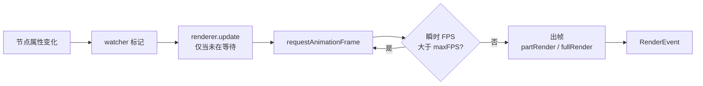

import { Canvas, Controls, Meta } from '@storybook/addon-docs/blocks';
import * as RenderBackend from './render-backend.stories';

<Meta of={RenderBackend} name="Docs" />

# 渲染后端

Leafer 在浏览器里用一个 `<canvas>` 渲染整棵节点树。每个 `Leafer` 实例背后是三件事的组合：一个 Canvas 2D 上下文（绘图后端）、一个监听数据变化的 watcher、一个按需出帧的 renderer。理解这三者如何配合，就能预测「调哪个旋钮会让画面或性能怎样变化」。

关键直觉：

- 浏览器构建中，绘图后端固定是 Canvas 2D——`LeaferCanvas` 创建上下文时直接调用 `view.getContext('2d')`，所有渲染指令都走 Canvas 2D API。
- 渲染不是持续跑帧的循环，而是**按需触发**：节点属性变化 → watcher 标记 → renderer 请求一帧 → `requestAnimationFrame` 出帧。没有变化就不出帧。
- `maxFPS` 给「连续变化」场景下的出帧频率封顶；`usePartRender` 决定每帧是只重绘变化区域，还是全量重绘整张画布。

一个常见误解是 `leafer.config.type` 用来选渲染后端——它其实是 Leafer 的用途 / 视口类型（`draw` / `editor` / `design` …），与 Canvas 2D / WebGL 无关。2.2.9 的浏览器构建没有 WebGPU / WebGL 代码路径（下文详述）。



| 配置 / 输入 | 默认 | 回查要点 |
| --- | --- | --- |
| `maxFPS` | 源码 `120`；实际受 `requestAnimationFrame` 与显示器刷新率约束（一般 60） | 最高渲染帧率。运行时改 `leafer.config.maxFPS` 立即生效；建议取能被 60 整除的值（30 / 20 / 15） |
| `usePartRender` | `true` | 首帧后只重绘变化区域；`false` 时每帧全量重绘 |
| `useCellRender` | `false` | cell 模式渲染，2.2.9 为预留接口 |
| `start` | `true` | 是否自动启动引擎；可用 `leafer.stop()` / `leafer.start()` 控制 |
| `type` | 无默认 | Leafer 用途 / 视口类型（`draw` / `editor` / `design` …），**不是**渲染后端 |
| `fill` | 无 | 画布背景填充色 |

## 渲染后端：Canvas 2D

在浏览器构建中，`LeaferCanvas`（来自 `@leafer/canvas-web`）拿到 `view` 后调用 `view.getContext('2d')` 创建上下文，`Platform.requestRender` 被赋值为 `window.requestAnimationFrame`，把出帧挂到浏览器的帧循环。所以「渲染后端」= Canvas 2D 上下文 + rAF 出帧，二者在 2.2.9 的 web 构建里是写死的。

最小代码：

```ts
import { Leafer } from 'leafer-ui'

// view 传一个已存在的 <canvas>，Leafer 直接复用它作为 Canvas 2D 后端
const leafer = new Leafer({ view: canvas, fill: '#ffffff' })
```

**关于 WebGPU / WebGL**：接口层确实存在两个看起来像「后端开关」的钩子——`ILeaferCanvasConfig.webgl?: boolean` 和 `@leafer/web-core` 导出的 `useCanvas(canvasType, power?)`。但在 2.2.9 的浏览器构建里，`useCanvas` 的两个参数都被忽略（函数体只负责注册 DOM 相关的 `Platform.origin`），`__createContext` 恒定走 `getContext('2d')`，整条渲染链路上没有 WebGL / WebGPU 分支。`ICanvasType = 'skia' | 'napi' | 'canvas' | 'miniapp'` 是为 Node / Worker（Skia / NAPI）和小程序等非浏览器环境预留的**环境适配标识**，不是浏览器后端选择器。

可观察证据：无论怎么调本课的其它控件，下方实例 readout 的「渲染后端」一行始终是 `Canvas 2D`。

边界：服务端渲染、小程序后端不属本课边界（本课聚焦浏览器）。

## 按需渲染：没有变化就没有帧

Leafer 的渲染由数据变化驱动。当节点属性被赋新值，watcher 标记变化，`renderer.update()` 把 `changed` 置真并（仅当当前没有在等待的帧时）调用 `__requestRender()`；后者通过 `Platform.requestRender`（即 rAF）安排一次回调。回调里若「瞬时 FPS 大于 maxFPS」就再推迟一帧，否则采样 FPS、执行 `checkRender` → `render`。节点不变 → 不调 `update` → 不出帧 → 不占 CPU。

最小代码——任意属性赋值都会自动触发一次按需渲染：

```ts
rect.x += 1 // watcher 监听到变化，renderer 自动请求一帧
```

下面的实例把这套机制完整暴露出来：一个独立循环不断改写 `spinner.rotation` 制造变化，readout 实时读出 `leafer.renderer` 的状态。

<Canvas of={RenderBackend.Interactive} />
<Controls of={RenderBackend.Interactive} />

| 读者操作 | 可观察证据 |
| --- | --- |
| 把 `maxFPS` 调到 `15` | 旋转明显变顿，实测 FPS 跟随降到 ~15，累计帧数增长变慢 |
| 关闭「持续触发渲染」 | 旋转停止，累计帧数很快不再增长——没有数据变化就没有帧 |
| 关闭「局部渲染」 | 首帧后每帧全量重绘，静态元素多时开销更高 |
| 打开 Show code | 看到该 Canvas 实际执行的 `example.ts` |

需要跳过「等变化」、立刻拿到一帧时（导出、截图、强制刷新），用手动 API：

```ts
leafer.forceRender()  // 强制渲染一次
leafer.renderer.renderOnce()
leafer.nextRender(() => { /* 下一帧后执行 */ })
```

## maxFPS：给出帧频率封顶

`maxFPS` 限制的是「连续变化场景下」的最高出帧率：当两次出帧间的瞬时 FPS 超过 `maxFPS`，render 回调会被推迟到下一个 rAF，从而把帧率压到上限附近。它的源码默认值是 `120`，实际还会被 `requestAnimationFrame` 和显示器刷新率（一般 60）兜底，所以即便设到 120 也通常跑不到。官方建议取能被 60 整除的值（60 / 30 / 20 / 15），避免丢帧节律不均。

在上面的实例里把 `maxFPS` 从 `60` 拉到 `15` 再拉回来，能直接看到实测 FPS 与旋转流畅度随之变化。

运行时改写无需重建实例——`leafer.config` 与 `leafer.renderer.config` 是同一个对象引用，赋值即在下一帧生效：

```ts
leafer.config.maxFPS = 30 // 立即生效
```

## 局部渲染：partRender 与 fullRender

`usePartRender`（默认 `true`）决定每帧重绘多大区域：

- **开启**：首帧用 `fullRender` 全量画一遍；之后布局事件把变化的元素汇总成若干 `updateBlock`，renderer 合并这些块后只对每个块做 `clipRender`（裁剪 + 清空 + 重绘局部），不动的地方保留原样。
- **关闭**：每一帧都 `fullRender`，把整张画布擦掉重画。

在上面的实例里切换「局部渲染」，readout 的对应行随之变化。当画面里只有一小块在动（如本例的旋转指示器）而其余是静态内容时，开启局部渲染能让每帧的实际重绘面积远小于全量；这在节点众多的真实场景里是关键的性能杠杆。局部渲染的进阶调优（block 合并策略、超大画布下的处理）放在性能优化课展开。

## 常见问题

- `leafer.config.type = 'webgl'` 能切到 WebGL 吗？
  不能。`type` 是 Leafer 的用途类型 `ILeaferType`（取值如 `draw` / `editor` / `design` / `board` …），决定的是 Leafer 实例的视口与交互行为，与绘图后端无关。2.2.9 浏览器构建的渲染后端固定为 Canvas 2D；想要 WebGL / WebGPU 目前需自行封装或关注后续版本。

- 不动画面时 `renderer.FPS` 为什么不归零？
  `FPS` 是**渲染时才采样**的滚动均值（最多 30 帧的窗口），不出帧就不更新，会停在最后一次的值。要判断「现在到底有没有在出帧」，看 `renderer.totalTimes` 是否还在增长，或 `renderer.changed` 是否为真——这正是本课 readout 同时给出「累计帧数」的原因。

## 总结回顾

摘要：

Leafer 在浏览器里的渲染后端是 Canvas 2D 上下文加 `requestAnimationFrame` 出帧，二者在 2.2.9 的 web 构建中写死，接口层的 `webgl` 配置与 `useCanvas` 钩子并不改变后端。渲染由数据变化按需触发，节点不变即不出帧；`maxFPS` 给连续变化场景的出帧率封顶，`usePartRender` 让首帧后的重绘只覆盖变化区域而非整张画布。`leafer.config.type` 表达的是 Leafer 的用途 / 视口类型，不是渲染后端。

一句话：

> 在 2.2.9 的浏览器里，Leafer 的渲染后端就是 Canvas 2D，真正能调的是「按需出帧的节奏」——`maxFPS` 封顶、`usePartRender` 限定重绘区域。

知识要点：

- 浏览器构建中 Leafer 的渲染后端是什么？能否切换到 WebGL / WebGPU？
- 渲染是按需触发还是持续循环？怎样从 readout 验证「无变化即无帧」？
- `maxFPS` 的源码默认值与实际表现是什么？运行时如何让它立即生效？
- `usePartRender` 开与关时，每帧的重绘范围有何不同？
- `leafer.config.type` 表示什么？它是不是渲染后端选择器？

## 参考资料

- [渲染生命周期](https://www.leaferjs.com/ui/guide/life/render.html)
- [应用与引擎基础配置](https://www.leaferjs.com/ui/reference/config/app/base.html)
- [局部渲染](https://www.leaferjs.com/ui/guide/advanced/partRender.html)
- [GitHub 主仓库 leaferjs/leafer](https://github.com/leaferjs/leafer)
