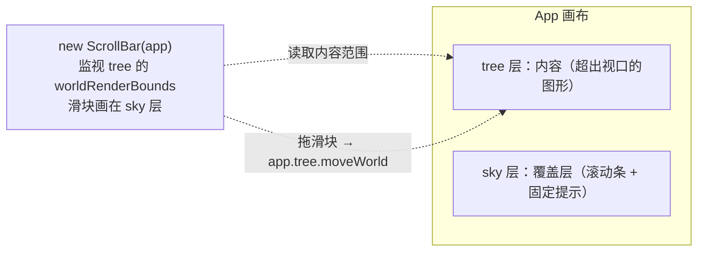

import { Canvas, Controls, Meta } from '@storybook/addon-docs/blocks';
import * as Scroll from './scroll.stories';

<Meta of={Scroll} name="Docs" />

# 滚动条

`@leafer-in/scroll` 为**大画布**提供滚动条：当内容超出可视区，它自动在画布右侧 / 下侧画出滑块；拖动滑块就平移整个内容层，相当于给无限画布装上了浏览器的滚动条。它本身是一个继承自 `Group` 的 `ScrollBar` 元素，挂在 **App 的 sky 覆盖层**上，持续监视 **tree 层**的内容范围（`worldRenderBounds`），按「可视区 / 可视区+内容」的比例算出滑块大小和位置——内容大于视口时比例 `< 1`，滚动条出现；小于视口时比例 `≥ 1`，滚动条隐藏。

记住这条主线就能预测大多数行为：`new ScrollBar(app, config)` → 构造时把自己加进 `app.sky`、把 `app.tree` 记为监视目标 → 每帧渲染前根据 `tree` 的世界包围盒与 canvas 视口重算滑块 → 用户拖滑块时，内部对 `app.tree` 调 `moveWorld` 平移内容，滑块位置与内容偏移同步。所以滚动条不是独立滚动 DOM，而是**平移内容层**的可视化把手——这决定了它的坐标读数来自 tree 的位移，而不是某个 `scrollTop`。



| 关键输入 | 默认 | 含义与回查要点 |
| --- | --- | --- |
| `new ScrollBar(target, config?)` | — | `target` 传 **App** 最省事：自动加入 `app.sky`、监视 `app.tree`。也可传 Leafer / Group，但不会自动安置到某层。 |
| `config.theme` | `'light'` | `'light'`（黑滑块，配浅底）/ `'dark'`（白滑块，配深底）/ 任意 `IBoxInputData` 自定义样式对象。 |
| `config.padding` | `0` | 滚动条轨道距画布边缘的内边距（fourNumber，同 CSS）。 |
| `config.minSize` | `10` | 滑块最小尺寸（px），内容远大于视口时避免滑块缩到看不见。 |
| 滑块默认外观 | — | `width: 6`、`cornerRadius: 3`、`opacity: 0.5`（hover 0.6 / press 0.7）；自定义 theme 在此基础上覆盖。 |
| `changeTheme(theme)` | — | 运行时换主题；内部会触发 `update` 重算滑块样式。 |
| `update(check?)` | — | 手动刷新滑块。运行时改 `config` 不会自动刷新，需调一次。`check=true` 时内容范围没变就跳过。 |
| `scroll.ratioX` / `ratioY` | — | 只读：可视区宽 / (可视区+内容) 宽。`< 1` 该轴出现滚动条，`≥ 1` 隐藏。 |
| `scroll.scrollBounds` | — | 只读：内容在世界坐标系下的包围盒，即「可滚动的全部范围」。 |
| `config.move.scroll` | falsy | 是否允许**拖空白处平移视图**及滚动限制：`true` / `'x'` / `'y'` / `'limit'` / `'x-limit'` / `'y-limit'`。`'limit'` 把平移约束在内容范围内。 |
| `config.move.scrollLimit` | `'stop'` | 触达滚动边界时的行为：`'stop'`（停住）/ `'smooth'`（带缓动回弹）。 |

## 启用滚动条

启用只需两步：`import '@leafer-in/scroll'`（或 `import { ScrollBar } from '@leafer-in/scroll'`），再 `new ScrollBar(app)`。滚动条是**按需出现**的——内容没有超出视口时不画滑块，所以不用手动判断显隐。

```ts
import { App, Rect } from 'leafer-ui'
import { ScrollBar } from '@leafer-in/scroll'

// App 只有给出 tree/sky（或 editor）时才创建这两个分层；滚动条要加入 sky、监视 tree，必须显式声明
const app = new App({ view: canvas, fill: '#f8fafc', tree: {}, sky: {} })

// tree 层放内容：坐标超过视口尺寸，滚动条才会出现
app.tree.add(Rect.one({ fill: '#FEB027', cornerRadius: 20 }, 500, 100))
app.tree.add(Rect.one({ fill: '#FFE04B', cornerRadius: 20 }, 650, 2400))

// 传 App：自动加入 sky 层、监视 tree 层内容
new ScrollBar(app)
```

下面的实例把整条主线可视化：tree 层放一个 6×4 的坐标网格（每片标着它的列行与世界坐标），加一个右下角星形进一步撑大范围；sky 层放固定提示文字（不随内容滚动）。拖动右侧或下侧的滑块，左下读数会实时显示内容范围、视口尺寸、缩略比（`ratio`，`<1` 表示该轴有滚动条）和视图偏移（`app.tree.x/y`，即「滚到了哪里」）。

<Canvas of={Scroll.Interactive} />
<Controls of={Scroll.Interactive} />

| 读者操作 | 可观察证据 |
| --- | --- |
| 默认（内容尺寸=1） | 坐标网格超出视口，「缩略比」X/Y 均 `< 1`，右侧 / 下侧滚动条都出现 |
| 拖动下侧（X）滑块 | 网格左右移动，「视图偏移」的 x 随之变化，滑块同步定位 |
| 拖动右侧（Y）滑块 | 网格上下移动，「视图偏移」的 y 随之变化 |
| 把「内容尺寸」调到 ~0.5 | 网格缩进视口，「缩略比」趋近或 `≥ 1`，滚动条自动隐藏 |
| 切「滚动条主题」到 dark | 画布变深底、滑块变白（`'dark'` 配深色画布） |
| 切「滚动条主题」到 custom | 滑块变绿（自定义 `IBoxInputData` 样式） |
| 调大「画布内边距」 | 滑块轨道整体向内收缩，离开画布边缘 |
| 打开 Show code | 看到该 Canvas 实际执行的 `example.ts` |

### 主题与样式

`theme` 三种取值：`'light'`（默认，黑色滑块配 `rgba(255,255,255,0.8)` 描边，适合浅色画布）、`'dark'`（白色滑块配 `rgba(0,0,0,0.2)` 描边，适合深色画布）、或直接传一个 `IBoxInputData` 样式对象做完全自定义。内置外观会先铺一组默认值（`width: 6`、`cornerRadius: 3`、`opacity: 0.5` 及 hover / press 透明度），再用你传入的样式覆盖，所以自定义时只写想改的字段即可。

```ts
new ScrollBar(app, { theme: 'dark' })                          // 深色画布配白滑块
new ScrollBar(app, { theme: { fill: '#22c55e' } })             // 自定义：只覆盖填充
new ScrollBar(app, { theme: { fill: '#38bdf8', width: 10 } })  // 更粗的蓝色滑块

const scroll = new ScrollBar(app, { theme: 'dark' })
scroll.changeTheme('light')   // 运行时换主题，内部自动 update
```

### 滚动范围与限制

滚动条本身只在「内容超出视口」时出现，但**视图能不能被拖出去、拖到边界怎么停**由 `config.move` 这组视图移动配置决定（属 App / Leafer 的交互配置，不是 ScrollBar 独有）。把 `move.scroll` 设为 `'limit'`，平移会被约束在内容范围内，避免把内容拖飞；`scrollLimit` 决定触边时是直接停住（`'stop'`）还是缓动回弹（`'smooth'`）。

```ts
const app = new App({
  view: canvas,
  move: { scroll: 'limit', scrollLimit: 'smooth' },  // 平移限定在内容内 + 边界缓动
})

// 需要程序化滚动时，直接平移 tree 层（滚动条拖滑块内部也是这么做的）
app.tree.moveWorld(-200, -100)
```

> `move.scroll` 控制的是「拖空白处平移视图」是否启用及其限制，和滚动条滑块是两条互补的浏览路径：滑块拖动由 `ScrollBar` 自己处理（监听滑块的 `drag` 事件、内部调 `moveWorld`），`move.scroll` 则面向「在画布空白处按住拖动」的平移手势。两者都最终落到 `app.tree` 的位移上。

## 常见问题

- **滚动条一直不出现？**
  先确认内容真的超出视口：`ScrollBar` 按「可视区 / (可视区+内容)」算比例，`ratio ≥ 1` 就不画滑块。实例里把「内容尺寸」调大即可看到。再检查传的是不是 `App`——只有传 App 才会自动加到 `sky` 层并监视 `tree`；传 Leafer / Group 时滚动条不会自动安置到任何层。
- **`app.sky` / `app.tree` 是 undefined？**
  `App` 默认不创建任何分层，只有在 config 里给出 `tree` / `sky`（或 `editor` / `ground`）时才会 `addLeafer` 建出对应层。滚动条要加入 sky、监视 tree，所以必须 `new App({ view, tree: {}, sky: {} })`（或带 `editor: {}`）。官方示例多带 `editor: {}`，顺带把 tree/sky 一起建出来了，容易让人误以为 sky 是默认就有的。
- **运行时改了 `config`（如 `padding`），滑块没变？**
  改 `scroll.config.xxx` 不会自动刷新。手动调一次 `scroll.update()` 即可（实例里的「画布内边距」控件就是这么做的）。
- **滑块拖动时内容跟着动，但读到的偏移和我预期差一点？**
  滚动条平移的是 `app.tree`（内容层），读「滚到了哪里」看 `app.tree.x / y`。若画布还做了缩放（`zoomLayer`），世界坐标和像素位移会按缩放比例换算，先确认当前是否有缩放。
- **想让用户也能拖空白处平移、并限制在内容内？**
  给 App 配 `move: { scroll: 'limit' }`。这开启「空白处拖动平移」并把范围约束到内容边界；只想让滚动条滑块可用、不想开空白拖动，就保持 `move.scroll` 默认（falsy）。

## 总结回顾

摘要：

`@leafer-in/scroll` 的 `ScrollBar` 是一个挂在 App sky 覆盖层的 `Group`，持续监视 tree 层内容的 `worldRenderBounds`，按「可视区 / (可视区+内容)」算出 `ratioX/ratioY`：`< 1` 就在该轴画出滑块，`≥ 1` 隐藏。启用只需 `new ScrollBar(app, config)`（传 App 会自动加入 sky、监视 tree）。拖动滑块时，内部对 `app.tree` 调 `moveWorld` 平移内容层，所以「滚到了哪里」读 `app.tree.x/y`，没有独立的 `scrollTop`。`config.theme` 支持 `'light'`/`'dark'`/自定义 `IBoxInputData`，运行时用 `changeTheme` 切换；改 `config` 后要手动 `update()`。视图能否被拖出边界由 `config.move.scroll`（`'limit'` 等限制）与 `scrollLimit` 决定，属 App 的视图移动配置、与滑块互补。

一句话：

> 滚动条是「内容层平移」的可视化把手——`new ScrollBar(app)` 监视 tree 内容范围，内容超出视口（`ratio<1`）就出现滑块，拖滑块即 `moveWorld` 平移 `app.tree`，偏移读 `tree.x/y`。

知识要点：

- 怎样启用滚动条？传 App 和传 Leafer/Group 有何区别？
- 滚动条什么时候出现、什么时候隐藏？`ratioX/ratioY` 的含义是什么？
- 拖动滑块时内容如何移动？「滚到了哪里」读哪个属性？
- `theme` 的三种取值是什么？运行时怎么换主题？
- 运行时改了 `config.padding` 为什么滑块没变？怎么修？
- 想把视图平移限制在内容范围内，要配哪个选项？

## 参考资料

- [ScrollBar 滚动条插件 | Leafer UI 官方文档](https://www.leaferjs.com/ui/plugin/in/scroll/)
- [App 分层与 ground/tree/sky 结构 | Leafer UI 官方文档](https://www.leaferjs.com/ui/guide/start/app.html)
- [应用配置（move.scroll / scrollLimit 等视图移动参数）| Leafer UI 官方文档](https://www.leaferjs.com/ui/reference/config/app/base.html)
- [GitHub leafer-in/scroll 源码](https://github.com/leaferjs/leafer-in/tree/main/packages/scroll)
