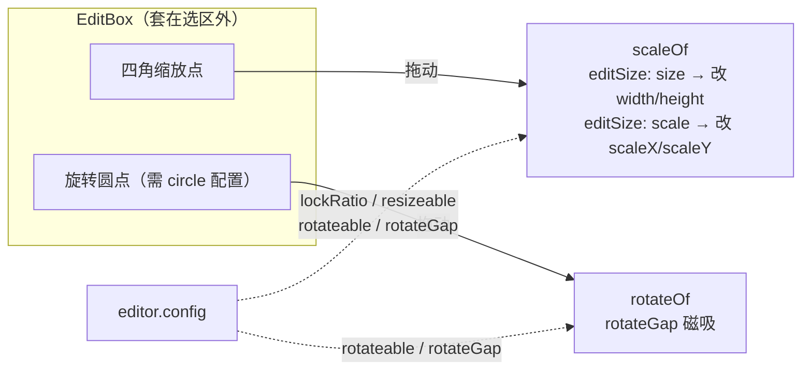

import { Canvas, Controls, Meta } from '@storybook/addon-docs/blocks';
import * as SelectTransform from './select-transform.stories';

<Meta of={SelectTransform} name="Docs" />

# 选中与变换手柄

启用编辑器（见 [8.1.1 启用编辑器](?path=/docs/editor-basics--docs)）后，被选中的元素外围会出现一层**编辑框（EditBox）**，它把「选中谁」和「怎么变换」可视化成一圈可拖拽的手柄。本课在「能选中」的基础上往前走一步，回答三个问题：单选与多选的差别在哪、变换手柄（缩放 / 旋转）怎么驱动元素、`editor.config` 怎么约束这些变换（锁定比例、禁用旋转、磁吸角度）。

三个对象各司其职：**Editor** 管选中状态与变换命令，**EditBox** 画手柄并把手柄拖动翻译成 `scaleOf` / `rotateOf` / `move`，**editor.config** 决定这些变换能做什么。预测结果只需记住一点：**`select` 决定手柄围住谁，`config` 决定手柄能做什么，拖手柄才真正改变元素。**



| 关键输入 | 默认 | 回查要点 |
| --- | --- | --- |
| `editor.select(node)` / `select([nodes])` | — | 单选传一个元素，多选传数组 |
| `editor.list` / `.single` / `.multiple` | `[]` / `false` / `false` | 只读，查选中数量与模式 |
| `editor.element` | — | 单选=该元素；多选=代表合并外框的 `SimulateElement` |
| `editor.config.lockRatio` | `undefined`（不锁） | `true` 始终锁、`'corner'` 仅角点锁、`false` 不锁 |
| `editor.config.resizeable` | `true` | `false` 禁用缩放；`'zoom'` 走滚轮 |
| `editor.config.rotateable` | `true` | `false` 隐藏旋转点并禁止旋转 |
| `editor.config.rotateGap` | `45` | 旋转磁吸间隔（度），接近倍数时吸附；`0` 关闭 |
| `editor.config.editSize` | `'size'` | 缩放改 `width/height`；`'scale'` 改 `scaleX/scaleY` |
| `editor.config.circle` | `undefined` | 给 `{}` 才出现专用旋转圆点 |

## 单选与多选

选中是变换的前提：没选中就没有手柄。`select()` 的参数决定单选还是多选——传一个元素是单选，传数组是多选；多选时编辑框围住的是所有选中元素的**合并外框**，缩放 / 旋转同时作用于组内每个元素。启用编辑器、`editable` 标记与 `cancel()` / `list` 的基础用法见 [8.1.1 启用编辑器](?path=/docs/editor-basics--docs)，这里只讲多选带来的差别。

```ts
import { App, Rect, Ellipse } from 'leafer-ui';

const app = new App({ view, editor: {} });
const editor = app.editor;

const a = new Rect({ editable: true, width: 120, height: 90, fill: '#4f7cff' });
const b = new Ellipse({ editable: true, width: 120, height: 90, fill: '#32cd79' });
app.tree.add([a, b]);

editor.select(a);          // 单选：编辑框围住 a
editor.select([a, b]);     // 多选：编辑框围住 a、b 的合并外框
editor.cancel();           // 取消
```

读取选中状态除了 [8.1.1](?path=/docs/editor-basics--docs) 讲过的 `list` / `editing`，还有两个更适合区分单/多选的只读成员，以及一个关键的 `element` 访问器：

```ts
editor.single;   // boolean：是否恰好选中一个
editor.multiple; // boolean：是否选中多个
editor.element;  // 单选 = 该元素；多选 = 代表合并外框的模拟元素（SimulateElement）
```

`editor.element` 是编辑器内部用来计算变换的「目标」：单选时它就是被选元素本身，多选时它是一个 `SimulateElement`（其包围盒等于所有选中元素的合并框）。`EditBox` 的尺寸 / 角度读数、手柄拖动的变换都作用在 `element` 上——理解了这一点，就能解释「多选拖角点为什么是整组等比缩放」。

`editable: 'single'` 的元素可单独选中、但会被多选过滤掉；`locked: true` 的元素则彻底排除出任何选中（见下文 [元素锁定](#元素锁定)）。

## 变换手柄

选中后，`EditBox` 在选区外围画出手柄，把手柄拖动翻译成对 `editor.element` 的变换命令。默认手柄有两类：**四个角的缩放点**，和**顶部的旋转圆点**（需在 config 里给 `circle: {}` 才出现，否则只能「按住 Ctrl/Cmd 拖角点」旋转）。

下面这个实例把选中、手柄和约束放在一起：用 Controls 切换选中目标、锁定比例、允许旋转和吸附角度，直接拖手柄变换，左下角读出选区尺寸和角度。

<Canvas of={SelectTransform.Interactive} />
<Controls of={SelectTransform.Interactive} />

| 读者操作 | 可观察证据 |
| --- | --- |
| 切「选中目标」为矩形/椭圆/全选/取消 | 手柄框出现在对应元素外围；全选时围住两者的合并外框；「选中数量/模式」随之变为 1/2 与单选/多选 |
| 拖四角缩放点 | 元素尺寸改变，「选区尺寸」读数同步；「锁定比例=是」时宽高等比变化 |
| 拖顶部圆形旋转手柄 | 元素绕中心旋转，「选区角度」读数同步 |
| 切「允许旋转」为否 | 旋转手柄消失、无法旋转；缩放手柄仍在 |
| 调「旋转吸附」为 45 | 旋转接近 0/45/90…° 时磁吸；调回 0 可自由旋转 |
| 直接点击画布里的元素 | 也能切到该元素的单选（元素标了 `editable: true`） |
| 打开 Show code | 看到该 Canvas 实际执行的 `example.ts` |

### 缩放手柄

四个角点是默认的缩放手柄，拖动它们触发编辑器的缩放命令。缩放「改的是什么」由 `editSize` 决定：默认 `'size'` 直接改元素的 `width/height`（矩形的尺寸属性真的变了），`'scale'` 则改 `scaleX/scaleY`、保持原 `width/height`。多数图形编辑场景用默认 `'size'`，想要「不破坏原始尺寸数据、只做视觉缩放」时切 `'scale'`。

```ts
editor.config.editSize = 'size';   // 默认：缩放改 width/height
editor.config.editSize = 'scale';  // 改 scaleX/scaleY，保留原始尺寸
```

想要四条边中点也出现缩放点（共 8 个点），给 config 加 `middlePoint: {}`；默认只有四个角。缩放手柄是否启用由 `resizeable` 控制（默认 `true`）。

### 旋转手柄

旋转有两条路。最直观的是**专用旋转圆点**——一个悬在选区上方的圆点，需要在 config 里给 `circle: {}`（或 `rotatePoint: {}`）才会出现：

```ts
const app = new App({ view, editor: { circle: {} } });  // 选区上方出现旋转圆点
```

不给 `circle` 时，默认行为是**按住 Ctrl/Cmd 拖一个角点**切到旋转（由 `rotateKey` 控制，默认 Meta/Ctrl）。旋转是否启用由 `rotateable` 控制（默认 `true`），设 `false` 会同时隐藏旋转点并禁止旋转。旋转支点默认是元素中心，可用 `rotateAround` 调整。

## 编辑边界约束

`editor.config` 是运行时可写的配置对象——直接赋值即可，编辑器在每次手柄操作时通过 `mergeConfig` 实时读取它。下表是约束类常用项（默认值已与 2.2.9 源码 `@leafer-in/editor/src/config.ts` 核对）：

| config 项 | 默认 | 作用 |
| --- | --- | --- |
| `lockRatio` | `undefined`（不锁） | 缩放锁定宽高比：`true` 始终锁、`'corner'` 仅角点锁、`false` 不锁 |
| `moveable` | `true` | 是否允许拖动移动；`'gesture'` 走触摸手势 |
| `resizeable` | `true` | 是否允许缩放；`'zoom'` 走滚轮 |
| `rotateable` | `true` | 是否允许旋转 |
| `skewable` | `true` | 是否允许斜切（拖边线中点，需 `middlePoint`） |
| `flipable` | `true` | 缩放过零时是否允许翻转 |
| `rotateGap` | `45` | 旋转磁吸间隔（度），接近倍数时吸附；`0` 关闭 |
| `hideRotatePoints` | `undefined` | `true` 隐藏旋转点 |
| `around` / `rotateAround` | `undefined` | 缩放 / 旋转的支点（`IAlign` 或 `IUnitPointData`） |

```ts
// 运行时改约束：直接写 editor.config，再刷新编辑框让手柄显隐立即生效。
editor.config.lockRatio = true;
editor.config.rotateable = false;
editor.config.rotateGap = 45;
if (editor.list.length) editor.updateEditBox();
```

### 锁定比例 lockRatio

拖角点缩放时，`lockRatio` 决定是否保持原始宽高比。三态取值对应不同拖拽点行为：

- `lockRatio: true` —— 任何缩放点都锁比例，宽高等比变化。
- `lockRatio: 'corner'` —— **只在拖角点时锁**，拖边中点可单轴拉伸（需 `middlePoint`）。
- `lockRatio: false`（默认）—— 不锁，自由缩放。

实例里把「锁定比例」切到「是」，再拖角点，就能看到「选区尺寸」的宽高保持同比例增减。

### 启停变换 moveable / resizeable / rotateable

`moveable` / `resizeable` / `rotateable` / `skewable` / `flipable` 五个开关分别控制一种变换是否可用，默认全是 `true`。把某个设 `false`，对应手柄会隐藏、操作被禁止——实例里把「允许旋转」切到「否」，旋转圆点和角点的旋转功能一并消失，但缩放仍可用。移动端可把字符串值设为 `'gesture'` / `'zoom'` / `'rotate'` 走触摸手势。

### 旋转吸附 rotateGap

`rotateGap` 是旋转的**磁吸间隔**（度），默认 `45`。它不是强制每 45° 一档——而是在旋转角接近间隔倍数（±1° 内）时吸附过去，其余角度仍可自由旋转。设 `rotateGap: 0`（或任意 ≤1）关闭吸附。实例里把「旋转吸附」调到 45，拖旋转手柄接近水平 / 垂直 / 对角时会感到「吸住」。

### 元素锁定

除了 config 约束，编辑器还有一把「锁」：`editor.lock()` 把所有选中元素置为 `locked: true`（彻底不可选中、不可变换），`editor.unlock()` 解锁。也可直接在元素上设 `locked: true`——它会被选择器与 `addItem` 一并过滤，相当于从编辑场景里「冻住」。`locked` 与 `editable` 的差别：`editable: false` 只是不可被点击 / 框选命中（编程式 `select` 仍可选），`locked: true` 则连编程式多选都会被过滤。

## 最佳实践

- **改了 `editor.config` 就调一次 `updateEditBox()`。** `mergeConfig` 虽实时读取，但手柄的显隐（如 `rotateable=否` 隐藏旋转点）要等编辑框重排才看得见，显式刷新最稳。
- **想要明显的旋转手柄，给 `circle: {}`。** 默认只有四角缩放点，旋转要按 Ctrl/Cmd 拖角点；给一个专用旋转圆点后旋转无需组合键。
- **缩放改尺寸还是改缩放，用 `editSize` 区分。** 编辑图形几何用默认 `'size'`（改 `width/height`），只想视觉缩放、不破坏原始数据时用 `'scale'`。
- **读选区的尺寸 / 角度用 `editor.element`。** 它单选时是被选元素、多选时是 `SimulateElement`（合并外框），直接读它的 `width/height/rotation` 始终同步于当前选中；读 `editBox.rectBounds` 则要等编辑框异步加载，容易拿到上一帧的旧值。

## 常见问题

- 改了 `editor.config.rotateable = false`，旋转手柄还在
  `mergeConfig` 实时读到了新值，但手柄显隐要等编辑框重排。改完调一次 `editor.updateEditBox()`（有选中时）即可刷新。
- 旋转总是「一格一格」跳，不能自由转
  `rotateGap` 默认是 `45`，接近 45° 倍数时会磁吸。想自由旋转就把 `editor.config.rotateGap` 设为 `0`。
- 拖角点缩放后元素的 `width/height` 没变
  当前 `editSize` 多半是 `'scale'`，缩放改的是 `scaleX/scaleY`。想改实际尺寸就设 `editor.config.editSize = 'size'`（默认值）。
- 多选拖角点时是整组缩放，想单独改某个元素
  多选时 `editor.element` 是合并外框，手柄作用于整组。先 `editor.select(单个元素)` 切回单选，再拖它的手柄。

## 总结回顾

摘要：

在 [8.1.1](?path=/docs/editor-basics--docs) 启用编辑器的基础上，`select(node)` 单选、`select([nodes])` 多选，差别在于多选时编辑框围住合并外框、变换作用于整组；`editor.element` 在单选时是被选元素、多选时是代表合并外框的 `SimulateElement`。选中后 `EditBox` 画出四角缩放点（默认）和旋转圆点（需 `circle: {}`），把拖动翻译成 `scaleOf` / `rotateOf`；`editSize` 决定缩放改 `width/height` 还是 `scaleX/scaleY`。`editor.config` 运行时可写：`lockRatio` 锁比例、`resizeable` / `rotateable` 启停变换、`rotateGap`（默认 45）做旋转磁吸，改完调 `updateEditBox()` 让手柄立即重排；`editor.lock()` / `unlock()` 与元素 `locked` 则把元素整体冻出编辑场景。

一句话：

> `select` 决定手柄围住谁（单选=元素，多选=合并外框），手柄 + `editSize` 决定怎么变，`editor.config` 决定能怎么变——改完 config 记得 `updateEditBox()` 刷新。

知识要点：

- `select()` 怎么分别做单选和多选？多选时 `editor.element` 指向什么？
- 默认的变换手柄有哪几类？怎么让一个专用旋转手柄出现？
- `editSize` 的 `'size'` 与 `'scale'` 分别改变元素的什么属性？
- `lockRatio` 的 `true` / `'corner'` / `false` 分别在拖哪些点时锁比例？
- `rotateable`、`rotateGap`（默认值）各影响什么？改完 config 要调什么方法？`locked` 与 `editable: false` 的差别？

## 参考资料

- [编辑器（@leafer-in/editor 指南）](https://www.leaferjs.com/ui/plugin/in/editor/)
- [Editor.select / cancel（编辑器 API）](https://www.leaferjs.com/ui/plugin/in/editor/Editor/select.html)
- [editor 控制类配置（lockRatio / moveable / resizeable / rotateable）](https://www.leaferjs.com/ui/plugin/in/editor/config/control.html)
- [editor 基础类配置（editSize / circle / around）](https://www.leaferjs.com/ui/plugin/in/editor/config/base.html)
- [Leafer UI 官方文档](https://www.leaferjs.com/ui/guide/)
