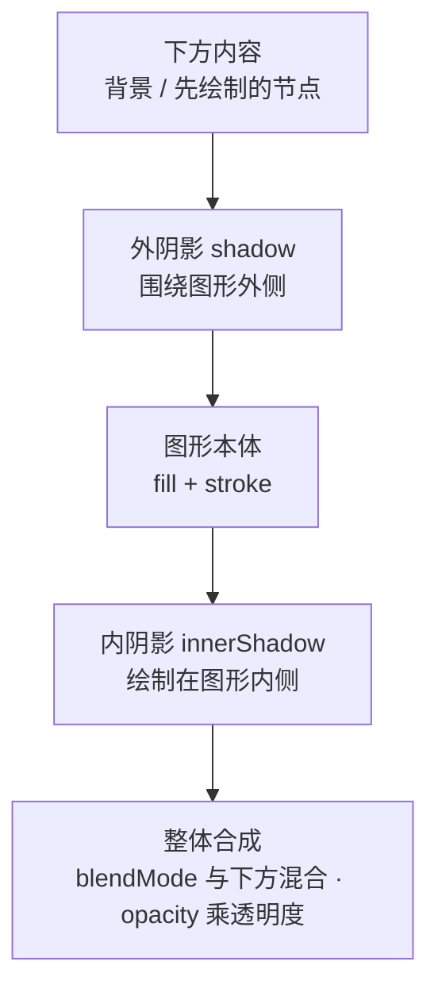

import { Canvas, Controls, Meta } from '@storybook/addon-docs/blocks';
import * as ShadowAndBlend from './shadow-and-blend.stories';

<Meta of={ShadowAndBlend} name="Docs" />

# 视觉效果

LeaferJS 的视觉效果是一组挂在 `UI` 基类上的样式属性：**外阴影 `shadow`、内阴影 `innerShadow`、混合模式 `blendMode`、透明度 `opacity`**。它们不改变图形的形状和尺寸，只在已有的填充与描边之上叠加光学效果。`new` 构造时传入、或运行时 `node.set({ ... })` 修改，引擎随即重绘。

四个属性按固定顺序叠加，理解这个顺序就能预测结果：**外阴影画在图形外侧 → 图形本体（fill/stroke）→ 内阴影画在图形内侧 → 整个元素再按 `blendMode` 与下方内容合成、按 `opacity` 收紧透明度**。下面的实例把四个属性集中到同一个圆角矩形上，背景特意放了一黄一青两个椭圆，让混合与透明有可对比的下方内容。



| 关键输入 | 默认 | 含义与回查要点 |
| --- | --- | --- |
| `shadow` | 无 | 外阴影。`ShadowEffect` 对象或数组（多层叠加）；不设则无外阴影。 |
| `innerShadow` | 无 | 内阴影。与 `shadow` 共用 `ShadowEffect`，只是绘制在图形内侧。 |
| `blendMode` | `'pass-through'` | 元素与下方内容的合成方式。`pass-through` 穿透、性能最好；非穿透模式会单独开层合成。 |
| `opacity` | `1` | 元素整体透明度 `0~1`；作用于整个元素，包含其阴影。 |
| `ShadowEffect.x` / `y` | — | 阴影偏移，正负方向同坐标轴。 |
| `ShadowEffect.blur` | — | 模糊半径；`0` 为硬边。 |
| `ShadowEffect.spread` | `0` | 阴影向外/向内的扩展量。 |
| `ShadowEffect.color` | — | 阴影颜色；必须显式给出，否则看不到阴影。 |
| `ShadowEffect.box` | `false` | `true` 时按 CSS3 `box-shadow` 风格，只显示图形外部的阴影。 |
| `ShadowEffect.blendMode` | `'pass-through'` | 阴影自身的「子混合模式」，让阴影单独与下方内容混合。 |

## 阴影

外阴影用 `shadow` 属性，传入一个 `ShadowEffect` 对象。它有四个核心字段：偏移 `x`/`y`、模糊 `blur`、颜色 `color`，另外可选 `spread`（扩展）、`box`（CSS box-shadow 风格）、`blendMode`（子混合）。`shadow` 是 `UI` 基类属性，`Rect`、`Text`、`Image` 等所有元素都继承。

```ts
import { Leafer, Rect } from 'leafer-ui'

const leafer = new Leafer({ view: window })

new Rect({
  width: 100, height: 100, cornerRadius: 30,
  fill: 'rgba(50,205,121,0.7)',
  shadow: { x: 10, y: -10, blur: 20, color: '#FF0000AA' },
})

// box: true → 只显示图形外部的阴影（CSS3 boxShadow 风格）
new Rect({
  width: 100, height: 100, cornerRadius: 30,
  fill: 'rgba(50,205,121,0.7)',
  shadow: { x: 10, y: -10, blur: 20, color: '#FF0000AA', box: true },
})
```

传数组可叠加多层阴影，数组顺序即绘制顺序：

```ts
shadow: [
  { x: 10, y: 10, blur: 20, color: '#FF0000AA' },
  { x: -5, y: -5, blur: 10, color: '#0000FFAA' },
]
```

下面的实例同时承载阴影、内阴影、混合与透明四类输入。先调整「阴影 X / Y / 模糊」，观察外阴影如何围绕图形外侧移动、变柔；再切换「混合模式」与「透明度」，验证它们作用在「整个元素」上。

<Canvas of={ShadowAndBlend.Interactive} />
<Controls of={ShadowAndBlend.Interactive} />

| 读者操作 | 可观察证据 |
| --- | --- |
| 调整「阴影 X」「阴影 Y」 | 外阴影随偏移移动；读数「外阴影」的 `x`/`y` 同步 |
| 调整「阴影模糊」 | 外阴影从硬边变柔和；读数「外阴影」的 `blur` 同步 |
| 切换「内阴影」 | 图形内侧出现暗边；读数「内阴影」在「无 / 柔和 / 强烈」间切换 |
| 切换「混合模式」到 `multiply` / `screen` | 前景与黄+青背景相混：`multiply` 变暗、`screen` 变亮 |
| 调整「透明度」 | 整个前景（含外阴影与内阴影）变透明、背景透出 |
| 打开 Show code | 看到该 Canvas 实际执行的 `example.ts`，四类属性都 `set` 到同一节点 |

阴影看不见时先查三件事：`color` 是否显式给出（不设颜色就看不到）、`blur` 与偏移是否都为 `0`、被合成顺序是否被 `opacity` 收得太淡。

### 内阴影

`innerShadow` 与 `shadow` 共用同一个 `ShadowEffect` 接口，字段完全相同，区别只在绘制位置——外阴影在图形外侧，**内阴影在图形内侧**，因此常用来做凹槽、立体边缘。`box` 字段对内阴影无意义，可忽略。

```ts
import { Leafer, Rect } from 'leafer-ui'

const leafer = new Leafer({ view: window })

new Rect({
  width: 100, height: 100, cornerRadius: 30,
  fill: 'rgb(50,205,121)',
  innerShadow: { x: 10, y: 5, blur: 20, color: '#FF0000AA' },
})
```

在上面的实例里把「内阴影」从「无」切到「柔和 / 强烈」，即可看到圆角矩形内侧浮现一圈暗边，读数「内阴影」同步变化。内阴影同样支持数组叠加多层。

## 混合模式

`blendMode` 决定**整个元素如何与下方内容合成**，语义对应 Canvas 的 `globalCompositeOperation` / CSS 的 `mix-blend-mode`。默认 `'pass-through'`（穿透）只把元素直接绘上去、性能最好；其余模式才会真正做像素混合。要看到混合效果，元素下方必须有可混合的内容（实例里的一黄一青椭圆就是这个用途）。

```ts
import { Leafer, Rect } from 'leafer-ui'

const leafer = new Leafer({ view: window })

new Rect({
  width: 100, height: 100,
  fill: '#e0218a',
  blendMode: 'multiply', // 与下方内容相乘 → 变暗
})
```

常用模式按效果分组：

| 分组 | 模式 | 效果 |
| --- | --- | --- |
| 默认 | `pass-through` | 穿透，直接绘制，性能最好（默认值） |
| 常规 | `normal` | 正常，元素单独绘制在一个层上，大量使用会有性能问题 |
| 变暗 | `multiply` / `darken` / `color-burn` | 减色，整体变暗 |
| 变亮 | `screen` / `lighten` / `color-dodge` | 加色，整体变亮 |
| 对比 | `overlay` / `hard-light` / `soft-light` | 加深亮暗对比 |
| 反差 | `difference` / `exclusion` | 颜色相减，产生反相 |
| 色彩分量 | `hue` / `saturation` / `color` / `luminosity` | 只混合色相 / 饱和度 / 颜色 / 明度 |

除了元素级的 `blendMode`，填充、描边和每个阴影都能自带 `blendMode` 作为「子混合模式」，单独与当前元素层的内容混合；之后再由元素级 `blendMode` 把整个元素与下方合成。在上面的实例里把「混合模式」从 `pass-through` 切到 `multiply`、`screen`、`overlay`，前景会相对黄/青背景明显变暗、变亮、加深对比，读数「混合模式」同步。

边界：任何非 `pass-through` 模式都会让元素单独开层合成，**大量元素同时使用会有性能成本**，日常默认 `pass-through` 即可。

## 透明度

`opacity` 是元素的整体透明度，范围 `0~1`，默认 `1`（完全不透明）。它作用于**整个元素**——填充、描边、外阴影、内阴影一起变透明，而不是只影响填充本身。

```ts
import { Leafer, Rect } from 'leafer-ui'

const leafer = new Leafer({ view: window })

new Rect({ width: 100, height: 100, fill: '#e0218a', opacity: 0.5 })
```

在上面的实例里把「透明度」从 `1` 拉到 `0.5`，整个圆角矩形连同它的阴影会一起半透、背景透出。`opacity` 与 `blendMode` 独立但会叠加：元素先按 `blendMode` 合成，再按 `opacity` 收紧透明度。注意 `opacity` 与填充颜色里的 `rgba` alpha 不是一回事——后者只影响填充本身，`opacity` 影响整个元素（含阴影）。

## 最佳实践

- **想看到混合，先保证「下方有内容 + 模式选对」。** `pass-through` / `normal` 对不透明元素不产生颜色混合，要看效果需选 `multiply` / `screen` / `overlay` 等，且元素下方要先绘制了非空内容；前景用较饱和的纯色，混合对比才明显。
- **整体变透明优先用 `opacity`，而不是给每个填充写 `rgba`。** `opacity` 一次性作用于整个元素（含阴影、描边），避免各部分透明度不一致。
- **大量元素慎用 `normal` 及非穿透模式。** 每个都会单独开层合成，性能成本明显高于默认的 `pass-through`；只在确需混合时切换。
- **多层阴影用数组按需叠加。** 数组顺序即绘制顺序，按「先大后小、先淡后浓」排列更有层次；阴影自带 `blendMode` 可做更细腻的子混合。

## 常见问题

- **切换 `blendMode` 看不到任何变化？**
  下方要有可混合的内容（先绘制的节点）；且 `pass-through` / `normal` 对单个不透明元素视觉相同，要看到混合需选 `multiply` / `screen` 等模式。前景若用了半透明填充，对比也会被削弱。
- **设了 `shadow` 却什么都看不到？**
  `ShadowEffect.color` 必须显式给出，否则没有可见阴影；同时确认 `blur` 和 `x`/`y` 偏移不都为 `0`、元素未被 `opacity` 收得太淡。
- **`normal` 和 `pass-through` 看起来一样？**
  对单个不透明元素两者视觉相同。差别在 `normal` 会把元素单独绘制到一个层上再合成，大量使用会有性能问题；日常保持默认 `pass-through` 即可。
- **`opacity` 和填充颜色的 `rgba` 透明度有什么区别？**
  `opacity` 作用于整个元素（填充、描边、外阴影、内阴影一起变透明）；`rgba` 的 alpha 只影响那一个填充本身，不影响阴影与描边。

## 总结回顾

摘要：

LeaferJS 的视觉效果是 `UI` 基类上的四类样式属性。`shadow` 与 `innerShadow` 共用 `ShadowEffect`（`x`/`y`/`blur`/`color`，可选 `spread`/`box`/`blendMode`），前者画在图形外侧、后者画在内侧，都支持数组叠加多层。`blendMode` 决定整个元素如何与下方内容合成，默认 `pass-through` 最快、非穿透模式才会真正混合但需单独开层。`opacity` 是整体透明度，作用于整个元素包含阴影。四者按「外阴影 → 本体 → 内阴影 → 整体合成（`blendMode` × `opacity`）」的固定顺序叠加，此外填充、描边和每个阴影还能各自带 `blendMode` 做子混合。

一句话：

> `shadow` 在外、`innerShadow` 在内，`blendMode` 管与下方怎么混、`opacity` 管整体多透——四者按固定顺序叠加到一个元素上。

知识要点：

- `shadow` / `innerShadow` / `blendMode` / `opacity` 各自的默认值是什么？
- 四个效果的叠加顺序是怎样的？`blendMode` 与 `opacity` 作用在哪一步？
- `ShadowEffect` 有哪些字段？`box` 和阴影自身的 `blendMode` 各做什么？
- 为什么切换 `blendMode` 可能看不到变化？需要满足什么前提？
- `opacity` 与填充颜色的 `rgba` 透明度有什么区别？
- `normal` 与 `pass-through` 视觉相同，差别在哪里？

## 参考资料

- [shadow | Leafer UI 官方文档](https://www.leaferjs.com/ui/guide/property/shadow.html)
- [innerShadow | Leafer UI 官方文档](https://www.leaferjs.com/ui/guide/property/innerShadow.html)
- [blendMode | Leafer UI 官方文档](https://www.leaferjs.com/ui/guide/property/blendMode.html)
- [shadow 参考属性 | Leafer UI 官方文档](https://www.leaferjs.com/ui/reference/property/shadow.html)
