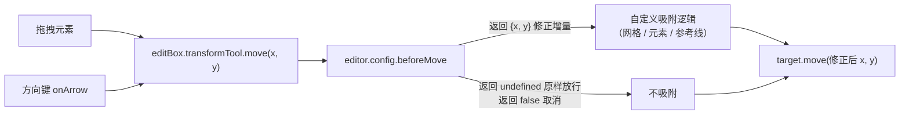

import { Canvas, Controls, Meta } from '@storybook/addon-docs/blocks';
import * as SnapAlignRuler from './snap-align-ruler.stories';

<Meta of={SnapAlignRuler} name="Docs" />

# 吸附、对齐与标尺

「吸附」让元素在移动时自动靠齐到网格或其他元素；「对齐线」在移动时显示参考对齐线；「标尺 / 参考线」在画布边缘给出刻度并允许放置可吸附的辅助线。三者共同服务「精确编辑」——不靠肉眼对齐，而是让引擎约束落点。

需要先建立一个关键事实，否则会找不到 API：**在 LeaferJS 2.2.9 中，`@leafer-in/editor` 没有内置元素吸附、对齐线与标尺这三个开箱功能。** 编辑器只提供一套「变换拦截钩子」和几个步进参数，吸附逻辑要由你在钩子里写；完整的对齐线、标尺与参考线由社区 / 官方插件提供（见 [对齐线、标尺与参考线](#对齐线标尺与参考线插件生态)）。因此本课分两层：先讲怎么用内置钩子做出网格吸附（可运行实例），再指明完整功能的插件来源。

内置精确编辑能力的配合关系，一句话概括：**`beforeMove` 钩子拦截每一次移动（拖拽和方向键都走这条路），你返回修正后的增量完成吸附；`arrowStep` / `rotateGap` 则是键盘步进与旋转磁吸的两个现成档位。**



| 关键输入 / 配置 | 默认与行为 | 回查要点 |
| --- | --- | --- |
| `editor.config.beforeMove` | `undefined`（不拦截） | 函数 `(data) => IPointData \| false \| void`；`data.x/y` 是本次移动**增量** |
| `editor.config.beforeScale` | `undefined` | 返回 `IScaleData` 修正缩放、`false` 取消；拖角点与滚轮缩放都经过它 |
| `editor.config.beforeRotate` | `undefined` | 返回 `number` 修正角度、`false` 取消 |
| `editor.config.arrowStep` | `1` | 方向键每按一次移动的像素数 |
| `editor.config.arrowFastStep` | `10` | 按住 Shift 时方向键的步长 |
| `editor.config.rotateGap` | `45` | 旋转磁吸间隔（度），接近倍数时吸附；`0` 关闭 |
| `editor.config.ignorePixelSnap` | `undefined` | 渲染像素吸附（让描边更清晰），与「元素位置吸附」无关 |

## 移动拦截：网格吸附的内置做法

`@leafer-in/editor` 在每次移动元素时调用 `editBox.transformTool.move(x, y)`，而它做的第一件事就是读 `mergeConfig.beforeMove`：如果存在，先把「本次移动增量 `{ x, y }`」交给你，你可以返回一个修正后的增量、返回 `false` 取消本次移动、或返回 `undefined` 原样放行。这正是网格吸附的挂载点——把落点四舍五入到最近网格点，再换算回增量返回即可。

关键细节：`x, y` 是**增量**（本次拖动 / 按键要叠加的偏移），不是绝对坐标。所以「吸附到网格」要算「当前位置 + 增量」的预测落点，吸附后再减回当前坐标得到修正增量。

```ts
import { App, Rect } from 'leafer-ui';
import '@leafer-in/editor';

const app = new App({ view: canvas, editor: {} });
const editor = app.editor;

app.tree.add(new Rect({ editable: true, x: 53, y: 28, width: 120, height: 90, fill: '#4f7cff' }));

const GRID = 20;
// beforeMove 拦截每一次移动：拖拽、方向键微调都经过这里。
editor.config.beforeMove = ({ target, x, y }) => {
  const snapX = Math.round((target.x + x) / GRID) * GRID;
  const snapY = Math.round((target.y + y) / GRID) * GRID;
  return { x: snapX - target.x, y: snapY - target.y }; // 返回修正增量完成吸附
};
```

下面的实例把网格吸附做成可开关：场景里有网格背景和两个 `editable` 元素，编辑器默认选中矩形。用「吸附」开关切换 `editor.config.beforeMove` 是否生效，用「网格大小」调整吸附间隔与背景网格疏密，直接拖元素或用方向键移动，左下角读出当前位置与吸附到的网格点。

<Canvas of={SnapAlignRuler.Interactive} />
<Controls of={SnapAlignRuler.Interactive} />

| 读者操作 | 可观察证据 |
| --- | --- |
| 拖动矩形 / 椭圆 | 元素在网格点上「跳跃」吸附，「选中位置」与「吸附目标」同步变化 |
| 按方向键微调（画布需先聚焦） | 元素每次按 `gridSize` 吸附一格，证明方向键同样经过 `beforeMove` |
| 切「吸附」为「否」 | 元素自由跟随光标，「吸附目标」变「自由」 |
| 调「网格大小」10 → 60 | 背景网格变密 / 变疏，吸附间隔同步变化 |
| 切「显示网格」为「隐藏」 | 网格线消失，但拖动仍按 `gridSize` 吸附（吸附与显示互相独立） |
| 直接点击画布中的元素 | 也能切到该元素的单选（元素标了 `editable: true`），读数跟随更新 |
| 打开 Show code | 看到该 Canvas 实际执行的 `example.ts` |

实例里网格背景是一个 `Path`（SVG 路径串成的网格线），设了 `hittable: false`：它不参与命中检测，因此既不会被编辑器选中，也不会挡住下层 / 同层元素的点击与框选。网格只是视觉参考，「吸附是否生效」完全取决于 `beforeMove`，与「是否显示网格」无关——这正是「显示网格=隐藏」后吸附仍工作的原因。

### beforeMove / beforeScale / beforeRotate

移动、缩放、旋转各自有一个 `before` 钩子，签名同源、返回值语义一致，构成一组「变换拦截」家族。它们都从 `editor.config`（经 `mergeConfig`）实时读取，运行时直接赋值即可，无需重新建编辑器。

```ts
editor.config.beforeMove = ({ target, x, y }) => ({ x, y });      // 返回 IPointData 修正增量
editor.config.beforeScale = ({ target, origin, scaleX, scaleY }) => false; // 返回 false 取消缩放
editor.config.beforeRotate = ({ target, origin, rotation }) => 45;         // 返回 number 修正角度
```

- **`beforeMove`**：参数 `{ target, x, y }`（`x/y` 为移动增量）。返回 `{ x, y }` 覆盖增量、`false` 取消本次移动、`void` 原样放行。拖拽与方向键（`onArrow` → `transformTool.move`）都经过它，因此一处即可同时吸附鼠标与键盘。
- **`beforeScale`**：参数 `{ target, origin, scaleX, scaleY, drag? }`。返回 `IScaleData`（`{ scaleX, scaleY }`）修正缩放、`false` 取消。拖角点缩放与滚轮缩放（`resizeable: 'zoom'`）都经过它；想做「缩放也吸附到整数倍」就挂这里。
- **`beforeRotate`**：参数 `{ target, origin, rotation }`。返回 `number` 修正角度、`false` 取消。若 `rotateGap` 的 45° 档位不够用、想要自定义角度吸附（如吸附到 30° 倍数），用这个钩子。

三个钩子的返回值语义不同（增量 / 缩放比 / 角度），但「拦截→修正/取消」的模式一致，按需挂其中一个或多个即可。

## 步进移动与角度对齐

除了自己写 `beforeMove`，编辑器还有两个开箱即用的「档位式」对齐，直接改 config 就生效：

- **方向键步进 `arrowStep` / `arrowFastStep`**（默认 `1` / `10`）：选中元素后按方向键，每按一次移动 `arrowStep` 像素；按住 Shift 走 `arrowFastStep`。把 `arrowStep` 设成网格大小（如 `20`），键盘微调就天然落在网格上，不必再写 `beforeMove`。
- **旋转磁吸 `rotateGap`**（默认 `45`）：旋转接近间隔倍数（±1° 内）时吸附过去，其余角度自由。设 `0` 关闭。手柄、`circle` 旋转点与 `beforeRotate` 都在同一旋转路径上，`rotateGap` 是其中最省事的档位。

旋转手柄、`circle` 旋转点与 `rotateGap` 的完整用法见 [8.1.2 选中与变换手柄](?path=/docs/select-transform--docs)，这里只把它们作为「精确编辑」的对位成员点名。

## 对齐线、标尺与参考线：插件生态

如果你需要的是设计软件里那种「拖动时出现与其他元素对齐的虚线」「画布边缘的标尺刻度」「可放置的参考辅助线」——这些在 2.2.9 的 `@leafer-in/editor` 里都没有内置，由插件提供。它们的共同接入方式是把插件 import 进项目、注册到编辑器，随后吸附 / 对齐逻辑由插件接管（仍作用在同一个 `editor` 上）。下表按功能列出常用来源（均为 2.2.x 时期社区 / 官方生态，未随 `@leafer-in/*` 内置，需自行安装）：

| 想要的能力 | 插件来源（2.2.x 生态） | 说明 |
| --- | --- | --- |
| 元素间吸附 / 对齐线 | `leafer-x-snap`、`leafer-x-easy-snap`、`leafer-x-guide-line` | 拖动时显示与其他元素边 / 中心对齐的参考线并吸附；部分为付费 |
| 标尺与参考线 | PxGrow 官方 [Ruler 插件](https://www.pxgrow.com/plugin/view/?id=10025)、社区 `leafer-x-ruler` | 画布边缘刻度 + 可拖出 / 吸附的辅助参考线 |

选用原则：只需「靠齐网格 / 整数坐标」，用本课的 `beforeMove` 内置做法即可，零依赖；需要「靠齐其他元素」「画布标尺」「参考线」时再装对应插件，并以其文档为准（插件 API 不属于 `@leafer-in/editor`，本课不展开）。

## 最佳实践

- **网格吸附优先用 `beforeMove`，零依赖。** 把落点 `Math.round((target.x + x) / GRID) * GRID` 即可吸附，`hittable: false` 的背景网格只做视觉参考、不参与命中。
- **键盘微调想落网格，设 `arrowStep` 为网格大小。** 比写 `beforeMove` 更省事，且方向键与拖拽的吸附行为一致。
- **吸附与显示分离。** 别把「是否画网格」和「是否吸附」耦合在一个开关上——`beforeMove` 只认 `gridSize`，网格显隐只影响可读性。
- **`beforeMove` 里只做增量修正，不要直接改 `target.x/y`。** 钩子返回修正后的 `{ x, y }`，引擎自己会 `target.move`；直接改坐标会与编辑框的拖拽状态错位。

## 常见问题

- 设了 `editor.config.beforeMove` 但拖动不吸附
  钩子要从 `editor.config`（经 `mergeConfig`）读取，直接赋值 `editor.config.beforeMove = fn` 即可，运行时实时生效，无需重建编辑器或调 `updateEditBox()`。若仍无效，多半是返回值不对——它要返回 `{ x, y }` 表示**修正后的增量**，不是绝对坐标，也不是 `true`。
- 关闭吸附后元素还一跳一跳
  `beforeMove` 的返回值分支漏了「关闭」路径。关闭时应 `return`（`undefined`，原样放行），而不是 `return { x: 0, y: 0 }`（会把元素锁死在原处）。
- 网格背景挡住了下方元素的点击
  网格元素没设 `hittable: false`。一个铺满画布的 `Path` / `Rect` 默认参与命中，会把点击全接走；加 `hittable: false` 让它只渲染、不参与拾取。
- 想要「拖动时显示与其他元素对齐的虚线」找不到 API
  这是元素对齐线，2.2.9 非内置，需要 `leafer-x-snap` / `leafer-x-easy-snap` / `leafer-x-guide-line` 等插件；标尺与参考线同理走 `Ruler` 插件或 `leafer-x-ruler`。详见 [对齐线、标尺与参考线](#对齐线标尺与参考线插件生态)。

## 总结回顾

摘要：

LeaferJS 2.2.9 的 `@leafer-in/editor` 不内置元素吸附、对齐线与标尺，精确编辑的内置基础是「变换拦截钩子」与「步进 / 磁吸档位」。`editor.config.beforeMove` 拦截每一次移动（拖拽与方向键同路径），把落点吸附到自定义网格是最常见的零依赖做法，返回修正增量 `{ x, y }` 完成、`undefined` 放行、`false` 取消；`beforeScale` / `beforeRotate` 按同一模式覆盖缩放与旋转。开箱档位有方向键步进 `arrowStep` / `arrowFastStep`（默认 1 / 10）和旋转磁吸 `rotateGap`（默认 45）。完整的元素对齐线、标尺与参考线由插件生态提供（`leafer-x-snap`、`leafer-x-guide-line`、PxGrow Ruler、`leafer-x-ruler`），接入后仍作用在同一个 `editor` 上。背景网格只做视觉参考，需设 `hittable: false` 才不挡命中，且与吸附是否生效互相独立。

一句话：

> 2.2.9 的吸附 = `editor.config.beforeMove` 里把移动增量修正到网格，对齐线 / 标尺 / 参考线则要装插件。

知识要点：

- 2.2.9 的 `@leafer-in/editor` 是否内置元素吸附、对齐线与标尺？内置的精确编辑基础是什么？
- `beforeMove` 收到的 `x, y` 是绝对坐标还是增量？如何用它实现网格吸附？
- 拖拽和方向键微调是否都经过 `beforeMove`？返回 `{x,y}` / `false` / `undefined` 各是什么语义？
- `beforeScale` 与 `beforeRotate` 各返回什么类型的修正值？
- `arrowStep`、`arrowFastStep`、`rotateGap` 的默认值各是多少？
- 背景网格为什么必须设 `hittable: false`？隐藏网格后吸附是否仍生效？
- 想要「与其他元素对齐的虚线」「画布标尺」「参考线」分别该走哪条路？

## 参考资料

- [Leafer UI 官方文档 · 编辑器](https://www.leaferjs.com/ui/plugin/in/editor/)
- [Leafer UI 官方文档（指南总入口）](https://www.leaferjs.com/ui/guide/)
- [LeaferJS 版本更新日志（确认吸附 / 标尺为插件生态）](https://www.leaferjs.com/ui/update/)
- [@leafer-in/editor 源码（TransformTool.ts / config.ts）](https://github.com/leaferjs/leafer)
- [8.1.2 选中与变换手柄（rotateGap / circle 手柄）](?path=/docs/select-transform--docs)
- [8.1.1 启用编辑器（editor 配置与 editable）](?path=/docs/editor-basics--docs)
