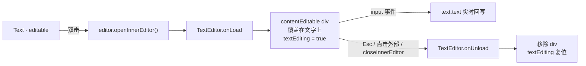

import { Canvas, Controls, Meta } from '@storybook/addon-docs/blocks';
import * as TextEditor from './text-editor.stories';

<Meta of={TextEditor} name="Docs" />

# 文字编辑器

选中一个 `Text` 后双击它，LeaferJS 会让这个文字直接进入「就地编辑」：画布上覆盖一个真实的浏览器输入框，你打字、移动光标、选择文字，内容实时回写到 `Text.text`。这个能力来自 `@leafer-in/text-editor` 提供的 **`TextEditor` 内部编辑器**，它和选中框一样，是图形编辑器（[8.1.1 启用编辑器](?path=/docs/editor-basics--docs)）的内置组成部分，而不是一个独立画布。

理解文字编辑只需抓住三件事：

- **`TextEditor` 是一种 InnerEditor（内部编辑器）**。编辑器（`@leafer-in/editor`）负责「选中 + 变换」，内部编辑器负责「选中之后钻进去改内容」。`TextEditor` 专门处理 `Text`，由 `@leafer-in/text-editor` 注册。
- **触发是「先选中、再双击」**。编辑器默认配置 `openInner: 'double'`，在选中元素的编辑框上监听双击，命中后调用 `editor.openInnerEditor()` 加载 `TextEditor`。
- **编辑期间用一个 contentEditable 的 `<div>` 覆盖文字**，`Text` 自身暂停绘制（`textEditing = true`）；输入框的 `input` 事件把内容写回 `Text.text`，关闭时复位标志、移除 `<div>`。



| 关键输入 / 方法 | 默认与行为 | 回查要点 |
| --- | --- | --- |
| `import '@leafer-in/editor'` | 把 `Text.editInner` 默认设为 `'TextEditor'`，并注册编辑器 | 漏掉这行，`Text.editInner` 为 `'PathEditor'`，双击文字不会进入文字编辑 |
| `import { TextEditor } from '@leafer-in/text-editor'` | 注册 `TextEditor` 类（tag = `'TextEditor'`），执行 `Plugin.add('text-editor','editor')` | 漏掉这行，编辑器找不到 `'TextEditor'` 内部编辑器，双击无反应 |
| `editable`（Text 属性） | 未设置（falsy） | 双击前要先选中；选中又要求 `editable: true`，见 [启用编辑器](?path=/docs/editor-basics--docs) |
| `editor.config.openInner` | `'double'`（双击进入） | 可设 `'long'` 改为长按进入；设为假值则不自动进入 |
| `TextEditor.config.selectAll` | `true`（进入编辑时全选文字） | 设 `false` 则把光标放到文字末尾；进入编辑前设置才生效 |
| `editor.openInnerEditor(target?, nameOrSelect?, select?)` | 打开内部编辑器 | 编程式进入；自然双击内部就是调它 |
| `editor.closeInnerEditor(onlyInnerEditor?)` | 关闭内部编辑器 | `Esc`、点击输入框外部、编程关闭最终都走它 |
| `editor.innerEditing` / `editor.innerEditor` | `innerEditing` 是是否在内联编辑的布尔值；`innerEditor` 是当前 InnerEditor 实例（`.tag` / `.editTarget`） | 读这两个值判断编辑状态；`innerEditor?.tag === 'TextEditor'` |

## 启用文字编辑器

文字编辑建立在编辑器之上，因此要先启用编辑器，再额外引入 `@leafer-in/text-editor`。两行 import 缺一不可，各自承担不同的注册职责：

```ts
import { App, Text } from 'leafer-ui';
import { Editor } from '@leafer-in/editor';        // 注册编辑器；并把 Text.editInner 默认设为 'TextEditor'
import { TextEditor } from '@leafer-in/text-editor'; // 注册 TextEditor 类（副作用导入触发注册）

const app = new App({ view: canvas, editor: {} });

const title = new Text({
  editable: true,          // 能被选中 / 双击的前提
  text: '双击我编辑',
  fontSize: 44,
  fill: '#1e293b',
});
app.tree.add(title);
```

`Text.editInner` 的默认值 `'TextEditor'` 是在引入 `@leafer-in/editor` 时由 `Text.addAttr('editInner', 'TextEditor')` 设上的——它告诉编辑器「`Text` 这个元素的内联编辑用哪个内部编辑器」。`@leafer-in/text-editor` 则把 `TextEditor` 这个类以 `tag = 'TextEditor'` 注册进 `EditToolCreator.list`。两者通过这个名字匹配，所以两个 import 任何一个缺失，双击文字都不会进入文字编辑。

> Text 的创建、字体、换行等基础属性是独立主题，见 [5.1 文本](?path=/docs/text--docs)。本课只讲「编辑文字」这一层。

## 进入与结束内联编辑

文字编辑有自然交互和编程接口两条入口，结束方式则更多。

**进入编辑**——默认走双击：先用编辑器选中 `Text`（点击它），再双击它的编辑框。这会触发编辑器的 `openInner: 'double'` 分支，内部调用 `editor.openInnerEditor()`，加载 `TextEditor`。也可以完全用代码进入：

```ts
const editor = app.editor as unknown as Editor;

// 方式 A：与双击流程一致——先选中，再 openInnerEditor()，编辑框以选中元素为目标。
editor.select(title);
editor.openInnerEditor();

// 方式 B：openInnerEditor 直接指定目标（第二参数 true 表示同时把它设为选中目标）。
editor.openInnerEditor(title, true);
```

**结束编辑**——任一条件触发都会关闭：在输入框外点击（`TextEditor` 在 `app` 的 `PointerEvent.DOWN` 上监听，命中不在输入框就关闭）、按 `Esc`（`onKeydown` 里 `editor.closeInnerEditor()`）、或代码调用：

```ts
editor.closeInnerEditor();
```

下面的实例把进入 / 结束合在一起。场景里有一个可编辑的 `Text`（「双击进入编辑」），用「编辑状态」控件可以编程式进入或结束；也可以直接双击画布中的文字。「全选模式」对应 `TextEditor.config.selectAll`，进入编辑前切换它，观察打开时是全选文字还是把光标放到末尾。

<Canvas of={TextEditor.Interactive} />
<Controls of={TextEditor.Interactive} />

| 读者操作 | 可观察证据 |
| --- | --- |
| 「编辑状态」选「进入编辑」 | 文字上出现覆盖的输入框，读数「内联编辑」变「进行中」、「内部编辑器」变 `TextEditor`、「textEditing 标志」变 `true` |
| 直接双击画布中的文字 | 同样进入编辑，读数跟随 `InnerEditorEvent.OPEN` 更新 |
| 在输入框里打字 | 文字内容实时变化，读数「文字内容」同步（`onInput` 回写 `text.text`） |
| 按 `Esc` 或点击文字以外区域 | 输入框消失，读数「内联编辑」变「空闲」、「textEditing 标志」变 `false`，最终文字保留 |
| 「编辑状态」选「结束编辑」 | 等价于 `Esc` / 点击外部，调用 `editor.closeInnerEditor()` |
| 切换「全选模式」后重新进入编辑 | `true` 打开时全选文字；`false` 把光标放到文字末尾 |

### 双击进入的判定

双击进入不是 `Text` 自身的双击事件，而是编辑器的**选中框（EditBox）**上的 `PointerEvent.DOUBLE_TAP`。这意味着两个前置条件：元素已被选中（有了选中框），且选中框监听到了双击。所以「双击一个未选中的文字」通常的体感是：第一次点击选中它，第二次连续点击才算双击进入。把 `editor.config.openInner` 设为 `'long'` 可以改为长按进入；设为假值则关闭自动进入，只能用 `openInnerEditor()` 编程打开。

## 编辑过程中的行为

`TextEditor.onLoad` 在进入编辑时做四件事：把 `text.textEditing` 设为 `true`、创建一个 `contentEditable` 的 `<div>`（class 为 `leafer-text-editor`）、按 `selectAll` 决定初始选区、并临时关闭编辑器的 `keyEvent`（让方向键用来移动光标而不是移动元素）。`onUnload` 在结束时做相反的事：写回内容、清掉 `textEditing`、恢复 `keyEvent`、移除 `<div>`。

- **输入实时回写**：输入框的 `input` 事件把 `editDom.innerText` 直接赋给 `editTarget.text`。所以你每打一个字，`Text.text` 就更新一次，不需要「确定」。
- **换行用 `Enter`、结束用 `Esc`**：`onKeydown` 拦截 `Enter`，手动插入 `<br/>`（并修了 contentEditable 末尾需要两次换行的浏览器问题）；`Esc` 关闭编辑。注意这里 `Enter` 是换行而非结束编辑。
- **粘贴为纯文本**：`onPaste` 调 `preventDefault()` 后只取 `text/plain`，按行拆成文本节点与 `<br/>` 插入，避免把网页富文本带进文字。
- **文字暂停绘制**：`textEditing` 为 `true` 时，`Text` 的绘制流程会跳过自身（导出时除外），由输入框「扮演」这段文字；关闭后 `Text` 恢复正常绘制，因此编辑前后的视觉是连续的。
- **输入框跟随文字世界变换**：`onUpdate` 读取 `text.worldTransform`，按 `textScale`（保证最小可读字号，小于 12 会放大）算出 `matrix(...)` 变换，把 `<div>` 精确对齐到画布上的文字位置和字号，缩放 / 旋转画布后依然贴合。

> `HTMLText`（富文本）也由同一个 `TextEditor` 处理：`onLoad` 里 `isHTMLText = !(text instanceof Text)`，读写出用 `innerHTML` 而非 `innerText`，其余流程相同。

## 读取编辑状态与事件

判断「现在是否在编辑文字」读 `editor.innerEditing`（布尔）和 `editor.innerEditor`（当前 InnerEditor 实例，`innerEditor?.tag === 'TextEditor'` 即可确认是文字编辑）。被编辑的文字在 `editor.innerEditor.editTarget` 上，也可以看 `text.textEditing` 标志。

编辑器在打开 / 关闭时派发 `InnerEditorEvent`，事件同时冒泡到编辑器和被编辑的元素：

```ts
import { InnerEditorEvent } from '@leafer-in/editor';

editor.on(InnerEditorEvent.OPEN, (e) => {
  // e.editTarget 是被编辑的 Text，e.innerEditor 是 TextEditor 实例
  console.log('进入编辑', e.editTarget.text);
});
editor.on(InnerEditorEvent.CLOSE, (e) => {
  console.log('结束编辑，最终文字：', e.editTarget.text);
});
```

四个事件常量：`InnerEditorEvent.BEFORE_OPEN` / `OPEN` / `BEFORE_CLOSE` / `CLOSE`。本课实例就监听了 `OPEN` / `CLOSE` 来让 readout 跟随双击和 `Esc` 这类用户主动操作。

## 自定义与边界

- **拦截或改道进入编辑**：给编辑器配 `beforeEditInner` 回调，它收到 `{ target, name }`，返回 `false` 阻止进入、返回字符串则改用别的内部编辑器。
- **换一个内部编辑器**：在元素上 `title.setEditInner('MyEditor')`（等价于 `title.editInner = 'MyEditor'`），前提是该编辑器已用 `@registerInnerEditor()` 注册、且类被引入。自定义内部编辑器与编辑工具的扩展是独立主题，见 [8.3.2 内部编辑器与编辑工具](?path=/docs/inner-editor--docs)。
- **`view` 为 `<canvas>` 时输入框挂到 `document.body`**：源码里 `inBody = view instanceof HTMLCanvasElement`。当 `App` 的 `view` 传的是 canvas 元素（本课实例就是），`TextEditor` 无法把 `<div>` 加进 view，只能用 `position: fixed` 挂到 `document.body`，再用 `app.clientBounds` 对齐；`view` 为普通容器时则直接加进容器。两种情况定位都对，但如果你在自定义布局里重排了父容器，要留意这个 `fixed` 定位是相对视口的。
- **编辑会临时接管键盘**：进入编辑时 `app.config.keyEvent` 被设为 `false`，方向键不再移动选中元素；结束时恢复原值。如果你依赖 `keyEvent` 做其它快捷键，需知道它在文字编辑期间是短暂关闭的。

## 常见问题

- 双击文字没有反应，进不了编辑
  先确认两行 import 都在：`@leafer-in/editor`（把 `Text.editInner` 默认设为 `'TextEditor'`）和 `@leafer-in/text-editor`（注册 `TextEditor` 类），缺任何一个都打不开。再确认 `App` 传了 `editor: {}` 启用编辑器、`Text` 设了 `editable: true` 能被选中。最后注意双击判定落在选中框上：第一次点击是选中，要在已选中状态下再双击。

- 编程 `openInnerEditor()` 调了却没进入
  `openInnerEditor` 要求 `editor.single` 为真（恰好选中一个元素）。如果当前没有选中、或多选，它不会打开。先 `editor.select(text)` 选中单个文字，或用 `editor.openInnerEditor(text, true)` 同时指定目标并设为选中。

- 编辑结束（`closeInnerEditor`）后文字内容没更新
  这是误解：`onInput` 在每次输入时就已经把内容写进 `text.text`，关闭时 `onUnload` 会再写回一次并清掉空内容（`text === '\n'` 时清成 `''`）。如果你监听的是关闭事件里的文字，读 `e.editTarget.text` 就是最终值；若看起来没变，多半是渲染层缓存或导出时序问题，读 `text.text` 属性本身即可确认。

- 编辑期间方向键移动了元素而不是光标
  正常不会：进入编辑会临时把 `app.config.keyEvent` 设为 `false`。如果你看到方向键还在移动元素，可能是你手动在编辑期间恢复了 `keyEvent`，或用了未走 `onLoad`/`onUnload` 的自定义打开方式；让进入 / 退出走标准 `openInnerEditor` / `closeInnerEditor` 即可保持该开关同步。

## 总结回顾

摘要：

LeaferJS 的文字内联编辑由 `@leafer-in/text-editor` 的 `TextEditor` 内部编辑器提供，它运行在已启用的图形编辑器之上。引入 `@leafer-in/editor` 会把 `Text.editInner` 默认设为 `'TextEditor'`，引入 `@leafer-in/text-editor` 注册 `TextEditor` 类，两者通过名字匹配，缺一不可。默认 `openInner: 'double'`：选中 `Text` 后双击选中框触发 `editor.openInnerEditor()`，加载 `TextEditor`；也可用 `openInnerEditor(target, true)` 编程进入。编辑时用一个 contentEditable 的 `<div>` 覆盖文字、`textEditing` 置 `true` 暂停 `Text` 自身绘制，`input` 事件实时回写 `text.text`，`Enter` 换行、`Esc` 或点击外部或 `closeInnerEditor()` 结束并复位。`editor.innerEditing` / `editor.innerEditor` 反映状态，`InnerEditorEvent.OPEN` / `CLOSE` 让外部 UI 跟随交互。

一句话：

> 选中文字、双击进入 `TextEditor`，用一个覆盖在文字上的输入框就地改写 `text.text`，`Esc` 或点击外部结束——它和选中框一样是编辑器的内置能力。

知识要点：

- 启用文字编辑需要哪两行 import，它们各自注册了什么？
- 默认怎样进入编辑？`openInner` 的默认值是什么，如何改成编程式 / 长按？
- `openInnerEditor` / `closeInnerEditor` 的签名与前置条件（`single`）是什么？
- 编辑期间 `textEditing` 标志、`keyEvent` 临时关闭、`input` 实时回写分别带来什么可观察效果？
- `Enter` 和 `Esc` 在编辑中分别做什么？粘贴为什么是纯文本？
- 如何读取是否在编辑文字，并监听打开 / 关闭？

## 参考资料

- [Leafer UI 官方文档 · 文字编辑器（@leafer-in/text-editor）](https://www.leaferjs.com/ui/plugin/in/text-editor/)
- [Leafer UI 官方文档 · 编辑器（@leafer-in/editor）](https://www.leaferjs.com/ui/plugin/in/editor/)
- [内部编辑：getInnerEditor / openInnerEditor / closeInnerEditor（编辑器 API）](https://www.leaferjs.com/ui/plugin/in/editor/Editor/innerEditor.html)
- [@leafer-in/text-editor 源码（TextEditor.ts）](https://github.com/leaferjs/leafer)
