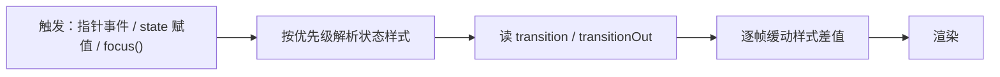

import { Canvas, Controls, Meta } from '@storybook/addon-docs/blocks';
import * as TransitionState from './transition-and-state.stories';

<Meta of={TransitionState} name="Docs" />

# 过渡与状态

LeaferJS 的「过渡」和「状态」是两个分工又配合的机制：**状态**（`@leafer-in/state`）决定元素的视觉**变成什么样**——鼠标悬停、按下、选中、禁用，或你自定义的命名状态，各自对应一套预设样式；**过渡**（`@leafer-in/animate` 的 `transition`）决定这些样式变化**以多快、多柔的曲线发生**。状态切换时，引擎会读取节点上的 `transition` 配置，把样式差值缓动出来，而不是瞬间跳变。

一条主线就能预测大多数行为：某个触发（指针 `enter`/`down`、`focus()`、`selected = true`、或给 `state` 赋一个命名状态）→ 引擎按优先级解析出目标状态样式 → 读 `transition`（进入）或 `transitionOut`（退出）→ 用 `animate` 在每一帧插值样式 → 渲染。要让它工作必须同时引入两个插件：`@leafer-in/state` 注册状态属性、`@leafer-in/animate` 注册 `transition`，缺了 animate，`transition` 退化为瞬变、看不到任何动画。



需要先安装并引入两个插件，否则 `hoverStyle`、`states`、`transition` 都不会生效：

```bash
npm i leafer-ui @leafer-in/state @leafer-in/animate
```

| 关键输入 | 默认 | 含义与回查要点 |
| --- | --- | --- |
| `transition` | `true` | 状态**进入**过渡。`true`=用默认（`ease`/`0.2s`）；`number`=duration（秒）；`string`=easing；`object`=`IAnimateOptions`。 |
| `transitionOut` | 沿用 `transition` | 状态**退出**过渡。可在某个状态样式内单独设，如 `pressStyle: { transitionOut: 'bounce-out' }`。 |
| `duration` | `0.2` | 动画时长，**以秒为单位**。 |
| `easing` | `'ease'` | 缓动曲线名：`linear` `ease` `ease-in-out` `sine-*` `back-*` `bounce-*` `elastic-*`（均含 `-in`/`-out`/`-in-out`）。 |
| `hoverStyle` / `pressStyle` / `focusStyle` | `undefined` | 指针 / 焦点状态样式，由 `pointer.enter`/`leave`/`down`/`up` 与 `focus()` 自动触发。 |
| `selectedStyle` / `disabledStyle` | `undefined` | 选中 / 禁用状态样式，由 `selected` / `disabled` 属性触发。 |
| `states` | `{}` | 命名状态预设表 `{ [name]: IStateStyle }`，每项可含任意样式甚至 `animation`。 |
| `state` | `''` | 当前命名状态名，赋值即切换并触发过渡。 |
| `selected` / `disabled` | `false` | 布尔属性，切换 `selectedStyle` / `disabledStyle`。 |
| `button` | `false` | 把 `Box` / `Group` 标记为按钮，子元素自动同步交互状态（不可嵌套）。 |

## 过渡：transition

`transition` 是状态变化的「动画参数」。它有四种写法，都归一到 `ITransition = boolean | number | string | IAnimateOptions`：

```ts
// #过渡 + 状态 [按钮交互 (Leafer)]
import '@leafer-in/state';
import '@leafer-in/animate';
import { Leafer, Rect } from 'leafer-ui';

const leafer = new Leafer({ view: window });

const rect = new Rect({
  width: 120, height: 120, fill: '#32cd79', cornerRadius: 16, origin: 'center',
  hoverStyle: { fill: '#ff8a5b', scale: 1.2 },
  pressStyle: { fill: '#f59e0b', scale: 0.9, transitionOut: 'bounce-out' },
  transition: { duration: 0.6, easing: 'ease' }, // object：完整动画选项
  // transition: 0.6,        // number：只设 duration（秒）
  // transition: 'back-out', // string：只设 easing
  // transition: true,       // boolean：用默认 ease / 0.2s
});
leafer.add(rect);
```

四个要点决定 `transition` 的行为边界：

- **只作用于状态过渡。** 与 CSS 不同，`transition` 只在状态切换（`state`、`hoverStyle`、`pressStyle` 等）时生效；直接赋值 `rect.fill = '#xxx'` 不会自动过渡。想让任意属性变化走动画，用 `rect.set({ fill: '#xxx' }, { duration: 0.3 })` 或 `animate()`（见「动画系统」课）。
- **进入与退出可分开。** `transition` 管「进入状态」，`transitionOut` 管「退出状态」；不设 `transitionOut` 就沿用 `transition`。两者还能写在某个状态样式内部，只对该状态生效——典型用法是 `pressStyle.transitionOut = 'bounce-out'`，按下后松手弹回，而进入仍按 `ease`。
- **时长单位是秒。** `duration`、`delay`、`loopDelay` 都以秒为单位，默认 `duration: 0.2`。
- **依赖动画插件。** 不引入 `@leafer-in/animate`，`transition` 会被当作 `false`，状态切换瞬时完成、没有过渡。

下面的实例把 `transition` 与状态串在一起：切换「命名状态」会按当前 `duration` / `easing` 缓动到新样式，悬停 / 按下按钮则触发 `hoverStyle` / `pressStyle`，松手按 `bounce-out` 弹回。右下读数里的「过渡进度」会实时反映过渡是否在跑。

<Canvas of={TransitionState.Interactive} />
<Controls of={TransitionState.Interactive} />

| 读者操作 | 可观察证据 |
| --- | --- |
| 切换「命名状态」 | Box 按 `duration` / `easing` 缓动到新 `fill` / `scale` / `cornerRadius`，「过渡进度」从 0% 爬到 100% 后回「空闲」 |
| 调大「过渡时长」再切换状态 | 过渡明显变慢，「过渡进度」爬得更久、更易观察 |
| 切「缓动」为 `bounce-out` / `elastic-out` 再切换 | 能看到回弹 / 弹性超调曲线 |
| 鼠标悬停按钮 | 「悬停」=`是`，Box 过渡到 `hoverStyle`（青色、放大），子文字同步变白 |
| 鼠标按下按钮 | 「按下」=`是`，Box 过渡到 `pressStyle`（橙色、缩小） |
| 松开按钮 | 按 `pressStyle.transitionOut`（`bounce-out`）弹回，「过渡进度」再次跑起来 |
| 打开 Show code | 看到该 Canvas 实际执行的 `example.ts` |

## 交互状态样式

状态样式是「某个交互发生时，元素的样式应变成什么」。它们由引擎在指针 / 焦点 / 选中 / 禁用变化时**自动触发**，无需自己绑事件：

| 状态样式 | 触发时机 | 取消时机 |
| --- | --- | --- |
| `hoverStyle` | `pointer.enter`（指针进入） | `pointer.leave`（指针离开） |
| `pressStyle` | `pointer.down`（按下） | `pointer.up`（抬起） |
| `focusStyle` | 调用 `leaf.focus()` 获得焦点 | `leaf.focus(false)` 失焦 |
| `selectedStyle` | `selected = true` | `selected = false` |
| `disabledStyle` | `disabled = true` | `disabled = false` |
| `placeholderStyle` | 文本为空（仅 `Text`） | 文本非空 |

```ts
import '@leafer-in/state';
import { Rect } from 'leafer-ui';

// 悬停变亮、按下变深；origin 居中让 scale 从中心缩放，过渡更自然
const rect = new Rect({
  width: 120, height: 48, fill: '#6366f1', cornerRadius: 10, origin: 'center',
  hoverStyle: { fill: '#0ea5e9', scale: 1.06 },
  pressStyle: { fill: '#f59e0b', scale: 0.96 },
});

rect.focus();        // 获得焦点 → 应用 focusStyle（若定义了）
rect.selected = true; // 选中 → 应用 selectedStyle
rect.disabled = true; // 禁用 → 应用 disabledStyle（禁用后 hover/press 不再生效）
```

多个状态可同时生效，引擎按固定优先级叠加（低 → 高）：**`state` < `selected` < `placeholder` < `focus` < `hover` < `press` < `disabled`**。高优先级覆盖低优先级的同名属性；`disabled` 一旦为真，`focus` / `hover` / `press` 都不再生效（见源码 `getStyle` 的分层逻辑）。优先级意味着：按下时（`press`）的样式会盖过悬停（`hover`），松手回到 `hover`，离开再回到基准。

无任何状态激活时，元素回到基准样式（`normalStyle`）。引擎会自动从当前属性推算基准，一般无需手动设；`set(data, 'temp')` 内部用它保存「状态之外的原样」。

### button：子元素状态同步

`Box` / `Group` 设 `button: true` 后，父级的交互状态会**自动同步给子元素**——父级 hover，子元素也进入 hover；父级切换 `state`，子元素跟着切。这正是上面实例里按钮文字在悬停时变白的原因（父级 `Box` 是按钮，子 `Text` 自己的 `hoverStyle` 进一步覆盖）。

```ts
import '@leafer-in/state';
import { Box } from 'leafer-ui';

const button = new Box({
  fill: '#32cd79', cornerRadius: 6, button: true, origin: 'center',
  hoverStyle: { fill: '#ff4b4b', scale: 1.1 },     // 父级 hover
  children: [
    { tag: 'Text', text: 'Button', fontSize: 16, padding: [10, 20],
      hoverStyle: { fill: 'black' } },              // 子级随父级 hover，再叠加自己的样式
  ],
});
```

注意：按钮**不能嵌套**；`button` 只在容器上开启，对普通叶子图形（`Rect` 等）无意义。

## 命名状态：states + state

交互状态样式覆盖的是「悬停 / 按下」这类指针场景；当你需要**程序化**地在几套预设视觉间切换（如卡片折叠 / 展开、按钮的 idle / loading / done），用命名状态。`states` 是预设表，`state` 是当前激活的名字，赋值即切换并触发过渡：

```ts
import '@leafer-in/state';
import '@leafer-in/animate';
import { Leafer, Rect } from 'leafer-ui';

const leafer = new Leafer({ view: window });

const rect = new Rect({
  width: 120, height: 120, fill: '#32cd79', cornerRadius: 30, origin: 'center',
  transition: 1, // 命名状态切换走 1 秒过渡
  states: {
    color: { fill: '#FEB027' },
    spin: { animation: { keyframes: [{ rotation: 45 }, { rotation: 135, scale: 1.2 }], duration: 1, swing: true } },
  },
  state: 'color',
});
leafer.add(rect);

rect.on('click', () => {
  rect.state = rect.state === 'color' ? 'spin' : 'color'; // 赋值即切换 + 过渡
});
```

命名状态的要点：

- **每个状态可含任意样式。** `states[name]` 是一个 `IStateStyle`，能放 `fill` / `scale` 等基础样式，也能放 `animation`（甚至 `hoverStyle` 这类交互样式），因此「状态」可以是「一段循环动画」。
- **优先级最低。** 命名状态（`state`）在分层里优先级最低，任何 `selected` / `hover` / `press` 都会覆盖它——所以命名状态适合做「基准视觉」，交互反馈叠在上面。
- **切换方式。** 赋值 `rect.state = 'name'` 最常用；也可命令式调用 `State.set(rect, 'name')`。若你改了 `states` 预设或外部条件（如 `selected`）想让当前样式重算，调 `rect.updateState()`。
- **查询当前状态。** 用 `State.isHover(rect)` / `State.isPress(rect)` / `State.isFocus(rect)` / `State.isSelected(rect)` / `State.isDisabled(rect)` / `State.isState('name', rect)` 查询，上面实例右下读数的「悬停 / 按下」就来自 `State.isHover` / `State.isPress`。

回到上方实例：「命名状态」控件在 `idle` / `primary` / `danger` 三套预设间切换，每次切换都按当前 `transition` 缓动；读数「当前状态」回读 `box.state`，证明赋值已生效。

## 最佳实践

- **进入用 `ease`、退出用 `back` / `bounce`。** 状态进入（如 hover）通常要快而稳，`ease` 或 `0.2s` 足够；退出（如松手）想要「弹一下」的反馈，在 `pressStyle.transitionOut` 单独设 `'bounce-out'`，比全局改 `transition` 更克制。
- **`scale` 类过渡配 `origin: 'center'`。** 缩放默认绕左上角，过渡时会「甩」出去；设 `origin: 'center'`（或 `around: 'center'`）让缩放从中心进行，视觉才平稳。
- **命名状态做基准、交互状态做反馈。** 把「业务视觉」放进 `states` + `state`，把 hover / press 这类即时反馈放进 `hoverStyle` / `pressStyle`。因为命名状态优先级最低，交互反馈会自然盖在上面，互不打架。
- **想让属性变化走过渡，用 `set(data, transition)`。** 直接 `rect.fill = x` 不触发 `transition`；要过渡就用 `rect.set({ fill: x }, { duration: 0.3 })`，或更复杂的用 `animate()`（关键帧、排队见「动画系统」课）。

## 常见问题

- **配了 `transition` 和 `hoverStyle`，悬停还是瞬变、没动画？**
  没引入 `@leafer-in/animate`。`transition` 由动画插件注册，缺了它状态切换会瞬时完成。确认顶部有 `import '@leafer-in/animate'`（或用已集成的 `leafer-game`）。
- **直接 `rect.fill = '#xxx'` 为什么不过渡？**
  正常。`transition` 只用于**状态过渡**（`state` / `hoverStyle` / `pressStyle`…）和 `move()` / `set()` 等方法的过渡参数；普通属性赋值不经过状态机。要过渡属性变化用 `rect.set({ fill: '#xxx' }, { duration: 0.3 })`。
- **`state` 赋了同一个值，过渡不触发？**
  `state` 的 setter 会先 `__setAttr` 判重，值没变就短路、不再调 `State.set`，所以不会重复过渡。要强制重算当前样式用 `rect.updateState()`；要换个过渡再播一次，切到别的状态再切回来。
- **悬停按钮时子元素没跟着变？**
  父容器要设 `button: true`，子元素才会同步交互状态。另外按钮不能嵌套——一个 `button: true` 的容器里不要再放另一个 `button: true`。
- **禁用（`disabled = true`）后 hover / press 还在生效？**
  不会。`disabled` 优先级最高，为真时 `focus` / `hover` / `press` 都被跳过（见分层优先级）。若仍看到样式，多半是 `disabledStyle` 自身定义了那套视觉。

## 总结回顾

摘要：

LeaferJS 的过渡与状态由两个插件配合：`@leafer-in/state` 提供 `hoverStyle` / `pressStyle` / `focusStyle` / `selectedStyle` / `disabledStyle` 等交互状态样式（由 `pointer.enter/leave/down/up`、`focus()`、`selected` / `disabled` 自动触发）和 `states` / `state` 命名状态（程序化切换）；`@leafer-in/animate` 的 `transition` / `transitionOut` 决定这些状态变化以何种 `duration` / `easing` 缓动。`transition` 只作用于状态过渡和 `set()` / `move()` 等方法的过渡参数，直接赋值属性不会过渡。状态按 `state < selected < placeholder < focus < hover < press < disabled` 的优先级叠加，`button: true` 让容器子元素同步交互状态。配置时给容器设 `origin: 'center'` 让缩放过渡居中，进入用 `ease`、退出在 `pressStyle.transitionOut` 用 `back` / `bounce` 做弹回反馈。

一句话：

> 状态决定「变成什么」，`transition` 决定「怎么变」——状态切换时引擎读 `transition` 缓动样式差值，缺了 `@leafer-in/animate` 就只剩瞬变。

知识要点：

- `transition` 的默认值是什么？它有哪四种写法？`duration` 的单位是什么？
- `transition` 和 `transitionOut` 各管什么？怎样只给某个状态的退出单独设曲线？
- 为什么直接 `rect.fill = x` 不触发过渡？要让属性变化过渡该用什么方法？
- 哪些状态样式由指针事件自动触发？`selectedStyle` / `disabledStyle` 由什么触发？
- 状态样式的优先级顺序是什么？`disabled` 为真时 hover / press 还生效吗？
- `button: true` 解决什么问题？命名状态（`states` / `state`）在优先级里处于什么位置？
- 同时引入哪两个插件才能让状态过渡正常工作？

## 参考资料

- [transition 过渡效果 | Leafer UI 官方文档](https://www.leaferjs.com/ui/reference/UI/transition.html)
- [state 状态（states / state / button）| Leafer UI 官方文档](https://www.leaferjs.com/ui/reference/UI/state/state.html)
- [hover（hoverStyle 交互状态）| Leafer UI 官方文档](https://www.leaferjs.com/ui/reference/UI/state/hover.html)
- [交互状态插件 @leafer-in/state | Leafer UI 官方文档](https://www.leaferjs.com/ui/guide/plugin/state.html)
- [动画插件 @leafer-in/animate（动画选项属性）| Leafer UI 官方文档](https://www.leaferjs.com/ui/guide/plugin/in/animate/)
