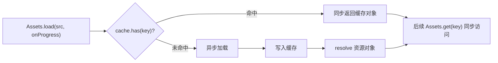

import { Canvas, Controls, Meta } from '@storybook/addon-docs/blocks';
import * as AssetsCourse from './assets.stories';

<Meta of={AssetsCourse} name="Docs" />

# 资源加载

纹理、精灵表、字体等资源在 v8 里统一由 `Assets` 加载。`Assets` 是一个 Promise 风格、**带全局缓存**的资源管理器：每次 `load` 都是异步的，加载结果按 key（URL 或别名）缓存，**对同一个 key 的重复请求直接返回同一对象**，不会重复加载。围绕这层缓存，`Assets` 还提供别名注册、bundle 分组、进度回调和精确卸载，把"资源从哪来、何时可用、如何释放"收进一个总入口。

理解了"异步加载 + key 缓存 + 去重"这层模型，本课其余能力（别名、bundles、unload、背景加载）都是在同一模型上换不同的组织方式。



开场先给两张速查表。第一张是 `Assets` 常用静态方法，覆盖加载、缓存访问、分组与卸载的入口：

| 方法 | 签名要点 | 作用 |
| --- | --- | --- |
| `Assets.init(options?)` | `Promise<void>`，**只能调用一次** | 设 `basePath`、`manifest`、`preferences` 等；不调用时首次 `load`/`loadBundle` 会自动以默认选项初始化 |
| `Assets.load(src, onProgress?)` | `Promise<T>`（单个） / `Promise<Record<key, T>>`（数组） | 异步加载并缓存；`onProgress: (p: number) => void`，`p` 从 0 到 1 |
| `Assets.loadBundle(ids, onProgress?)` | `Promise<按别名键的对象>` | 加载一组已注册的 bundle；返回值按别名键，也可加载后用 `Assets.get(alias)` |
| `Assets.get(key)` | 同步 `T`；未加载返回 `undefined` | 同步取已缓存资源，不触发加载 |
| `Assets.cache.has(key)` | 同步 `boolean` | 检查某 key 是否已加载进缓存 |
| `Assets.add(asset)` | `void` | 预注册别名 → 源，不立即加载 |
| `Assets.addBundle(id, assets)` | `void` | 预注册一个命名 bundle，不立即加载 |
| `Assets.unload(keys)` | `Promise<void>` | 按 key 卸载，释放底层纹理 |
| `Assets.unloadBundle(ids)` | `Promise<void>` | 卸载整个 bundle 内的全部资源 |
| `Assets.backgroundLoad(src)` / `backgroundLoadBundle(ids)` | `Promise<void>` | 后台预热缓存，无进度回调 |

第二张是 `Assets` 能识别和加载的文件类型，决定什么资源能直接交给它：

| 类型 | 扩展名 | 内置 loader |
| --- | --- | --- |
| 纹理 | `.png` `.jpg` `.gif` `.webp` `.avif` | `loadTextures` |
| SVG | `.svg` | `loadSvg` |
| 视频纹理 | `.mp4` `.webm` `.ogg` `.mov` | `loadVideoTextures` |
| 精灵表 | `.json`（描述 + 同名图集） | `spritesheetAsset` |
| 位图字体 | `.fnt` `.xml` `.txt` | `loadBitmapFont` |
| Web 字体 | `.ttf` `.otf` `.woff` `.woff2` | `loadWebFont` |
| JSON / 文本 | `.json` / `.txt` | `loadJson` / `loadTxt` |
| 压缩纹理 | `.basis` `.dds` `.ktx` `.ktx2` | `loadBasis` / `loadDDS` / `loadKTX` |

## 异步加载与缓存

这一节建立本课的核心模型。`Assets` 把"资源是一个异步值、加载完进缓存、之后按 key 复用"这三件事打包：加载是异步的，因为读文件、解码图片、上传 GPU 都不能同步完成；缓存让多次引用同一资源不会重复加载；去重保证 `load` 同一个 key 拿到的是同一对象，引用比较 `===` 成立。

### Assets.load：加载单个资源

最简形式：传 URL 字符串，拿到一个纹理。

```ts
import { Assets, Sprite } from 'pixi.js';

const texture = await Assets.load('https://pixijs.com/assets/bunny.png');
const sprite = new Sprite(texture);
app.stage.addChild(sprite);
```

`Assets.load` 会按文件扩展名自动选择 loader（上表），所以 `.png` 走纹理 loader，`.json` 走精灵表 loader。加载完成的资源**自动写进缓存**，key 就是传入的 URL。

加载多个资源时传数组，返回值按传入的 key（URL 或别名）索引：

```ts
const textures = await Assets.load([
  'https://pixijs.com/assets/bunny.png',
  'https://pixijs.com/assets/flowerTop.png',
]);
const bunny = new Sprite(textures['https://pixijs.com/assets/bunny.png']);
```

带进度回调时，回调收到的 `progress` 是 0 到 1 之间的数字，可用来驱动加载条：

```ts
await Assets.load(['a.png', 'b.png', 'c.png'], (progress) => {
  loadingBar.width = progress * 200; // 0.0 → 1.0
});
```

注意 `onProgress` 只反映加载过程，不要用它判断"全部加载完成"——完成要看 `await` 返回。极端情况下回调可能在末尾前就近似为 1。

### 缓存、去重与同步访问

加载完成后，资源按 key 进缓存。之后无论再 `load` 还是 `get` 同一个 key，拿到的都是**同一个对象**：

```ts
const a = await Assets.load('bunny.png');
const b = await Assets.load('bunny.png');
console.log(a === b); // true——第二次命中缓存，没有再次加载
```

`Assets.get(key)` 是同步入口：只要资源已在缓存里就立即返回，不会触发加载、不返回 Promise。配合 `Assets.cache.has(key)` 可以先判断再同步取用：

```ts
if (Assets.cache.has('bunny')) {
  const texture = Assets.get('bunny');
  const sprite = new Sprite(texture);
}
```

未加载时 `get` 返回 `undefined`。需要"没有就加载"的语义时直接用 `load`（它内部已带缓存判断），不要自己用 `get` + `load` 拼条件分支。

下面的实例把"异步加载 + 缓存命中"两种路径放在一起对比。切换资源时，**首次**选择一个别名会显示进度条、读数为"加载中"；**再次切回**已加载的别名则命中缓存，精灵瞬时出现、读数变为"缓存命中"。

<Canvas of={AssetsCourse.Interactive} />
<Controls of={AssetsCourse.Interactive} />

| 读者操作 | 可观察证据 |
| --- | --- |
| 选「bunny」 | 首次出现进度条并从 0% 推进，加载完成后精灵显示，读数为"加载完成" |
| 切到「flowerTop」再切回「bunny」 | 切回时**没有进度条**，读数为"缓存命中"，证明同一 key 的第二次请求命中缓存 |
| 查看左下角「缓存命中」 | 当前别名是否已在缓存中，对应 `Assets.cache.has(alias)` |
| 打开 Show code | 看到该 Canvas 实际执行的 `assets.ts`，其中 `loadAlias` 的两个分支对应缓存命中与异步加载 |

### 别名引用资源

直接用 URL 当 key 会又长又脆。`Assets` 允许给资源起别名，之后所有 API（`load`、`get`、`has`、`unload`、`Sprite.from`）都能用别名：

```ts
// 加载时直接带别名
await Assets.load({ alias: 'bunny', src: 'https://pixijs.com/assets/bunny.png' });
const texture = Assets.get('bunny'); // 用别名取
```

只想注册、暂不加载时用 `Assets.add`，留到合适时机再 `load`：

```ts
Assets.add({ alias: ['hero', 'player'], src: 'hero.png' }); // 一个资源可起多个别名
await Assets.load('hero');
```

别名注册后，加载、缓存、卸载都以别名作为 key——之后整个项目都用别名引用资源，URL 只在注册处出现一次。

## 批量与分组加载

### 一次加载多个资源

`Assets.load([...])` 一次加载多个资源并返回按 key 索引的对象，配合进度回调可做整体加载进度条。这与单个 `load` 共用同一套缓存，差别只在返回形式：

```ts
const assets = await Assets.load(
  ['background.png', 'player.png', 'enemy.png'],
  (progress) => setTotalProgress(progress),
);
app.stage.addChild(new Sprite(assets['background.png']));
```

需要给多个资源同时起别名时，传对象数组即可：

```ts
const assets = await Assets.load([
  { alias: 'bg', src: 'background.png' },
  { alias: 'player', src: 'hero.png' },
]);
const bg = assets.bg; // 按别名取
```

### bundles：分组预载与按需加载

资源多到需要按场景（加载页 / 主菜单 / 战斗）分组时，用 bundle。bundle 是"一组带别名的资源 + 一个名字"。两种注册方式：

**清单方式**——在 `Assets.init({ manifest })` 里一次性声明全部 bundle，适合在启动时集中配置：

```ts
const manifest = {
  bundles: [
    {
      name: 'load-screen',
      assets: [
        { alias: 'background', src: 'sunset.png' },
        { alias: 'bar', src: 'load-bar.png' },
      ],
    },
    {
      name: 'game-screen',
      assets: [
        { alias: 'character', src: 'robot.png' },
        { alias: 'enemy', src: 'bad-guy.png' },
      ],
    },
  ],
};

await Assets.init({ manifest });
```

**运行时方式**——用 `Assets.addBundle` 随时注册，适合按需或动态得知资源时：

```ts
Assets.addBundle('animals', [
  { alias: 'bunny', src: 'bunny.png' },
  { alias: 'chicken', src: 'chicken.png' },
]);
```

注册不会加载。需要时用 `Assets.loadBundle(name)` 加载整组，返回值按别名键：

```ts
const gameAssets = await Assets.loadBundle('game-screen', (progress) => {
  setProgress(progress); // 同样是 0 到 1
});
// 也可加载后用别名同步取
const character = Assets.get('character');
```

bundle 的价值在于"按需"：可以只加载当前场景的 bundle，其它场景的资源不占内存；切场景时再加载下一组。`init` 选项里还有 `basePath`（给所有相对路径加前缀，常用于 CDN）和 `defaultSearchParams`（给所有 URL 加默认查询串），在多环境部署时很有用。

## 卸载与生命周期

### unload 释放资源

`Assets.unload(keys)` 按 key 把资源从缓存移除并销毁底层对象（纹理会 `destroy`，释放 GPU 内存）。卸载后该 key 不在缓存里，再次使用前必须重新 `load`：

```ts
await Assets.unload('bunny');
Assets.cache.has('bunny'); // false
```

`Assets.unloadBundle(ids)` 一次性卸载整个 bundle 内的全部资源：

```ts
await Assets.unloadBundle('game-screen'); // character、enemy 同时释放
```

卸载是**精确的释放手段**，但有一个必须留意的副作用：仍在显示的精灵如果引用了被卸载的纹理，会渲染为空白或报错。卸载前先确认引用该资源的显示对象已经移除，或一并销毁。

### 背景加载预热

`Assets.backgroundLoad(src)` / `Assets.backgroundLoadBundle(ids)` 在后台悄悄把资源加载进缓存，不阻塞主流程、也没有进度回调。之后再对同一资源调用 `load` / `loadBundle`，如果后台已加载完成，会**立即命中缓存返回**，从而省去一次加载等待：

```ts
// 在主菜单时就开始预热战斗场景的资源
Assets.backgroundLoadBundle('game-screen');

// 玩家进入战斗时正式加载——若后台已完成，这里瞬时返回
await Assets.loadBundle('game-screen');
```

适合"已知稍后要用、但不想现在卡住界面"的场景，用来减少后续的加载屏。

## 最佳实践

- **统一用 Assets 管资源入口。** 凡是要加载的纹理、精灵表、字体都走 `Assets.load` / `loadBundle`，拿到结果后再 `new Sprite(texture)`。直接 `Sprite.from(url)` 走的是 `Texture.from`，对未加载的 URL 会隐式加载，绕过 Assets 的别名、bundle、进度与卸载管理。
- **用别名而非 URL 当 key。** URL 只在注册处出现一次，全项目用别名引用；换 CDN、换文件名只改注册处。
- **bundle 与场景对齐。** 一个场景一个 bundle，进入时 `loadBundle`、离开时 `unloadBundle`，既控进度又控内存；跨场景共享的资源单独放一个常驻 bundle，不随场景卸载。
- **卸载前清理引用。** 卸载资源前，先移除或销毁引用它的显示对象，避免精灵引用到已销毁的纹理而变白或报错。

## 常见问题

- **直接 `Sprite.from(url)` 显示纹理，有时空白、也没有加载进度**
  `Sprite.from` / `Texture.from` 对未加载的 URL 会创建一个隐式加载的纹理，绕过 Assets 的进度回调、别名、bundle 与卸载管理，加载时机不可控。正确做法是先 `await Assets.load(...)` 预载，再用 `new Sprite(Assets.get(alias))` 或 `Sprite.from(alias)` 取已缓存纹理。
- **卸载一个纹理后，画面上某些精灵变白或报错**
  `Assets.unload` 会销毁底层纹理。仍在舞台上的精灵如果引用了它，就会渲染失败。卸载前先把引用该纹理的显示对象移除/销毁，或确保该资源不再被任何对象引用。
- **`loadBundle` 报"bundle 不存在"**
  bundle 要么在 `Assets.init({ manifest })` 的清单里声明，要么用 `Assets.addBundle` 注册过，并且 `Assets.init` 只能调用一次。运行时新增的 bundle 一律用 `addBundle`，不要再次调用 `init`（会被忽略并告警）。
- **`Assets.get(key)` 返回 `undefined`**
  资源尚未加载进缓存。`get` 是纯同步访问、不触发加载。需要"确保可用"时用 `await Assets.load(key)`，它在内部已经做了缓存判断。

## 总结回顾

摘要：

`Assets` 是 v8 的异步资源加载器与全局缓存。所有加载都是 Promise 风格的：`load` 单个或多个资源、`loadBundle` 按命名组加载，都带可选的 0 到 1 进度回调。加载结果按 key（URL 或别名）缓存，重复请求直接返回同一对象，避免重复加载。`Assets.get` 与 `Assets.cache.has` 提供同步访问；`Assets.add` / `addBundle` / `Assets.init({ manifest })` 用来预注册别名与分组；`unload` / `unloadBundle` 精确释放底层纹理；`backgroundLoad` / `backgroundLoadBundle` 在后台预热缓存，让后续加载命中缓存瞬时返回。

一句话：

> Assets 的心智模型是"异步加载 + key 缓存 + 去重"——加载是 Promise，结果按 key 缓存，同名请求返回同一对象，其余能力都是在这层模型上换组织方式。

知识要点：

- 为什么 `Assets.load` 是异步的，它的返回值与进度回调分别是什么？
- 同一个 key 第二次 `load` 会发生什么？怎么用 `Assets.get` 同步取？
- 别名解决了什么问题，怎么注册和引用？
- bundle 的两种注册方式（manifest / addBundle）分别在什么时机用？
- `unload` 释放什么、有什么必须留意的副作用？
- `backgroundLoad` 与直接 `load` 的关系是什么？

## 参考资料

- [PixiJS 指南：Assets](https://pixijs.com/8.x/guides/components/assets)
- [PixiJS 指南：Assets / Manifests 与 Bundles](https://pixijs.com/8.x/guides/components/assets/manifest)
- [PixiJS 指南：Assets / 背景加载](https://pixijs.com/8.x/guides/components/assets/background-loader)
- [PixiJS API：Assets](https://pixijs.download/release/docs/assets.Assets.html)
- [PixiJS API：Cache](https://pixijs.download/release/docs/assets.Cache.html)
