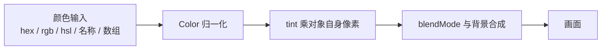

import { Canvas, Controls, Meta } from '@storybook/addon-docs/blocks';
import * as BlendColorStories from './blend-color.stories';

<Meta of={BlendColorStories} name="Docs" />

# 混合模式与着色

PixiJS 里「颜色如何落到画面上」由三个处在不同渲染阶段的机制分担：`Color` 把任意颜色输入（hex、rgb、hsl、CSS 名称、数组……）统一归一化为内部颜色；`tint` 在对象**自身像素**上做乘法着色；`blendMode` 在**合成阶段**决定这些像素如何与已经画在画面上的背景混合。理解「哪个阶段做什么」，就能预测大部分结果——`tint` 改的是对象长什么样，`blendMode` 改的是对象怎么和背景叠加，二者顺序固定、不可互换。

三者都挂在任意显示对象（`Container` / `Sprite` / `Graphics` / `Text`）上，作用于该对象及其全部子节点。本课讲核心包的混合模式、`tint` 与 `Color`；滤镜自身的 `filter.blendMode`（滤镜输出与背景的混合）已在「滤镜」课讲过，这里只给边界；用 GLSL 自定义混合属于「网格与着色器」。



| 写法 / 属性 | 默认值 | 作用 |
| --- | --- | --- |
| `obj.blendMode = 'add'` | `'inherit'`（继承父级，顶层等效 `'normal'`） | 对象与背景的像素合成方式 |
| `obj.tint = 0xff0000` | `0xFFFFFF`（白色 = 无 tint） | 用颜色乘对象像素做整体着色 |
| `new Color(source)` | — | 解析任意颜色格式并统一转换 |
| `import 'pixi.js/advanced-blend-modes'` | — | 启用 overlay / difference 等高级混合模式 |
| `app.init({ useBackBuffer: true })` | `false` | WebGL 上高级混合模式必需（需采样背景像素） |
| `Color.shared` | — | 全局共享的单例 Color，避免反复 `new` |

## 混合模式

混合模式（blend mode）决定一个对象的颜色（source）如何与画面上已绘制的内容（destination）合成。给任意显示对象的 `blendMode` 赋一个字符串即可：

```ts
import { Container } from 'pixi.js';

const glow = new Container();
glow.blendMode = 'add';        // 加法混合：重叠区变亮，做光晕 / 火焰
glow.blendMode = 'multiply';   // 乘法混合：变暗，做阴影 / 染色
glow.blendMode = 'normal';     // 还原为标准 alpha 合成
```

几点直接影响结果的行为：

- **v8 用字符串字面量。** `BLEND_MODES` 是 TypeScript 类型而非运行时对象，`BLEND_MODES.ADD` 在运行时是 `undefined`，必须写字符串 `'add'`。
- **作用对象及子节点。** `blendMode` 设到一个 `Container` 上等于对它整棵子树生效；子树内未单独设置的子节点会继承（`'inherit'`）父级。
- **混合的是「已绘制的背景」。** 对象按场景顺序逐个绘制，`blendMode` 把当前对象与它**之下**已画好的内容合成。场景里没有背景、或对象是第一个绘制的，混合就无从生效。
- **切换会打断批渲染。** 相邻对象 `blendMode` 不同时，渲染器必须分批提交（batch break），大量混杂模式会影响性能。
- **高级模式是滤镜实现。** `overlay` / `difference` 等需要额外 `import`，且有滤镜开销和 WebGL 的 `useBackBuffer` 要求（见下方专节）。

下面的演示台把三个半透明彩色圆盘叠在一个可调背景上：切模式看合成差异，换背景色看同一模式的不同结果。

<Canvas of={BlendColorStories.BlendModeDemo} />
<Controls of={BlendColorStories.BlendModeDemo} />

| 读者操作 | 可观察证据 |
| --- | --- |
| 切「混合模式」 | 重叠区呈现对应合成（add 变亮趋白、multiply 变暗、screen 柔和提亮、difference 出现补色） |
| 切到 `erase` | 圆盘覆盖区域的背景像素被擦除，露出画布清除色 |
| 调「背景色」 | 同一 blendMode 因背景色不同而结果不同（如 add 叠在黑色上几乎无变化、叠在亮色上明显） |
| 打开 Show code | 看到该 Canvas 实际执行的 `blend-modes.ts` |

### 标准（GPU 原生）混合模式

标准模式由 GPU 的 blend 硬件直接实现，开销低，是最常用的几类：

| 模式 | 效果 | 典型用途 |
| --- | --- | --- |
| `'normal'` | 标准 alpha 合成（顶层默认行为） | 默认渲染 |
| `'add'` | 源 + 目的，向白收敛，重叠区更亮 | 光晕、火焰、激光、发光粒子 |
| `'multiply'` | 源 × 目的，向暗收敛 | 阴影、染色、半透明玻璃 |
| `'screen'` | 滤色（1-(1-s)(1-d)），变亮但比 add 柔和 | 光效叠加、去除暗部 |
| `'erase'` | 用对象 alpha 擦除已绘制像素 | 镂空、擦除 |
| `'none'` | 不混合，直接覆盖目的 | 强制覆盖绘制 |
| `'min'` / `'max'` | 取源与目的的逐通道最小 / 最大（WebGL2+） | 特殊合成 |

另有三个带 `-npm` 后缀的变体（`'normal-npm'` / `'add-npm'` / `'screen-npm'`），用于处理**非预乘 alpha**（not-premultiplied）纹理——当你加载 PNG 等已经是预乘格式的纹理时基本用不到，只在自定义纹理管线 alpha 模式不匹配时才需要。

`'inherit'` 不是一种合成算法，而表示「沿用父级 blendMode」——它是对象构造时的初始值；场景根 `stage` 没有父，最终按 `'normal'` 渲染。

### 高级（滤镜实现）混合模式

PixiJS 还支持一组 Photoshop 风格的混合模式：`'overlay'`、`'soft-light'`、`'hard-light'`、`'color-dodge'`、`'color-burn'`、`'linear-burn'`、`'linear-dodge'`、`'vivid-light'`、`'pin-light'`、`'linear-light'`、`'hard-mix'`、`'difference'`、`'exclusion'`、`'negation'`、`'darken'`、`'lighten'`、`'subtract'`、`'divide'`、`'saturation'`、`'color'`、`'luminosity'`。它们覆盖变暗、变亮、对比、反相和 HSL 分量等大类，按视觉效果分类选即可。

与标准模式不同，**高级模式基于滤镜实现**（每个模式是一个 `BlendModeFilter` 扩展），因此：

- **必须先 import 扩展。** 在使用前 `import 'pixi.js/advanced-blend-modes';` 注册全部高级模式，否则赋值后无效果。
- **WebGL 上要开 `useBackBuffer`。** 滤镜实现要采样背景像素，而 WebGL 默认无法读回主画布；`app.init({ useBackBuffer: true })` 让渲染先画到纹理再呈现，才能采样（WebGPU 原生支持，不需要）。
- **有滤镜开销。** 它们走滤镜管线，性能比标准模式贵；高分屏上默认 `resolution: 1` 可能与主分辨率不匹配导致裁切，必要时调 `Filter.defaultOptions.resolution`。

```ts
import 'pixi.js/advanced-blend-modes';
import { Application, Sprite } from 'pixi.js';

const app = new Application();
await app.init({ preference: 'webgl', useBackBuffer: true }); // 高级模式在 WebGL 上必需

const overlay = new Sprite(texture);
overlay.blendMode = 'color-burn'; // 现在才生效
```

本课演示台的 `overlay` 与 `difference` 两个选项就是高级模式，开 Show code 能看到对应的 `import` 与 `useBackBuffer`。

## tint 着色

`tint` 用一个颜色去**乘**对象渲染出来的每个像素，做整体着色。它是乘法运算，所以白色（`0xFFFFFF`，各通道为 1）等于「乘 1」、不改变颜色，也是 `tint` 的默认值；任何彩色 tint 都会让对象**变暗或偏色**——白色图形会直接显示 tint 色，彩色图形按通道相乘后偏色。

```ts
import { Container, Sprite } from 'pixi.js';

const sprite = Sprite.from('hero.png');
sprite.tint = 0xff0000;    // 红色 tint：白色像素变红，彩色像素偏红变暗
sprite.tint = 'blue';      // 接受任意 ColorSource（名称 / hex / rgb / hsl ...）
sprite.tint = 0xffffff;    // 还原：白色 = 无 tint
sprite.tint = null;        // 同样移除 tint
```

几点关键行为：

- **默认 `0xFFFFFF`（白色，无效果）。** 想让对象显示原色，就把 tint 设回白色或 `null`。
- **子节点继承父 tint。** 设在 `Container` 上的 tint 会传给未单独设 tint 的子节点；要只染局部，把那部分单独分组。
- **乘法 = 必然变暗。** tint 不会让对象变亮（没有通道能 >1）；要变亮用 `'add'` / `'screen'` 混合模式或更亮的填充色。
- **接受任意 ColorSource。** 数字（`0xff0000`）、字符串（`'red'`、`'#ff0000'`、`'rgb(255,0,0)'`）、Color 实例都可，PixiJS 内部用 `Color` 统一解析（见下一节）。

下面的演示给一个含白色与彩色图形的场景上 tint：换色看白色图形被染、彩色图形偏色，调强度看在白色与目标色间的插值（tint 无原生强度，演示用 Color 插值模拟）。左下角读数用 Color 把当前 tint 转成多种格式，验证任意输入都能被统一解析。

<Canvas of={BlendColorStories.TintDemo} />
<Controls of={BlendColorStories.TintDemo} />

| 读者操作 | 可观察证据 |
| --- | --- |
| 调「着色 tint」 | 白色方块直接显 tint 色，橙圆 / 绿星 / 蓝矩形按乘法偏色变暗 |
| 选白色 | 场景还原原色（白色 = 无 tint，即默认值） |
| 调「强度」从 1 到 0 | tint 逐渐退回白色，场景还原（演示强度由 Color 插值实现） |
| 看左下读数 | tint 被统一转成 hex / rgba / number 三种格式，证明 Color 的多格式转换 |

## Color 颜色类

`Color` 是 PixiJS 的颜色容器与转换器：把各种输入格式解析成内部归一化 RGBA（各通道 0-1），并提供一组方法输出成需要的格式。`tint`、`fill`、`stroke`、文字 `fill` 等所有接受颜色的属性都接受 `ColorSource`——也就是 `Color` 能解析的任何东西。

```ts
import { Color } from 'pixi.js';

new Color('red');                  // CSS 名称
new Color(0xff0000);               // 数字
new Color('#ff0000');              // 6 位 hex
new Color('#f00f');                // 4 位 hex（含 alpha）
new Color({ r: 255, g: 0, b: 0 }); // RGB 对象（r/g/b 为 0-255）
new Color([1, 0, 0, 0.5]);         // 数组（归一化 0-1，RGBA）
new Color({ h: 0, s: 100, l: 50 }); // HSL 对象
new Color('hsl(0, 100%, 50%)');    // HSL 字符串
```

常用转换方法（输出时，RGB 分量都归一化到 0-1）：

| 方法 | 输出示例 |
| --- | --- |
| `toHex()` | `'#ff0000'` |
| `toHexa()` | `'#ff0000ff'`（含 alpha） |
| `toNumber()` | `0xff0000` |
| `toArray()` | `[1, 0, 0, 1]`（RGBA） |
| `toRgbArray()` | `[1, 0, 0]`（RGB） |
| `toRgba()` | `{ r: 1, g: 0, b: 0, a: 1 }` |
| `toRgbaString()` | `'rgba(255,0,0,1)'` |
| `toUint8RgbArray()` | `[255, 0, 0]`（0-255） |

`setValue()`、`setAlpha()`、`multiply()`、`premultiply()` 都是**链式**方法，便于就地计算颜色：

```ts
import { Color } from 'pixi.js';

// 用 Color.shared 复用单例，避免反复 new
const tint = Color.shared.setValue(0xffffff).multiply([1, 0.5, 0.5]).toNumber();
sprite.tint = tint; // 红色调染色

const c = new Color('red');
c.setAlpha(0.5).multiply([0.8, 0.8, 0.8]); // 半透明 + 整体变暗
```

- **`red` / `green` / `blue` / `alpha` 属性**归一化到 0-1，可直接读。
- **`Color.shared`** 是全局单例，适合「设值→转换→读出」的一次性计算，省去 `new` 的开销和 GC 压力；不要把它的引用存起来跨段使用（会被下一次 `setValue` 改写）。
- **`setValue()` 会恢复 alpha** 为源颜色自带的 alpha（覆盖之前的 `setAlpha`）。

需要程序化算色（插值、混色、按 HSL 调色）时用 `Color`；单纯给对象上一个固定颜色，直接把颜色字面量赋给 `tint` / `fill` / `stroke` 即可，PixiJS 内部自动转换。

## 最佳实践

- **优先用标准混合模式。** 标准模式由 GPU blend 硬件实现，开销远低于高级模式（滤镜管线）。能用 `'add'` / `'multiply'` / `'screen'` 表达的效果，不要换 `'overlay'` / `'linear-burn'`。
- **按 blendMode 分组渲染。** 相邻对象 blendMode 不同会打断批渲染；把同模式的发光元素 / 阴影元素分别集中到一个容器，减少 batch break。
- **高级模式按需开 `useBackBuffer`。** 它让 WebGL 先渲染到纹理，有额外开销；只在确实用了高级模式时开启。
- **用 `0xFFFFFF` 重置 tint，不要反复改。** tint 是简单赋值（便宜），但用一个固定的白色常量比每次算颜色更清晰；需要叠加多个 tint 时，用 `Color.shared.multiply(...)` 先算出合成色再赋一次。
- **复用 `Color.shared` 做一次性计算。** 频繁 `new Color(...)` 会增加 GC；设值→转换→读出的场景用单例。

## 常见问题

- **设了 `overlay` / `difference` 等高级模式却没效果**
  两步都没做才会生效：先在使用前 `import 'pixi.js/advanced-blend-modes';` 注册扩展，再在 WebGL 渲染器上 `app.init({ useBackBuffer: true })`。WebGPU 渲染器原生支持采样背景，不需要 `useBackBuffer`。
- **`BLEND_MODES.ADD` 运行时报错或 undefined**
  v8 里 `BLEND_MODES` 只是 TypeScript 类型，运行时不存在这个对象。直接写字符串字面量：`sprite.blendMode = 'add'`。
- **`add` 模式没有让对象变亮**
  加法混合把对象颜色加到背景上。如果背景是纯黑（`0x000000`），加上任何色也只是还原对象本身，看不出「变亮」——换一个亮色背景或让多个对象重叠，效果就明显了。
- **`tint` 让对象变暗而不是「染色」**
  tint 是乘法，任何彩色都会让通道值变小（变暗）。只有原本是白色 / 浅色的像素才会直接显示 tint 色；深色或彩色像素按通道相乘后必然偏暗。要变亮用 `'add'` / `'screen'` 混合模式或换更亮的填充色。
- **父容器设了 tint，子节点没跟着变**
  子节点若自己单独设过 tint（非白色 / 非 `null`），就用它自己的 tint 而非继承父级。把子节点的 tint 重置为 `0xffffff` 或 `null`，就会重新继承父级。
- **同一个 `Color.shared` 存起来后面用，值被改了**
  `Color.shared` 是全局单例，每次 `setValue` 都覆盖。只在「设值→立即转换→读出」的一次性流程里用，不要保存它的引用跨段使用；要持久保存颜色用 `new Color(...)`。

## 总结回顾

摘要：

颜色落到画面的过程由三个机制分担：`Color` 把 hex / rgb / hsl / CSS 名称 / 数组等任意输入统一归一化为内部颜色；`tint`（默认 `0xFFFFFF`，白色 = 无效果）用乘法对对象自身像素做整体着色，子节点继承父 tint，任何彩色 tint 都必然让对象偏暗；`blendMode`（运行时默认 `'inherit'`，顶层等效 `'normal'`）在合成阶段决定对象与已绘制背景如何混合。标准模式（`normal` / `add` / `multiply` / `screen` / `erase` / `none` / `min` / `max`，加 `-npm` 非 alpha 预乘变体）由 GPU blend 硬件实现、开销低；高级模式（`overlay` / `difference` / `color-burn` 等 21 个，按变暗 / 变亮 / 对比 / 反相 / HSL 分量分类）基于滤镜，需 `import 'pixi.js/advanced-blend-modes'`，WebGL 上还要 `useBackBuffer: true`。v8 中 `BLEND_MODES` 是 TS 类型，运行时用字符串字面量；相邻对象 blendMode 不同会打断批渲染。`Color` 提供 `toHex` / `toArray` / `toNumber` 等转换方法和 `setValue` / `multiply` 链式计算，`Color.shared` 单例适合一次性算色。

一句话：

> tint 用乘法改对象自身像素，blendMode 在合成阶段决定它与背景如何叠加——前者让对象「长成」某个色，后者让对象「融进」背景。

知识要点：

- `Color`、`tint`、`blendMode` 分别处在渲染管线的哪个阶段？
- `blendMode` 的运行时默认值是什么？`'normal'` 和 `'inherit'` 各代表什么？
- 标准 blendMode 有哪些？`add` / `multiply` / `screen` 各适合什么效果？
- 高级 blendMode 使用前需要做哪两步（import + WebGL 选项）？为什么 WebGL 需要 `useBackBuffer`？
- 为什么 v8 不能用 `BLEND_MODES.ADD`？该怎么写？
- `tint` 的默认值是什么？为什么彩色 tint 会让对象变暗？
- 父容器的 tint 如何影响子节点？子节点怎样才会重新继承？
- `Color` 能解析哪些输入格式？有哪些转换方法？
- `Color.shared` 适合什么场景？为什么不能保存它的引用跨段使用？

## 参考资料

- [PixiJS API：Container.blendMode（含全部可选模式与 advanced-blend-modes 说明）](https://pixijs.download/release/docs/scene.Container.html#blendMode)
- [PixiJS API：Container.tint](https://pixijs.download/release/docs/scene.Container.html#tint)
- [PixiJS API：Color 类](https://pixijs.download/release/docs/color.Color.html)
- [PixiJS API：Application（init 选项含 useBackBuffer）](https://pixijs.download/release/docs/app.Application.html)
- [PixiJS API 参考](https://pixijs.download/release/docs/index.html)
- [PixiJS 指南](https://pixijs.com/8.x/guides)
- [PixiJS v8 迁移指南（BLEND_MODES 类型化、advanced-blend-modes）](https://pixijs.com/8.x/guides/migrations/v8)
- [PixiJS 示例库](https://pixijs.com/8.x/examples)
