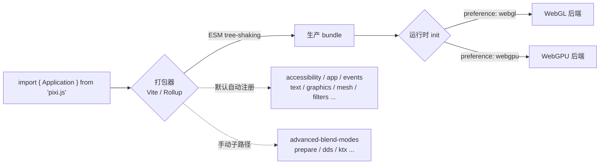

import { Meta } from '@storybook/addon-docs/blocks';

<Meta id="build" title="工程与性能/构建与打包" name="Docs" />

# 构建与打包

PixiJS v8 把整套框架收成**单一 `pixi.js` 包**，用 ESM 重写并引入扩展（extensions）系统。所以「打包」不再是手工拼装模块，而是让打包器（推荐 Vite）发挥 tree-shaking，并按需决定哪些扩展进 bundle。默认 `import { Application } from 'pixi.js'` 已经能用、类型自带、WebGL/WebGPU 后端按需加载；要进一步瘦身，靠的是关闭自动导入、手动注册子路径扩展，以及确认打包器没有把未用代码打进生产产物。

理解 v8 打包的三条主线：(1) 包是 tree-shakeable 的 ESM，扩展系统决定哪些能力在初始化时注册；(2) TypeScript 类型随包自带，不再需要 `@types`；(3) 渲染后端通过异步 `init` 按需加载——WebGPU 用户不会下载 WebGL 代码，反之亦然。



| 项目 | 值 / 默认 | 说明 |
| --- | --- | --- |
| npm 包 | `pixi.js` | v8 单一包；v7 的 `@pixi/*` 子包已废弃，不要再装 |
| 安装到现有项目 | `npm install pixi.js` | 只此一个依赖 |
| 新项目脚手架 | `npm create pixi.js@latest` | 提供模板选择，官方推荐 Vite + PixiJS 模板 |
| Node 版本 | v20.0+ | 脚手架前提 |
| TypeScript 类型 | 包内自带 `.d.ts` | 移除 `@types/pixi.js`，否则与自带类型冲突 |
| 默认导入 | `import { Application } from 'pixi.js'` | 命名导出，ESM，可 tree-shake |
| 渲染后端 | WebGL（默认 / 兜底）、WebGPU | `app.init({ preference })` 选择；只加载用到的那个 |
| `manageImports` | `true`（默认） | `false` 时关闭扩展自动注册，改手动子路径导入做最小 bundle |

## 包结构与 Tree-shaking

v8 最大的工程变化是**把 v7 的 Lerna 多包（`@pixi/app`、`@pixi/sprite`……）合并成单一 `pixi.js` 包、用 ESM 重写**。一个导入根带来两个直接后果：

- **tree-shaking 友好。** 打包器能看到完整的依赖图，未引用的导出会被裁掉。官方在 v8 发布时明确：重写带来了「好得多的 tree-shaking，未导入的能力不会进 bundle」。
- **后端按需加载。** `Application.init()` 改成异步，初始化时才决定并加载实际使用的渲染后端。WebGPU 用户不会为 WebGL 代码付体积，反过来也一样。这正是 init 从同步构造函数变成 `await app.init()` 的工程理由之一。

```ts
// 唯一推荐的导入方式：命名导出，交给打包器 tree-shake
import { Application, Container, Sprite, Graphics, Text } from 'pixi.js';
```

**不要**再写 v7 的 `import { Application } from '@pixi/app'`——这些子包已废弃。v8 的一切从 `pixi.js` 一个入口进来。

### 扩展系统与自动注册

v8 的能力（事件、文本、滤镜、各种精灵、可访问性等）以**扩展**形式存在。默认情况下，`pixi.js` 主入口在模块求值时自动注册一批常用扩展，所以 `new Application()` 一启动事件系统、文本、Graphics 都能用。这些是默认自动注册的子路径：

| 默认自动注册 | 提供的能力 |
| --- | --- |
| `pixi.js/app` | `Application` |
| `pixi.js/events` | 事件系统（`eventMode`、命中测试、pointer/touch） |
| `pixi.js/graphics` | `Graphics` / `GraphicsContext` |
| `pixi.js/mesh` | `Mesh` / `Geometry` / `Shader` |
| `pixi.js/text` | `Text` |
| `pixi.js/text-bitmap` | `BitmapText`，并为 `Assets` 注册位图字体加载 |
| `pixi.js/text-html` | `HTMLText` |
| `pixi.js/sprite-tiling` | `TilingSprite` |
| `pixi.js/sprite-nine-slice` | `NineSliceSprite` |
| `pixi.js/filters` | 内置滤镜 |
| `pixi.js/accessibility` | 可访问性 |

这意味着默认导入就已经包含了上述能力对应的代码——这正是默认方便、但 bundle 偏大的原因。下面「自定义打包」讲怎么按需裁剪。

## TypeScript 类型

v8 的 TypeScript 类型**随包自带**（DTS bundle，单一 `.d.ts` 覆盖全部导出）。因此：

- **不要安装 `@types/pixi.js`。** 它是 v7 时代的社区类型，已废弃，会与包内自带类型冲突。装了就卸掉：`npm uninstall @types/pixi.js`。
- **直接导入即有类型**，编辑器和 `tsc` 自动识别。

```ts
import { Application, Container } from 'pixi.js';

// Application 现在是泛型，类型参数决定渲染器类型
const app = new Application();          // 自动检测（WebGL 或 WebGPU）
await app.init({ width: 800, height: 600 });
```

`tsconfig.json` 的模块解析要能解析包的 `exports` 字段。推荐用 `bundler`（搭配 Vite）或 `node16` / `nodenext`：

```json5
{
  "compilerOptions": {
    "module": "ESNext",
    "moduleResolution": "bundler",   // 或 "node16" / "nodenext"
    "strict": true
  }
}
```

渲染器类型可以用泛型显式收窄，在追求类型安全时有用：

```ts
import {
  Application,
  WebGLRenderer,
  WebGPURenderer,
} from 'pixi.js';

const webglApp = new Application<WebGLRenderer<HTMLCanvasElement>>();
const webgpuApp = new Application<WebGPURenderer<HTMLCanvasElement>>();
```

大多数项目用默认的 `new Application()`（运行时按 `preference` 自动检测）即可，不必写死泛型。

## Vite 集成

Vite 是官方推荐的打包器——脚手架的 Vite + PixiJS 模板就是默认选项。PixiJS 是标准 ESM 依赖，**不需要任何特殊 Vite 配置**：装上就能 `dev` 和 `build`。

最小集成（手动，不使用脚手架）：

```bash
npm install pixi.js
npm install -D vite
```

```html
<!-- index.html -->
<script type="module" src="./src/main.ts"></script>
```

```ts
// src/main.ts
import { Application, Graphics } from 'pixi.js';

// 关键：把异步 init 包进 async 函数，不要用顶层 await（见下方坑点）
async function main() {
  const app = new Application();
  await app.init({ width: 800, height: 600, preference: 'webgl' });
  document.body.append(app.canvas);

  const box = new Graphics().rect(0, 0, 100, 100).fill({ color: 0x4f7cff });
  app.stage.addChild(box);
}

void main();
```

`npm run dev` 启动开发服务器，`npm run build` 输出生产产物。Vite 默认对 `pixi.js` 做 tree-shaking 和代码分割；异步 `init` 让 WebGL/WebGPU 后端自然落到独立 chunk，按需加载。

### 顶层 await 的生产构建坑

官方在 Quick Start 里给出明确警告：**Vite ≤ 6.0.6 在生产构建时，PixiJS 配合顶层 await 会出问题**。表现是 `vite build` 报顶层 await 相关错误或产物异常。处理方式只有一个——把启动代码包进 `async function` 再调用，不要直接在模块顶层 `await app.init()`。上面示例的 `async function main() { ... } void main();` 就是正确写法。

## 自定义打包

默认导入方便但会带入全部自动注册扩展。当 bundle 体积敏感（移动端、CDN 流量受限）时，可以关闭自动注册、只手动导入真正用到的扩展，做最小 bundle。

关闭自动注册并手动选择扩展：

```ts
// 1. 显式导入要用的扩展子路径（在导入 pixi.js 之前或之后均可，模块求值时注册）
import 'pixi.js/accessibility';
import 'pixi.js/events';
import 'pixi.js/graphics';
import 'pixi.js/text';
import { Application, Graphics } from 'pixi.js';

// 2. 初始化时关掉自动注册
const app = new Application();
await app.init({
  manageImports: false,   // 不再自动注册，只保留上面手动导入的扩展
  preference: 'webgl',
});
```

`manageImports: false` 是「从默认全开」切到「全手动」的开关。开启它之后，**没手动导入的能力就不可用**——比如忘了 `import 'pixi.js/text'`，`Text` 类还在但渲染时会缺文本渲染管线。可参考「常见问题」里的典型缺失。

### 默认不自动注册、需要时手动加的扩展

下面这些扩展默认**不**进 bundle，要用就显式导入：

| 手动导入 | 用途 |
| --- | --- |
| `pixi.js/advanced-blend-modes` | 颜色加深、减淡、叠加等 Photoshop 风格混合滤镜 |
| `pixi.js/prepare` | `Prepare` / `BasePrepare` 上传队列，预加载纹理到 GPU |
| `pixi.js/math-extras` | Point / Matrix 之外的数学扩展 |
| `pixi.js/unsafe-eval` | 需要求值着色器的场景（安全风险，按需） |
| `pixi.js/dds` | DDS 纹理格式加载 |
| `pixi.js/ktx` | KTX 纹理格式加载 |
| `pixi.js/ktx2` | KTX2 纹理格式加载 |
| `pixi.js/basis` | Basis 超级压缩纹理加载 |

```ts
import 'pixi.js/prepare';        // 要用 app.renderer.prepare 预上传纹理时
import 'pixi.js/advanced-blend-modes';  // 要 ColorBurnBlend 等高级混合时
```

### 两个特殊扩展

- **`pixi.js/text-bitmap`** 不只是 `BitmapText` 类，它还为 `Assets` 注册位图字体加载器。**要在 `app.init()` 之前用 `Assets.load` 加载位图字体（`.fnt` / `.xml`），必须显式 `import 'pixi.js/text-bitmap'`**，否则加载器还没注册、字体加载失败：

```ts
import 'pixi.js/text-bitmap';
import { Assets, Application } from 'pixi.js';

await Assets.load('fonts/score.fnt');   // 需要上面的导入先注册加载器
await new Application().init();
```

- **`CullerPlugin`**（自动剔除）在 v8 是**可选扩展**，默认不开。要每帧自动剔除视口外对象（模拟 v7 行为），手动注册：

```ts
import { extensions, CullerPlugin } from 'pixi.js';
extensions.add(CullerPlugin);
```

剔除的判断与适用场景在[性能优化](?path=/docs/performance--docs)与[层级与分组](?path=/docs/layers--docs)课讲清，这里只给打包入口。

### 度量产物体积

自定义打包前先量、改完再量，避免盲猜。常用手段：

- Vite 生产构建结尾会打印各 chunk 的 gzip 体积，先看 `pixi.js` 落到哪个 chunk、多大。
- 配 `rollup-plugin-visualizer` 生成可视化，确认哪些扩展占了体积、tree-shaking 是否生效。
- 对照「关 `manageImports` 前 / 后」的两份产物体积差，判断手动裁剪的收益。

## 最佳实践

- **先用默认导入跑通，体积真有问题再定制。** 默认 `import { ... } from 'pixi.js'` + `manageImports` 默认 `true` 覆盖绝大多数项目；只有移动端 / 流量敏感场景才值得切到手动扩展。
- **异步 init 一定包进 async 函数。** 无论打包器是 Vite 还是别的，`await app.init()` 不要写在模块顶层——Vite ≤ 6.0.6 生产构建会出错，养成包函数的习惯最省心。
- **`manageImports: false` 后按缺失补扩展。** 关掉自动注册后，哪个能力不可用就补对应子路径：文本看 `pixi.js/text`、事件看 `pixi.js/events`、位图字体在 init 前加载还要 `pixi.js/text-bitmap`。
- **纹理压缩 / 高级混合按需导入。** DDS / KTX / Basis / advanced-blend-modes 默认不进 bundle，用到才 `import 'pixi.js/...'`，不为没用到的能力付体积。
- **类型走包自带，别装 `@types`。** `@types/pixi.js` 与自带 `.d.ts` 冲突，新项目不要加，老项目删掉。

## 常见问题

- **Vite 生产构建报顶层 await（top-level await）相关错误**
  PixiJS 的 `app.init()` 是异步的，Vite ≤ 6.0.6 在生产构建时对顶层 await 有已知问题。把启动代码包进 `async function main() { ... } void main();`，不要在模块顶层直接 `await`。
- **TypeScript 报类型找不到 / 红线一堆，或与 `@types/pixi.js` 冲突**
  v8 自带 `.d.ts`，不要再装 `@types/pixi.js`。已装的执行 `npm uninstall @types/pixi.js`；同时确认 `tsconfig` 的 `moduleResolution` 是 `bundler` / `node16` / `nodenext`，旧的 `node` 解析可能读不到包的 `exports`。
- **关了 `manageImports` 之后，文字不显示 / 事件不响应 / Graphics 画不出来**
  `manageImports: false` 关掉了扩展自动注册，缺哪个能力就补对应子路径：`import 'pixi.js/text'`、`import 'pixi.js/events'`、`import 'pixi.js/graphics'` 等。逐项对照「默认自动注册」表补齐。
- **`Assets.load('x.fnt')` 加载位图字体报错，说找不到加载器**
  位图字体加载器由 `pixi.js/text-bitmap` 注册。要在 `app.init()` 之前加载 `.fnt`，必须先 `import 'pixi.js/text-bitmap'`，否则 `Assets` 还不认识这个格式。
- **自动剔除（culling）不生效，视口外对象还在渲染**
  v8 的 `CullerPlugin` 默认不注册。要每帧自动剔除就 `import { extensions, CullerPlugin } from 'pixi.js'; extensions.add(CullerPlugin);`。剔除适用场景（GPU 瓶颈才有收益）见[性能优化](?path=/docs/performance--docs)课。
- **产物里同时有 WebGL 和 WebGPU 代码，体积没减**
  异步 `init` 让后端可分 chunk，但最终是否分离取决于打包器的分割策略。检查 Vite 的 chunk 输出，必要时用动态 `import()` 包裹渲染器初始化路径，强制后端落到独立 chunk 按需加载。

## 总结回顾

摘要：

v8 把整套框架收成单一 `pixi.js` 包并用 ESM 重写，打包器因此能 tree-shake，未导入的能力不进 bundle。类型随包自带（DTS bundle），移除 `@types/pixi.js`、`tsconfig` 用 `bundler` / `node16` / `nodenext` 解析即可。Vite 是推荐打包器，无需特殊配置，但 `app.init()` 异步且 Vite ≤ 6.0.6 生产构建对顶层 await 有问题，启动代码要包进 async 函数。能力以扩展形式存在，主入口默认自动注册 app / events / graphics / mesh / text 系列 / filters / accessibility 等常用扩展，DDS / KTX / advanced-blend-modes / prepare 等需手动导入。要最小 bundle 就 `app.init({ manageImports: false })` 关掉自动注册，再按需 `import 'pixi.js/...'` 手动注册；位图字体在 init 前加载还要额外 `import 'pixi.js/text-bitmap'`，自动剔除要手动 `extensions.add(CullerPlugin)`。后端通过异步 init 按需加载，WebGL / WebGPU 各自独立。

一句话：

> v8 的打包就是让打包器 tree-shake 单一 ESM 包——默认导入已经够用，要瘦身就关 `manageImports` 按子路径手动选扩展。

知识要点：

- v8 用单一 `pixi.js` 包，v7 的 `@pixi/*` 子包还能用吗？
- TypeScript 类型来自哪里？为什么不能装 `@types/pixi.js`？
- `tsconfig` 的 `moduleResolution` 推荐哪个值？
- 为什么 `Application.init()` 是异步的？它和 bundle 体积有什么关系？
- Vite 生产构建用顶层 await 会出什么问题？怎么写才对？
- `manageImports: false` 改变了什么？开了之后能力从哪里来？
- 默认自动注册的扩展有哪些？哪些需要手动导入？
- 在 `app.init()` 之前用 `Assets.load` 加载位图字体，缺哪一步会失败？
- 怎么开启 v7 那样的每帧自动剔除？

## 参考资料

- [PixiJS 指南：Quick Start](https://pixijs.com/8.x/guides/getting-started/quick-start)
- [PixiJS v8 迁移指南](https://pixijs.com/8.x/guides/migrations/v8)
- [PixiJS v8 发布博客](https://pixijs.com/blog/pixi-v8-launches)
- [PixiJS 更新博客：TypeScript 文档改进](https://pixijs.com/blog/better-docs-v8)
- [PixiJS API：Application](https://pixijs.download/release/docs/app.Application.html)
