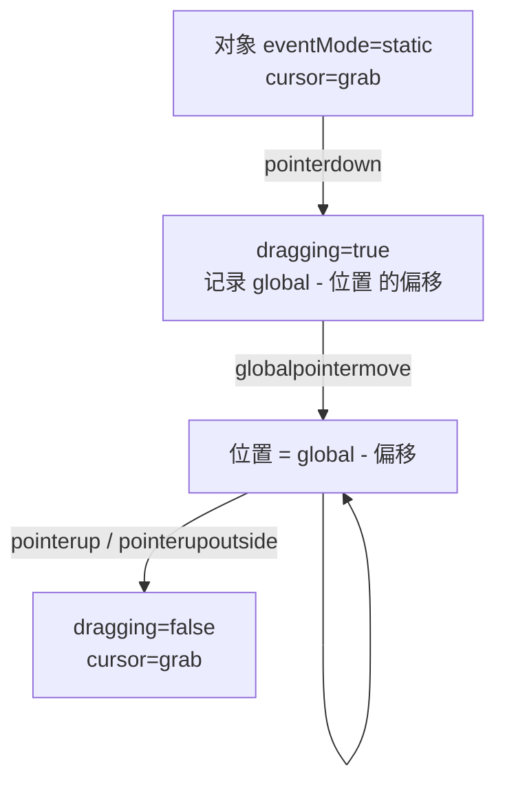

import { Canvas, Controls, Meta } from '@storybook/addon-docs/blocks';
import * as DragStories from './drag.stories';

<Meta of={DragStories} name="Docs" />

# 拖拽与手势

拖拽在 PixiJS 里没有专门 API，它建立在事件系统之上：对象设 `eventMode='static'` 后，监听 `pointerdown` / `pointermove` / `pointerup` 就能动手。真正的难点是「指针捕获」——当你拖着一个对象快速移动，指针会离开对象边界，v8 的 `pointermove`（局部）一旦检测不到命中就停止触发，对象「掉」在原地。v8 没有独立的指针捕获方法，标准做法是改听 `globalpointermove`：它在指针离开对象后仍持续派发给当初按下时的监听者，等价于把指针「锁」在该对象上。

手势（双指缩放、旋转）同样没有内置识别，需要用 `pointerId` 跟踪每一根手指，自己算距离与角度。

本课假设你已了解事件系统的 `eventMode` 与命中测试（详见[事件系统](?path=/docs/events--docs)）。下面先打通拖拽循环与指针捕获，再给出约束、对齐、置顶等常见交互模式，最后是多指手势的手算思路。



| 事件 / 属性 | 触发时机 / 作用 |
| --- | --- |
| `pointerdown` | 指针按下并命中对象 |
| `pointermove` | 指针移动且位于对象上方（v8 仅悬停时触发） |
| `globalpointermove` | 指针在画布内任意移动都触发（拖拽标准用法） |
| `pointerup` | 指针抬起且仍位于对象上方 |
| `pointerupoutside` | 指针抬起且不在对象上方（拖拽收尾必备） |
| `pointertap` | 按下再抬起（点击） |
| `wheel` | 鼠标滚轮（缩放常用） |
| `eventMode` | `none` / `passive`(默认) / `auto` / `static` / `dynamic`；拖拽对象用 `static` |
| `cursor` | CSS 光标样式，如 `'grab'` / `'grabbing'` / `'pointer'` |
| `hitArea` | 自定义命中区，覆盖默认 bounds |
| `event.global` | 指针在世界坐标系的位置 `{ x, y }` |

## 拖拽循环与指针捕获

一个完整的拖拽由三段事件组成：

1. **`pointerdown`** —— 记录「指针坐标 − 对象坐标」的偏移。直接把对象贴到指针会让它「跳」一下；记下按下时的差值，移动时再减回去，抓握点保持不动。
2. **`globalpointermove`** —— 若正在拖拽，把对象位置设为 `global − 偏移`。
3. **`pointerup` + `pointerupoutside`** —— 清除拖拽标记，恢复光标。

```ts
import { FederatedPointerEvent } from 'pixi.js';

const card = new Graphics();
card.eventMode = 'static';
card.cursor = 'grab';

let dragging = false;
const offset = { x: 0, y: 0 };

card.on('pointerdown', (e: FederatedPointerEvent) => {
  dragging = true;
  card.cursor = 'grabbing';
  offset.x = e.global.x - card.x;
  offset.y = e.global.y - card.y;
});

// 关键：用 globalpointermove，而不是 pointermove。
card.on('globalpointermove', (e: FederatedPointerEvent) => {
  if (!dragging) return;
  card.x = e.global.x - offset.x;
  card.y = e.global.y - offset.y;
});

card.on('pointerup', () => { dragging = false; card.cursor = 'grab'; });
card.on('pointerupoutside', () => { dragging = false; card.cursor = 'grab'; });
```

为什么是 `globalpointermove` 而不是 `pointermove`：v8 把 `pointermove` / `mousemove` / `touchmove` 改成「仅当指针在对象上方时触发」，与 v7 不同。拖拽时对象会随指针移动，指针稍快一点就移出对象边界，局部 `pointermove` 立刻停止，对象停在原地；若你又在对象外抬起，局部 `pointerup` 也不触发，拖拽状态卡住。`globalpointermove` 在画布内任何移动都派发，并且始终送给当初注册它的对象——这就是 v8 的「指针捕获」机制，没有别的独立 API。

下面的实例把两种模式做成开关，直接对比：

<Canvas of={DragStories.DragDemo} />
<Controls of={DragStories.DragDemo} />

| 读者操作 | 可观察证据 |
| --- | --- |
| 选「全局 globalpointermove」快速甩动卡片 | 卡片始终跟随指针，抬手即放 |
| 切「局部 pointermove」快速甩动卡片 | 卡片「掉」在指针离开的边界处，不再跟随 |
| 局部模式下，按住卡片拖到画布空白处松手 | 读数「拖拽中」卡在「是」——`pointerup` 未触发，状态没清 |
| 全局模式下，在画布任意位置松手 | 读数「拖拽中」回到「否」——`pointerupoutside` 兜底收尾 |
| 打开 Show code | 看到该 Canvas 实际执行的 `drag.ts` |

对象嵌套在带变换的容器里时，`e.global` 是世界坐标，不能直接赋给局部 `x/y`。用父容器的 `toLocal` 把它转回父空间，再把结果写进对象位置：

```ts
card.on('globalpointermove', (e: FederatedPointerEvent) => {
  if (!dragging) return;
  // 第三参把结果直接写进 card.position，省一个中间变量
  card.parent.toLocal(e.global, undefined, card.position);
});
```

## 交互模式：约束、对齐与置顶

拖拽循环打通后，常见需求是：拖不出画布、抬手对齐网格、被拾对象盖在其它之上。它们都挂在移动和释放回调里。

**约束边界**——移动时把中心坐标 `clamp` 到画布尺寸内。把对象以原点为中心绘制（几何画在 `(-w/2, -h/2)` 处），`x/y` 即中心点，clamp 时用半宽 / 半高最直观：

```ts
card.on('globalpointermove', (e) => {
  if (!dragging) return;
  let nx = e.global.x - offset.x;
  let ny = e.global.y - offset.y;
  nx = Math.max(halfW + 8, Math.min(nx, app.screen.width - halfW - 8));
  ny = Math.max(halfH + 8, Math.min(ny, app.screen.height - halfH - 8));
  card.x = nx;
  card.y = ny;
});
```

**对齐网格**——释放时把坐标 round 到最近网格点。对齐放在抬手回调（`pointerup` / `pointerupoutside`），而不是移动中，否则拖动会一顿顿；对齐后再 clamp 一次，避免跳出约束区。

```ts
const release = () => {
  if (!dragging) return;
  dragging = false;
  card.x = Math.round(card.x / 40) * 40;
  card.y = Math.round(card.y / 40) * 40;
};
card.on('pointerup', release);
card.on('pointerupoutside', release);
```

**拾取置顶**——按下时把对象重新 `addChild` 到父容器。PixiJS 的子节点按添加顺序渲染，对一个已有子节点再 `addChild` 会把它移到末尾，也就是最顶层。需要批量排序时改用 `container.sortableChildren = true` 配合 `zIndex`。

```ts
card.on('pointerdown', () => {
  card.parent.addChild(card);   // 已有子节点重新 addChild → 移到末尾（顶层）
});
```

下面的实例用三张叠放的卡片，把三种模式做成可独立开关的控件：

<Canvas of={DragStories.PatternsDemo} />
<Controls of={DragStories.PatternsDemo} />

| 读者操作 | 可观察证据 |
| --- | --- |
| 开「约束边界」向外拖 | 卡片中心被挡在画布边缘内，拖不出去 |
| 开「对齐网格」抬手 | 卡片松手时跳到最近的 40px 网格点 |
| 开「拾取置顶」点底层卡片 | 被拾卡片立刻盖在其它两张之上，读数「顶层卡片」同步变化 |
| 同时拖多张卡片（触屏双指 / 多点设备） | 每张卡片各自跟随对应手指——多对象拖拽的基础 |
| 打开 Show code | 看到该 Canvas 实际执行的 `patterns.ts` |

多对象同时可拖的关键是：每个对象各自维护 `dragging` 标志，各自监听 `globalpointermove`。回调里先判断自身 `dragging`，是才移动自己，互不干扰。这也是多指手势的起点。

## 多点手势：缩放与旋转

PixiJS 不识别捏合、旋转这类手势，需要用 `pointerId` 自己跟踪每根手指。思路：用一个 `Map<pointerId, point>` 收集当前按下的指针，当同时有两根时，比较「当前两指距离 / 起始两指距离」得到缩放比，比较「当前两指角度 − 起始角度」得到旋转弧度。

```ts
const pointers = new Map<number, { x: number; y: number }>();
let startDist = 0;
let startAngle = 0;
let startScale = 1;
let startRotation = 0;

target.eventMode = 'static';

target.on('pointerdown', (e: FederatedPointerEvent) => {
  pointers.set(e.pointerId, { x: e.global.x, y: e.global.y });
  if (pointers.size === 2) {
    const [a, b] = [...pointers.values()];
    startDist = Math.hypot(b.x - a.x, b.y - a.y);
    startAngle = Math.atan2(b.y - a.y, b.x - a.x);
    startScale = target.scale.x;
    startRotation = target.rotation;
  }
});

target.on('globalpointermove', (e: FederatedPointerEvent) => {
  if (!pointers.has(e.pointerId)) return;
  pointers.set(e.pointerId, { x: e.global.x, y: e.global.y });
  if (pointers.size !== 2) return;
  const [a, b] = [...pointers.values()];
  const dist = Math.hypot(b.x - a.x, b.y - a.y);
  const angle = Math.atan2(b.y - a.y, b.x - a.x);
  target.scale.set((startScale * dist) / startDist);
  target.rotation = startRotation + (angle - startAngle);
});

const release = (e: FederatedPointerEvent) => pointers.delete(e.pointerId);
target.on('pointerup', release);
target.on('pointerupoutside', release);
target.on('pointercancel', release);
```

注意：要在两指都在对象上按下后才进入手势模式——所以监听挂在目标对象上，并用 `pointers.has(e.pointerId)` 过滤 `globalpointermove`，避免无关指针干扰。抬起任一指时 `delete` 对应条目，剩一指时可交给单指拖拽逻辑。

鼠标环境没有多指，常用滚轮代替捏合来缩放。监听 `wheel` 事件，用 `deltaY` 调整 `scale`：

```ts
stage.eventMode = 'static';
stage.on('wheel', (e: FederatedPointerEvent) => {
  const factor = e.deltaY > 0 ? 0.9 : 1.1;
  target.scale.set(target.scale.x * factor);
});
```

完整的捏合 / 旋转需要真实多点设备才能观察；上面的两指距离 / 角度算法是核心，单指拖拽 + 滚轮缩放则可在任意鼠标环境直接验证。

## 最佳实践

- **拖拽一律用 `globalpointermove`，不要用 `pointermove`。** 局部移动在指针离开对象时立即停止，导致快速拖拽「掉」对象、状态卡死；同时挂 `pointerup` + `pointerupoutside` 才能在对象外正常收尾。
- **按下时记偏移，别把对象吸附到指针中心。** 用 `offset = global − 位置`，移动时 `位置 = global − offset`，抓握点保持不变，体验自然。
- **自移动对象用 `eventMode='dynamic'`。** `dynamic` 在指针静止时也补发合成事件，适合本身在动、又需要悬停命中的目标；静态可拖对象用 `static` 即可。
- **约束用 clamp，对齐放在抬手。** 移动中实时 clamp 保证不越界；网格对齐若放在移动中会一顿顿，放抬手一次跳到位最舒服。
- **置顶用重新 `addChild`，批量排序用 `zIndex`。** 单个对象置顶 `parent.addChild(obj)` 最便宜；要按规则批量重排时开 `sortableChildren` 并设 `zIndex`。

## 常见问题

- **快速拖动时对象「掉」在原地、跟不上指针**
  你监听的是局部 `pointermove`，指针移出对象边界后事件停止。改用 `globalpointermove`，并把抬起挂在 `pointerup` + `pointerupoutside` 上。
- **在对象外松手后，对象再也拖不动（状态卡住）**
  只绑了 `pointerup`（局部），对象外抬手不触发，`dragging` 一直是 `true`。补一个 `pointerupoutside` 监听器清除状态。
- **按下时对象猛跳到指针位置**
  没有记录按下偏移。在 `pointerdown` 里存 `offset.x = e.global.x − obj.x`（y 同理），`globalpointermove` 里用 `obj.x = e.global.x − offset.x` 写回。
- **对象嵌在带缩放 / 旋转的容器里，拖拽位置偏了**
  `e.global` 是世界坐标，直接赋给局部 `x/y` 会错位。用 `obj.parent.toLocal(e.global, undefined, obj.position)` 把它转回父空间。
- **拖动时被拖对象被其它对象盖住**
  渲染顺序即添加顺序。在 `pointerdown` 里 `parent.addChild(obj)` 把它移到末尾（顶层），或开 `sortableChildren` + 调 `zIndex`。
- **两指捏合缩放跳变或不稳**
  要在第二指按下时（`pointers.size === 2`）才记录 `startDist` / `startScale`，并且每次只相对这个起始基准计算，不要逐帧累乘。抬起的指要 `Map.delete`，避免残留。

## 总结回顾

摘要：

拖拽是事件系统的组合用法：对象设 `eventMode='static'`，在 `pointerdown` 记录「指针 − 位置」偏移，在 `globalpointermove` 用 `global − 偏移` 更新位置，在 `pointerup` + `pointerupoutside` 收尾。v8 没有独立的指针捕获 API——`globalpointermove` 在指针离开对象后仍持续派发给按下时的监听者，这就是「锁住指针」的标准机制；改用局部 `pointermove` 会因指针移出对象而停止，对象掉在原地、状态卡住。常见交互模式都挂在移动和释放回调里：约束边界用 `clamp`（移动中），对齐网格用 `round`（抬手时），置顶用重新 `addChild` 或 `zIndex`。多对象同时可拖靠每个对象各自维护 `dragging` 标志；多指手势（缩放 / 旋转）需用 `pointerId` 跟踪每根手指，自己算两指距离与角度，鼠标环境可用 `wheel` 代替捏合。

一句话：

> v8 的指针捕获就是 globalpointermove——拖拽时它持续派发给按下时的对象，指针离开也不丢。

知识要点：

- 一个完整拖拽循环由哪三个事件组成？各自做什么？
- 为什么 v8 必须用 `globalpointermove` 而不是 `pointermove`？局部方案会出什么问题？
- 为什么 `pointerupoutside` 是拖拽收尾必备？
- 按下时为什么要记录偏移？不记会怎样？
- 约束边界、对齐网格、拾取置顶分别挂在哪个回调里？为什么对齐放抬手而不放移动中？
- 嵌套容器里拖拽位置偏了，用哪个 API 把全局坐标转回父空间？
- 多指缩放 / 旋转靠什么标识跟踪每一根手指？起始基准何时记录？

## 参考资料

- [PixiJS 指南：Events / Interaction](https://pixijs.com/8.x/guides/components/events)
- [PixiJS API：FederatedPointerEvent](https://pixijs.download/release/docs/events.FederatedPointerEvent.html)
- [PixiJS API：EventSystem](https://pixijs.download/release/docs/events.EventSystem.html)
- [PixiJS 示例库](https://pixijs.com/8.x/examples)
- [PixiJS v8 迁移指南](https://pixijs.com/8.x/guides/migrations/v8)
