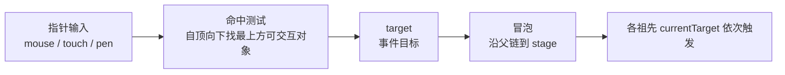

import { Canvas, Controls, Meta } from '@storybook/addon-docs/blocks';
import * as EventsStories from './events.stories';

<Meta of={EventsStories} name="Docs" />

# 事件系统

事件系统把浏览器指针输入（鼠标、触摸、触控笔）映射到场景树里的显示对象：先做**命中测试**找出最上方的可交互对象作为事件目标，再让事件沿父链**冒泡**到根。整个过程由每个对象的 `eventMode` 决定它是否参与——这是 v8 的事件总开关，替代了 v7 的 `interactive` 布尔。

关键认知：v8 的默认 `eventMode` 是 `passive`，对象**自身既不命中也不发事件**，只有显式设为 `static`（或 `dynamic`）才会被命中、才能收到 `pointerdown` 等事件。把这一点记牢，"为什么我加了 `on('click')` 却没反应"这类问题都能直接定位。



| `eventMode` | 自身命中测试 | 自身发事件 | 子树影响 | 适用场景 |
| --- | :---: | :---: | --- | --- |
| `none` | 否 | 否 | 跳过自身和全部子节点 | 纯装饰对象 |
| `passive`（默认） | 否 | 否 | 仍可接收事件 | 容器：自身不交互、子节点要交互 |
| `auto` | 仅当父级可交互时 | 否 | 正常 | 被交互父节点连带命中、自身不发事件 |
| `static` | 是 | 是 | 正常 | 按钮、面板等静态可交互对象 |
| `dynamic` | 是 | 是 | 正常 | 会移动 / 动画的对象（指针静止时也能收到合成事件） |

`isInteractive()` 只在 `static` / `dynamic` 时返回 `true`，等价于"这个对象自身会被命中并发出事件"。

## 开启交互：eventMode

给显示对象设 `eventMode` 并注册监听，是接收事件的最小写法：

```ts
import { Sprite } from 'pixi.js';

const sprite = new Sprite(texture);
sprite.eventMode = 'static';        // 必需：默认 passive 不会发出事件
sprite.on('pointerdown', (e) => {
  console.log('按下', e.target.name);
});
```

`eventMode` 可在运行时直接赋值，下一次命中测试会读取新值，无需重建对象。三档实际最常用：

- **`static`**——绝大多数可交互对象（按钮、图标、卡片）。
- **`passive`**——容器默认值；当你只想让子节点交互、容器自身不参与命中时保持默认即可。
- **`dynamic`**——对象在持续移动（如随指针拖动、动画飞行）时用；指针静止不动，它仍能收到合成事件，避免"对象移开后事件丢失"。静止对象用 `static` 就够，`dynamic` 有额外开销。

`auto` 较少手设：它表示"自身不发事件，但若祖先可交互则参与命中"，主要服务于特殊命中结构。`none` 则彻底退出事件系统，连子节点一起跳过，适合纯视觉对象。

v7 的 `interactive` 布尔在 v8 仍以别名形式存在（`true` → `static`、`false` → `passive`），但默认值从 v7 的 `auto` 改成了 `passive`——旧代码迁移时优先改用 `eventMode`，并注意默认行为变了。下面的实例把一个目标圆放在静态背景之上，切换目标的 `eventMode` 看它是否被命中。

<Canvas of={EventsStories.EventMode} />
<Controls of={EventsStories.EventMode} />

| 读者操作 | 可观察证据 |
| --- | --- |
| 切「目标 eventMode」到 `static` / `dynamic` | 按下目标时读数显示「目标」，圆短暂变绿放大 |
| 切到 `passive` / `auto` / `none` | 按下不再命中目标，读数显示「背景（穿透）」——事件落到静态背景 |
| 打开 Show code | 看到该 Canvas 实际执行的 `events.ts` |

## 事件类型与指针坐标

开启 `eventMode` 之后，接下来要解决两件事：监听**哪种事件**，以及从事件对象里**读取坐标**。两者都落在 `FederatedPointerEvent` 上——它的 `type` 决定事件类型，`global` / `client` / `getLocalPosition` 提供不同坐标空间的读数。

### 事件类型：pointer / mouse / touch 三族

PixiJS 用一套"联合事件"模型把鼠标、触摸、触控笔统一成**指针事件**，多数场景只需监听 pointer 族：

| pointer（推荐，覆盖全部输入） | mouse | touch |
| --- | --- | --- |
| `pointerdown` `pointerup` `pointerupoutside` | `mousedown` `mouseup` `mouseupoutside` | `touchstart` `touchend` `touchendoutside` |
| `pointertap` | `click` `rightclick` `rightdown` `rightup` `rightupoutside` | `tap` |
| `pointerover` `pointerout` `pointerenter` `pointerleave` | `mouseover` `mouseout` `mouseenter` `mouseleave` | — |
| `pointermove` `globalpointermove` | `mousemove` `globalmousemove` `wheel` | `touchmove` `globaltouchmove` |
| `pointercancel` | — | `touchcancel` |

几个容易踩的差异：

- **`pointermove` 只在指针悬停在某个显示对象上时触发**；想随时随地跟踪指针移动，监听 `globalpointermove`，或用 `app.renderer.events.pointer` 读取最新指针状态（见下文范例）。
- **`pointerenter` / `pointerleave`（及 mouse 版）不冒泡**；`pointerover` / `pointerout` 会冒泡。给容器整体做"进入 / 离开"高亮时用前者，给单个对象做悬停用后者。
- **`pointerupoutside`**：按下后在外部松开时触发，做按钮的"按下又移开取消"逻辑时常用。

监听 API 与 DOM 一致：`on(type, fn)` 注册、`off(type, fn)` 移除、`once(type, fn)` 只触发一次；也支持 `addEventListener` / `removeEventListener` 和 `onclick = fn` 这类属性写法。

### 指针坐标：global / client / 本地

`FederatedPointerEvent` 提供多套坐标，最常用的是：

| 属性 | 含义 |
| --- | --- |
| `event.global` / `globalX` `globalY` | 指针在**世界空间**的坐标（最常用，跨对象一致） |
| `event.client` / `x` `y` | 相对画布的坐标（`x` / `y` 是 `clientX` / `clientY` 的别名） |
| `event.screen` | 渲染器屏幕空间 |
| `event.getLocalPosition(container)` | 把世界坐标换算成某容器的**本地坐标**（做命中、定位时常用） |

除了监听事件，还可以用 `app.renderer.events.pointer`（一个只读的最近指针状态对象）随时读取 `global`、`button`、`pointerType` 等，不必非得注册监听——下面的命中与事件流实例就是用它来实时跟踪指针坐标的。

## 命中测试与事件流

命中测试决定**谁是 `target`**，事件流决定事件**如何在父子间传递**。两者是同一个连续过程。

**命中三因素**（自顶向下找最上方可交互对象时）：

1. **`eventMode` 为 `none`** 的对象连同其子树被整体跳过；
2. **`interactiveChildren = false`** 的 `Container` 跳过其全部子节点的命中测试（默认 `true`）；
3. **`hitArea`** 若设置，则覆盖默认的几何包围盒判定（见下节）。

命中测试按场景树的渲染顺序自顶向下，**后添加（更靠上、zIndex 更大）的对象优先**。找到 target 后，事件沿父链冒泡到 `stage`，路径上的每个对象都收到事件——它的 `currentTarget` 是"当前正在处理的那个对象"，`target` 始终是最初命中的对象。

```ts
parent.on('pointerdown', (e) => {
  // 命中子节点时这里也会触发：e.target 是子节点，e.currentTarget 是 parent
  console.log(e.target.name, '冒泡到', e.currentTarget.name);
});
```

控制冒泡的两个方法：

- `e.stopPropagation()`——不再继续冒泡到下一个祖先，但当前对象上剩余的监听器仍会执行。
- `e.stopImmediatePropagation()`——连当前对象上的其他监听器也一并阻止。

下面的实例用"父容器 + 两个部分重叠的子节点"展示命中目标与冒泡路径：实时显示指针坐标、按下时按触发顺序列出"谁收到事件"。

<Canvas of={EventsStories.EventFlow} />
<Controls of={EventsStories.EventFlow} />

| 读者操作 | 可观察证据 |
| --- | --- |
| 在 A / B / 重叠区按下 | 读数「谁收到事件」显示冒泡路径，如 `A → 父容器` |
| 开「子节点 stopPropagation」 | 再按 A / B 时路径只剩子节点本身，父容器不再收到 |
| 关「父容器 interactiveChildren」 | 即使指针在子节点上，也只命中父容器（子节点被命中测试跳过） |
| 移动指针 | 「指针坐标 global」实时跟随，光标点随之移动 |
| 打开 Show code | 看到该 Canvas 实际执行的 `event-flow.ts` |

### 命中区域：hitArea

默认命中测试基于显示对象的几何包围盒。给 `hitArea` 赋一个形状，可以**单独定义命中区域**，让"可点击范围"与"可见形状"分离：

```ts
import { Rectangle, Circle, Polygon } from 'pixi.js';

sprite.hitArea = new Rectangle(0, 0, 100, 100);   // 矩形命中区
sprite.hitArea = new Circle(50, 50, 40);          // 圆形命中区
sprite.hitArea = new Polygon([0, 0, 100, 0, 50, 100]); // 多边形命中区

// 任意实现 contains(x, y) 的对象都能当 hitArea
sprite.hitArea = {
  contains(x: number, y: number) {
    return x >= 0 && x <= 100 && y >= 0 && y <= 100;
  },
};
```

`hitArea` 取自 `Rectangle` / `Circle` / `Polygon` 等内置形状，或任何实现 `{ contains(x, y): boolean }`（`IHitArea` 接口）的对象。设为 `null` 则回落到默认包围盒。常见用途：给小图标扩大点击热区、把命中区收窄到不规则形状的可见部分、或排除透明边距。

下面的实例把一个可见星形的 `hitArea` 切换成不同形状，画出命中区轮廓——你会看到指针落在星形可见像素上、却处于命中区外的情况。

<Canvas of={EventsStories.HitArea} />
<Controls of={EventsStories.HitArea} />

| 读者操作 | 可观察证据 |
| --- | --- |
| 切到 `circle` | 星形尖端落在圆形命中区外，指针移到星尖时读数「不在命中区域内」 |
| 切到 `rectangle` | 命中区变成扁矩形，星形上下尖端同样落在区外 |
| 切到 `polygon` | 命中区与星形完全重合，凹陷处也正确判定为「不在区域内」 |
| 切到 `bounds` | 命中区是完整包围盒，星形凹角处也算「在区域内」 |
| 打开 Show code | 看到该 Canvas 实际执行的 `hit-area.ts` |

## 最佳实践

- **按场景选 eventMode，别一律 static。** 纯装饰对象用 `none`、容器用默认 `passive`、静态可交互对象用 `static`、会移动的对象才用 `dynamic`。`dynamic` 会产生合成事件，能不用就不用。
- **大容器关掉 `interactiveChildren`。** 只关心容器自身交互、不需要点子节点时设 `false`，命中测试直接跳过整棵子树，是性价比很高的性能优化。
- **海量对象时关掉不需要的事件 feature。** `EventSystem` 的 `features` 分 `move` / `globalMove` / `click` / `wheel` 四档（默认全开）。不需要移动追踪的场景可在 init 时关掉：`app.init({ eventFeatures: { move: false, globalMove: false } })`，或运行时 `app.renderer.events.features.globalMove = false`。
- **跨对象跟指针用 `events.pointer` 或 `globalpointermove`。** 普通 `pointermove` 只在悬停对象上触发，拖拽、画笔这类需要全程跟踪的场景不要依赖它。
- **自定义鼠标光标用 `cursor` 属性。** 给可交互对象设 `sprite.cursor = 'pointer'`；要注册命名光标样式，写进 `app.renderer.events.cursorStyles` 再按名引用。

## 常见问题

- **加了 `sprite.on('click', fn)` 却没反应**
  v8 默认 `eventMode` 是 `passive`，对象自身不发事件。把目标设成 `sprite.eventMode = 'static'`（旧代码里 `sprite.interactive = true` 也行，它是 `static` 的别名）。
- **拖动时 `pointermove` 不触发 / 只在对象上方才动**
  普通 `pointermove` 只在指针悬停在显示对象上时触发。拖拽要全程跟踪，改监听 `globalpointermove`，或把监听挂在 `stage` 上，或用 `app.renderer.events.pointer.global` 主动读坐标。
- **点击落到了背景上、没命中目标**
  检查三处：目标 `eventMode` 是否 `static` / `dynamic`；祖先链上有没有 `interactiveChildren = false` 把子树命中关掉；目标 `eventMode` 是不是 `none`（会连子树一起跳过）。
- **场景刚加载、第一帧之前事件没响应**
  `EventSystem` 的 `rootBoundary.rootTarget` 会在每次渲染前自动设为最后渲染的对象——场景至少要渲染一次，UI 事件才能正常派发。`Application` 默认会自动开始渲染循环，确认没有在 `init` 完成前就期望收到事件。
- **`pointerenter` / `pointerleave` 在父容器上收不到子节点的进入离开**
  这两个事件不冒泡。要监听含子节点的整体进出，改用会冒泡的 `pointerover` / `pointerout`，或分别给子节点注册。

## 总结回顾

摘要：

PixiJS v8 的事件系统由每个显示对象的 `eventMode` 驱动，默认 `passive`——自身不命中也不发事件，要接收事件须设为 `static`（静态对象）或 `dynamic`（移动对象，含合成事件）；`none` 连子树一起退出，`auto` 仅在被交互父节点连带时参与命中、自身不发事件。`eventMode` 替代了 v7 的 `interactive`（默认也从 `auto` 变为 `passive`），可在运行时直接赋值。命中测试自顶向下找最上方可交互对象作为 target，受 `eventMode`、`interactiveChildren`、`hitArea` 三因素影响；找到后事件沿父链冒泡到 stage，`stopPropagation` / `stopImmediatePropagation` 控制是否继续。事件分 pointer / mouse / touch 三族，推荐用 pointer；`pointermove` 仅在悬停对象时触发，全程跟踪用 `globalpointermove` 或 `app.renderer.events.pointer`。`FederatedPointerEvent` 的 `global` 是世界坐标，`getLocalPosition(container)` 换算本地坐标。`hitArea` 可用 Rectangle / Circle / Polygon 或任何实现 `contains(x, y)` 的对象，让命中区与可见区分离。

一句话：

> 要让对象接收事件，先设 eventMode = 'static'——默认 passive 不发事件；命中测试找到 target 后事件沿父链冒泡。

知识要点：

- v8 默认 `eventMode` 是什么？哪几档会让对象自身发出事件？
- v7 的 `interactive` 在 v8 里对应什么？默认值发生了什么变化？
- 命中测试的三个影响因素分别是什么？谁决定 target？
- `target` 和 `currentTarget` 有什么区别？事件如何冒泡？
- `stopPropagation` 和 `stopImmediatePropagation` 有何不同？
- `pointermove` 为什么有时不触发？全程跟踪指针该用什么？
- `hitArea` 接受哪些类型的值？它和默认包围盒判定是什么关系？
- 哪些事件不冒泡？给容器做整体进入 / 离开该选哪一组？

## 参考资料

- [PixiJS 指南：Events](https://pixijs.com/8.x/guides/components/events)
- [PixiJS API：EventSystem](https://pixijs.download/release/docs/events.EventSystem.html)
- [PixiJS API：FederatedPointerEvent](https://pixijs.download/release/docs/events.FederatedPointerEvent.html)
- [PixiJS API：IHitArea](https://pixijs.download/release/docs/events.IHitArea.html)
- [PixiJS API：Container（eventMode / hitArea / interactiveChildren）](https://pixijs.download/release/docs/scene.Container.html)
- [PixiJS v8 迁移指南](https://pixijs.com/8.x/guides/migrations/v8)
