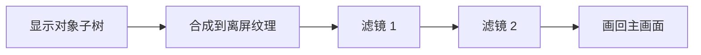

import { Canvas, Controls, Meta } from '@storybook/addon-docs/blocks';
import * as FiltersStories from './filters.stories';

<Meta of={FiltersStories} name="Docs" />

# 滤镜

滤镜（Filter）是 PixiJS 的 GPU 后处理机制：把一个显示对象**及其全部子节点**先合成到一张离屏纹理，再用着色器对这张纹理做像素级处理（模糊、变色、扭曲、噪声……），最后把结果画回主画面。理解「先合成子树、再整体处理」这一点，就能推导出滤镜的全部关键行为——它作用于对象整棵子树而非单个图元、多个滤镜按数组顺序串成流水线、溢出对象边界的效果会被裁切（需要 `padding` 补救）。

滤镜挂在任意显示对象的 `filters` 属性上，v8 的 5 个内置滤镜都用 options 对象构造。本课只讲核心包的内置滤镜与滤镜链：用 GLSL 自定义滤镜（`Filter.from`）属于「网格与着色器」，滤镜级混合模式（`advanced-blend-modes`）属于「混合模式与着色」，社区扩展包 `pixi-filters`（DropShadow / Glow 等）不在核心包内——这些只给边界，不展开。



| 写法 / 属性 | 默认值 | 作用 |
| --- | --- | --- |
| `obj.filters = filter` 或 `[f1, f2]` | — | 应用单个或多个滤镜；赋 `null` 移除 |
| `BlurFilter` | strength `8`、quality `4`、kernelSize `5` | 高斯模糊 |
| `ColorMatrixFilter` | identity 5×4 矩阵、alpha `1` | 5×4 矩阵做色彩变换，含 sepia / negative / hue 等预设 |
| `NoiseFilter` | noise `0.5`、seed 随机 | 叠加随机噪声 |
| `DisplacementFilter` | scale `20` | 用位移图（红绿通道）扭曲像素 |
| `AlphaFilter` | alpha `1` | 整体均匀透明 |
| `filter.padding` | `0` | 给处理区加边距，防止模糊等溢出效果被裁切 |
| `filter.resolution` | `1` | 滤镜纹理分辨率；调低省 GPU、降画质 |
| `filter.enabled` | `true` | 设 `false` 在链中跳过该滤镜（不卸载） |
| `filter.blendMode` | `'normal'` | 滤镜输出与背景的混合方式 |

## 应用滤镜

给任意显示对象的 `filters` 赋值即可。setter 接受单个 `Filter`、数组 `Filter[]`，或 `null` 移除：

```ts
import { Container, BlurFilter, NoiseFilter } from 'pixi.js';

const box = new Container();

box.filters = new BlurFilter({ strength: 8 });          // 单个滤镜（不必包数组）
box.filters = [new BlurFilter({ strength: 4 }),          // 多个滤镜：按数组顺序处理
               new NoiseFilter({ noise: 0.2 })];
box.filters = null;                                      // 移除全部滤镜
```

几点直接影响结果的行为：

- **作用于对象及全部子节点。** 滤镜会把整个子树先合成成一张图再处理，所以挂在一个 `Container` 上等于对它所有后代整体生效，而非逐个图元处理。
- **仅 WebGL / WebGPU 渲染器支持。** canvas 2D 渲染器会忽略滤镜；本课实例用 `preference: 'webgl'`。
- **构造走 options 对象。** v8 的滤镜构造函数第一个参数是 options 对象，如 `new BlurFilter({ strength, quality })`；旧的按位置传参写法（`new BlurFilter(8, 4)`）已废弃。
- **`enabled` 是开关。** 把 `filter.enabled` 设为 `false`，滤镜留在数组里但被跳过，便于动态开关而不重建链。
- **构造时直接传入。** 也可以 `new Container({ filters: [...] })` 在构造对象时一并指定。

## 内置滤镜

v8 核心包自带 5 个滤镜，都用 options 对象构造，共享 `Filter` 基类的 `padding` / `resolution` / `enabled` / `blendMode` 等属性（默认值见开场参考表）。每个滤镜类还暴露静态 `defaultOptions`，可全局改写后续新建实例的默认值。

选型一览：

| 要做的事 | 用哪个 |
| --- | --- |
| 模糊 / 虚化 | `BlurFilter` |
| 调色、怀旧、反色、去色等色彩风格 | `ColorMatrixFilter` |
| 加颗粒 / 噪点 | `NoiseFilter` |
| 涟漪、扭曲、热浪等位移变形 | `DisplacementFilter` |
| 整体均匀半透明（拍平后降透明） | `AlphaFilter` |

下面的演示台把 7 种用法（ColorMatrixFilter 拆成 saturate / sepia / negative 三种代表性用法）做成可切换控件，并暴露各自主参数与共有的 `padding`：切类型看效果，调参数看强度变化，调 padding 看溢出部分能否被保留。

<Canvas of={FiltersStories.FilterDemo} />
<Controls of={FiltersStories.FilterDemo} />

| 读者操作 | 可观察证据 |
| --- | --- |
| 切「滤镜类型」 | 场景呈现对应滤镜的视觉效果（模糊 / 调色 / 噪点 / 扭曲 / 半透明） |
| 调「模糊强度 strength」 | 模糊加重；强度大时边缘溢出被裁切，加大 padding 可恢复 |
| 调「饱和度 amount」 | -1 接近灰度、1 高饱和，0 还原 |
| 调「噪声量 noise」 | 颗粒从无到密集 |
| 调「位移强度 scale」 | 扭曲幅度变大（红绿通道驱动水平 / 垂直位移） |
| 调「透明度 alpha」 | 整体（含重叠区）均匀变透明 |
| 调「padding」 | 模糊、位移等溢出边界的效果不再被裁掉 |
| 打开 Show code | 看到该 Canvas 实际执行的 `filters.ts` |

### BlurFilter

高斯模糊，是最常用的内置滤镜。参数：

| 选项 / 属性 | 默认 | 说明 |
| --- | --- | --- |
| `strength` | `8` | 模糊强度，同时设 X/Y |
| `strengthX` / `strengthY` | `8` | 单方向强度；两者不等时读 `strength` 会抛错 |
| `quality` | `4` | 迭代次数，越大越平滑越贵 |
| `kernelSize` | `5` | 卷积核大小 |
| `repeatEdgePixels` | `false` | `true` 时钳制边缘像素，避免边缘透明 |

```ts
const blur = new BlurFilter({ strength: 8, quality: 4 });
blur.strengthX = 12;        // 只横向加强
blur.strengthY = 4;         // 纵向弱一些
```

`blur` / `blurX` / `blurY` 是 8.3.0 起废弃的旧名（旧默认值 `2`），新代码用 `strength`。模糊会把像素向外扩散，所以默认 `padding: 0` 时模糊的边缘会被切掉——加 `padding` 或开 `repeatEdgePixels`。

### ColorMatrixFilter

用一个 5×4 矩阵变换每个像素的 RGBA，做色彩风格的统一调整。直接设 `filter.matrix`，或调用预设方法：

```ts
import { ColorMatrixFilter } from 'pixi.js';

const color = new ColorMatrixFilter();
color.saturate(0.8);   // 提饱和：amount -1 灰度 ~ 1 高饱和，默认 0
color.sepia();         // 棕褐
color.negative();      // 反色
color.hue(90);         // 色相旋转（度）
color.brightness(1.5); // 提亮：0 黑、>1 变亮
color.contrast(0.5);   // 对比度：0 灰、0.5 正常、1 最大
```

常用预设方法：

| 方法 | 参数 | 作用 |
| --- | --- | --- |
| `saturate(amount?)` | -1 灰度 ~ 1 高饱和，默认 `0` | 调饱和度 |
| `hue(rotation, multiply?)` | 角度（度） | 色相旋转 |
| `brightness(b, multiply?)` | 倍率，0 黑、>1 提亮 | 亮度 |
| `contrast(amount, multiply?)` | 0 灰、0.5 正常、1 最大 | 对比度 |
| `grayscale(scale, multiply?)` | 0 黑 ~ 1 白 | 灰度 |
| `sepia(multiply?)` | — | 棕褐 |
| `negative(multiply?)` | — | 反色 |
| `desaturate()` | — | 去色（= `saturate(-1)`） |
| `tint(color, multiply?)` | 颜色 | 着色 |
| `vintage / kodachrome / polaroid / technicolor / predator / lsd / night / browni / colorTone / toBGR / blackAndWhite` | 各异 | 风格化预设 |
| `reset()` | — | 还原为单位矩阵 |

`multiply` 参数控制与当前矩阵的关系：省略或 `false` 时**替换**矩阵，`true` 时在当前矩阵基础上**叠加**。连调多个效果（如先提亮再降饱和）时传 `true` 才能组合，否则后一个会覆盖前一个。`filter.alpha`（默认 `1`）控制原始色与变换色的混合：`0` 完全无效果、`1` 完全用变换色。

### NoiseFilter

叠加随机噪声，做颗粒 / 老旧感：

```ts
const noise = new NoiseFilter({ noise: 0.5 });
```

| 选项 | 默认 | 说明 |
| --- | --- | --- |
| `noise` | `0.5` | 噪声强度，接近 0 几乎无、接近 1 很强 |
| `seed` | `Math.random()` | 噪声图样种子；相同 seed 生成相同图样 |

### DisplacementFilter

用一张位移图（displacement map）扭曲像素：位移图的**红通道控制水平位移、绿通道控制垂直位移**。常用于涟漪、波浪、热浪、镜头扭曲。

```ts
import { DisplacementFilter, Sprite } from 'pixi.js';

const mapSprite = new Sprite(displacementTexture);   // 提供位移图
const displace = new DisplacementFilter({ sprite: mapSprite, scale: 20 });
displace.scale.x = 100;   // 只加强水平位移
displace.scale.y = 50;    // 垂直位移
```

| 选项 / 属性 | 默认 | 说明 |
| --- | --- | --- |
| `sprite` | — | 位移图来源（取其 texture） |
| `scale` | `20` | 位移强度；数字等比，或 `{ x, y }` 分轴 |

位移图通常是程序化生成或预渲染的纹理（如本课演示台用 `renderer.generateTexture(graphics)` 把彩色 Graphics 转成静态纹理）。位移图为纯灰（红绿无变化）时不会产生位移。

### AlphaFilter

给整个对象（含全部子节点合成后的结果）施加均匀透明：

```ts
const alpha = new AlphaFilter({ alpha: 0.5 });
```

`alpha` 默认 `1`，范围 `0`（全透明）~ `1`（不透明）。它和 `container.alpha` 的区别是合成时机：

- `container.alpha` 是**逐元素**参与合成——子节点各自的半透明在画面上叠加，重叠区颜色加深。
- `AlphaFilter` 是先把整棵子树**拍平**成一张图，再整体降透明——重叠区不再加深，呈现均匀半透明。

需要整个面板统一半透明（而非各层叠加）时用 `AlphaFilter`。

## 滤镜链与顺序

`filters` 数组的顺序就是处理顺序：第 1 个滤镜处理原始子树纹理，第 2 个处理第 1 个的输出，依此类推。

```ts
// 先模糊，再叠噪声
box.filters = [new BlurFilter({ strength: 6 }), new NoiseFilter({ noise: 0.35 })];
```

顺序对结果的影响取决于滤镜是否「可交换」。对线性、逐像素的滤镜（如 `ColorMatrixFilter` 的色彩矩阵、`AlphaFilter`），交换顺序结果基本相同；但对会改变像素分布或区域相关性的滤镜（如 `BlurFilter` 会平滑、`DisplacementFilter` 会搬移像素、`NoiseFilter` 会注入高频），顺序差异明显。下面的实例用模糊 + 噪声演示：差异落在「噪声颗粒是否被模糊」上。

<Canvas of={FiltersStories.ChainDemo} />
<Controls of={FiltersStories.ChainDemo} />

| 读者操作 | 可观察证据 |
| --- | --- |
| 切「blur → noise」 | 底图模糊，但噪声颗粒保持锐利 |
| 切「noise → blur」 | 噪声也被平滑，整体朦胧、颗粒变糊 |
| 关「启用第二个滤镜」 | 只剩单个滤镜，作为顺序对比的对照 |

## 最佳实践

- **模糊、位移等溢出边界的效果要加 `padding`。** 滤镜处理区默认是对象边界，超出部分会被裁切。按效果强度给 `filter.padding` 一个适当值（如模糊强度的一半），或对模糊开 `repeatEdgePixels`。
- **省 GPU 用 `resolution`。** `resolution` 调低（如 `0.5`）在更小的纹理上做滤镜再放大回填，性能显著提升但画质下降；移动端或全屏滤镜常用这招。
- **滤镜挂到尽可能小的 Container。** 滤镜代价和被处理区域大小相关，挂在整棵 `stage` 上比挂在局部面板上贵得多。
- **复用 Filter 实例。** 同一个滤镜实例可以挂在多个对象上（GPU 资源只建一份），不要每个对象都 `new` 一份相同参数的滤镜。
- **逐帧改参数可以，逐帧重建实例不行。** 调 `strength` / `noise` 等访问器是便宜的；但每帧 `new BlurFilter(...)` 再赋值会反复重建 GPU 资源。预创建实例，运行时只改属性。

## 常见问题

- **模糊 / 位移的边缘被切掉一圈**
  滤镜处理区默认等于对象边界，溢出部分被裁切。给 `filter.padding` 加一个值（按效果强度估），或对 `BlurFilter` 设 `repeatEdgePixels: true`。
- **设了 `filters` 却没有任何效果**
  三种常见原因：渲染器是 canvas 2D（滤镜仅 WebGL / WebGPU 生效）；`filter.enabled` 被设成了 `false`；或赋值顺序写反——必须先 `new` 出实例再赋给 `.filters`，而 `filters` 接受的是实例不是类。
- **多个半透明子节点重叠区颜色加深，想整体统一半透明**
  `container.alpha` 是逐元素合成，重叠区会叠加。要整体均匀半透明，改用 `AlphaFilter`，它先拍平子树再降透明。
- **`DisplacementFilter` 几乎没有扭曲**
  位移图接近纯灰（红绿通道无变化）时不会产生位移。确认位移图有明显的红绿空间变化；`scale` 默认只有 `20`，按需调大。
- **连调两个 `ColorMatrixFilter` 预设，后一个覆盖了前一个**
  预设方法默认是替换矩阵。要叠加效果，调用时传 `multiply: true`（如 `color.brightness(1.2, true)`），才能在前一个矩阵基础上组合。

## 总结回顾

摘要：

滤镜是 PixiJS 的 GPU 后处理机制：把显示对象及其全部子树先合成到离屏纹理，再用着色器做像素级处理。通过 `obj.filters` 赋值应用——接受单个 `Filter`、数组 `Filter[]` 或 `null` 移除；仅 WebGL / WebGPU 渲染器支持。核心包自带 5 个内置滤镜：`BlurFilter`（strength `8`、quality `4`）做高斯模糊，`ColorMatrixFilter` 用 5×4 矩阵做色彩变换并提供 sepia / negative / hue / saturate 等预设（`multiply: true` 叠加），`NoiseFilter`（noise `0.5`、seed 随机）加颗粒，`DisplacementFilter`（scale `20`，红绿通道驱动位移）做扭曲，`AlphaFilter`（alpha `1`）做拍平后的整体均匀透明。多个滤镜按数组顺序串成流水线，线性滤镜可交换、位移 / 模糊 / 噪声等则不可。所有滤镜共享 `padding`（`0`）、`resolution`（`1`）、`enabled`（`true`）、`blendMode`（`'normal'`），溢出边界的效果靠 `padding` 补救。

一句话：

> 滤镜先把整棵子树拍成一张图，再按 filters 数组的顺序逐个处理——顺序、处理区（padding）和渲染器类型决定了最终结果。

知识要点：

- `filters` 属性接受哪些形式？怎样移除滤镜？
- 滤镜作用于对象的范围是单个图元还是整棵子树？
- v8 内置哪 5 个滤镜，各自最擅长做什么？
- `BlurFilter` 的 strength、quality 默认值是多少？strengthX 和 strengthY 不等时读 strength 会怎样？
- `ColorMatrixFilter` 的预设方法默认是替换还是叠加矩阵？怎样组合多个效果？
- `DisplacementFilter` 的红、绿通道分别控制哪个方向的位移？scale 默认值是多少？
- `AlphaFilter` 和 `container.alpha` 在半透明效果上有什么区别？
- 滤镜链的数组顺序如何影响结果？哪些滤镜交换顺序后结果基本不变？
- 模糊边缘被裁切时该怎么处理？`padding` 的默认值是多少？

## 参考资料

- [PixiJS 指南：Filters / Blend Modes](https://pixijs.com/8.x/guides/components/filters)
- [PixiJS API：Filter（基类）](https://pixijs.download/release/docs/filters.Filter.html)
- [PixiJS API：BlurFilter](https://pixijs.download/release/docs/filters.BlurFilter.html)
- [PixiJS API：ColorMatrixFilter](https://pixijs.download/release/docs/filters.ColorMatrixFilter.html)
- [PixiJS API：NoiseFilter](https://pixijs.download/release/docs/filters.NoiseFilter.html)
- [PixiJS API：DisplacementFilter](https://pixijs.download/release/docs/filters.DisplacementFilter.html)
- [PixiJS API：AlphaFilter](https://pixijs.download/release/docs/filters.AlphaFilter.html)
- [社区扩展 pixi-filters（DropShadow / Glow 等，非核心包）](https://github.com/pixijs/filters)
