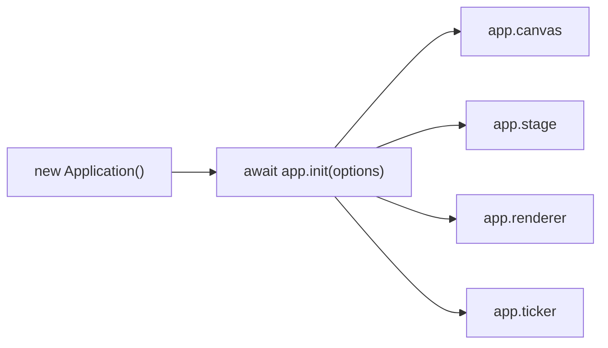

import { Canvas, Controls, Meta } from '@storybook/addon-docs/blocks';
import * as GettingStarted from './getting-started.stories';

<Meta of={GettingStarted} name="Docs" />

# 初始化

PixiJS v8 用 `Application` 把渲染器、画布、舞台（stage）和渲染循环打包成一个对象。和 v7 不同，v8 的构造函数不做任何初始化——必须 `await app.init(options)` 完成后才能拿到可用的 canvas、stage 和 ticker。init 选项一次性配置渲染器类型、画布尺寸、分辨率和背景，之后把 `app.canvas` 挂到 DOM 即可看到渲染结果。



| init 选项 | 默认值 | 作用 |
| --- | --- | --- |
| `width` / `height` | `800` / `600` | 画布 CSS 像素尺寸 |
| `background` | `0x000000`（黑） | 每帧清屏颜色；运行时改 `app.renderer.background.color` |
| `backgroundAlpha` | `1` | 背景不透明度；**初始化后不可改** |
| `resolution` | `1` | 设备像素比；HiDPI 屏设为 `window.devicePixelRatio` |
| `autoDensity` | `false` | 让 CSS 尺寸自动补偿 resolution |
| `resizeTo` | `null` | 自动跟随 Window / 元素调整画布尺寸 |
| `preference` | `'webgl'` | 渲染器优先顺序：`'webgpu'` / `'webgl'` / `'canvas'` |
| `antialias` | `false` | MSAA 抗锯齿 |
| `autoStart` | `true` | init 后是否立即开始渲染循环 |
| `clearBeforeRender` | `true` | 每帧渲染前是否清屏 |
| `canvas` | *（自动创建）* | 复用已有 `<canvas>` |
| `hello` | `false` | 在控制台打印渲染器版本与类型 |

## 创建并启动 Application

v8 把启动拆成两步：`new Application()` 只创建空壳，`await app.init(options)` 才真正初始化渲染器。之所以改成异步，是因为 WebGPU 渲染器的初始化本身就是异步的。

```ts
import { Application } from 'pixi.js';

const app = new Application();

await app.init({
  width: 800,
  height: 600,
  background: '#1099bb',
});

document.body.appendChild(app.canvas);
```

init 完成后，`app` 上同时就绪：

- **`app.canvas`** — 渲染目标的 `<canvas>` 元素，挂到 DOM 才可见。
- **`app.stage`** — 根容器，所有显示对象都加到它上面（场景图在「场景图与容器」课展开）。
- **`app.renderer`** — 渲染器实例（WebGL / WebGPU / Canvas），负责实际绘制。
- **`app.ticker`** — 渲染循环驱动器，默认 `autoStart: true`，init 后立即开始每帧渲染 stage。
- **`app.screen`** — `Rectangle`，表示画布可见区域的逻辑尺寸。

下面的实例在 init 完成后向 stage 添加一个旋转图形、注册 ticker 回调，证明这些对象在一次 init 后同时可用。实例复用了 Storybook 传入的画布，所以不需要 `appendChild`。

<Canvas of={GettingStarted.Interactive} />
<Controls of={GettingStarted.Interactive} />

| 读者操作 | 可观察证据 |
| --- | --- |
| 调整「背景色」 | 画布底色立即变化——对应 init 的 `background` 选项，运行时经 `app.renderer.background.color` 生效 |
| 查看左下角读数 | 显示当前渲染器类型（WebGL / WebGPU / Canvas）、分辨率和画布尺寸 |
| 打开 Show code | 看到该 Canvas 实际执行的 `getting-started.ts` |

## 把画布挂到页面

### 挂载自动创建的画布

不传 `canvas` 时，PixiJS 在 init 时自动创建一个 `<canvas>`，通过 `app.canvas` 取出后手动挂到 DOM：

```ts
await app.init({ width: 800, height: 600 });
document.body.appendChild(app.canvas);
```

### 复用已有画布

把一个已有的 `<canvas>` 传给 `init({ canvas })`，PixiJS 就用它做渲染目标，不再创建新画布。适合嵌入既有容器、组件框架或（如本课实例）Storybook Canvas：

```ts
const canvas = document.querySelector('#stage') as HTMLCanvasElement;
await app.init({ canvas, background: '#1a1a2e' });
// 不需要 appendChild——canvas 已在页面中
```

## 关键 init 选项

开场参考表列出了全部常用选项及默认值，下面展开最需要理解的两组。

### 画布尺寸与自适应

`width` / `height` 设定画布的 CSS 像素尺寸（默认 800 × 600）。如果希望画布跟随窗口或容器自动调整，传 `resizeTo`：

```ts
await app.init({ resizeTo: window });          // 全窗口
await app.init({ resizeTo: containerEl });     // 跟随容器元素
```

在 HiDPI / Retina 屏上，默认 `resolution: 1` 会让画面发糊。要获得清晰渲染，把 `resolution` 设为 `window.devicePixelRatio`，并配 `autoDensity: true` 让 CSS 尺寸自动补偿，避免画布显示尺寸错位：

```ts
await app.init({
  resolution: window.devicePixelRatio,
  autoDensity: true,
});
```

### 背景与渲染器选择

`background`（别名 `backgroundColor`）接受十六进制数、CSS 颜色字符串等 `ColorSource`，每帧用它清屏。注意 `backgroundAlpha` 初始化后不可改——要让画布透明，必须在 init 时就设 `backgroundAlpha < 1`。

`preference` 决定渲染器检测顺序。默认 `'webgl'`（最稳定），传字符串表示「优先尝试该渲染器再回退其余」：

```ts
await app.init({ preference: 'webgpu', hello: true });
// 控制台输出类似：PixiJS 8.x.x - WebGPU
```

`hello: true` 会在控制台打印最终选中的渲染器，用来确认 `preference` 的实际效果。用数组形式（如 `['webgpu', 'webgl']`）可精确限定只尝试列出的渲染器。

## 渲染循环自动运行

`autoStart` 默认为 `true`，init 后 ticker 立即开始每帧渲染 `app.stage`。无需手动调用 `render()`——只要把显示对象加到 stage，它们就会自动出现在画布上。注册逐帧回调用 `app.ticker.add`：

```ts
app.ticker.add(() => {
  shape.rotation += 0.02;
});
```

`app.start()` / `app.stop()` 可以暂停和恢复渲染循环。帧率调节、delta time、帧无关动画的完整用法在「渲染循环」课展开。

## 最佳实践

- **HiDPI 清晰度：** 面向浏览器的应用始终配 `resolution: window.devicePixelRatio` + `autoDensity: true`；只有分辨率固定且性能敏感的离屏渲染场景才保持默认 `1`。
- **渲染器选择：** 生产环境默认 `'webgl'` 最安全；只有在目标浏览器上验证过内容在 WebGPU 上正确渲染后，才固定 `preference: 'webgpu'`。
- **嵌入既有 UI：** 当画布必须挂载到组件框架、Storybook 或既有 DOM 节点时，始终传 `canvas` 复用已有元素，而不是让 PixiJS 创建后再 `appendChild`。

## 常见问题

- **`app.canvas` 是 `undefined`**
  init 是异步的，`await app.init()` 返回前 canvas 还未创建。确认在 `await` 之后才访问 `app.canvas`；Vite 等打包器下要把代码包在 async 函数里。
- **运行时把背景色改成半透明，画布仍然不透明**
  `backgroundAlpha` 默认 `1` 且初始化后不可改——canvas 在 init 时就被标记为不透明。即使运行时设置带 alpha 的背景色（控制台会告警），画布也不会变透明。要让画布支持透明，必须在 init 时就设 `backgroundAlpha < 1`。
- **设置了 `resolution` 后画布变得异常大或异常小**
  只设 `resolution` 不开 `autoDensity` 时，画布的后备存储会放大，但 CSS 尺寸不补偿，导致显示尺寸错位。始终把 `resolution` 和 `autoDensity: true` 配对使用。

## 总结回顾

摘要：

PixiJS v8 用 `new Application()` + `await app.init(options)` 两步完成启动：构造函数是空壳，异步 init 才创建渲染器、画布、stage 和 ticker，它们在 init 完成后同时可用。关键 init 选项覆盖画布尺寸（`width` / `height`）、自适应（`resizeTo`）、HiDPI 清晰度（`resolution` + `autoDensity`）、背景（`background` / `backgroundAlpha`）和渲染器选择（`preference`）。画布通过 `app.canvas` 挂到页面，或用 `init({ canvas })` 复用已有元素。init 后 `autoStart` 默认开启，ticker 自动每帧渲染 stage，只需注册回调做逐帧更新。

一句话：

> Application.init 是 v8 唯一的启动入口——它异步地一次性创建渲染器、画布、stage 和 ticker，init 完成前这些都不可用。

知识要点：

- 为什么要 `await app.init()`，它创建哪些对象？
- `app.canvas` 怎么挂到页面？什么情况下传已有 `canvas`？
- 哪些 init 选项影响 HiDPI 清晰度，怎么配？
- `backgroundAlpha` 为什么初始化后不可改？
- `preference` 默认选什么渲染器，怎么切换？
- init 后渲染循环是否自动开始？

## 参考资料

- [PixiJS 指南：Application](https://pixijs.com/8.x/guides/components/application)
- [PixiJS 快速开始](https://pixijs.com/8.x/guides/getting-started/quick-start)
- [PixiJS API：Application](https://pixijs.download/release/docs/app.Application.html)
- [PixiJS API：ApplicationOptions](https://pixijs.download/release/docs/app.ApplicationOptions.html)
- [v8 迁移指南](https://pixijs.com/8.x/guides/migrations/v8)
