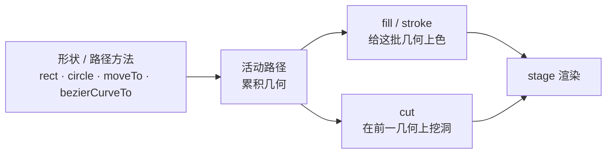

import { Canvas, Controls, Meta } from '@storybook/addon-docs/blocks';
import * as GraphicsStories from './graphics.stories';

<Meta of={GraphicsStories} name="Docs" />

# 图形绘制

Graphics 是 PixiJS 的矢量绘制对象：用代码画矩形、圆、椭圆、多边形、星形和自由曲线路径，再给它们填充颜色或描边。它和精灵（位图）互补——精灵显示现成的像素图，Graphics 画的是可缩放的矢量几何。

v8 的 Graphics 改用**「先画形、后上色」**的命令缓冲模型：先调用形状或路径方法把几何累积到一条活动路径，再用 `fill` / `stroke` 给这批几何上色。这个顺序和 v7 的 `beginFill → drawRect → endFill` 相反——很多旧教程的写法在 v8 里不再生效。把这层模型记牢，`fill`、`stroke`、`cut`、`clear` 的行为都能自然推导。

Graphics 本身是叶子显示对象（**不能 `addChild`**），所有绘制指令委托给一个可共享的 `GraphicsContext`。



| 方法 / 属性 | 默认值 | 作用 |
| --- | --- | --- |
| `rect(x, y, w, h)` | — | 矩形 |
| `roundRect(x, y, w, h, radius?)` | `radius` 可选 | 圆角矩形；`radius` 省略时为直角 |
| `circle(x, y, radius)` | — | 圆 |
| `ellipse(x, y, radiusX, radiusY)` | — | 椭圆；radiusX/Y 即横向、纵向半径（半宽 / 半高） |
| `poly(points, close?)` | `close` 可选 | 多边形；`points` 为 `[x1,y1,x2,y2,...]` |
| `star(x, y, points, radius, innerRadius?, rotation?)` | `innerRadius` 可选 | 星形；`innerRadius` 省略时约为外径一半 |
| `moveTo / lineTo / arc / 曲线` | — | 自由路径 |
| `fill({ color, alpha, ... })` | color `0xffffff`、alpha `1` | 填充前面的几何 |
| `stroke({ width, color, alignment, ... })` | width `1`、color `0xffffff`、alpha `1`、alignment `0.5`、cap `'butt'`、join `'miter'`、miterLimit `10` | 描边前面的几何 |
| `cut()` | — | 用前一个形状在已填充几何上挖洞 |
| `clear()` | — | 清空全部几何 |
| `GraphicsContext` | — | 底层可共享的绘制上下文 |

## 绘制模型：先画形、后上色

v8 的写法是「画形 → 上色」，与 v7 相反。形状方法只把几何加进活动路径，`fill` / `stroke` 才真正上色：

```ts
import { Graphics } from 'pixi.js';

const g = new Graphics();
g.rect(50, 50, 100, 100)                       // 1. 画形（进入活动路径）
 .fill(0xff0000)                               // 2. 填充这批几何
 .circle(200, 100, 40)                         // 3. 再画一个形
 .stroke({ width: 2, color: 0xffffff });       // 4. 给它描边
app.stage.addChild(g);
```

所有方法链式返回 `this`，可以串成一句。`fill` / `stroke` 作用于**自上次上色以来积累的几何**——所以画形必须写在上色之前。连续对同一路径 `fill` 再 `stroke` 时，PixiJS 会自动复用这条路径，不必重画。

对照 v7 的旧写法（v8 已废弃），帮你识别过时资料：

```ts
// v7（v8 不再支持）
new Graphics().beginFill(0xff0000).drawRect(50, 50, 100, 100).endFill();
// v8 等价写法
new Graphics().rect(50, 50, 100, 100).fill(0xff0000);
```

主要的命名变化：`drawRect` → `rect`、`drawCircle` → `circle`、`drawEllipse` → `ellipse`、`drawPolygon` → `poly`、`drawStar` → `star`、`drawRoundedRect` → `roundRect`；`beginFill` / `endFill` → `fill`、`lineStyle` → `stroke`、`beginHole` / `endHole` → `cut`。

## 形状与上色

基本形状方法的坐标都基于 Graphics 的局部坐标系（原点在它的 `position`），所以画在 `(0, 0)` 的形状会落在 Graphics 自身的定位点。常用形状：

| 方法 | 参数说明 |
| --- | --- |
| `rect(x, y, w, h)` | 矩形左上角与宽高 |
| `roundRect(x, y, w, h, radius?)` | `radius` 控制圆角，省略时为 0 |
| `circle(x, y, radius)` | 圆心与半径 |
| `ellipse(x, y, radiusX, radiusY)` | 横向半径、纵向半径（半宽 / 半高） |
| `poly(points, close?)` | 点数组 `[x1,y1,...]`；`close` 是否闭合 |
| `star(x, y, points, radius, innerRadius?, rotation?)` | `points` 指数，`innerRadius` 省略时约 `radius/2` |

上色有两种写法——颜色简写或样式对象：

```ts
// 颜色简写：数字、字符串、CSS 颜色名都行
g.rect(0, 0, 80, 80).fill(0x4f7cff);
g.circle(120, 40, 30).fill('red');

// 样式对象：控制透明度、描边宽度、对齐等
g.rect(0, 0, 80, 80).fill({ color: 0x4f7cff, alpha: 0.5 });
g.circle(120, 40, 30).stroke({ width: 4, color: 0xffffff, alignment: 0.5 });
```

样式对象字段与默认值：

| 字段 | fill 默认 | stroke 默认 | 说明 |
| --- | --- | --- | --- |
| `color` | `0xffffff` | `0xffffff` | 颜色（数字 / 字符串 / `Color`） |
| `alpha` | `1` | `1` | 透明度 |
| `width` | — | `1` | 描边宽度，`0` 等于无描边 |
| `alignment` | — | `0.5` | 描边相对路径边的位置，`0.5` 居中骑在边上 |
| `cap` | — | `'butt'` | 线帽：`'butt'` / `'round'` / `'square'` |
| `join` | — | `'miter'` | 拐角：`'miter'` / `'round'` / `'bevel'` |
| `miterLimit` | — | `10` | `miter` 拐角的最大斜接长度 |
| `texture` / `matrix` | — | — | 用纹理填充 / 描边，`matrix` 为纹理变换 |

`alignment` 是描边特有的：默认 `0.5` 让描边居中骑在路径边上，偏离 `0.5` 时描边会偏向某一侧。下面的实例把六种形状、描边宽度、对齐与填充透明度做成了可调控件，直观看到「画形 → fill → stroke」的顺序与样式效果。

<Canvas of={GraphicsStories.ShapeDemo} />
<Controls of={GraphicsStories.ShapeDemo} />

| 读者操作 | 可观察证据 |
| --- | --- |
| 切「形状」 | 画布上的几何切换为矩形 / 圆角矩形 / 圆 / 椭圆 / 星形 |
| 调「描边宽度 width」 | 描边变粗变细；降到 0 时描边消失，只剩填充 |
| 调「描边对齐 alignment」 | 描边相对形状边界明显偏移——`0.5` 居中，偏离后偏向某一侧 |
| 调「填充透明度 alpha」 | 填充区从全透明到全不透明渐变 |
| 打开 Show code | 看到该 Canvas 实际执行的 `shapes.ts` |

## 自由路径

形状方法覆盖常用几何，自由轮廓用路径方法拼。核心是 `moveTo`（抬笔到起点）+ `lineTo`（直线）+ 曲线方法，最后用 `closePath` 闭合、用 `fill` / `stroke` 上色：

```ts
g.moveTo(20, 20)
 .lineTo(120, 20)
 .quadraticCurveTo(180, 20, 180, 80)        // 二次贝塞尔（1 控制点 + 终点）
 .lineTo(180, 140)
 .closePath()                                // 闭合：从当前点连回子路径起点
 .fill({ color: 0x66d9a0, alpha: 0.6 })
 .stroke({ width: 3, color: 0x0f5132 });
```

路径方法清单：

- `moveTo(x, y)` / `lineTo(x, y)` — 抬笔到起点 / 画直线
- `arc(x, y, radius, startAngle, endAngle, counterclockwise?)` — 圆弧
- `arcTo(x1, y1, x2, y2, radius)` — 两切线间的圆角弧
- `bezierCurveTo(cp1x, cp1y, cp2x, cp2y, x, y)` — 三次贝塞尔（2 控制点 + 终点）
- `quadraticCurveTo(cpx, cpy, x, y)` — 二次贝塞尔（1 控制点 + 终点）
- `closePath()` — 闭合当前子路径

关于闭合：`fill` 一个开放路径时，PixiJS 会按闭合方式填充区域；`stroke` 只描实际的路径段，不画那条闭合线——要让描边也闭合，得显式 `closePath()`。

### 挖洞：cut

`cut` 和 `fill` / `stroke` 一样作用于前面的几何：先填充主形状，再画出洞的形状并 `cut()`，洞形状会从填充里被减去。

```ts
g.circle(0, 0, 60).fill(0x4f7cff)            // 先填充主圆
 .circle(0, 0, 20).cut();                    // 再画小圆并 cut，挖出一个洞
```

下面的实例用两条三次贝塞尔曲线拼出一个心形路径，让你开关填充、描边和挖洞，观察三种上色方式如何作用于同一条自由路径。

<Canvas of={GraphicsStories.PathDemo} />
<Controls of={GraphicsStories.PathDemo} />

| 读者操作 | 可观察证据 |
| --- | --- |
| 关「填充 fill」 | 实心心形变透明，只剩描边轮廓 |
| 关「描边 stroke」 | 轮廓消失，只剩填充面 |
| 关「挖洞 cut」 | 心形上的圆洞被补回，证明 `cut` 作用于前面的填充几何 |
| 打开 Show code | 看到该 Canvas 实际执行的 `paths.ts` |

## GraphicsContext：共享与热切换

Graphics 把所有绘制指令委托给内部的 `GraphicsContext`（通过 `graphics.context` 访问）。多个 Graphics 可以**共享同一个 context**，GPU 只构建一份几何：

```ts
import { Graphics, GraphicsContext } from 'pixi.js';

const ctx = new GraphicsContext().circle(0, 0, 40).fill(0xff5a7a);
const a = new Graphics(ctx);
const b = new Graphics(ctx);                 // 共享同一份几何
```

热切换 `graphic.context` 是很便宜的操作——预构建好几套几何，运行时只换 context 就能变样，不必每帧重画：

```ts
const ctxA = new GraphicsContext().circle(0, 0, 40).fill(0xff5a7a);
const ctxB = new GraphicsContext().rect(-40, -40, 80, 80).fill(0x4f7cff);
const g = new Graphics(ctxA);
app.stage.addChild(g);
g.context = ctxB;                            // 切换显示，无需重画
```

销毁注意：销毁一个被共享的 `GraphicsContext` 会影响所有引用它的 Graphics。用 `graphics.destroy({ context: true })` 会连同内部 context 一起销毁。

## 最佳实践

- **每帧重画用换 context，别 clear + rebuild。** `clear()` 会丢弃几何并触发重建上传，逐帧调用会拖垮性能。需要动态变样时预构建多个 `GraphicsContext`，运行时切换 `graphic.context`。仅在响应用户操作（偶发）时 `clear` + 重画才可接受。
- **多个简单 Graphics 优于一个复杂 Graphics。** 后者会打断 GPU 批渲染（batching）；把大量独立形状拆成多个简单 Graphics 对象，能让渲染器更好地批处理。
- **同一形状既填又描时，连续 fill + stroke。** 紧跟在画形之后的 `fill` 与 `stroke` 会自动复用同一条路径，不必重画两次。
- **整体半透明用 `graphics.alpha`。** Graphics 内多个半透明图元会逐个参与合成，重叠区域颜色叠加；要让整个 Graphics 统一半透明，设 `graphics.alpha`（整体），或先渲染到 `RenderTexture` 拍平再降透明。

## 常见问题

- **旧教程的 `beginFill` / `drawRect` / `endFill` 报错或不生效**
  v8 改成「先画形、后上色」：`rect().fill()`、`circle().stroke()`。`drawRect` → `rect`、`drawCircle` → `circle`、`drawStar` → `star`、`drawPolygon` → `poly`、`drawRoundedRect` → `roundRect`；`beginFill` / `endFill` → `fill`、`lineStyle` → `stroke`。
- **给 Graphics `addChild` 报错或加了子节点不显示**
  Graphics 是叶子显示对象（`allowChildren` 为 `false`），不能挂子节点。要嵌套就把 Graphics 和其他对象一起放进一个 `Container`。
- **画了形状却没有颜色**
  `fill` / `stroke` 作用于**调用时积累的几何**，画形必须写在上色之前。顺序写反（先 `fill` 后画形）会去填充一条空路径。先 `rect(...)` 再 `fill(...)`。
- **描边看起来偏内或偏外**
  `stroke` 的 `alignment` 控制，默认 `0.5` 居中。把它调回 `0.5`，或按需要调到 `0` / `1` 让描边偏向某一侧。
- **`cut` 后描边也跟着少一块 / 描边上看不到洞**
  `cut` 主要作用于填充几何（在三角化时挖洞），描边是独立的轮廓。要让轮廓也表现洞，需另外为描边路径单独处理。

## 总结回顾

摘要：

Graphics 用「先画形、后上色」的命令缓冲模型：形状与路径方法把几何累积到活动路径，`fill` / `stroke` 再给这批几何上色，`cut` 在已填充几何上挖洞。基本形状有 `rect` / `roundRect` / `circle` / `ellipse` / `poly` / `star`，自由路径由 `moveTo` / `lineTo` / `arc` / `bezierCurveTo` / `quadraticCurveTo` / `closePath` 拼出。`fill` 与 `stroke` 各接受颜色简写或样式对象，stroke 默认 width `1`、alignment `0.5`、cap `'butt'`、join `'miter'`、miterLimit `10`，fill 与 stroke 默认 alpha 都是 `1`。Graphics 是叶子节点，绘制指令委托给可共享、可热切换的 `GraphicsContext`；逐帧变样用换 context，不要 `clear` + rebuild。

一句话：

> 先把几何画进活动路径，再用 fill / stroke / cut 给这批几何上色——顺序与 v7 相反。

知识要点：

- v8 的绘制顺序是什么？和 v7 的 beginFill / drawRect / endFill 有何不同？
- `fill` / `stroke` 作用于哪一批几何？画形和上色谁先谁后？
- 六个基本形状方法各自的参数含义是什么？
- `stroke` 的 width、alignment 默认值各是多少？
- `cut` 怎样在已填充几何上挖洞？它依赖什么前置条件？
- 为什么每帧重画应该换 `GraphicsContext` 而不是 `clear`？
- Graphics 能不能 `addChild`？绘制指令实际存放在哪里？

## 参考资料

- [PixiJS 指南：Graphics](https://pixijs.com/8.x/guides/components/scene-objects/graphics)
- [PixiJS API：Graphics](https://pixijs.download/release/docs/scene.Graphics.html)
- [PixiJS API：GraphicsContext](https://pixijs.download/release/docs/scene.GraphicsContext.html)
- [PixiJS v8 迁移指南](https://pixijs.com/8.x/guides/migrations/v8)
