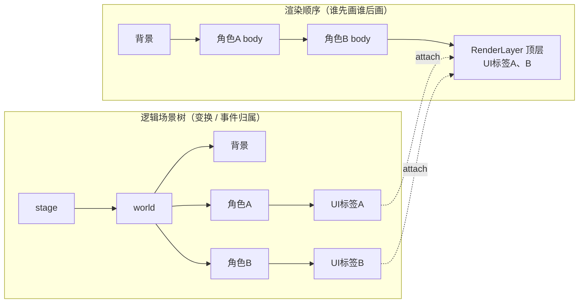

import { Canvas, Controls, Meta } from '@storybook/addon-docs/blocks';
import * as LayersStories from './layers.stories';

<Meta of={LayersStories} name="Docs" />

# 层级与分组

PixiJS 默认按 `addChild` 的顺序绘制场景树：先加入的画在底层，后加入的画在上层。但真实项目里经常要打破这个顺序——血条要始终盖在角色身上、UI 不能被世界滤镜影响、视口外的对象不该浪费 GPU。v8 用四套**独立**机制处理这类需求，它们各自回答不同的问题，弄清「回答的是哪个问题」就不会用错：

- **`zIndex` + `sortableChildren`** — 在同一父容器内按 z 值重排兄弟节点。
- **`RenderLayer`** — 把对象的**渲染归属**从逻辑父子中剥离：对象仍挂在逻辑父下（变换、事件不变），但渲染时画到另一层。
- **`RenderGroup`** — 名字像 layer，其实是**渲染优化**：把子树打成 GPU 批次，整体移动更便宜。
- **Culling** — 跳过视口外对象的渲染。

关键区分是「渲染顺序」和「逻辑父子」是两件事：逻辑父子决定变换与事件归属，渲染顺序决定先画谁后画谁。`zIndex` 在逻辑树内微调顺序，`RenderLayer` 让渲染顺序脱离逻辑树，`RenderGroup` 不改顺序只改效率，Culling 不改顺序只跳过不可见的。下面的三个实例分别对应前三类机制中需要观察的部分。



| 机制 | 默认值 | 解决什么 | 关键 API |
| --- | --- | --- | --- |
| `zIndex` / `sortableChildren` | `zIndex: 0`、`sortableChildren: false` | 同一父容器内按 z 值重排子节点 | `child.zIndex`、`container.sortableChildren`、`sortChildren()` |
| `RenderLayer` | — | 跨层级改渲染归属：对象保留逻辑父但渲染到另一层 | `layer.attach(child)`、`detach(child)`、`sortRenderLayerChildren()` |
| `RenderGroup` | `isRenderGroup: false` | 渲染优化：子树合成成 GPU 批次，整体移动 / 调透明更便宜 | `new Container({ isRenderGroup: true })`、`enableRenderGroup()` |
| Culling | `cullable: false`、`cullableChildren: true` | 跳过视口外对象的渲染 | `container.cullable`、`cullArea`、`Culler.shared.cull()`、`extensions.add(CullerPlugin)` |

## zIndex 与排序

`zIndex` 是显示对象上的一个数字（默认 `0`），但它**只在同一父容器的兄弟之间**比较，而且必须把父容器的 `sortableChildren` 打开才生效。三者缺一不可：

- 默认 `sortableChildren: false` —— `zIndex` 被完全忽略，渲染顺序就是 `addChild` 顺序。
- `sortableChildren: true` —— 每帧 `updateTransform` 时自动按 `zIndex` 升序排子节点；值越大越靠后绘制（越在上层）。
- 需要立刻同步顺序（不等到下一帧）时，手动调 `container.sortChildren()`。

```ts
import { Container } from 'pixi.js';

const parent = new Container();
parent.sortableChildren = true;  // 打开后 zIndex 才生效

child1.zIndex = 1;
child2.zIndex = 10;              // child2 渲染在 child1 之上
```

`zIndex` 是**局部**的：只有同一个父容器下的兄弟互相比较。父容器自身的 `zIndex` 决定它相对于自己兄弟的位置，但无法用它让「某容器深处的一个孙节点」跨层级浮到另一个容器之上——跨层级的顺序问题由下面的 `RenderLayer` 解决。

下面的实例把 A/B/C 三张卡片的 `zIndex` 固定为 0/1/2，P 卡片的 `zIndex` 可调。切 `sortableChildren` 看顺序是否还随 `zIndex` 变，调 P 的 `zIndex` 看它能否沉到最底或浮到最顶。

<Canvas of={LayersStories.ZIndexDemo} />
<Controls of={LayersStories.ZIndexDemo} />

| 读者操作 | 可观察证据 |
| --- | --- |
| 关闭 `sortableChildren` | 无论 P 的 `zIndex` 多少，P 始终在最上层（`addChild` 顺序决定渲染栈） |
| 开启 `sortableChildren`，把 P 的 `zIndex` 调到负值 | P 沉到 A 之下；读数「渲染栈」把 P 移到最左（最底层） |
| 把 P 的 `zIndex` 调到大于 2 | P 浮到 C 之上；读数「渲染栈」把 P 移到最右（最顶层） |
| 打开 Show code | 看到该 Canvas 实际执行的 `z-index.ts`，含 `sortChildren()` 如何同步读数 |

## RenderLayer

`RenderLayer` 是 v8 的层 API，用来把对象的**渲染归属**从它的逻辑父子中剥离。被 `attach` 的对象仍然是它逻辑父的子节点（继承变换、参与事件、位置跟随父级移动），但渲染时不再画在逻辑父所在的层，而是画到这个 `RenderLayer` 所在的位置——通常放在 `stage` 顶层，从而永远盖在其它内容之上，也不被逻辑父上的滤镜 / 蒙版影响。

```ts
import { Application, Container, RenderLayer, Sprite } from 'pixi.js';

const app = new Application();
await app.init({ width: 800, height: 600 });

const world = new Container();        // 世界容器，可能挂滤镜
const character = new Container();    // 角色，逻辑上属于 world
const healthBar = new Container();    // 血条，逻辑上是角色的子节点
character.addChild(healthBar);
world.addChild(character);
app.stage.addChild(world);

const uiLayer = new RenderLayer();
app.stage.addChild(uiLayer);          // RenderLayer 本身要进场景树
uiLayer.attach(healthBar);            // 血条渲染归属转移到 uiLayer，但仍跟随角色移动
```

几条直接影响结果的行为：

- **`attach` 不等于 `addChild`。** `RenderLayer` 不接管逻辑父子，所以**不要**用 `addChild` / `removeChild` 管理它的成员，只能用 `attach` / `detach` / `detachAll`。
- **一个对象同时只能属于一个 `RenderLayer`。** `attach` 到新层会自动从旧层 `detach`；对象的 `parentRenderLayer` 属性记录它当前所属的层。
- **从逻辑父 `removeChild` 会自动把它从 `RenderLayer` 移除**；但之后重新加回场景树**不会自动 reattach**，要再手动 `attach` 一次。
- **层内排序用 `zIndex`。** 给 `RenderLayer` 设 `sortableChildren: true`，再调 `layer.sortRenderLayerChildren()`；也可在构造时传 `sortFunction` 做自定义排序（如按 y 坐标排远近）。

```ts
// 按 y 坐标排序，让「下面的」角色盖住「上面的」（2D 伪 3D 常用）
const layer = new RenderLayer({
  sortableChildren: true,
  sortFunction: (a, b) => a.position.y - b.position.y,
});
```

典型用途：血条 / 名牌始终盖在角色身上、教程里高亮对象永远在前、UI 不被世界位移滤镜扭曲。下面的实例里 `world` 挂了 `AlphaFilter`（让留在 world 内的对象半透明），三个角色的 UI 标签可切换渲染归属：切到 `RenderLayer` 时标签脱离 world 滤镜、恢复不透明并置顶，但位置仍跟随角色浮动。

<Canvas of={LayersStories.RenderLayerDemo} />
<Controls of={LayersStories.RenderLayerDemo} />

| 读者操作 | 可观察证据 |
| --- | --- |
| 关闭「attach 到 RenderLayer」 | 3 个 UI 标签和角色一样半透明（被 world 的 AlphaFilter 影响） |
| 开启「attach 到 RenderLayer」 | 3 个 UI 标签恢复完全不透明、浮在所有内容之上 |
| 观察标签位置 | 开启后标签仍随角色上下浮动——变换归属（逻辑父）未变，只有渲染归属变了 |
| 打开 Show code | 看到该 Canvas 实际执行的 `render-layer.ts`，含 `attach` / `detach` 切换 |

## RenderGroup

`RenderGroup` 名字里带 group，容易和 `RenderLayer` 混，但它**完全是另一回事**：它是渲染层的优化，不改渲染顺序，也不改逻辑父子。把一个容器提升为 `RenderGroup` 后，PixiJS 把它的子树合成成一个 GPU 批次，之后**移动整个组、调 `alpha` / `tint`** 都在 GPU 侧完成，CPU 几乎零开销。

两种启用方式：

```ts
import { Container } from 'pixi.js';

// 构造时指定（静态场景）
const hud = new Container({ isRenderGroup: true });

// 运行时提升
const world = new Container();
world.enableRenderGroup();
```

| 属性 / 方法 | 默认 | 说明 |
| --- | --- | --- |
| `isRenderGroup` | `false` | 是否作为独立渲染组 |
| `enableRenderGroup()` | — | 运行时把容器提升为 RenderGroup |
| `renderGroup` | — | 底层 `RenderGroup` 对象，`cacheAsTexture` 等高级用法挂在这里 |

几点判断依据：

- **被渲染的根（`stage`）自动是 RenderGroup**；你额外创建的是它内部的子批次。
- **适合内容稳定的子树**：UI / HUD、视差背景、`ParticleContainer` 之外的粒子组、大块整体移动的场景层。它们每帧只是整体变换，内容很少重绘。
- **不适合内容每帧变化的子树**：子树内部频繁重绘（如实时变形的 Graphics）会让合成的缓存反复失效，反而更贵。

`RenderGroup` 与 `RenderLayer` 的分工：`RenderGroup` 优化「怎么画」（合批省 CPU），`RenderLayer` 控制「画在哪一层」（渲染顺序归属）。两者可以独立使用，也可以一起用。

## 视口剔除

Culling 让落在视口（可见矩形）之外的对象不进入渲染管线，省下对它们的处理与提交开销。v8 把 culling 从自动渲染循环里**移除了**，交给用户控制：你要么手动调 `Culler.shared.cull()`，要么注册 `CullerPlugin` 让它每帧自动剔除。默认什么都不发生。

三个容器属性控制剔除行为：

| 属性 | 默认 | 说明 |
| --- | --- | --- |
| `cullable` | `false` | 这个容器是否可被剔除 |
| `cullableChildren` | `true` | 是否递归剔除后代 |
| `cullArea` | `null` | 自定义剔除区域（`Rectangle`），替代按 bounds 判断 |

两种触发方式：

```ts
import { Container, Culler, extensions, CullerPlugin } from 'pixi.js';

const world = new Container();
world.cullable = true;          // 这个容器可被剔除
world.cullableChildren = true;  // 后代也递归剔除

// 方式一：手动剔除（完全由你控制时机）
Culler.shared.cull(world, app.screen);
app.renderer.render(world);

// 方式二：注册 CullerPlugin，每帧渲染前自动剔除（等价于旧版自动行为）
extensions.add(CullerPlugin);
```

`CullerPlugin` 内部把 `app.renderer.render({ container: app.stage })` 替换成「先 `Culler.shared.cull(app.stage, app.screen)` 再 render」。手动方式适合你想精确控制剔除时机（如相机移动后才剔除）；插件方式适合「装上就忘」。`cullArea` 在 bounds 计算很贵或不准时用自定义矩形替代。

下面的实例铺了 16×16 = 256 个方块，画布只显示中间一部分，`world` 缓慢平移让方块进出视口。开关 `cullable` 看读数变化——视口外的方块本就不可见，所以画面看起来不变，这正是剔除的价值：它们不再被渲染管线处理。

<Canvas of={LayersStories.CullingDemo} />
<Controls of={LayersStories.CullingDemo} />

| 读者操作 | 可观察证据 |
| --- | --- |
| 观察「视口内」「已剔除」读数 | 随 `world` 平移实时变化；视口外方块被计入「已剔除」 |
| 关闭 `cullable` | 「已剔除」恒为 0（即便对象在视口外，仍进入渲染管线） |
| 对照橙色视口框 | 框内 = 视口内对象；框外 = 被剔除对象 |
| 打开 Show code | 看到该 Canvas 实际执行的 `culling.ts`，含每帧 `Culler.shared.cull` 调用 |

## 最佳实践

- **局部排序用 `zIndex`，跨层级用 `RenderLayer`。** 只要在同一父容器内重排兄弟，`sortableChildren` + `zIndex` 最轻量；要让对象脱离所在容器渲染（置顶、避开父级滤镜），用 `RenderLayer.attach`。
- **`RenderLayer` 排序先开 `sortableChildren` 再调 `sortRenderLayerChildren()`。** 它不会像普通 `Container` 那样每帧自动排；需要每帧排序（如按 y 排远近）时在 `ticker` 里调用。
- **`RenderGroup` 给内容稳定的子树，别给每帧重绘的子树。** UI / HUD / 视差背景适合；实时变形的 Graphics 不适合，缓存失效反而更贵。
- **大世界配 Culling，二选一触发方式。** 场景大、相机移动多时务必开 culling；相机逻辑简单用 `CullerPlugin`「装上就忘」，需要精确控制时机就手动 `Culler.shared.cull(world, cameraView)`。
- **`RenderGroup` 优化效率，`RenderLayer` 控制顺序，不要混为一谈。** 需要置顶用 `RenderLayer`，需要合批省 CPU 用 `RenderGroup`，两者可叠加。

## 常见问题

- **设了 `zIndex` 却没有任何效果**
  `sortableChildren` 默认是 `false`，此时 `zIndex` 被完全忽略。把父容器的 `sortableChildren` 设成 `true`，或手动调 `sortChildren()`。另外确认你比的是同一个父容器下的兄弟——`zIndex` 不跨层级。
- **想让深处的一个对象浮到另一个容器之上，`zIndex` 调多大都没用**
  `zIndex` 只在兄弟间比较。跨层级的渲染顺序要用 `RenderLayer`：`new RenderLayer()` 加进 `stage`，再 `layer.attach(thatObject)` 把它的渲染归属提到顶层。
- **`RenderLayer.attach` 之后对象不见了**
  `RenderLayer` 本身要先 `addChild` 进场景树（通常 `app.stage.addChild(renderLayer)`）。`attach` 只转移渲染归属，不会自动把层放进场景；另外不要用 `addChild` 往 `RenderLayer` 里加成员，那不是它的用法。
- **`RenderGroup` 和 `RenderLayer` 到底什么区别**
  `RenderGroup` 是性能优化（把子树合批到 GPU，整体移动 / 调透明更便宜），不改渲染顺序；`RenderLayer` 是渲染顺序控制（让对象脱离逻辑父渲染到另一层）。一个回答「怎么画更省」，一个回答「画在哪一层」。
- **开了 `cullable` 却没有剔除发生**
  v8 默认不自动剔除。要么注册插件 `extensions.add(CullerPlugin)` 让它每帧自动 `cull`，要么自己每帧调 `Culler.shared.cull(container, view)`；`view` 通常传 `app.screen`。同时确认容器的 `cullable` 是 `true`。
- **对象被 `removeChild` 后重新加回，`RenderLayer` 没有自动恢复**
  从逻辑父移除会自动从 `RenderLayer` 脱离，但重新加回场景树不会自动 reattach。需要再次 `layer.attach(obj)` 重建渲染归属。

## 总结回顾

摘要：

PixiJS v8 用四套独立机制管理渲染层级。`zIndex`（默认 `0`）配合 `sortableChildren`（默认 `false`）在同一父容器的兄弟间按 z 值重排——必须打开 `sortableChildren` 或手动 `sortChildren()` 才生效，且只在兄弟间比较、不跨层级。`RenderLayer` 用 `attach` / `detach` 把对象的渲染归属从逻辑父子中剥离：对象仍继承逻辑父的变换与事件，但渲染到 `RenderLayer` 所在的层，从而置顶、避开父级滤镜，并通过 `sortableChildren` + `sortRenderLayerChildren()`（或构造时传 `sortFunction`）在层内排序。`RenderGroup`（`isRenderGroup` / `enableRenderGroup()`）是渲染优化而非排序：把内容稳定的子树合批到 GPU，整体移动 / 调透明更便宜，每帧重绘的子树不适合。Culling 默认不启用，靠 `cullable`（默认 `false`）、`cullableChildren`（默认 `true`）、`cullArea` 三个属性配合 `Culler.shared.cull(container, view)` 手动剔除或 `extensions.add(CullerPlugin)` 自动剔除，跳过视口外对象的渲染。

一句话：

> `zIndex` 排兄弟，`RenderLayer` 换渲染归属，`RenderGroup` 省 GPU，Culling 跳过视口外——四者各管一件事，不要混用。

知识要点：

- `zIndex` 默认值是多少？为什么设了却不生效？
- `zIndex` 的比较范围是兄弟还是全局？想让深处对象浮到别的容器之上该用什么？
- `RenderLayer` 的 `attach` 和 `addChild` 有什么区别？为什么不能混用？
- `attach` 之后对象的变换跟随谁？为什么它还能避开逻辑父上的滤镜？
- 对象从逻辑父移除后再加回，`RenderLayer` 会自动恢复吗？
- `RenderGroup` 改的是渲染顺序还是渲染开销？什么样的子树不适合用它？
- Culling 默认是自动的吗？要让它生效有哪两种触发方式？
- `cullable` 和 `cullableChildren` 的默认值分别是什么？

## 参考资料

- [PixiJS 指南：Render Layers](https://pixijs.com/8.x/guides/concepts/render-layers)
- [PixiJS 指南：Render Groups](https://pixijs.com/8.x/guides/concepts/render-groups)
- [PixiJS 指南：Container](https://pixijs.com/8.x/guides/components/scene-objects/container)
- [PixiJS 指南：Culler Plugin](https://pixijs.com/8.x/guides/components/application/culler-plugin)
- [PixiJS API：RenderLayer](https://pixijs.download/release/docs/scene.RenderLayer.html)
- [PixiJS API：Container](https://pixijs.download/release/docs/scene.Container.html)
- [v8 迁移指南](https://pixijs.com/8.x/guides/migrations/v8)
