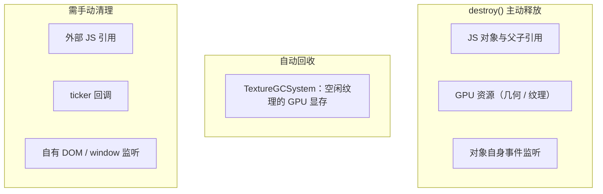

import { Canvas, Controls, Meta } from '@storybook/addon-docs/blocks';
import * as Lifecycle from './lifecycle.stories';

<Meta of={Lifecycle} name="Docs" />

# 内存与生命周期

PixiJS 的内存释放分两层：JS 对象层靠 `destroy()` 显式断开引用、释放 GPU 资源，GPU 纹理层靠手动 `unload` 或 `TextureGCSystem` 自动回收。`destroy` 不是 JavaScript 垃圾回收——它是 PixiJS 的主动释放入口，不调用就留在内存里。避免泄漏的核心是：按需要的范围组合 destroy 选项、区分共享与独占纹理、清理外部引用与回调。



| destroy 选项 | 默认值 | 作用 |
| --- | --- | --- |
| `children` | `false` | 是否递归 `destroy` 所有子级 |
| `texture` | `false` | 是否销毁子级 Sprite / Text 引用的 `Texture` |
| `textureSource` | `false` | 是否销毁底层 `TextureSource`（占 GPU 显存）；v7 称 `baseTexture` |
| `context` | `false` | 是否销毁 `Graphics` 的绘制上下文 |
| `style` | `false` | 是否销毁 `Text` 的 `TextStyle` |

`Application.destroy` 另有 `removeView`（默认 `false`）控制是否从 DOM 移除 `app.canvas`。自动纹理 GC 的默认值见下文「纹理与资源释放」。

## 销毁显示对象

`Container.destroy(options)` 是显示对象的统一释放入口。它做四件事：把自身从父级移除、清空并（按选项）销毁子级、移除所有事件监听、销毁 `renderGroup`。**默认不递归销毁子级**——传 `false` 或不传时，子级被 `removeChildren` 脱离父级，但对象本身完整保留，只是成了脱离场景树的「孤儿」。

```ts
const group = new Container();
group.addChild(spriteA, spriteB);

group.destroy();                    // 仅销毁 group：spriteA/B 脱离树但 destroyed=false
group.destroy({ children: true });  // 递归：spriteA/B.destroyed=true，GPU 资源释放
```

`options` 为 `boolean` 时等价于 `{ children: <值> }`。子级若被别处引用，`destroyed` 标记可用来判断它是否还能用。下面的实例把同一个批次在两种选项下销毁，读数显示被销毁与孤儿子级的数量差。

<Canvas of={Lifecycle.Interactive} />
<Controls of={Lifecycle.Interactive} />

| 读者操作 | 可观察证据 |
| --- | --- |
| 切换「递归销毁子级」 | 读数「子级已销毁」在 6/6 与 0/6 之间切换，「孤儿子级」反向变化 |
| 查看画面提示 | 顶部文字同步显示当前轮的销毁结论 |
| 打开 Show code | 看到该 Canvas 实际执行的 `lifecycle.ts` |

`Sprite`、`Graphics`、`Text` 都继承自 `Container`，同样用 `destroy(options)`。`texture` / `textureSource` / `context` / `style` 只对持有对应资源的对象生效——`Graphics` 看 `context`、`Sprite` 看 `texture` / `textureSource`、`Text` 看 `style`；选项与对象类型不匹配时无副作用。

## Application 的销毁

`Application.destroy(rendererDestroyOptions?, options?)` 是应用级总开关。它依次释放 ticker、`app.stage`（用 `options` 递归销毁整棵场景树）和 renderer（释放 WebGL / WebGPU 上下文与 GPU 资源），并按 `removeView` 决定是否从 DOM 移除 canvas。

```ts
app.destroy();    // 停止渲染并释放场景树与 renderer；canvas 留在 DOM
app.destroy(      // 完整释放：
  { removeView: true },                 // renderer 选项：连 canvas 一起从 DOM 移除
  { children: true, texture: true, textureSource: true }, // display 选项：传给 stage.destroy
);
```

第一个参数是 renderer 的销毁选项，传 `true` 是 `{ removeView: true }` 的简写；第二个参数是传给 `stage.destroy` 的 `DestroyOptions`。**单页应用切换页面、组件框架卸载组件时必须调用 `app.destroy()`**，否则 ticker 持续运行、GPU 上下文不释放，是典型的应用级泄漏。

本课实例复用了共享外壳的 `dispose()` 模式——离开 Docs 页时 canvasStory 自动调用实例的 `dispose()`，里面执行 `app.destroy(true, { children: true })`：

```ts
function dispose() {
  disposed = true;
  visibilityObserver.disconnect();
  resizeObserver.disconnect();
  if (ready) {
    app.destroy(true, { children: true });
  }
}
```

若 `app.init()` 还在进行中就触发了 `dispose`，要在 `init().then()` 里检查 `disposed` 标记后再 `destroy`，避免初始化与销毁竞态——init 完成时如果已经销毁，直接 `app.destroy()` 返回。

## 纹理与资源释放

纹理是 PixiJS 里最容易泄漏的资源，因为它独占 GPU 显存。v8 把 v7 的 `BaseTexture` 重构为 `TextureSource`：`Texture` 是渲染用的采样描述，`TextureSource` 是真正占 GPU 显存的数据源。两层各有自己的释放入口。

### Texture 与 TextureSource

`Texture.destroy(destroySource = false)` 默认只销毁 `Texture` 自身（解绑 `TextureSource` 的 resize 事件、清自身状态），**保留共享的 `TextureSource`**。这对共享同一图集 / spritesheet 的多个纹理是安全的——其他引用同一 source 的纹理继续工作。只有当这个纹理独占 source 时才传 `true`：

```ts
const tex = Texture.from('hero.png');
sprite.destroy({ texture: true });   // 销毁 sprite 引用的 tex（默认不碰 source）
tex.destroy(true);                    // 独占时连 TextureSource 一起释放
```

显示对象 `destroy({ texture: true, textureSource: true })` 会把这两步合并：先销毁每个子级引用的 `Texture`，再销毁其 `TextureSource`。**共享 source 的精灵不要带 `textureSource: true`**——第一个精灵销毁时 source 就被释放，其余精灵的纹理立即失效。

### Assets 缓存与自动 GC

经 `Assets` 加载的资源会进缓存，`destroy` 不会自动清缓存。三种释放方式覆盖不同范围：

```ts
await Assets.unload('hero.png');   // 从缓存移除并释放；再次访问需重新加载
texture.unload();                   // 从 GPU 卸载显存，保留数据，需要时再上传
texture.source.unload();            // 同上，精确到 TextureSource 层
```

`Assets.unload` 释放最彻底（缓存 + GPU），`texture.unload()` 只卸 GPU 显存但保留 CPU 端数据，适合「暂时不用、稍后还要」的场景。除此之外，`TextureGCSystem` 会在渲染循环里自动回收长时间未用的纹理显存：

| init 选项 | 默认值 | 作用 |
| --- | --- | --- |
| `textureGCActive` | `true` | 是否开启 GPU 纹理自动 GC |
| `textureGCMaxIdle` | `3600` | 纹理空闲多少帧后从 GPU 回收（约 60 秒 @60fps） |
| `textureGCCheckCountMax` | `600` | 每隔多少帧扫描一次未用纹理 |

自动 GC 只管 GPU 显存，不管 JS 对象——被 JS 引用持有的纹理对象不会被回收。需要立即释放或大量短生命周期纹理（过场、关卡切换）时，手动 `unload` / `Assets.unload` 比等 GC 更可控。

## 引用、回调与监听

`destroy` 会自动移除显示对象自身的所有事件监听（`removeAllListeners`）并把它从父级摘掉，但**不处理 PixiJS 外部持有的引用和回调**。这三类需要手动清：

- **外部引用**：把显示对象存到了数组、Map、组件状态里。`destroy` 不改这些引用，对象不会进 JS GC。销毁后置 `null` 或从集合移除。
- **ticker 回调**：`app.ticker.add(fn)` 注册的逐帧回调，`destroy` 不会移除（除非回调所在对象本身被 `destroy`）。用 `app.ticker.remove(fn)` 或在销毁钩子里清。
- **自有 DOM 监听**：自己在 `window` / `document` 上加的 `resize`、`keydown` 等监听，`destroy` 完全不涉及。对应 `removeEventListener`。

```ts
const onResize = () => renderer.resize(window.innerWidth, window.innerHeight);
window.addEventListener('resize', onResize);
app.ticker.add(tick);

// 销毁时
window.removeEventListener('resize', onResize);
app.ticker.remove(tick);
sprite.destroy({ children: true });
sprite = null;   // 断开外部引用，让 JS GC 能回收
```

判断是否泄漏：Chrome DevTools Memory 面板对 PixiJS 对象做堆快照，搜索 `Container` / `Sprite` / `TextureSource` 计数；Performance 面板的 GPU 内存曲线能看出纹理显存是否回落。

## 最佳实践

- **destroy 选项匹配所有权：** 销毁自己创建并独占的子树用 `{ children: true, texture: true, textureSource: true }`；只借来用的子级先 `removeChildren()` 再销毁容器，避免误伤别人的纹理。
- **共享纹理走 unload 而非 destroy source：** 图集 / spritesheet 的 source 被多个精灵共享，用 `texture.unload()` 控制 GPU 显存，不要在精灵 `destroy` 时带 `textureSource: true`。
- **页面级销毁走 app.destroy：** 组件卸载、路由切换、SPA 页面退出时调 `app.destroy(true, { children: true })`，一次释放 ticker、场景树、renderer 和 DOM 画布。
- **临时大量纹理配 unload + Assets.unload：** 过场动画、关卡切换等短生命周期纹理，用完立即 `Assets.unload` 释放缓存，让自动 GC 不必等满 3600 帧。

## 常见问题

- **`removeChild` 之后 GPU 内存没降**
  `removeChild` 或 `destroy()` 不传选项，只把对象移出场景树，不释放 GPU 资源。必须 `destroy({ children: true })` 才触发纹理 / 几何体的释放。
- **销毁一个精灵后，其他共享同一纹理的精灵变白或消失**
  销毁时带了 `textureSource: true`，共享的 `TextureSource` 被释放。共享 source 时只 `destroy({ texture: true })` 或干脆不带 texture 选项，改用 `texture.unload()` 控制 GPU 显存。
- **`destroy` 之后对象还在内存里**
  `destroy` 释放 PixiJS 内部资源，但不改变你持有的 JS 引用。检查是否把对象存到了数组、Map 或组件 state，销毁后把这些引用置空，JS GC 才会回收。
- **ticker 回调还在跑、报错访问已销毁对象**
  `destroy` 不移除你用 `app.ticker.add` 注册的回调。在销毁前 `app.ticker.remove(fn)`，或在回调里检查 `sprite.destroyed` 提前返回。
- **切换页面后 GPU 内存持续上涨**
  没调 `app.destroy()`，ticker 仍在跑、renderer 上下文未释放。每个 `Application` 实例在卸载时都要 `app.destroy(true, { children: true })`。

## 总结回顾

摘要：

PixiJS 的内存释放分两层：JS 对象层靠 `destroy()` 显式断引用、释放 GPU 资源，GPU 纹理层靠 `texture.unload()` 或 `TextureGCSystem` 自动回收。`Container.destroy` 默认不递归子级，`children` / `texture` / `textureSource` 等选项控制释放范围；v8 的 `textureSource` 即 v7 的 `baseTexture`。`Application.destroy` 是应用级总开关，依次释放 ticker、场景树、renderer，第一个参数控制 `removeView`、第二个参数传给 `stage.destroy`。纹理经 `Assets` 加载的进缓存，要靠 `Assets.unload` 清；`TextureGCSystem` 默认每 600 帧扫描、回收空闲超 3600 帧的纹理显存。`destroy` 不处理外部引用、ticker 回调和自有 DOM 监听，这三类需手动清。

一句话：

> destroy 决定 PixiJS 内部资源的释放范围，外部引用、ticker 回调和 DOM 监听永远要自己清。

知识要点：

- `Container.destroy` 默认是否递归销毁子级？怎么改成递归？
- `DestroyOptions` 有哪些成员，各自作用于哪类对象？
- `Application.destroy` 的两个参数分别控制什么？
- `Texture.destroy(true)` 和 `texture.unload()` 有什么区别？
- 共享 `TextureSource` 的精灵销毁时为什么不能带 `textureSource: true`？
- `TextureGCSystem` 默认多久回收一次空闲纹理？
- 哪三类资源 `destroy` 不会自动清理？

## 参考资料

- [PixiJS 指南：垃圾回收](https://pixijs.com/8.x/guides/concepts/garbage-collection)
- [PixiJS 指南：纹理](https://pixijs.com/8.x/guides/components/textures)
- [PixiJS 指南：Assets](https://pixijs.com/8.x/guides/components/assets)
- [PixiJS 指南：Application](https://pixijs.com/8.x/guides/components/application)
- [PixiJS API：Container.destroy](https://pixijs.download/release/docs/scene.Container.html)
- [PixiJS API：Application.destroy](https://pixijs.download/release/docs/app.Application.html)
- [v8 迁移指南](https://pixijs.com/8.x/guides/migrations/v8)
