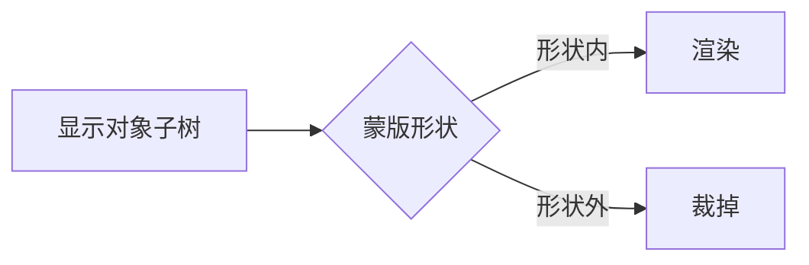

import { Canvas, Controls, Meta } from '@storybook/addon-docs/blocks';
import * as MaskStories from './mask.stories';

<Meta of={MaskStories} name="Docs" />

# 蒙版

蒙版（mask）用另一个对象的形状裁剪一个显示对象（及其全部子节点）的可见区域——形状之内渲染、形状之外裁掉。理解这一点就能推导出它的全部关键行为：蒙版作用于整棵子树、蒙版对象本身不画到画面但必须加入显示列表、每个对象只能挂一个蒙版。

能当蒙版的有两种对象：**Graphics**（矢量形状，走形状裁剪，便宜，最常用）和 **Sprite**（纹理，按通道采样，适合柔和 / 渐变 / 不规则图像蒙版）。通过 `obj.mask = mask` 直接赋值，或用 `obj.setMask({ mask, inverse, channel })` 带选项配置（反向、通道）。本课只讲核心包的蒙版能力；用 GLSL 做像素级后处理见「滤镜」，自定义着色器见「网格与着色器」，社区扩展包不在范围内。



| 写法 / 选项 | 默认值 | 作用与要点 |
| --- | --- | --- |
| `obj.mask = mask` | — | 把 Graphics 或 Sprite 设为蒙版，裁剪 obj 及其子树的可见区 |
| `obj.mask = null` | — | 移除蒙版 |
| `obj.setMask({ mask, inverse, channel })` | — | 带选项设蒙版；等价于 mask 属性，但可配 inverse / channel |
| `inverse` | `false` | `true` 反向：蒙版形状内透明、形状外可见（抠洞） |
| `channel` | `'red'` | Sprite 蒙版的采样通道：`'red'` 适合灰度蒙版图、`'alpha'` 适合带透明的蒙版图 |
| 蒙版与显示列表 | — | 蒙版本身不渲染像素，但**必须加入显示列表**（如 `stage.addChild(mask)`）才生效；每个对象只能有一个蒙版 |

## 应用蒙版

把任意显示对象的 `mask` 属性赋为另一个对象即可。最常见的是用一个 Graphics 画好形状当蒙版：

```ts
import { Container, Graphics } from 'pixi.js';

const content = new Container();        // 被裁剪的内容（任意显示对象皆可）
const mask = new Graphics();
mask.circle(0, 0, 100).fill(0xffffff);  // 形状即裁剪区，填充色不影响结果

content.mask = mask;   // 应用蒙版：content 只在圆内可见
content.mask = null;   // 移除蒙版
```

几个直接影响「能否生效」的要点：

- **蒙版必须加入显示列表。** 蒙版对象本身不会被画到画面，但必须 `addChild` 到 stage 或某个父容器里才会生效。只 `new` 出来赋给 `.mask`、却忘了加进场景树，是最常见的「蒙版没效果」原因。
- **作用于整棵子树。** 蒙版挂在 Container 上等于对它所有后代统一裁剪，而非逐个图元。
- **一个对象只能有一个蒙版。** 需要多块可见区时，在一个 Graphics 里画复合形状（多个圆 / 矩形 / 路径），而不是挂多个蒙版。
- **蒙版的填充色不影响结果。** Graphics 蒙版只看形状几何的并集，填什么颜色、多透明都不影响裁剪——只要有填充。
- **需要反向（抠洞）用 `setMask`。** `mask` 属性只接受对象，`inverse` / `channel` 选项要走 `setMask`：

```ts
// 反向：形状内透明、形状外可见（饼干刀 / 挖洞效果）
content.setMask({ mask, inverse: true });

// 移除（等价于 mask = null）
content.setMask({ mask: null });
```

下面的演示把「形状裁剪、反向抠洞、移除」放在一个台子里：内容是一整片彩色竖条，蒙版是居中的 Graphics 形状。

<Canvas of={MaskStories.MaskDemo} />
<Controls of={MaskStories.MaskDemo} />

| 读者操作 | 可观察证据 |
| --- | --- |
| 切「蒙版形状」 | 内容只在所选形状（圆 / 圆角矩形 / 星）内可见 |
| 开「反向 inverse」 | 形状内变透明、形状外露出彩色竖条（抠洞） |
| 关「启用蒙版」 | 蒙版移除，整片彩色竖条完整显示 |
| 打开 Show code | 看到该 Canvas 实际执行的 `mask.ts` |

## 蒙版类型

能当蒙版的是 Graphics 与 Sprite 两类对象，区别在于「形状从哪来」：Graphics 用矢量几何走形状裁剪（快），Sprite 用纹理走通道采样（柔）。两者的共同约束相同——必须加入显示列表、一个对象一个蒙版、挂到 Container 上作用于整棵子树。

### 图形蒙版

用 `Graphics` 画的形状当蒙版，走形状裁剪（shape clipping），是默认也是最常用的选择：

- **便宜。** 矢量几何裁剪，不需要额外纹理，canvas 渲染器也支持。
- **形状即裁剪区。** 在一个 Graphics 里画的所有填充几何的并集就是可见区，填充色与透明度不影响结果（只要有填充）。
- **适合规则 / 硬边形状。** 圆、矩形、星、任意路径，边界清晰。

上面的 `MaskDemo` 就是图形蒙版：切形状看裁剪区变化，开 inverse 看抠洞。需要多块可见区时，在同一个 Graphics 里画多个形状即可——它们共同构成蒙版形状。

### 精灵蒙版

用 `Sprite` 的纹理当蒙版，按某个**颜色通道**的值决定每个像素的可见度——纹理是该通道值的「可见度图」。适合柔和渐变、照片级不规则边缘，或预渲染的灰度蒙版图：

```ts
import { Sprite } from 'pixi.js';

const maskSprite = new Sprite(maskTexture);
maskSprite.anchor.set(0.5);

content.setMask({ mask: maskSprite, channel: 'alpha' }); // 用透明通道
```

关键点是**采样通道**（`channel`，默认 `'red'`）：

- `'red'`：读纹理的红通道值作为可见度，适合**灰度蒙版图**（白处可见、黑处不可见）。
- `'alpha'`：读纹理的透明通道，适合**靠透明度表达**的蒙版图（如带柔边的 PNG）。

默认读红通道是个常见坑：蒙版图若用透明度（而非灰度）画的，用默认 `'red'` 往往得不到预期效果，要改成 `'alpha'`。下面的演示用一张「红圆 + 蓝矩形」程序纹理，刻意让红通道与透明通道不同——红圆 red=255、蓝矩形 red=0，但二者 alpha 都为 1——切换通道即可看到可见区变化。

<Canvas of={MaskStories.SpriteMaskDemo} />
<Controls of={MaskStories.SpriteMaskDemo} />

| 读者操作 | 可观察证据 |
| --- | --- |
| 选「红通道 red」 | 只有红圆区域露出彩色竖条（蓝矩形 red=0 被裁掉） |
| 选「透明通道 alpha」 | 红圆和蓝矩形都露出竖条（二者 alpha 都为 1） |
| 打开 Show code | 看到该 Canvas 实际执行的 `sprite-mask.ts` |

## 最佳实践

- **优先用 Graphics 蒙版。** 形状裁剪比 Sprite 的纹理采样便宜；规则形状、硬边裁剪都用 Graphics，只在需要柔和 / 渐变 / 图像蒙版时才上 Sprite。
- **蒙版一定要 `addChild`。** 蒙版不渲染像素，但不加入显示列表就不生效。设完 `.mask` 后确认蒙版对象已在场景树里。
- **多块可见区画在一个 Graphics 里。** 一个对象只能有一个蒙版；要多个裁剪窗，在同一 Graphics 上画多个形状（并集），而不是叠加多个蒙版。
- **移动蒙版做 reveal 动画。** 蒙版随自身的 `position` / `scale` / `rotation` 移动，改蒙版对象的 transform 就能做擦除 / 扫光 / 揭示效果。
- **Sprite 蒙版按需选通道。** 灰度蒙版图用默认 `'red'`；靠透明度表达的蒙版图改 `'alpha'`，否则结果会偏离预期。

## 常见问题

- **设了 `mask` 却完全没效果**
  最常见的原因是蒙版对象忘了加入显示列表。蒙版本身不画到画面，但必须 `stage.addChild(mask)`（或加到某个父容器）才生效；只 new 出来赋给 `.mask` 不够。
- **Sprite 蒙版的结果不对、半透明区消失**
  Sprite 蒙版默认读红通道。蒙版图若用透明度（alpha）而非灰度表达，用默认 `'red'` 会丢信息；改用 `setMask({ mask, channel: 'alpha' })`。
- **挂了蒙版后对象的宽高 / `getLocalBounds` 不对**
  蒙版对象需要与被蒙版对象处在同一显示子树内。把蒙版加到被蒙版对象父级（或更上层）的子树里，不要让它游离在场景树之外。
- **蒙版把内容全裁掉了**
  蒙版形状画在了与内容不重叠的位置，或坐标系 / 锚点没对齐。确认蒙版与被裁剪对象的 `position` / `anchor` 让形状落在内容上方。

## 总结回顾

摘要：

蒙版用另一个对象的形状裁剪显示对象（及其全部子树）的可见区：形状内渲染、形状外裁掉。通过 `obj.mask = mask` 应用、`obj.mask = null` 移除；需要反向或通道选项时用 `obj.setMask({ mask, inverse, channel })`。能当蒙版的有两类：Graphics（矢量形状裁剪，便宜，规则 / 硬边场景首选，填充色不影响结果）和 Sprite（按纹理通道采样，`channel` 默认 `'red'` 适合灰度蒙版图、`'alpha'` 适合带透明的蒙版图，适合柔和 / 渐变 / 图像蒙版）。`inverse`（默认 `false`）打开后变成抠洞——形状内透明、形状外可见。所有蒙版共享约束：作用于整棵子树、一个对象只有一个蒙版、蒙版本身不渲染像素但必须加入显示列表。

一句话：

> 蒙版把对象的可见区裁剪成另一个对象的形状——Graphics 走形状裁剪、Sprite 走通道采样，但无论哪种，蒙版都必须加入显示列表才生效。

知识要点：

- `mask` 属性接受哪些对象？怎样应用和移除蒙版？
- Graphics 蒙版的填充色是否影响裁剪结果？
- 蒙版作用于单个图元还是整棵子树？一个对象能挂几个蒙版？
- 蒙版对象本身会不会被画到画面？它必须满足什么条件才生效？
- Graphics 蒙版和 Sprite 蒙版在机制上有什么区别？各自适合什么场景？
- Sprite 蒙版的 `channel` 默认值是什么？灰度蒙版图和带透明的蒙版图分别该用哪个通道？
- `setMask` 的 `inverse` 默认值是什么？打开后效果如何？
- 为什么只 `new` 出蒙版赋给 `.mask` 却没有效果？

## 参考资料

- [PixiJS 指南：场景对象（含蒙版）](https://pixijs.com/8.x/guides/components/scene-objects)
- [PixiJS API：Container（mask 属性与 setMask）](https://pixijs.download/release/docs/scene.Container.html)
- [PixiJS API：MaskOptions（inverse / channel）](https://pixijs.download/release/docs/scene.MaskOptions.html)
- [PixiJS API：Graphics（图形蒙版）](https://pixijs.download/release/docs/scene.Graphics.html)
- [PixiJS API：Sprite（精灵蒙版）](https://pixijs.download/release/docs/scene.Sprite.html)
