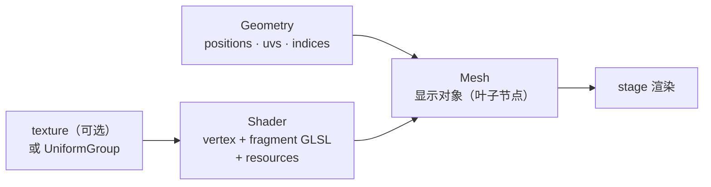

import { Canvas, Controls, Meta } from '@storybook/addon-docs/blocks';
import * as MeshShaderStories from './mesh-shader.stories';

<Meta of={MeshShaderStories} name="Docs" />

# 网格与着色器

Mesh 是 PixiJS 通往原生 GPU 管线的「逃生舱」：当 Sprite（位图）、Graphics（矢量）和滤镜（屏幕空间后处理）表达不了需求时——比如纯 GLSL 片元图案、顶点级形变、自定义渲染状态——用它直接控制顶点和着色器。它的心智模型只有三块积木：**Geometry 提供顶点数据，Shader 提供 GLSL 程序，Mesh 把两者组合成一个显示对象**。

掌握这节课要先记住一个不直观的边界：**自定义 `Shader.from` 写的 vertex 不会自动套用 Mesh 的 position / scale / rotation**。PixiJS 不往自定义着色器里注入投影或变换矩阵——顶点如何落到裁剪空间（`gl_Position`）完全由你的 GLSL 决定。所以同一个 Mesh，用自定义 shader 和用内置 mesh 类型（MeshPlane 等）的默认 shader，行为完全不同：前者你全权负责坐标映射，后者 PixiJS 替你处理场景图变换。



| 类 / 概念 | 默认 / 取值 | 作用 |
| --- | --- | --- |
| `Mesh` | 构造 `{ geometry, shader?, texture?, state? }` | 把 Geometry + Shader（+ texture）组成显示对象；叶子节点，不能 `addChild` |
| `MeshGeometry` | `topology: 'triangle-list'` | 顶点 `positions` / `uvs` / `indices`；`topology` 取 `'triangle-list'` / `'triangle-strip'` 等 |
| `Shader` | `Shader.from({ gl, gpu?, resources })` | 自定义 GLSL / WGSL 程序；只给 `gl` 则仅 WebGL 可用 |
| `GlProgram` | `{ vertex, fragment }` | WebGL 程序包装；通常经 `Shader.from` 的 `gl` 字段传入 |
| `UniformGroup` | 每项需 `{ value, type }` | 数值型 uniforms 集合；`type` 用 `f32` / `vec3<f32>` / `mat4x4<f32>` 等 |
| `MeshPlane` | `verticesX` / `verticesY` 控制细分 | 细分四边形，扭曲纹理 |
| `MeshRope` | `points[]`、`textureScale: 0` | 沿点列弯曲纹理 |
| `MeshSimple` | `vertices`、`autoUpdate: true` | 每帧顶点动画的轻量封装 |
| `State` | 默认 `State.for2d()` | 混合 / 深度 / 剔除；启用 depth 或 culling 会禁用批渲染 |

## 组成：Geometry、Shader 与 Mesh

三件套各司其职，组合关系是「Geometry + Shader → Mesh」：

- **Geometry** 拥有顶点数据。`MeshGeometry` 用 `positions`（每顶点 2 个 float）、`uvs`（与位置一一对应）、`indices`（每三角形 3 个索引）描述形状；内部把 `positions` 注册为 attribute `aPosition`、`uvs` 注册为 `aUV`，所以 vertex shader 里直接用这两个名字取顶点。
- **Shader** 拥有 GLSL 程序和外部数据。`Shader.from({ gl: { vertex, fragment }, resources })` 创建；`resources` 是「资源」集合，可放 `UniformGroup`（数值 uniforms）、`texture.source`（纹理）等，**纹理不再算 uniform**，而是独立资源。
- **Mesh** 是显示对象，把 Geometry 和 Shader 组合后挂上场景图。它还可以带一个 `texture`（给默认 shader 用）和一个 `state`（渲染状态）。

最小组合（全屏四边形 + 自定义片元着色器）：

```ts
import { Application, Mesh, MeshGeometry, Shader, UniformGroup } from 'pixi.js';

const geometry = new MeshGeometry({
  positions: new Float32Array([-1, -1, 1, -1, 1, 1, -1, 1]), // 裁剪空间 NDC
  uvs: new Float32Array([0, 0, 1, 0, 1, 1, 0, 1]),
  indices: new Uint32Array([0, 1, 2, 0, 2, 3]),
});

const globals = new UniformGroup({
  uTime: { value: 0, type: 'f32' },
});

const shader = Shader.from({
  gl: {
    vertex: `
      in vec2 aPosition; in vec2 aUV; out vec2 vUV;
      void main() { gl_Position = vec4(aPosition, 0.0, 1.0); vUV = aUV; }`,
    fragment: `
      precision mediump float; in vec2 vUV; uniform float uTime;
      void main() { gl_FragColor = vec4(vUV, 0.5 + 0.5 * sin(uTime), 1.0); }`,
  },
  resources: { globals },
});

const mesh = new Mesh({ geometry, shader });
app.stage.addChild(mesh);
```

注意顶点直接用裁剪空间坐标（NDC −1..1），vertex shader 原样输出 `gl_Position`——这是让四边形铺满屏幕最简单的写法，也正是「自定义 shader 绕过场景图变换」的最小证据。

## 自定义着色器

**Shader 与 GlProgram**

`Shader.from` 是创建自定义着色器的入口。`gl` 字段里放 `vertex` / `fragment` 两个 GLSL 字符串（内部包成 `GlProgram`）；`gpu` 字段可选，给了 WGSL 源就能同时跑 WebGPU。只给 `gl` 时着色器**仅 WebGL 可用**，在 WebGPU 后端不会渲染——要么补 `gpu`，要么初始化时 `preference: 'webgl'`。

GLSL 写法上，PixiJS 帮你处理了版本兼容：不写 `#version 300 es` 时它注入 WebGL1 兼容宏（`#define in varying` 等），所以用 `in` / `out` 既能给 ES 3.0，也能在兼容模式下被替换成 `attribute` / `varying`；`gl_FragColor` 和 `texture2D` 这种 WebGL1 写法在兼容模式下原生可用。精度由 PixiJS 自动注入（vertex `highp`、fragment `mediump`），官方示例仍显式写 `precision mediump float;`，照写无妨。

**resources 与 UniformGroup**

v8 把「纹理不再是 uniform」作为重要变化：纹理以 `texture.source`（或 `texture.style`）形式直接放进 `resources`，**资源 key 名必须和 shader 源码里的 uniform / 绑定名一致**。

数值型 uniforms 用 `UniformGroup` 收集，**每个 uniform 必须显式声明 `type`**：

```ts
const globals = new UniformGroup({
  uTime: { value: 0, type: 'f32' },
  uColor: { value: new Float32Array([0.3, 0.5, 0.9]), type: 'vec3<f32>' },
  uMatrix: { value: new Float32Array(16), type: 'mat4x4<f32>' },
});

const shader = Shader.from({
  gl: { vertex, fragment },
  resources: { globals },   // key 'globals' 是这一组资源的绑定名
});
```

`type` 用 WGSL 风格标量 / 向量 / 矩阵名（`f32`、`i32`、`vec2<f32>`…`mat4x4<f32>`）。资源 key（上例 `globals`）只是分组容器名，不必与某个 uniform 同名。

**每帧更新 uniform**

UniformGroup 实例的 `.uniforms` 是实际数据对象，直接改它就生效（无需重建 shader），因为 `resources` 引用同一个实例：

```ts
app.ticker.add((ticker) => {
  globals.uniforms.uTime += ticker.deltaMS / 1000;
});
```

下面的实例把这套链路做成可调控件：fragment shader 用 `uTime` 驱动等离子图案，色相、频率、速度三个 uniform 实时影响画面。顶点写死在裁剪空间，所以无论 Mesh 怎么设 position / scale，图案始终铺满画布——这正是自定义 shader 不响应场景图变换的最直观证据。

<Canvas of={MeshShaderStories.ShaderDemo} />
<Controls of={MeshShaderStories.ShaderDemo} />

| 读者操作 | 可观察证据 |
| --- | --- |
| 调「色相 hue」 | 整体色调随之偏移，证明 `uColor` 每帧写入 UniformGroup |
| 调「频率 frequency」 | 波纹密度变疏变密，证明 `uFrequency` 传到 fragment |
| 调「速度 speed」 | 图案流动加快 / 减慢，证明 `uSpeed` 改变 `uTime * uSpeed` |
| 观察 readout 的 `uTime` | 持续增长，证明 Ticker 每帧累加 uniform |
| 打开 Show code | 看到该 Canvas 实际执行的 `shader.ts`（NDC 四边形 + UniformGroup + Shader.from） |

**让自定义着色器响应变换**

自定义 shader 不是「不能」响应变换，而是要你自己传矩阵。做法：把 Mesh 的 `worldTransform`（一个 `Matrix`）和正交投影拍成一个 `mat3`，作为 `UniformGroup` 里的 uniform 传进 vertex shader，在 GLSL 里乘到顶点上。顶点几何写成像素坐标（如 `0..100`），由 shader 负责映射到裁剪空间。这一步对「想让自定义着色器像普通显示对象一样定位、缩放」的场景是必须的，但它脱离了最小演示；当内置 mesh 类型能覆盖需求时，优先用内置。

## 内置网格

内置 mesh 类型（MeshPlane / MeshRope / MeshSimple）的共性是：**不传自定义 shader 时用默认 shader，正常参与场景图变换**（position / scale / rotation / pivot 都生效）。这和上一节的自定义 shader 形成本课最重要的对照——选自定义还是内置，首先取决于「你要不要 PixiJS 替你管变换」。

它们各自用一个细分 / 弯曲好的几何 + 默认 shader，顶点缓冲同样可以改写并 `buffer.update()`，但纹理 UV 由几何固定，移动顶点会把纹理一起拉扯。

### MeshPlane

细分四边形，把一张纹理铺在 `verticesX × verticesY` 的顶点网格上。顶点越密，扭曲越平滑。适合旗帜飘动、水面波纹、透视拉伸这类「局部形变」效果。

```ts
import { MeshPlane, Texture } from 'pixi.js';

const plane = new MeshPlane({
  texture: Texture.from('bg.png'),
  verticesX: 10,   // 顶点数（不是分段数）
  verticesY: 10,
});
```

形变靠改写 `aPosition` 缓冲：先缓存原始顶点，每帧基于原始位置 + 时间叠加扰动，再 `buffer.update()` 推到 GPU。**改完必须 `update()`**——buffer 不监听自身 `data` 数组，不调用就停在 CPU，画面不变。

```ts
const { buffer } = plane.geometry.getAttribute('aPosition');
const base = new Float32Array(buffer.data);   // 缓存原始，避免累积漂移

app.ticker.add(() => {
  const t = performance.now() / 500;
  for (let i = 0; i < buffer.data.length; i += 2) {
    buffer.data[i + 1] = base[i + 1] + Math.sin(t + base[i] * 0.1) * 8; // y 起伏
  }
  buffer.update();   // 关键：推到 GPU
});
```

下面的实例用 `generateTexture` 把一个 Graphics 图案转成纹理贴到 MeshPlane 上，按振幅与波密度做横向波浪。注意它有 `pivot` / `position`（居中定位），纹理跟随顶点被拉扯——和上面的自定义 shader 范例对比，能清楚看到「默认 shader 响应变换」与「自定义 shader 不响应」的差异。

<Canvas of={MeshShaderStories.PlaneDemo} />
<Controls of={MeshShaderStories.PlaneDemo} />

| 读者操作 | 可观察证据 |
| --- | --- |
| 调「振幅 amplitude」 | 纹理起伏幅度变大 / 变小 |
| 调「波密度 waveDensity」 | 波浪流动加快、波数变化 |
| 观察网格线 | 纹理 UV 固定，顶点移动时网格被拉扯，证明形变发生在顶点级 |
| 打开 Show code | 看到该 Canvas 实际执行的 `mesh-builtins.ts`（缓存原顶点 → 扰动 → `buffer.update()`） |

### MeshRope

沿一串控制点（`Point[]`）弯曲一张纹理，适合飘带、蛇身、拖尾。点要足够多曲线才平滑；厚度由纹理高度决定，`width` 控制带宽。

```ts
import { MeshRope, Point, Texture } from 'pixi.js';

const rope = new MeshRope({
  texture: Texture.from('ribbon.png'),
  points: [new Point(0, 0), new Point(80, 20), new Point(160, -10)],
  textureScale: 0,   // 0 拉伸铺满；> 0 沿绳重复贴图
});
```

`textureScale` 是关键参数：`0` 把整张纹理拉伸到绳的全长（默认），`1` 沿绳重复贴图并保持长宽比，`0..1` 之间为高分辨率下采样。设 `autoUpdate = true` 时每帧重新求值几何，让 `points` 数组的动画直接反映成弯曲变化。

### MeshSimple

把「每帧改顶点」这件事封装了一层：用 `vertices` 属性（注意是 `vertices`，不是 MeshGeometry 的 `positions`）给顶点，`autoUpdate` 控制是否自动上传。适合简单的逐帧顶点动画——不必手动拿 buffer 和 `update()`。

```ts
import { MeshSimple, Texture } from 'pixi.js';

const tri = new MeshSimple({
  texture: Texture.from('face.png'),
  vertices: new Float32Array([0, 0, 100, 0, 50, 100]),
  autoUpdate: true,   // 默认开；改 vertices 后自动上传
});
```

要完全掌控上传时机时把 `autoUpdate` 关掉，改完 `vertices` 后手动调 `geometry.getBuffer('aPosition').update()`。v7 的 `SimpleMesh` / `SimplePlane` / `SimpleRope` 在 v8 已改名为 `MeshSimple` / `MeshPlane` / `MeshRope`。

## 渲染状态：混合、深度与剔除

通过 `new Mesh({ geometry, shader, state })` 传一个 `State` 可以控制 blend mode、深度测试和背面剔除。默认 state 是 `State.for2d()`，和 2D 渲染器一致。

```ts
import { Mesh, State } from 'pixi.js';

const state = new State();
state.depthTest = true;     // 开启深度测试
state.culling = true;       // 剔除背面三角形
state.blendMode = 'add';    // 混合模式
const mesh = new Mesh({ geometry, shader, state });
```

代价：**启用 depth 或 culling 会自动禁用批渲染（batching）**，自定义 shader 同样不参与批渲染——这两种情况下每个 mesh 独占一次 draw call。普通 2D 内容不要随意开深度 / 剔除；只有在真有遮挡或朝向需求的特殊渲染时才用，并接受性能成本。

## 最佳实践

- **能内置就别自定义。** MeshPlane / MeshRope / MeshSimple 用默认 shader 就能做形变并参与变换、参与批渲染；只有内置能力不够（片元级 GLSL 图案、自定义投影）才写自定义 shader。
- **每帧更新 uniform，别重建 Shader。** `Shader.from` 有编译开销。持有一个 `UniformGroup` 引用，每帧改 `.uniforms.xxx`；参数变化也只改 uniform，不要重建 shader。
- **动态形变优先改顶点缓冲，别每帧重建 Geometry。** 缓存原始 `aPosition`，每帧基于它叠加扰动并 `buffer.update()`；重建 Geometry 会重新分配 GPU 缓冲。
- **共享 Geometry 与 Shader。** 一个 Geometry 可被多个 Mesh 实例共用，一个 Shader 也是；只有 uniform 需要每组一份（用不同 UniformGroup 实例）。
- **WebGL / WebGPU 双后端要补 `gpu`。** 只写 `gl` 的自定义 shader 在 WebGPU 后端不渲染；要跨后端就在 `Shader.from` 同时给 `gpu` 的 WGSL 源，或在 `app.init` 用 `preference: 'webgl'` 锁定后端。

## 常见问题

- **自定义 shader 的 Mesh 改 position / scale / rotation 没反应**
  自定义 `Shader.from` 不注入投影 / 变换矩阵，顶点到裁剪空间由你的 vertex GLSL 决定。要么把顶点写成裁剪空间坐标（如范例的全屏 NDC 四边形），要么自己把 `worldTransform` + 投影组成矩阵作为 uniform 传入并在 shader 里乘到顶点上。
- **改了 `buffer.data` 画面不变**
  Buffer 不监听自身 `data` 数组，改完必须 `buffer.update()` 才推到 GPU。形变循环里每次写完都要调一次。
- **WebGPU 后端下自定义 shader 不显示**
  只写了 `gl`（WebGL）程序时，WebGPU 渲染器跑不了。给 `Shader.from` 补 `gpu` 的 WGSL 源，或 `app.init({ preference: 'webgl' })` 锁定 WebGL 后端。
- **`UniformGroup` 报类型错误或 uniform 不生效**
  每个 uniform 必须显式给 `{ value, type }`，`type` 用 WGSL 风格（`f32` / `vec3<f32>` / `mat4x4<f32>`），向量 / 矩阵的 `value` 要是匹配长度的 `Float32Array`。漏 `type` 或长度不对会静默失效或报错。
- **旧教程的 `PIXI.Shader.from(vertex, fragment, uniforms)` 不能用**
  v8 改成 `Shader.from({ gl: { vertex, fragment }, resources })`，纹理从 uniform 里搬到 `resources`，uniforms 装进带类型的 `UniformGroup`。`SimpleMesh` / `SimplePlane` / `SimpleRope` 也改名成 `MeshSimple` / `MeshPlane` / `MeshRope`。
- **开了深度测试后性能掉**
  `State` 启用 `depthTest` 或 `culling` 会自动禁用批渲染，每个 mesh 独占一次 draw call。2D 内容用默认 `State.for2d()`，只在确有遮挡 / 朝向需求时开。

## 总结回顾

摘要：

Mesh 由 Geometry（顶点 positions / uvs / indices，attribute 名 `aPosition` / `aUV`）、Shader（`Shader.from({ gl: { vertex, fragment }, resources })`，可补 `gpu` 跨后端）和可选的 texture / state 组成，是场景图里的叶子显示对象。自定义 Shader 的 vertex 不注入投影或变换矩阵，顶点到裁剪空间由 GLSL 自己决定，所以自定义 shader 不响应 Mesh 的 position / scale / rotation——要让自定义渲染参与变换，需自己把 worldTransform + 投影作为 uniform 传入。数值 uniforms 用 `UniformGroup`（每项 `{ value, type }`，type 用 `f32` / `vec3<f32>` 等），每帧改 `.uniforms.xxx` 即生效；纹理是独立 resource 不再是 uniform。内置 mesh 类型 MeshPlane（细分四边形）、MeshRope（沿点列弯曲，`textureScale` 控拉伸 / 重复）、MeshSimple（逐帧顶点动画，用 `vertices` + `autoUpdate`）用默认 shader，正常参与变换和批渲染；形变靠改写 `aPosition` 缓冲并 `buffer.update()`。渲染状态 `State` 的 depth / culling 会禁用批渲染，2D 内容默认用 `State.for2d()`。

一句话：

> Geometry 给顶点、Shader 给 GLSL、Mesh 把它们组成显示对象；自定义 shader 你自己管裁剪空间映射，内置 mesh 交给 PixiJS 管变换。

知识要点：

- Mesh 的三件套各拥有什么数据？它们如何组合？
- 自定义 `Shader.from` 的 vertex 会不会自动套用 Mesh 的 position / scale？为什么？
- `Shader.from` 的 `gl` / `gpu` / `resources` 三个字段分别装什么？只给 `gl` 有什么限制？
- `UniformGroup` 的每个 uniform 必须声明什么？`type` 用什么风格？
- 每帧更新 uniform 应该改哪里？为什么不必重建 Shader？
- 改完顶点缓冲后必须调什么？不调会怎样？
- MeshPlane / MeshRope / MeshSimple 各自的用途和关键参数是什么？它们用默认 shader 时与自定义 shader 的行为有何不同？
- 启用 `State` 的 depth / culling 会对性能产生什么影响？

## 参考资料

- [PixiJS 指南：Mesh](https://pixijs.com/8.x/guides/components/scene-objects/mesh)
- [PixiJS API：Mesh](https://pixijs.download/release/docs/scene.Mesh.html)
- [PixiJS API：MeshPlane](https://pixijs.download/release/docs/scene.MeshPlane.html)
- [PixiJS API：Shader](https://pixijs.download/release/docs/rendering.Shader.html)
- [PixiJS v8 迁移指南](https://pixijs.com/8.x/guides/migrations/v8)
- [PixiJS 示例库](https://pixijs.com/8.x/examples)
