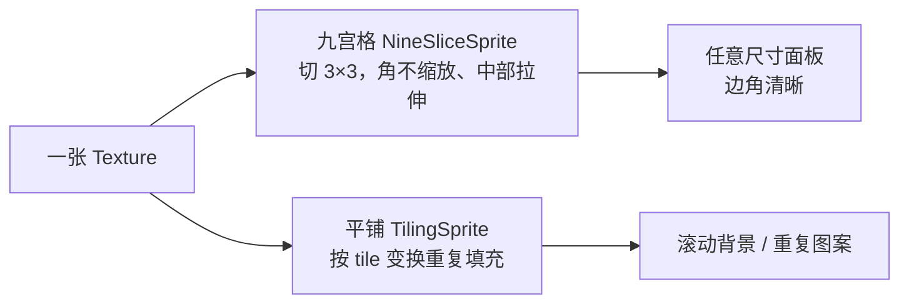

import { Canvas, Controls, Meta } from '@storybook/addon-docs/blocks';
import * as NineSliceTiling from './nine-slice-tiling.stories';

<Meta of={NineSliceTiling} name="Docs" />

# 九宫格与平铺

普通 Sprite 把整张纹理一次性贴到一个矩形里，缩放时所有像素一起变形。但有两类常见需求它做不到：把一个带圆角的面板拉伸到任意尺寸而边角不失真，以及把一张小图重复铺满一大片背景。PixiJS 用两个专门对象分别解决——**NineSliceSprite** 把纹理切成 3×3 九块，角块不缩放、中部按方向拉伸，做可拉伸面板；**TilingSprite** 把纹理按独立瓦片变换重复铺满矩形，做平铺背景。抓住「一张纹理、两种映射」这层分工，何时用哪个、为什么边角能保持清晰都能直接推导。



| 对象 / 属性 | 默认值 | 作用 |
| --- | --- | --- |
| `new NineSliceSprite(options)` | — | 九宫格面板；纹理切 3×3，四角不缩放 |
| `leftWidth` / `rightWidth` / `topHeight` / `bottomHeight` | `10` | 四条边宽；决定哪些区域不缩放 |
| `NineSliceSprite` 的 `width` / `height` | 纹理原尺寸 | 面板目标尺寸；设置后重算顶点与 UV |
| `NineSliceSprite.defaultOptions` | — | 静态默认 options，作全局兜底 |
| `new TilingSprite(options)` | — | 平铺精灵；纹理按 tile 变换重复填充矩形 |
| `TilingSprite` 的 `texture` | `Texture.WHITE` | 重复的纹理 |
| `tilePosition` | `(0, 0)` | 瓦片偏移；改它滚动图案，不动精灵位置 |
| `tileScale` | `(1, 1)` | 每个瓦片的缩放 |
| `tileRotation` | `0` | 每个瓦片的旋转（弧度），独立于精灵 rotation |
| `applyAnchorToTexture` | `false` | 平铺图案是否从锚点而非左上角起算 |
| `clampMargin` | `0.5` | 边缘裁剪余量；透明裁切纹理可设 `-0.5` 补一像素 |

## 九宫格拉伸：NineSliceSprite

NineSliceSprite 把一张纹理用四条边宽切成 3×3 九块，每块缩放规则不同：

- **四个角（1、3、7、9）**：完全不缩放。圆角、装饰角、阴影角都放在这里，拉伸后保持原样。
- **上、下边（2、8）**：只水平拉伸。上下边框线条只沿宽度方向延伸。
- **左、右边（4、6）**：只垂直拉伸。左右边框线条只沿高度方向延伸。
- **中心（5）**：双向填充。把剩余空间填满。

因此面板尺寸怎么变，四角的圆角和装饰都不会变形。构造时传入纹理与四条边宽：

```ts
import { Assets, NineSliceSprite } from 'pixi.js';

const texture = await Assets.load<Texture>('panel.png');
const panel = new NineSliceSprite({
  texture,
  leftWidth: 16,
  rightWidth: 16,
  topHeight: 16,
  bottomHeight: 16,
  width: 400,
  height: 200,
});
app.stage.addChild(panel);
```

构造函数也接受直接传 `Texture`（`new NineSliceSprite(texture)`），此时边宽走默认值。下面的实例把一个程序生成的面板纹理切成九宫格，让你拖动宽高直接观察每块区域的缩放规则。

<Canvas of={NineSliceTiling.NineSlice} />
<Controls of={NineSliceTiling.NineSlice} />

| 读者操作 | 可观察证据 |
| --- | --- |
| 调「面板宽度 width」 | 面板水平变宽，四个彩色角块（白圆点）尺寸不变；中心点阵水平拉开 |
| 调「面板高度 height」 | 面板垂直变高，四角仍不变；中心点阵垂直拉开 |
| 查看读数 | 目标尺寸随控件变化，纹理原尺寸（160 × 160）与边宽（40px）固定 |
| 打开 Show code | 看到该 Canvas 实际执行的 `nine-slice.ts` |

### 边宽与拉伸规则

四条边宽是九宫格的核心参数：它们定义了「不缩放的边框有多宽」。四个值都默认 `10`——如果纹理的圆角或装饰区不是 10 像素宽，必须按纹理实际边框宽度设置，否则切线会落进角装饰或中心区，导致圆角被拉扁或中心图案被切掉。

- **`leftWidth` / `rightWidth` / `topHeight` / `bottomHeight`**：分别设定左、右、上、下四条不缩放边框的像素宽度。它们也是可读写的实例属性，运行时改了会立即重算。
- **`width` / `height`**：面板目标尺寸，默认取纹理原尺寸。设置时（或调用 `setSize(w, h)`）会重算顶点与 UV，中部按规则填充。
- **`originalWidth` / `originalHeight`**：纹理在九宫格缩放前的原始尺寸（只读），用来回查源图大小。
- **`texture`**：可读写，运行时换纹理会按当前边宽重新切分。

纹理本身也能通过 `Texture#defaultBorders` 提供默认边宽；构造时不显式传，会回退到它，再回退到 `10`。`NineSliceSprite.defaultOptions` 是全局静态兜底，可一次性覆盖所有新实例的默认值（如默认纹理）。

## 平铺填充：TilingSprite

TilingSprite 不拉伸纹理，而是把同一张纹理**重复**铺满一个矩形。纹理到矩形的映射由一组**独立于精灵自身变换**的「瓦片变换」控制——滚动、缩放、旋转都发生在瓦片层，精灵的位置和大小不受影响。

```ts
import { Assets, TilingSprite } from 'pixi.js';

const texture = await Assets.load<Texture>('tile.png');
const tiling = new TilingSprite({
  texture,
  width: app.screen.width,
  height: app.screen.height,
});
app.stage.addChild(tiling);

// 滚动背景：改 tilePosition，精灵位置不动
app.ticker.add(() => {
  tiling.tilePosition.x -= 1;
});
```

`width` / `height` 定义要铺满的矩形区域，不设会很小、看不到重复效果。下面的实例用一个非对称瓦片铺满画布，ticker 自动滚动 `tilePosition.x`，让你操作缩放与旋转并观察重复。

<Canvas of={NineSliceTiling.Tiling} />
<Controls of={NineSliceTiling.Tiling} />

| 读者操作 | 可观察证据 |
| --- | --- |
| 观察默认状态 | 画布铺满完全相同的菱形瓦片（数得出重复次数），图案持续向左滚动 |
| 调「瓦片缩放 tileScale」 | 每个瓦片同步变大（重复变少）或变小（重复变多），滚动速度不变 |
| 调「瓦片旋转 tileRotation」 | 每个瓦片原地旋转，菱形朝向变化 |
| 查看读数 | tileScale、tileRotation 随控件变化；平铺区域随画布尺寸 |
| 打开 Show code | 看到该 Canvas 实际执行的 `tiling.ts` |

### tilePosition / tileScale / tileRotation

这三个属性组成瓦片变换，控制图案如何重复，与精灵的 `position` / `scale` / `rotation` 完全独立：

- **`tilePosition`**（默认 `(0, 0)`）：图案的偏移量。在 ticker 里持续推进它就形成滚动 / 视差，精灵本身可以一直固定在原位。
- **`tileScale`**（默认 `(1, 1)`）：每个重复瓦片的缩放。`> 1` 瓦片变大、重复次数变少；`< 1` 变小、重复变多。
- **`tileRotation`**（默认 `0` 弧度）：每个瓦片的旋转，独立于精灵 `rotation`。
- **`tileTransform`**：把上面三者合在一起的完整 `Transform` 对象，需要精确控制时直接操作它。

另外两个属性影响重复的起算与边缘质量：

- **`applyAnchorToTexture`**（默认 `false`）：默认图案从左上角起算；设 `true` 后改 `anchor` 会让图案原点跟着锚点走（v7 的 `uvRespectAnchor` 已废弃，改用此名）。
- **`clampMargin`**（默认 `0.5`）：控制纹理边缘的裁剪余量。当纹理有透明裁切导致边缘渗色或细缝时，设成 `-0.5` 能补一像素。

`TilingSprite.from(options)` 是等价的工厂方法；旧的 `new TilingSprite(texture, width, height)` 三参数签名在 v8 已废弃，改用 options 对象。

## 最佳实践

- **拉伸保边用九宫格，重复填充用平铺。** 可变尺寸的 UI 面板、按钮、对话框边框用 NineSliceSprite，确保圆角不失真；背景纹理、视差滚动、重复图案用 TilingSprite。不要用普通 Sprite + scale 做可拉伸面板——它会均匀拉伸整张图，圆角和边框装饰全部变形。
- **边宽必须匹配纹理的实际装饰区。** 四条边宽默认 `10`，只是兜底。纹理的圆角或边框是几像素，就把对应的 `leftWidth` 等设成几像素；设小了圆角被拉扁，设大了中心可用区被侵占。
- **滚动背景优先用 TilingSprite。** 一张小纹理 + 持续改 `tilePosition`，GPU 用单个图元就能重复填充任意大小区域，比手工摆放一堆 Sprite 省得多。
- **改尺寸用 `setSize`。** NineSliceSprite 和 TilingSprite 都有 `setSize(width, height)`，一次设置两个维度，避免分别赋 `width` / `height` 触发两次重算。

## 常见问题

- **面板的圆角被拉扁了**
  四条边宽用了默认 `10`，与纹理实际的圆角 / 边框宽度不符。把 `leftWidth` / `rightWidth` / `topHeight` / `bottomHeight` 设成纹理里装饰区的真实像素宽度，让切线刚好落在装饰区与中心的边界上。
- **v7 的 `NineSlicePlane` 在 v8 怎么不见了**
  v8 把 `NineSlicePlane` 重命名为 `NineSliceSprite`（旧类名保留为子类），构造也从 `(texture, leftWidth, topHeight, rightWidth, bottomHeight)` 改成了 options 对象。把旧的位置参数搬进 `{ texture, leftWidth, rightWidth, topHeight, bottomHeight }` 即可。
- **TilingSprite 只显示一小块、看不到重复**
  没设 `width` / `height`，矩形区域太小。显式设成要铺满的尺寸（全屏背景通常用 `app.screen.width` / `app.screen.height`）。
- **平铺图案接缝处有细缝或边缘渗色**
  纹理被透明裁切（trim）后边缘像素不准。把 `clampMargin` 设成 `-0.5` 补一像素；或确保纹理边缘是不透明的，避免边缘采样到透明邻居。
- **改了 `tilePosition` 精灵跟着动了**
  `tilePosition` 滚动的是图案、不是精灵位置。要移动精灵本身，改 `tiling.position` 或 `tiling.x` / `tiling.y`。

## 总结回顾

摘要：

NineSliceSprite 把纹理切成 3×3 九块：四角不缩放（放圆角和装饰）、上下边只水平拉伸、左右边只垂直拉伸、中心双向填充，适合任意尺寸下保持边角清晰的可拉伸面板。四条边宽（`leftWidth` / `rightWidth` / `topHeight` / `bottomHeight`）默认 `10`，要按纹理实际装饰宽度设置；改 `width` / `height` 或调 `setSize` 会重算顶点与 UV，中部按规则填充。TilingSprite 把纹理按独立瓦片变换重复铺满矩形——`tilePosition` 滚动图案、`tileScale` 改瓦片大小、`tileRotation` 旋转每个瓦片，三者都与精灵自身变换无关，适合滚动背景与重复图案。两者都继承容器，`anchor`、`tint`、`position` / `scale` / `rotation` 的用法与 Sprite 一致。v8 里构造统一走 options 对象，`NineSlicePlane` 已更名为 `NineSliceSprite`。

一句话：

> NineSliceSprite 拉伸一张纹理并保护边角，TilingSprite 重复一张纹理并独立滚动瓦片。

知识要点：

- 九宫格的九块区域里，哪些不缩放、哪些单向拉伸、哪个双向填充？
- 四条边宽的默认值是多少？为什么要改成纹理的实际边框宽度？
- TilingSprite 的 `tilePosition` 改变的是图案位置还是精灵位置？
- `tileScale` 大于 1 时，重复次数变多还是变少？
- 可拉伸 UI 面板和滚动背景各该用哪个对象？为什么普通 Sprite + scale 不行？

## 参考资料

- [PixiJS API：NineSliceSprite](https://pixijs.download/release/docs/scene.NineSliceSprite.html)
- [PixiJS API：TilingSprite](https://pixijs.download/release/docs/scene.TilingSprite.html)
- [PixiJS v8 迁移指南（NineSlicePlane → NineSliceSprite、构造改 options）](https://pixijs.com/8.x/guides/migrations/v8)
- [PixiJS 指南（8.x）](https://pixijs.com/8.x/guides)
- [PixiJS 示例库](https://pixijs.com/8.x/examples)
