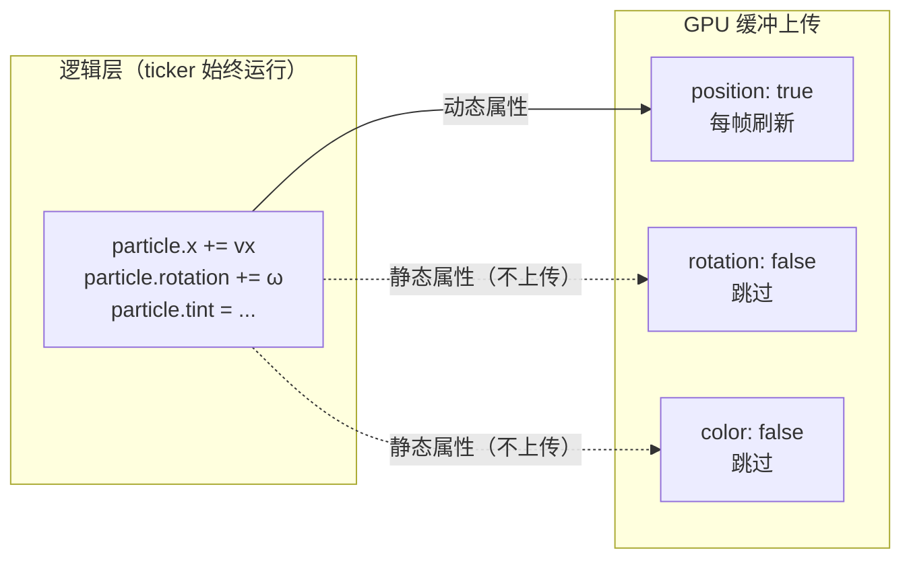

import { Canvas, Controls, Meta } from '@storybook/addon-docs/blocks';
import * as ParticleStories from './particle-container.stories';

<Meta of={ParticleStories} name="Docs" />

# 粒子容器

ParticleContainer 是 PixiJS v8 为「大量同纹理对象」专门优化的容器。它用轻量的 `Particle` 代替 `Sprite`，把粒子数据打包进 GPU 缓冲区批量提交，单次绘制调用渲染成千上万个粒子。代价是放弃 `Container` 的通用能力——粒子不能有子节点、事件、滤镜或蒙版，`addChild` / `removeChild` 直接抛错。

核心直觉是「你提前告诉它哪些属性会变」。`dynamicProperties` 把每个属性标记为动态（每帧上传 GPU）或静态（只在创建或 `update()` 时上传一次）。默认只有 `position` 动态——如果你的粒子只需要移动，这就是零配置的最快路径；旋转、变色、缩放等按需开启，开得越多每帧开销越大。

| 属性 / 选项 | 默认值 | 说明 |
| --- | --- | --- |
| `dynamicProperties.position` | `true` | 每帧上传 `x` / `y` |
| `dynamicProperties.rotation` | `false` | 每帧上传 `rotation` |
| `dynamicProperties.vertex` | `false` | 每帧上传 `scaleX` / `scaleY` / `anchorX` / `anchorY` 及纹理尺寸（顶点形变） |
| `dynamicProperties.uvs` | `false` | 每帧上传纹理坐标（精灵图切帧） |
| `dynamicProperties.color` | `false` | 每帧上传 `tint` + `alpha` 组合色 |
| `roundPixels` | `false` | 粒子坐标取整，牺牲平滑换清晰 |
| `texture` | `null` | 容器共享纹理；不传则取首个粒子的纹理 |
| `Particle.anchorX` / `anchorY` | `0` | 0–1 归一化锚点 |
| `Particle.scaleX` / `scaleY` | `1` | 缩放 |
| `Particle.tint` | `0xffffff` | 染色，与纹理颜色相乘 |
| `Particle.alpha` | `1` | 透明度（0–1，自动 clamp） |

## Particle 对象

`Particle` 是 `ParticleContainer` 专用的轻量显示单元。和 `Sprite` 的关键区别：没有 `children`、事件、滤镜、蒙版；用 `scaleX` / `scaleY` 和 `anchorX` / `anchorY`（不是 `scale` 和 `anchor`）；`tint` 和 `alpha` 在内部合并成一个 `color` 值上传 GPU。

两种构造方式：

```ts
import { Particle, Texture } from 'pixi.js';

const texture = Texture.from('spark.png');

// 简写：只传 texture，其余属性取默认值
const p1 = new Particle(texture);

// 完整：options 对象
const p2 = new Particle({
  texture,
  x: 100,
  y: 200,
  scaleX: 0.8,
  scaleY: 0.8,
  rotation: Math.PI / 4,
  anchorX: 0.5,
  anchorY: 0.5,
  tint: 0xff0000,
  alpha: 0.8,
});
```

加入容器用 `addParticle`，不能用 `addChild`——`ParticleContainer` 把 `addChild` / `removeChild` / `getChildAt` / `setChildIndex` / `swapChildren` 等方法全部覆写为直接抛错：

```ts
import { ParticleContainer, Particle, Texture } from 'pixi.js';

const texture = Texture.from('spark.png');
const container = new ParticleContainer({ texture });

container.addParticle(p1, p2);     // 支持一次加多个

// 粒子存储在 particleChildren 数组里（不是 children）
container.particleChildren.push(
  new Particle(texture),
);
container.update();                // 直接改数组后必须调 update
```

`ParticleContainer` 提供的粒子管理方法：

| 方法 | 说明 |
| --- | --- |
| `addParticle(...particles)` | 向末尾追加一个或多个粒子 |
| `removeParticle(...particles)` | 按引用移除 |
| `addParticleAt(particle, index)` | 在指定位置插入 |
| `removeParticleAt(index)` | 按索引移除 |
| `removeParticles(beginIndex, endIndex)` | 按区间移除 |
| `update()` | 直接修改 `particleChildren` 后手动标记缓冲脏 |

`addParticle` / `removeParticle` 等方法会自动标记缓冲为脏；只有直接操作 `particleChildren` 数组（`push` / `splice` / `length = 0`）时才需要手动调 `update()`。

## 动态属性

`dynamicProperties` 是 ParticleContainer 性能的核心杠杆。它告诉渲染器：哪些属性的 GPU 缓冲每帧刷新（动态），哪些只在创建或 `update()` 时写入一次（静态）。静态属性越多，每帧 GPU 缓冲写入越少，渲染越快。

五个键各管一组属性：

| 键 | 控制的粒子属性 | 默认动态 | 何时需要开启 |
| --- | --- | --- | --- |
| `position` | `x`、`y` | `true` | 粒子会移动 |
| `rotation` | `rotation` | `false` | 粒子会自转 |
| `vertex` | `scaleX`、`scaleY`、`anchorX`、`anchorY`、纹理尺寸 | `false` | 运行时改缩放或锚点 |
| `uvs` | 纹理坐标（`texture.uvs`） | `false` | 精灵图切帧动画 |
| `color` | `tint` + `alpha` 组合的 `color` | `false` | 运行时改颜色或透明度 |

```ts
const container = new ParticleContainer({
  texture,
  dynamicProperties: {
    position: true,   // 粒子会移动
    rotation: true,   // 粒子会自转
    color: true,      // 粒子会变色
    vertex: false,    // 缩放 / 锚点不变
    uvs: false,       // 纹理帧不变
  },
});
```

两条直接影响结果的规则：

- **静态属性改了不生效。** 你修改了 `particle.rotation` 但 `rotation` 是 `false`，GPU 缓冲不会刷新，画面不变——除非调 `container.update()`。
- **动态属性每帧上传，无论值是否真的变了。** 所以「全部开启动态」会侵蚀 ParticleContainer 的性能优势；按需开启才是正确用法。



下面的实例用程序生成的圆形纹理填充一个粒子场。每个粒子在逻辑层持续漂移、自转、循环染色——无论对应属性是否动态。切 `position` / `rotation` / `color` 为静态，对应视觉效果立即冻结；切回动态时画面跳变到 CPU 一直追踪的新位置，证明逻辑层从未停止。

<Canvas of={ParticleStories.ParticleField} />
<Controls of={ParticleStories.ParticleField} />

| 读者操作 | 可观察证据 |
| --- | --- |
| 增大「粒子数量」到 3000–5000 | 帧率读数仍接近 60——ParticleContainer 的吞吐能力 |
| 关闭「position 动态」 | 所有粒子位置冻结（CPU 仍在更新坐标，但 GPU 缓冲不刷新） |
| 开启「rotation 动态」 | 粒子开始自转；关闭后自转停止 |
| 开启「color 动态」 | 粒子开始循环染色；关闭后颜色冻结 |
| 重新开启「position 动态」 | 粒子跳到新位置——证明漂移逻辑一直在运行，只是画面之前没刷新 |
| 打开 Show code | 看到该 Canvas 实际执行的 `particle-container.ts`，含 `dynamicProperties` 构造与 ticker 更新 |

## 容器限制

`ParticleContainer` 的速度来自跳过通用场景图，因此有一组硬性限制：

- **不计算 bounds。** `container.bounds` 恒为空（`Bounds(0,0,0,0)`），避免遍历全部粒子。需要正确边界时（如视口剔除），手动设置从 `Container` 基类继承的 `boundsArea`：

```ts
import { Rectangle } from 'pixi.js';

container.boundsArea = new Rectangle(0, 0, 800, 600);
```

- **粒子不能有子节点、事件、滤镜或蒙版。** `Particle` 是纯数据对象，不参与场景图的这些能力。需要滤镜或交互的对象用 `Container` + `Sprite`。
- **所有粒子必须共享同一 base texture。** 用精灵图（sprite sheet）让不同外观的粒子共用一张图；需要完全不同的纹理时，分到多个 `ParticleContainer`。
- **不参与 `zIndex` 排序。** `ParticleContainer` 没有 `sortableChildren`，粒子按 `particleChildren` 数组顺序绘制。

## 最佳实践

- **默认配置（只有 position 动态）覆盖最常见的粒子场景。** 大多数粒子只需要移动，保持默认就是最快路径。旋转、变色、缩放按需开启，不要「以防万一」全开。
- **按效果开动态属性，不按粒子类型。** 同一个粒子场里，如果 80% 的粒子只需要移动、20% 还需要变色，把 `color` 开成动态会让全部粒子每帧上传颜色——权衡是开还是拆成两个容器。
- **直接改 `particleChildren` 后调 `update()`。** `addParticle` / `removeParticle` 自动标记脏；`push` / `splice` / `length = 0` 不会。遗漏 `update()` 是最常见的「改了不生效」原因。
- **用精灵图共享纹理。** 需要多种粒子外观时，把所有帧放进同一张精灵图，用不同 `texture`（同一 base texture 的不同帧）创建粒子；运行时切帧需要 `uvs: true`。
- **大场景配合 `boundsArea` 做 culling。** `ParticleContainer` 的空 bounds 会让 `Culler` 认为它不在视口内；设 `boundsArea` 后 culling 才能正确工作。

## 常见问题

- **改了 `particle.rotation` / `tint` 但画面不变**
  对应的 `dynamicProperties` 键是 `false`（静态）。要么在构造时把它设为 `true`，要么在修改后调 `container.update()` 手动刷新 GPU 缓冲。
- **调用 `addChild` 报错 "is not available"**
  `ParticleContainer` 禁用了全部 `Container` 子节点方法。用 `addParticle` / `removeParticle` / `addParticleAt` / `removeParticleAt` / `removeParticles` 代替。
- **直接 `push` 了 `particleChildren`，新粒子不显示**
  直接操作数组后必须调 `container.update()`。`addParticle` 会自动标记脏，直接改数组不会。
- **粒子数量不多时性能没比 Container 好**
  数百以下的粒子，`Container` + `Sprite` 的批渲染已经够快，`ParticleContainer` 的优势在大规模（数千以上）才明显。另外检查是否开了过多动态属性——全开 `vertex` / `position` / `rotation` / `uvs` / `color` 会侵蚀优势。
- **ParticleContainer 被 culling 剔除了（画面消失）**
  容器的 `bounds` 恒为空，`Culler` 会判定它不在视口内。设 `container.boundsArea = new Rectangle(0, 0, w, h)` 提供边界。

## 总结回顾

摘要：

`ParticleContainer` 是 PixiJS v8 为大量同纹理对象优化的专用容器，用轻量 `Particle`（构造：`new Particle(texture)` 或 `new Particle({ texture, x, y, scaleX, scaleY, anchorX, anchorY, rotation, tint, alpha })`）代替 `Sprite`。粒子通过 `addParticle` / `removeParticle` 加入 `particleChildren` 数组——`addChild` / `removeChild` 被覆写为抛错。性能核心是 `dynamicProperties` 的五个键：`position`（默认 `true`）、`rotation`、`vertex`、`uvs`、`color`（后四个默认 `false`）。动态属性每帧上传 GPU 缓冲；静态属性只在创建或 `update()` 时上传——静态属性越多渲染越快，但修改静态属性后不调 `update()` 就不会生效。容器不计算 bounds（恒为空），需要时手动设 `boundsArea`；粒子不能有子节点、事件、滤镜或蒙版，所有粒子必须共享同一 base texture。

一句话：

> 动态属性每帧上传，静态属性只上传一次——把不会变的属性标记为静态，就是 ParticleContainer 快的原因。

知识要点：

- `Particle` 和 `Sprite` 的关键区别是什么？为什么不能用 `addChild`？
- `dynamicProperties` 有哪五个键？各自的默认值是什么？
- 为什么改了静态属性后画面不变？怎么让它生效？
- 直接操作 `particleChildren` 后需要做什么？`addParticle` 之后呢？
- `ParticleContainer` 的 `bounds` 为什么恒为空？需要边界时怎么办？
- 所有粒子必须满足什么纹理约束？

## 参考资料

- [PixiJS 指南：ParticleContainer](https://pixijs.com/8.x/guides/components/scene-objects/particle-container)
- [PixiJS 博客：ParticleContainer — The New Speed Demon in v8](https://pixijs.com/blog/particlecontainer-v8)
- [PixiJS API：ParticleContainer](https://pixijs.download/release/docs/scene.ParticleContainer.html)
- [PixiJS API：Particle](https://pixijs.download/release/docs/scene.Particle.html)
- [v8 迁移指南](https://pixijs.com/8.x/guides/migrations/v8)
