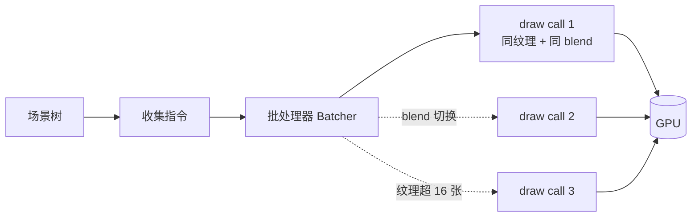

import { Canvas, Controls, Meta } from '@storybook/addon-docs/blocks';
import * as PerformanceStories from './performance.stories';

<Meta of={PerformanceStories} name="Docs" />

# 性能优化

PixiJS v8 默认就已经很快——批渲染自动合并相似对象、场景图缓存变换层级、纹理垃圾回收器自动回收闲置纹理。官方给出第一原则：**「Only optimize when you need to!」**（只在需要时才优化）。所以本课不是一堆"必做清单"，而是建立判断：**什么在消耗资源，对症减少**。

渲染每帧的开销可以归到一条流水线上：遍历场景树收集指令 → 批处理器把连续的、可合并的对象打包 → 提交一个或多个 **draw call** → GPU 绘制。优化的全部杠杆围绕这条流水线：

- **draw call 是主货币。** 一次 draw call = CPU 准备 + GPU 提交的固定开销。批渲染自动让多个对象共享一次提交，但**某些因素会打断批次**，让 draw call 成倍增加。
- **减少 GPU 工作量**：跳过看不见的（culling）、给同构对象用专用管线（`ParticleContainer`）、把稳定子树整体合批（`RenderGroup`）、少用最贵的蒙版 / 滤镜。
- **减少 CPU 工作量**：别每帧重建场景树、关掉不必要的命中测试、把昂贵的一次性绘制烘焙成纹理。
- **先定位再优化。** 不测量就优化是盲目的——先知道瓶颈在 CPU 还是 GPU，再对症下药。



| 性能杠杆 | 对应手段 | 关键 API / 默认值 | 深入入口 |
| --- | --- | --- | --- |
| draw call | 不打断批次：纹理图集、blend 分组、同类型聚集 | 每批次最多 **16 张纹理**（硬件相关）；`BLEND_MODES` | 本课「draw call 与批渲染」 |
| GPU 工作量 | culling / `ParticleContainer` / `RenderGroup` / 蒙版与滤镜取舍 | `cullable: false`（默认）；蒙版矩形 > Graphics > Sprite | [层级与分组](?path=/docs/layers--docs)；本课「减少 GPU 工作量」 |
| CPU 工作量 | 命中测试、Graphics 复用、文本策略 | `interactiveChildren: true`（默认）；Graphics **100 点**以下可批 | 本课「减少 CPU 工作量」 |
| 瓶颈定位 | draw call 计数、FPS、DevTools | `app.ticker.FPS` / `app.ticker.deltaMS` | 本课「瓶颈定位」 |

## draw call 与批渲染

批渲染（batching）是 v8 的内置行为，无需手动开启：渲染器遍历场景树时，把**连续的、共享纹理与状态的同类对象**累积到一个顶点缓冲区里，攒满或遇到无法合并的对象时一次提交。结果是 N 个精灵可能只产生 1 个 draw call。

理解"什么会打断批次"就等于掌握了减少 draw call 的钥匙。官方明确的打断因素：

- **blend mode 不同。** 相邻对象的 blend mode 不一致就打断。官方例子：`Screen / Normal / Screen / Normal` 交替 = 4 个 draw call；`Screen / Screen / Normal / Normal` 分组 = 2 个。
- **对象类型交替。** `sprite / graphic / sprite / graphic` 比 `sprite / sprite / graphic / graphic` 慢——不同类型的渲染管线互不相通。
- **纹理超过 16 张。** 一个批次最多绑定约 **16 张纹理**（硬件相关）。场景里出现的独立纹理源超过这个数就强制提交、开新批。
- **滤镜边界、RenderGroup 边界。** 滤镜会清空当前批；RenderGroup 是独立的合成根。

下面的实例用 monkey-patch 拦截 WebGL 的 `drawElements` / `drawArrays`，每帧计数 draw call。切换控件，观察 draw call 数如何随中断因素变化。

<Canvas of={PerformanceStories.DrawCallDemo} />
<Controls of={PerformanceStories.DrawCallDemo} />

| 读者操作 | 可观察证据 |
| --- | --- |
| `shared + normal`（默认） | draw call ≈ 1-2，无论精灵数 50 还是 600——所有精灵合一批 |
| 切到 `distinct` 纹理 | draw call 明显增多——24 张独立纹理 > 每批 16 张上限，批次被反复打断 |
| 切到 `alternating` blend | draw call 数接近精灵数——相邻精灵的 blend 反复切换，每次都打断 |
| 增大精灵数 | 在 `alternating` 下 draw call 线性增长，FPS 随之下降 |
| 打开 Show code | 看到该 Canvas 实际执行的 `performance.ts`，含 draw call 拦截与批次构造 |

### 纹理图集

上面的 `distinct` 模式揭示了问题：**独立纹理源越多，批次越碎**。解法是把多张小纹理合并成一张大纹理——纹理图集（Spritesheet）。图集里的每个小图共享同一个纹理源（只是 frame 不同），对批处理器而言是"同一张纹理"，因此可以合批。

```ts
import { Assets, Sprite } from 'pixi.js';

// Assets.load 支持 spritesheet JSON，自动把大图切成多个 Texture frame
const sheet = await Assets.load('sprites/sheet.json');
const sprite = new Sprite(sheet.textures['coin_01.png']);
```

配合精灵还可以用 **`tint`** 上色：`tint` 改的是顶点颜色而非纹理源，同一张白色纹理 + 不同 tint 仍在一个批次里（正是上面实例 `shared` 模式做的事）。所以"想要视觉多样"时优先考虑图集 + tint，而不是堆叠独立纹理。

## 减少 GPU 工作量

GPU 在做两件事：处理被提交的 draw call、对每个像素着色（含蒙版 / 滤镜的逐像素计算）。减少工作量的思路就是少提交、少着色。

- **culling 跳过视口外对象。** 大世界场景必备。关键判断（官方）：**GPU 瓶颈时 culling 提升性能，CPU 瓶颈时反而下降**——因为剔除本身花 CPU。culling 的完整 API（`cullable`、`cullableChildren`、`cullArea`、`Culler`、`CullerPlugin`）在[层级与分组](?path=/docs/layers--docs)课已讲清。
- **`ParticleContainer` 给同构对象专用管线。** 渲染成千上万个结构相同的粒子（雨滴、子弹、火星）时，它把所有粒子数据打包进单个缓冲区、一次 draw call 完成，绕过通用场景图。所有粒子必须共享同一基础纹理源，并按需在 `dynamicProperties` 里声明哪些属性每帧变化（`position` 默认动态，`color` / `rotation` / `scale` / `uvs` 默认静态）。详见[官方 ParticleContainer 指南](https://pixijs.com/8.x/guides/components/scene-objects/particle-container)。
- **`RenderGroup` 把稳定子树整体合批。** UI / HUD、视差背景这类内容很少重绘的子树，提升为 RenderGroup 后整体移动、调 `alpha` / `tint` 都在 GPU 侧完成，CPU 几乎零开销。不适合每帧重绘的子树（缓存失效反而更贵）。机制与启用方式见[层级与分组](?path=/docs/layers--docs)。
- **蒙版从快到慢：矩形 > Graphics > Sprite。** 轴对齐矩形蒙版用 scissor rect（最快）；Graphics 蒙版用 stencil buffer（次之）；Sprite 蒙版走滤镜管线（最贵）。能用矩形就别用精灵蒙版。
- **限定滤镜作用范围。** 滤镜对整个目标区域做逐像素处理，开销大。用 `container.filterArea = new Rectangle(x, y, w, h)` 把它限制在必要区域；不再需要时 `container.filters = null` 释放显存。
- **老设备降级。** `app.init({ useContextAlpha: false, antialias: false })` 关掉透明合成和抗锯齿，在低端设备上换性能。

## 减少 CPU 工作量

CPU 侧的开销来自场景树维护、命中测试、逐帧重算和资源上传。这些通常在对象数量大时才成为瓶颈。

- **别每帧重建场景树。** 变换层级是缓存的；频繁 `addChild` / `removeChild`、尤其成百上千次，会让缓存失效并增加 GC 压力。对象池 + 复用可见性（`visible` / `renderable`）比增删便宜得多。
- **关掉不必要的命中测试。** 容器默认 `interactiveChildren: true`，会递归参与命中检测。纯装饰层、背景层设 `interactiveChildren = false`；只在精确区域需要交互时给 `hitArea = new Rectangle(...)`。
- **复用 Graphics，避免每帧重画。** Graphics 在**不被频繁修改**时最快（变换 / alpha / tint 不算修改）。小于 **100 个点**的 Graphics 能像 Sprite 一样批渲染；成百上千个复杂 Graphics 会很慢，这时把它烘焙成纹理（`renderer.generateTexture(graphics)`）转成 Sprite，或改用 Sprite。
- **文本不要每帧改。** 普通文本每次修改都要重新绘制到 canvas 再上传 GPU。频繁更新的数字、计时器用 `BitmapText`（从预生成字形图集渲染，只重定位四边形）；不必要的高清可调低 `Text` 的 `resolution` 省显存。

## 瓶颈定位

优化的前提是知道瓶颈在哪。CPU 瓶颈和 GPU 瓶颈的处理手段完全不同，用错了反而更慢。

- **draw call 数。** 上面的实例展示了拦截 `gl.drawElements` 的思路。draw call 数稳定在个位数说明批渲染健康；随对象数线性增长说明批次在被持续打断（检查 blend mode、纹理数、对象类型排列）。
- **FPS 与帧时间。** `app.ticker.FPS` 是过去一秒的平均帧率，`app.ticker.deltaMS` 是上一帧的实际耗时。关注 `deltaMS` 比 FPS 更灵敏——60 FPS 时一帧预算 16.6 ms，超了就掉帧。
- **判断 CPU 还是 GPU 瓶颈。** 三个快速实验：
  - 缩小画布分辨率（`app.renderer.resolution` 调低）→ FPS 明显升 = **GPU 瓶颈**（像素着色压力大）。
  - 开启 culling → FPS 升 = GPU 瓶颈；FPS 降 = CPU 瓶颈（剔除本身花 CPU）。
  - 减少场景逻辑 / 命中测试 → FPS 升 = **CPU 瓶颈**。
- **浏览器 DevTools Performance。** 录制一段，看主线程花在 JS（你的 ticker 回调、场景更新）还是 GPU 任务上。PixiJS 的纹理上传、滤镜会在时间轴上有明显标记。

记住官方原则：**先测，再改，只改瓶颈。** 不测量就"优化"常常让代码更复杂却没收益，甚至引入回退（比如在 CPU 瓶颈时开 culling）。

## 最佳实践

- **对象数量大时优先保证批渲染不断。** 用纹理图集替代独立纹理、按类型聚集对象（Sprite 们放一起、Graphics 们放一起）、统一 blend mode，比任何微优化都有效。
- **culling 只在大世界 + GPU 瓶颈时开。** 视口远小于场景、且测量确认是 GPU 瓶颈时，culling 收益最大；CPU 瓶颈或小场景别开。
- **一次性绘制烘焙成纹理。** 复杂静态 Graphics、动态但不常变的 UI，用 `generateTexture` 烘焙成 Sprite 纹理后，每帧只是便宜的一次 draw call。
- **`ParticleContainer` 之外的"大量同纹理对象"用普通 Container + 图集就够。** 只有真正需要数十万级同构粒子时才上 `ParticleContainer`，它牺牲灵活性（无子节点、无事件、无滤镜）换吞吐。
- **降级选项留给低端设备。** `useContextAlpha: false`、`antialias: false`、调低 `resolution` 是按需牺牲画质的换性能开关，默认配置在主流设备上通常已足够。

## 常见问题

- **draw call 数随精灵数线性增长**
  检查三个打断因素：相邻精灵的 blend mode 是否一致、是否用了超过 16 张独立纹理源、Sprite 与 Graphics 是否交替排列。把独立纹理合并成图集、统一 blend mode、同类型聚集，draw call 会骤降。本课实例的 `alternating` blend 模式就是这个问题的直观演示。
- **开了 culling，FPS 反而下降**
  culling 的剔除判断本身花 CPU。官方明确：**GPU 瓶颈时 culling 提升性能，CPU 瓶颈时反而下降**。先用缩小分辨率确认是否 GPU 瓶颈；若已是 CPU 瓶颈，别开 culling，转而减少 JS 逻辑或命中测试。
- **大量文本更新导致卡顿**
  普通文本每次修改都要重新绘制到 canvas 再上传 GPU。频繁更新的数字、计分用 `BitmapText`（只重定位字形四边形，无重绘）；静态文本只在初始化时设一次。
- **场景里有几百个复杂 Graphics 很卡**
  Graphics 超过约 100 个点就不参与批渲染。把不常变的复杂 Graphics 用 `renderer.generateTexture(graphics)` 烘焙成 Texture、转成 Sprite；只对真正每帧变形的 Graphics 保留实时绘制。
- **滤镜让帧率明显下降**
  滤镜对整个目标区域做逐像素处理。给容器设 `filterArea = new Rectangle(...)` 把处理范围限制到必要矩形；多个叠加滤镜会逐个执行，能用一个调参代替就别叠加；不再需要时 `container.filters = null` 释放显存。
- **精灵都用 `BLEND_MODES.NORMAL` 却没合批**
  纹理的**预乘 Alpha（PMA）**属性会让引擎把 PMA 纹理的 `normal` 实际当作 `add` 处理（GPU 混合方程必须不同，否则出暗边）。当同一批次里既有 PMA 又有非 PMA 纹理时，即使名义 blend 都是 `normal`，也会因实际混合方程不同而中断批次。统一纹理的预乘属性（加载时设 `premultiplyAlpha`），或把它们合并到同一张图集，即可恢复合批。

## 总结回顾

摘要：

PixiJS v8 默认就启用了批渲染、变换缓存和纹理 GC，优化应只在测量确认瓶颈后进行。draw call 是性能的主货币：批处理器自动合并连续的、共享纹理与 blend 的同类对象，但 blend mode 切换、对象类型交替、独立纹理超过每批 16 张、滤镜边界都会打断批次、推高 draw call。减少 GPU 工作量靠 culling（仅 GPU 瓶颈有效）、`ParticleContainer`（同构对象专用管线）、`RenderGroup`（稳定子树合批）、以及按矩形 > Graphics > Sprite 的顺序选蒙版并限定 `filterArea`。减少 CPU 工作量靠避免每帧重建场景树、关掉不必要的 `interactiveChildren`、把复杂静态 Graphics 烘焙成纹理、用 `BitmapText` 替代频繁更新的文本。瓶颈定位先用 draw call 计数和 `app.ticker.FPS` / `deltaMS` 量化，再通过缩分辨率、开 culling 等实验区分 CPU 与 GPU 瓶颈，只对症下手。

一句话：

> draw call 是性能的主货币——不打断批次、不画看不见的、不重算不变的，比任何微优化都重要。

知识要点：

- 批渲染是自动的吗？它合并对象的前提是什么？
- 哪三个因素会打断批次？draw call 会怎样变化？
- 每个批次最多绑定多少张纹理？想要更多视觉多样该怎么办？
- tint 会打断批次吗？为什么？
- culling 在 CPU 瓶颈和 GPU 瓶颈下分别表现如何？
- `ParticleContainer` 适合什么场景？它对子节点 / 事件 / 滤镜有什么限制？
- 蒙版按速度从快到慢的顺序是什么？最贵的蒙版走的是哪条管线？
- 判断 CPU 还是 GPU 瓶颈，可以用哪几个快速实验？
- 复杂静态 Graphics 卡顿，用什么方法把它变快？

## 参考资料

- [PixiJS 指南：Performance Tips](https://pixijs.com/8.x/guides/concepts/performance-tips)
- [PixiJS 指南：Render Groups](https://pixijs.com/8.x/guides/concepts/render-groups)
- [PixiJS 指南：Particle Container](https://pixijs.com/8.x/guides/components/scene-objects/particle-container)
- [PixiJS API：Batcher](https://pixijs.download/release/docs/rendering.Batcher.html)
- [PixiJS API：Ticker](https://pixijs.download/release/docs/ticker.Ticker.html)
- [v8 迁移指南](https://pixijs.com/8.x/guides/migrations/v8)
