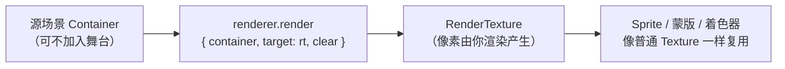

import { Canvas, Controls, Meta } from '@storybook/addon-docs/blocks';
import * as RenderTexture from './render-texture.stories';

<Meta of={RenderTexture} name="Docs" />

# 渲染纹理

渲染纹理（`RenderTexture`）是一块可写入的 GPU 纹理：你用 `renderer.render({ target })` 把任意场景子树画进它，它就成了一张普通 `Texture`，能被 Sprite、蒙版或着色器像加载的图片一样复用。它与普通纹理的区别只在「像素从哪来」——普通 `Texture` 的像素来自图片文件，`RenderTexture` 的像素来自你主动渲染的内容，并且可以每帧重画。读完下面的实例你会看到：切到「累积保留」后，轨道粒子的轨迹会逐帧累积成一整圈，而同一张纹理同时显示在主区和角落迷你区——这就是「可复用的动态纹理」。

`RenderTexture.create` 接收一组纹理选项，下列默认值取自 v8 的 `TextureSource.defaultOptions`：

| 选项 | 默认值 | 作用 |
| --- | --- | --- |
| `width` / `height` | 必填 | 纹理逻辑尺寸（CSS 像素），决定渲染区的可见大小 |
| `resolution` | `1` | 设备像素比；后备像素 = 逻辑尺寸 × resolution |
| `scaleMode` | `'linear'` | 缩放采样模式：`'linear'` 平滑 / `'nearest'` 像素感 |
| `antialias` | `false` | MSAA 抗锯齿，与分辨率是不同机制（见渲染器课） |
| `dynamic` | `false` | 是否允许后续 `rt.resize()`；不开启则 resize 静默失效 |
| `mipLevelCount` / `autoGenerateMipmaps` | `1` / `false` | mipmap 级数与自动生成（高级，配合 `render({ mipLevel })` 手动生成多级纹理） |

`renderer.render` 把渲染目标切换到纹理，关键参数：

| 参数 | 默认 / 取值 | 作用 |
| --- | --- | --- |
| `container` | 必填 | 要渲染的场景子树 |
| `target` | 省略时为屏幕画布 | 输出目标；传 `RenderTexture` 即渲染进纹理（v8 写法，旧的 `renderTexture` 参数已弃用） |
| `clear` | 屏幕目标取 `background.clearBeforeRender`；纹理目标建议显式传 | `true` 先清空再画（快照），`false` 保留旧像素（累积） |
| `transform` | 容器自身 localTransform | 相对纹理坐标系平移 / 旋转渲染内容 |
| `clearColor` | 目标背景色 | 清空时填充的颜色 |

## 创建渲染纹理

`RenderTexture.create(options)` 是唯一的工厂方法（v8 只接受对象形式，不再有独立参数重载）。返回值是一个 `RenderTexture`，它在内部用一块空白的、可写入的 `TextureSource` 支撑，行为与普通 `Texture` 一致：

```ts
import { RenderTexture } from 'pixi.js';

const rt = RenderTexture.create({
  width: 256,
  height: 256,
  resolution: 2,        // 后备像素 512×512，放大显示更锐利
  antialias: true,
  dynamic: true,        // 之后要 rt.resize() 必须开启
  textureOptions: { defaultAnchor: { x: 0.5, y: 0.5 } },
});
```

`width` / `height` 是逻辑尺寸，与 `resolution` 相乘得到实际 GPU 存储。需要事后改尺寸时务必带 `dynamic: true`——否则 `rt.resize()` 不会把变化传播给渲染器，画面静默不更新：

```ts
// 仅在创建时带 dynamic: true 才生效，重新分配 GPU 存储
rt.resize(512, 512, 2);
```

纹理创建后不要每帧重建。把 `rt` 作为长生命周期对象持有，在 `dispose` 时调 `rt.destroy(true)`（`destroySource` 为 `true` 才会释放底层 `TextureSource` 的 GPU 存储和 `Texture` 包装；销毁引用它的 Sprite 不会连带销毁纹理）。

## 渲染到纹理并复用

把渲染目标从「屏幕画布」切换到纹理，是这一课的核心机制。`renderer.render` 接收一个选项对象，`target` 指定输出，`clear` 决定每帧是擦除重画还是累积：



经典四步：准备一个场景、创建纹理、把场景渲染进纹理、再把纹理当普通 `Texture` 用：

```ts
// 1. 源场景：可不加入 stage，纯粹作为渲染输入
const scene = new Container();
scene.addChild(/* ... */);

// 2. 创建可写入纹理
const rt = RenderTexture.create({ width: 256, height: 256 });

// 3. 把场景渲染进纹理；target 指定输出，clear 决定是否先清空
app.renderer.render({ container: scene, target: rt, clear: true });

// 4. 纹理可像普通 Texture 一样复用：赋给任意 Sprite，多个 Sprite 可共享同一张
const sprite = new Sprite(rt);
app.stage.addChild(sprite);
```

渲染出来的纹理没有任何特殊待遇——它就是一张 `Texture`。同一个 `rt` 挂到多个 Sprite 上，所有 Sprite 都显示同一份内容，修改一处即处处同步，这就是「可复用」。它也能作为蒙版来源（`container.mask = new Sprite(rt)`）或在自定义着色器里采样，用法与加载的纹理一致。

下面的实例把一个旋转轨道粒子场景每帧渲染进 `RenderTexture`，主显示区放大显示、角落迷你区缩小复用同一张纹理。切「清除模式」对比 `clear` 的两种行为：

<Canvas of={RenderTexture.Interactive} />
<Controls of={RenderTexture.Interactive} />

| 读者操作 | 可观察证据 |
| --- | --- |
| 选「每帧清除」 | 纹理先清透明再画，主区只有一个移动的亮点（快照） |
| 选「累积保留」 | 不清除，亮点轨迹逐帧铺成完整圆环；迷你区同步累积 |
| 对比两块显示区 | 内容始终一致，证明同一张 `RenderTexture` 被多个 Sprite 复用 |
| 查看读数 | 「纹理分辨率」=2、「后备像素」= 512×512 = 逻辑尺寸 × 分辨率 |
| 打开 Show code | 看到该 Canvas 实际执行的 `render-texture.ts`，含 `renderer.render({ target, clear })` 与 `rt.destroy(true)` |

## 持续更新与一次性快照

「动态纹理」靠在 `Ticker` 里每帧重渲染实现——源场景变化后重新画进纹理，所有引用它的显示对象自动跟着更新：

```ts
// 每帧重渲染 → 纹理内容随场景动态更新
app.ticker.add(() => {
  // 更新 scene（旋转、位移等）...
  app.renderer.render({ container: scene, target: rt, clear: true });
});
```

`ticker` 回调默认优先级高于 `Application` 自身的舞台渲染，因此「纹理先更新、舞台再绘制到屏幕」顺序天然正确，无需手动调度。

如果只需要在某一刻捕获一次、之后不随源变化更新，用 `renderer.generateTexture` 一次性快照更合适——它渲染一次并返回 `Texture`，随即与源对象脱钩，不需要 Ticker 循环：

```ts
// 一次性快照：渲染一次返回 Texture，不随源更新（适合预渲染 UI、从 Graphics 烘焙纹理）
const snapshot = app.renderer.generateTexture(displayObject);
// 也可传 options：generateTexture({ target: displayObject, resolution: 2, antialias: true })
const sprite = new Sprite(snapshot);
```

选择依据：内容会持续变化用 `RenderTexture` + 每帧 `renderer.render`；内容基本静态、只想固化一次用 `generateTexture`。容器级的「把整个子树烘焙成一张纹理以减少 draw call」是另一种优化入口（`container.cacheAsTexture()`），它内部也使用渲染纹理，属于渲染层级与性能优化的范畴。

## 累积绘制与反馈效果

`clear: false` 让渲染纹理保留旧像素，新内容画在旧内容之上。这打开了一类「累积」与「反馈」效果，是 `RenderTexture` 区别于普通纹理最值得专门记下的能力。

### 累积绘制

把笔刷图形以 `clear: false` 反复画进同一张纹理，旧笔触保留、新笔触叠加。刮刮卡就是典型用法：纹理做蒙版，指针移动时累积画白色笔刷，逐步「刮开」被遮罩的内容：

```ts
// 指针移动时，把笔刷累积画进纹理（不清除）
brush.position.set(x, y);
app.renderer.render({ container: brush, target: rt, clear: false });

// 笔触之间用线段插值，避免快速移动时出现断点
line.clear().moveTo(lastX, lastY).lineTo(x, y).stroke({ width: 40, color: 0xffffff });
app.renderer.render({ container: line, target: rt, clear: false });
```

上面的实例切到「累积保留」时，旋转粒子留下的完整圆环就是同一种累积——只是粒子的位移代替了笔刷的指针位移。

### 缓冲交换

反馈拖尾、万花筒畸变这类效果，需要把「上一帧的纹理」作为下一帧的输入再画回去。但 GPU 不允许在同一帧的同一管线里同时读写同一张纹理，强行这么做会得到撕裂或不可预期的画面。解法是用两张 `RenderTexture` 交替读写（ping-pong / buffer swap）：

```ts
// 两个 RenderTexture 交替读写，读取与写入目标始终不同
app.renderer.render({ container: stage, target: writeRT, clear: false });

// 渲染完一帧后交换两个引用，writeRT 在下一帧成为输入
[readRT, writeRT] = [writeRT, readRT];
outputSprite.texture = readRT;
```

`stage` 里通常包含一个引用 `readRT` 的 Sprite（带轻微缩放或旋转），于是旧画面被不断以衰减的变换重画进 `writeRT`，形成递归拖尾。只要看到「纹理既是输入又是输出」，就应改用两张纹理交换。

## 最佳实践

- **需要 resize 就开 dynamic：** 凡是运行时可能改尺寸（响应式、缩放、分块）的渲染纹理，创建时带 `dynamic: true`；尺寸完全固定时可省略。
- **分辨率按用途选：** 会放大显示或需要清晰细节的纹理设 `resolution: 2`（与 HiDPI 同理）；中间过渡纹理、性能敏感场景保持默认 `1`。
- **复用而非重建：** 把 `rt` 作为长生命周期对象，每帧只重渲染内容；在 `dispose` 调 `rt.destroy(true)` 释放 GPU 存储，不要等 GC。
- **反馈效果用两张纹理：** 凡是纹理既是输入又是输出，改用两张 `RenderTexture` 交替读写，避免同帧读写同一张纹理。

## 常见问题

- **`rt.resize()` 调了但画面没变？**
  创建时没带 `dynamic: true`。没有这个标志，纹理不会把尺寸变化传播给渲染器，resize 静默失效。需要事后改尺寸的渲染纹理都必须带 `dynamic: true`。
- **反馈效果里画面撕裂或出现不可预期的残影？**
  在同一帧里对同一张纹理既读取（作为 Sprite 纹理输入）又写入（作为 `target`）。GPU 不允许同帧同纹理读写，改用两张 `RenderTexture` 交替读写（缓冲交换）。
- **`RenderTexture` 和 `generateTexture` 该用哪个？**
  内容会持续变化、需要随源更新用 `RenderTexture` + 每帧 `renderer.render`；只想在某一刻捕获一次、之后不再随源变化用 `generateTexture`。后者是单次快照，没有持续重渲染开销。
- **销毁了 Sprite，纹理好像没释放？**
  销毁引用纹理的 Sprite 不会连带销毁纹理本身。自行创建的 `RenderTexture` 必须显式 `rt.destroy(true)`（`destroySource: true`）才能释放底层 `TextureSource` 的 GPU 存储和 `Texture` 包装。

## 总结回顾

摘要：

`RenderTexture` 是一块可写入的 GPU 纹理：`RenderTexture.create({ width, height, resolution, antialias, dynamic })` 创建它，`resolution` 决定后备像素密度、`dynamic: true` 为后续 `resize()` 预留（不开则静默失效）。`renderer.render({ container, target: rt, clear })` 把任意场景子树渲染进纹理——`target` 是 v8 的写法（旧的 `renderTexture` 参数已弃用），`clear` 为 `true` 时每帧先清空再画（快照）、为 `false` 时保留旧像素（累积）。渲染出的纹理就是普通 `Texture`，可被多个 Sprite、蒙版或着色器复用，修改一处即处处同步。动态纹理靠 Ticker 每帧重渲染实现；只需固化一次用 `generateTexture`。反馈拖尾、刮刮卡等累积效果用 `clear: false`；当纹理既是输入又是输出时改用两张纹理缓冲交换，避免同帧读写同一张纹理。纹理自行管理生命周期，`rt.destroy(true)` 释放 GPU 存储。

一句话：

> `RenderTexture` 把「渲染目标」从屏幕画布切换到纹理，`clear` 决定每帧是快照还是累积，结果是一张可被任意 Sprite 复用的动态 `Texture`。

知识要点：

- `RenderTexture.create` 的 `resolution` 和 `dynamic` 各自影响什么？后备像素怎么算？
- `renderer.render` 用哪个参数把渲染目标切换到纹理？`clear` 的两种取值各自得到什么结果？
- 同一张 `RenderTexture` 怎么被多个显示对象复用？
- 持续动态更新和一次性快照分别用什么 API？怎么选？
- 反馈 / 拖尾效果为什么不能用同一张纹理同时读写？解法是什么？
- 销毁 `RenderTexture` 时为什么要显式 `rt.destroy(true)`？

## 参考资料

- [PixiJS 指南](https://pixijs.com/8.x/guides)
- [PixiJS API：RenderTexture](https://pixijs.download/release/docs/rendering.RenderTexture.html)
- [PixiJS API：AbstractRenderer.render](https://pixijs.download/release/docs/rendering.AbstractRenderer.html)
- [PixiJS API：generateTexture](https://pixijs.download/release/docs/rendering.AbstractRenderer.html#generateTexture)
- [PixiJS 示例库（render-texture）](https://pixijs.com/8.x/examples)
- [v8 迁移指南](https://pixijs.com/8.x/guides/migrations/v8)
