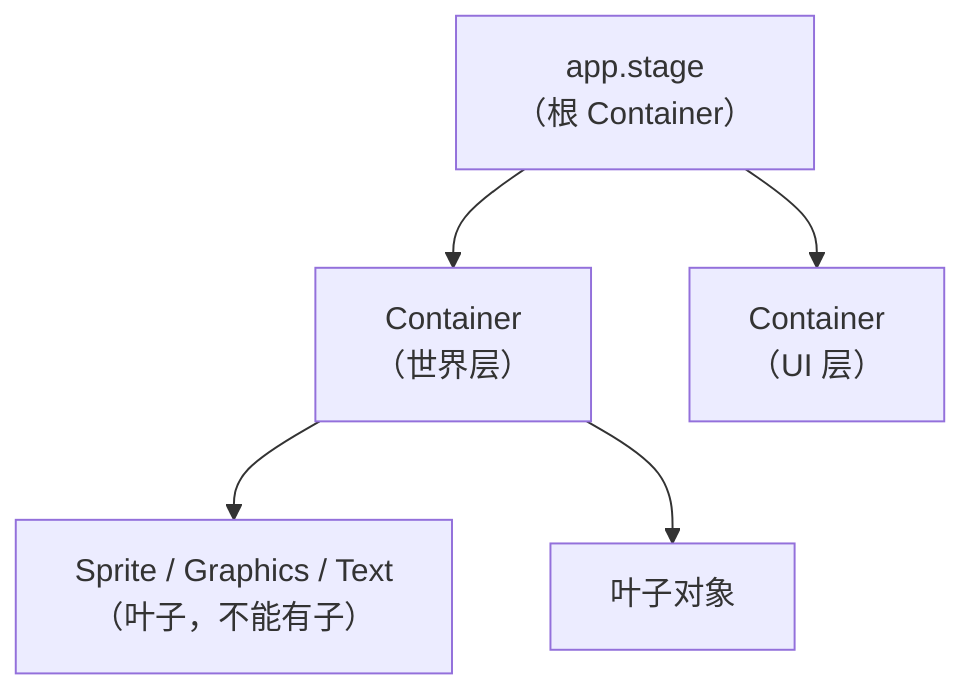

import { Canvas, Controls, Meta } from '@storybook/addon-docs/blocks';
import * as SceneGraph from './scene-graph.stories';

<Meta of={SceneGraph} name="Docs" />

# 场景图与容器

场景图（scene graph）是 PixiJS 组织所有可渲染对象的方式：对象排成一棵树，父节点的位置、旋转、缩放、透明度和可见性会逐级累积传递给子节点。`Container` 既是分组节点，也是 v8 中所有场景对象的基类；`Application` 启动后提供的 `app.stage` 就是这棵树的根。本课讲清这棵树的形态、父子关系的操作、渲染顺序，以及最关键的——本地坐标与全局坐标如何换算。读完它，你应该能预测：移动一个父容器，它的整棵子树会跟着动；而要把对象放到准确位置，永远要先看它挂在谁的下面。



| 对象 / 属性 | 默认值 | 用途与回查 |
| --- | --- | --- |
| `app.stage` | `Container` 实例 | 场景图根；对象只有加入它（或它的子树）才会被渲染 |
| `Container` | — | 分组节点 + 所有场景对象的基类；叶子对象（Sprite / Graphics / Text）不能有子 |
| `children` | `[]`（只读） | 子节点列表，按加入顺序 |
| `parent` | `null`（只读） | 当前父节点 |
| `visible` / `renderable` | `true` / `true` | 是否参与渲染，向子节点传递 |
| `alpha` | `1` | 透明度，与父级相乘累积 |
| `sortableChildren` / `zIndex` | `false` / `0` | 显式控制渲染顺序的开关 |
| `label` | — | 节点标识，配合 `getChildByLabel` 查找 |

## 场景图：一棵以 stage 为根的树

每一帧 PixiJS 都从 `app.stage` 开始，自上而下更新变换、再自上而下渲染。树上的每个节点要么是分组（`Container`），要么是叶子（`Sprite`、`Graphics`、`Text` 等具体内容）。叶子负责产生像素，分组负责组织结构和传递变换。理解这棵树有三个要点：

- **只有一棵树、一个根。** `app.stage` 是唯一的根；一个对象只有成为 `stage` 或其子树的一员，才会被更新和渲染。
- **变换向下累积。** 父节点的 `position`、`rotation`、`scale`、`skew`、`alpha` 和 `visible` 都会传递并叠加到所有子孙节点（各变换参数的含义与组合在「变换」课展开）。
- **叶子不能有子。** v8 起 `Sprite`、`Graphics`、`Mesh`、`Text` 都是叶子，对它们调 `addChild` 不生效；要嵌套就得先套一层 `Container`。

### Container：分组的基类

v8 做了一次重要的合并：旧版的 `DisplayObject` 被移除，`Container` 成为**所有场景对象的基类**。`Sprite`、`Graphics`、`Text` 都是 `Container` 的子类，但它们被限制为叶子——只有 `Container` 本身（以及 `RenderLayer` 等子类）能持有子节点。

`Container` 自己不产生像素，它只做两件事：持有子节点、把自身变换传递给子树。所以一个「什么都没装」的 `Container` 不会在画面上显示任何东西，它的存在感来自它的子节点和子节点之间的相对位置。

```ts
import { Container } from 'pixi.js';

// 空构造，或带 options：label 方便后续 getChildByLabel 查找
const world = new Container();
const enemy = new Container({ label: 'enemy' });
```

构造 options 里常用的有 `label`（替代旧版 `name`）、`isRenderGroup`、`sortableChildren`、`zIndex`。要按名字取回子节点用 `getChildByLabel(label, deep?)`，或用 `getChildrenByLabel(/enemy/)` 做正则批量查找。

### stage：Application 的根容器

`app.stage` 就是 `Application` 在 `init()` 时为你创建的一个普通 `Container`，作为场景图的根被自动渲染。你不必自己创建根，只要把内容 `addChild` 进 `stage`（或它的子树）即可。

```ts
const app = new Application();
await app.init({ /* 选项 */ });

app.stage.addChild(world);        // world 进入场景图
console.log(app.stage.children);  // [world]
```

`stage` 本身的位置默认在原点 `(0, 0)`，所以根级子对象的本地坐标几乎就是屏幕坐标（差别见下方「坐标空间」）。`Application` 的初始化选项、`app.canvas`（v8 替代旧版 `app.view`）和画布挂载见「初始化」课；这里只需把 `app.stage` 当作场景图的唯一入口。

## 父子关系：把对象放进树里

父子关系决定对象在树里的位置，进而决定它受谁的变换影响、按什么顺序渲染。所有结构操作都围绕「子节点列表」（`children`）展开，并且有一个共同点：**把子节点加入新父时会自动从旧父移除。**

### 添加与移除子节点

```ts
const a = new Container();
const b = new Container();

// 批量加入末尾，返回第一个被加入的子节点
stage.addChild(a, b);

// 插入到指定序号：a 现在排在第 0 位
stage.addChildAt(a, 0);

// 查序号、按序号取、重排、两两交换
stage.getChildIndex(b);   // 1
stage.getChildAt(0);      // a
stage.setChildIndex(b, 0);
stage.swapChildren(a, b);

// 移除：单个 / 多个 / 按序号 / 区间
stage.removeChild(a);
stage.removeChildAt(0);
stage.removeChildren(0, 2); // 移除 [0, 2) 区间内的子节点
```

`addChild` 接受变参，可以一次加入多个；如果被加入的子节点已有父节点，会自动从原父节点移除——这本身就是「重定父级」。但它保留的是子节点的**本地坐标**：换父后本地坐标数值不变，可参照的父变了，世界位置通常会跳变。

**想保持世界位置不跳，用 `reparentChild`。** v8 新增的 `reparentChild(...children)` 和 `reparentChildAt(child, index)` 会补偿本地变换，让子节点在屏幕上的位置不变，适合把对象从「世界层」挪到「UI 层」而不希望它瞬移：

```ts
// 普通挪法：本地坐标不变，世界位置会跳
uiLayer.addChild(hud);

// v8 专用：保持世界位置
uiLayer.reparentChild(hud);
```

被 `removeChild` 移除但不销毁的对象只是离开了场景图，仍可继续使用；要彻底释放见「内存与生命周期」课。`destroy(options)` 的 `options` 默认 `false`，传 `{ children: true }` 会连带销毁所有子节点。

### 渲染顺序与 zIndex

同一父节点下，子节点**按加入顺序**渲染：后加入的盖在前面。这是默认规则，多数场景够用。

当需要显式控制层级、又不方便改加入顺序时，打开父节点的 `sortableChildren`，再给每个子节点设 `zIndex`：

```ts
container.sortableChildren = true;
bg.zIndex = 0;
actor.zIndex = 1;   // 盖在 bg 之上
fx.zIndex = 2;
```

- `sortableChildren` 默认 `false`，不开时 `zIndex` 完全不生效。
- `zIndex` 默认 `0`，值小的先画（在下层），值大的后画（在上层）。
- 改完 `zIndex` 后，开启了 `sortableChildren` 的容器会自动重排；也可手动 `container.sortChildren()`。官方提醒排序有开销，子节点很多时谨慎使用。

`zIndex` 只在**同一个父节点内**比较，不同父节点的 `zIndex` 互不影响。需要跨子树统一分层时（例如 UI 永远盖在游戏世界之上），用「层级与分组」课的 `RenderLayer` / `RenderGroup`，而不是堆 `zIndex`。

## 坐标空间：本地坐标、全局坐标与父变换

场景图里每个对象都有两套坐标：**本地坐标**（`position`，相对父节点）和**全局坐标**（相对 `stage` 原点，近似屏幕左上角）。一个子节点的全局位置，等于「父节点的全局位置」叠加上「子节点的本地位置经父变换后的结果」——这就是父变换能带着整棵子树一起动的根本原因。

| 空间 | 原点 | 谁的坐标 |
| --- | --- | --- |
| 本地 | 父节点的原点 | `obj.position` / `obj.x` / `obj.y` |
| 全局 | `stage` 原点（屏幕左上） | `obj.toGlobal({ x, y })` / `obj.getGlobalPosition()` |
| 屏幕 | canvas DOM 元素左上 | DOM 事件坐标；canvas 被 CSS 拉伸时与全局不同 |

在两个空间之间换算：

```ts
// 把子节点的本地原点转成全局坐标
const g = child.getGlobalPosition();

// 把任意全局点转回本对象的本地坐标
const local = child.toLocal({ x: 100, y: 80 });

// 把 A 的局部点转到 B 的局部坐标系（from 指定来源空间）
const p = b.toLocal({ x: 10, y: 10 }, a);
```

下面的实例把 `stage → parent → child` 这条链画出来：蓝框是 `parent` 容器的本地空间，红圆是它的子节点。拖动「父容器 X」时整框带红圆一起平移；拖动「子对象 X」时只有红圆在框内移动。左下角读数里「子对象 X（全局）」始终等于「父容器 X（本地）+ 子对象 X（本地）」，这就是累积的直接证据。

<Canvas of={SceneGraph.Interactive} />
<Controls of={SceneGraph.Interactive} />

| 读者操作 | 可观察证据 |
| --- | --- |
| 拖动「父容器 X」 | 蓝框与红圆整体水平平移，「父容器 X（本地）」与「子对象 X（全局）」同步变化，灰色 stage 原点不动 |
| 拖动「子对象 X」 | 只有红圆在蓝框内平移，「子对象 X（本地）」变化，「父容器 X（本地）」不变 |
| 对比两行读数 | 「子对象 X（全局）」与「父 + 子本地」始终相等，证明全局坐标由父→子累积 |
| 打开 Show code | 看到该 Canvas 实际执行的 `scene-graph.ts`，包括 `app.stage.addChild(...)` 与 `getGlobalPosition()` |

## 最佳实践

- **用容器表达「一组」**：会一起移动、旋转或显隐的对象放进同一个 `Container`，移动父节点即可带动整组，不必逐个改子节点。
- **给节点起 `label`**：用 `getChildByLabel('enemy', true)` 深度查找，比维护自己的引用表更省心，调试时也更易辨认。
- **结构别太深**：每多一层都增加变换与命中测试的计算量，通常 3~4 层足够组织大部分场景。
- **静态子树考虑优化**：内容不变的大容器可评估 `cacheAsTexture(true)`（缓存为纹理）或 `isRenderGroup`（独立渲染分组）；取舍与适用条件见「层级与分组」与「性能优化」课。

## 常见问题

- **给 `Sprite` / `Graphics` 调 `addChild` 没反应？**
  v8 起这些叶子节点不能再有子节点。要嵌套就包一层 `Container`，把叶子和它的附属对象都放进这个容器。
- **改了 `zIndex` 却没生效？**
  `zIndex` 只在父节点开启 `sortableChildren`（默认 `false`）时才被比较。打开父节点的开关，或手动调 `sortChildren()`。另外 `zIndex` 只在同一父节点内有效，跨子树不通用。
- **`addChild` 把对象挪到新容器后位置「跳了」？**
  这是正常行为：`addChild` 保留子节点的本地坐标，换父后同一个本地坐标对应的世界位置通常变了。若希望屏幕位置不变，用 v8 的 `reparentChild`，它会补偿本地变换以保持世界坐标。
- **`removeChild` 之后内存没释放？**
  移除只断开场景图关系，对象本身仍被你的引用持有。要彻底释放，对不再使用的对象调 `destroy({ children: true })` 并清掉外部引用，细节见「内存与生命周期」课。

## 总结回顾

摘要：

PixiJS 用一棵以 `app.stage` 为根的场景图组织所有可渲染对象。v8 中 `Container` 既是分组节点也是所有场景对象的基类，叶子节点（Sprite / Graphics / Text）不能有子节点。父节点的变换、透明度和可见性逐级累积传递给子树；子节点按加入顺序渲染，可用 `sortableChildren` + `zIndex` 显式重排。结构操作围绕子节点列表展开，加入新父时自动解除旧父关系——`addChild` 保留本地坐标、`reparentChild` 保留世界坐标。每个对象都有相对父节点的本地坐标和相对原点的全局坐标，两者通过 `toGlobal` / `toLocal` / `getGlobalPosition` 换算。

一句话：

> 在 PixiJS 里定位任何东西，都要先看它在场景图里挂在谁的下面——本地坐标相对父，全局坐标由父→子逐级累积。

知识要点：

- `app.stage` 是什么，对象怎样才能被渲染？
- `Container` 在 v8 里扮演哪两个角色？
- 为什么 `Sprite` 不能 `addChild`？
- 子节点的渲染顺序由什么决定？`zIndex` 何时才生效？
- 本地坐标和全局坐标的原点分别在哪？怎么互相转换？
- `addChild` 重定父级时位置为什么会跳？用哪个方法能避免？

## 参考资料

- [PixiJS 指南 — 场景图（8.x）](https://pixijs.com/8.x/guides/concepts/scene-graph)
- [PixiJS 指南 — Container（8.x）](https://pixijs.com/8.x/guides/components/scene-objects/container)
- [PixiJS API 参考 — Container](https://pixijs.download/release/docs/scene.Container.html)
- [PixiJS v8 迁移指南](https://pixijs.com/8.x/guides/migrations/v8)
