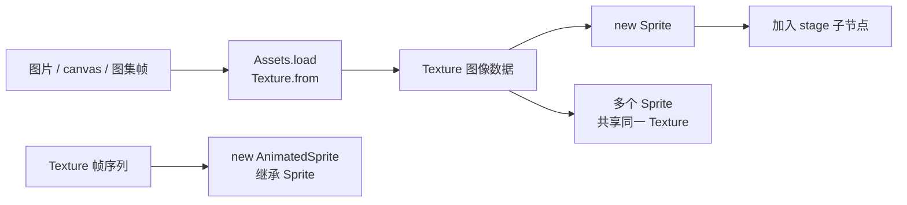

import { Canvas, Controls, Meta } from '@storybook/addon-docs/blocks';
import * as SpriteStories from './sprite.stories';

<Meta of={SpriteStories} name="Docs" />

# 纹理与精灵

在 PixiJS 里，把一张图显示到画布上分两步：先有 **Texture**（图像数据），再用 **Sprite** 把它放进场景图。Texture 只管「画什么」——像素来源、尺寸、裁剪；Sprite 只管「怎么放」——位置、旋转、缩放、锚点、染色。把这层分工记牢，anchor、换帧、批量同纹理等用法都能自然推导。逐帧动画由 **AnimatedSprite** 负责：它在 Sprite 基础上持有一组 Texture 帧序列并按速度自动切换，本质还是「Sprite + 多张 Texture」。



| 对象 / 属性 | 默认值 | 作用 |
| --- | --- | --- |
| `Texture` | — | 图像数据；记录像素来源、尺寸与裁剪，可被多个 Sprite 共享 |
| `new Sprite(texture)` | — | 用一个 Texture 创建显示对象 |
| `Sprite.anchor` | `(0, 0)` | 纹理内的锚点（0–1 归一化），决定定位、缩放与旋转的中心 |
| `Sprite.tint` | `0xFFFFFF` | 与纹理颜色相乘的整体染色，不改 Texture 数据 |
| `Texture.from(source)` | 命中缓存 | 从图片 / canvas / 缓存 id 创建 Texture |
| `Assets.load(url)` | 异步 | 加载图片等资源并返回 Texture（完整用法见「资源加载」） |
| `new AnimatedSprite({ textures })` | — | 用帧序列创建逐帧动画精灵 |
| `AnimatedSprite.animationSpeed` | `1` | 每帧推进倍率，越大越快；`0` 等于暂停 |
| `AnimatedSprite.loop` | `true` | 是否循环；`false` 时播完停在末帧 |
| `AnimatedSprite.autoPlay` | `false` | 构造后是否自动播放，默认需手动 `play()` |
| `AnimatedSprite.autoUpdate` | `true` | 是否绑定全局 `Ticker.shared` 自动推进帧 |

## Texture 与 Sprite 的分工

Texture 是 GPU 侧的图像数据，Sprite 是把它放进场景图的显示对象。一个直观证据：`tint` 给精灵染色时，所有像素与一个颜色相乘，Texture 的原始数据并不改变——染色是 Sprite 层的能力。正因如此，同一张 Texture 可以被多个 Sprite 共享，GPU 只存一份。

拿到 Texture 的途径：

```ts
import { Assets, Sprite, Texture } from 'pixi.js';

// 1. 异步加载图片（生产主路径，返回 Texture）
const texture = await Assets.load<Texture>('assets/arrow.png');

// 2. 从现成资源（HTMLImageElement / HTMLCanvasElement 等）直接包成 Texture
const textureFromCanvas = Texture.from(offscreenCanvas);

// 3. 一步创建 Sprite（内部自动建 Texture）
const sprite = Sprite.from(imageElement);
```

Texture 内部持有一个 **TextureSource**（真正的像素来源），同一个 source 可以包出多个 Texture（不同裁剪、锚点）。`Texture.from` 默认会按资源引用写缓存、重复传入同一资源时命中缓存。

## 用 Sprite 显示纹理

拿到 Texture 后，`new Sprite(texture)` 创建精灵，设定位置再加到 stage：

```ts
const sprite = new Sprite(texture);
sprite.position.set(160, 120);
app.stage.addChild(sprite);
```

anchor 默认是 `(0, 0)`，所以这段代码把纹理的**左上角**放到 `(160, 120)`。要让纹理中心落在该点，得先设 anchor。Sprite 继承自 Container，因此 position、scale、rotation、visible 等变换能力与容器一致，详见「场景图与容器」和「变换」课。

### anchor 与 tint

`anchor` 是精灵特有的锚点，取值 0–1 归一化：`(0, 0)` 是纹理左上角，`(0.5, 0.5)` 是中心，`(1, 1)` 是右下角。它同时决定**定位中心**（sprite 的 position 指向锚点位置）和**旋转 / 缩放中心**。`tint` 与纹理颜色逐像素相乘，`0xFFFFFF`（白）表示原色，深色 tint 会让画面变暗。

下面的实例把一个程序生成的箭头纹理包成 Texture，放进 Sprite 后缓慢自转，让你直观看到 anchor 与 tint 的效果。

<Canvas of={SpriteStories.SpriteDemo} />
<Controls of={SpriteStories.SpriteDemo} />

| 读者操作 | 可观察证据 |
| --- | --- |
| 切「锚点 anchor」 | 自转的旋转中心从角点移到中心再到对角，精灵在画布上的定位随之偏移 |
| 改「染色 tint」 | 白色主体直接变成所选颜色、蓝色箭头变成相乘后的色调——证明染色不改 Texture |
| 查看读数 | 显示当前 anchor 标签、纹理像素尺寸与 tint 值 |
| 打开 Show code | 看到该 Canvas 实际执行的 `sprite.ts` |

### 换纹理与共享纹理

运行时把 `sprite.texture` 赋成新的 Texture 即可热切换图像，精灵的变换（位置、旋转等）保持不变：

```ts
sprite.texture = await Assets.load('other.png');
```

多张图的批量加载、缓存与卸载属于「资源加载」课。需要省显存时，让多个 Sprite 引用同一个 Texture 实例，而不是各自加载一份。

## 逐帧动画：AnimatedSprite

AnimatedSprite 继承自 Sprite，额外持有一组 Texture 帧序列，并按 `animationSpeed` 自动切换内部 texture。构造时传入帧序列（数组或带时长的 FrameObject）：

```ts
const anim = new AnimatedSprite({
  textures,
  autoPlay: true,
  animationSpeed: 1,
  loop: true,
});
anim.anchor.set(0.5);
app.stage.addChild(anim);
```

`autoPlay` 默认 `false`——不在 options 里设 `true` 就必须显式 `anim.play()` 才会播放。

### 构造与播放控制

构造 options 的关键字段：`textures`（帧序列）、`autoPlay`、`animationSpeed`、`loop`、`autoUpdate`，以及回调 `onComplete` / `onFrameChange` / `onLoop`。播放控制方法与只读状态：

- `play()` / `stop()` — 开始或暂停播放
- `gotoAndPlay(frame)` / `gotoAndStop(frame)` — 跳到指定帧并播放 / 停下
- `currentFrame` / `totalFrames` / `playing` — 当前帧、总帧数、是否在播放

```ts
anim.gotoAndStop(0);          // 跳到首帧并停下
console.log(anim.playing);     // false
anim.animationSpeed = 2;       // 两倍速
```

下面的实例用 8 张程序生成的画布组成一个加载动画帧序列，让你操作速度与循环并观察帧状态。

<Canvas of={SpriteStories.AnimatedSprite} />
<Controls of={SpriteStories.AnimatedSprite} />

| 读者操作 | 可观察证据 |
| --- | --- |
| 调「播放速度」 | 亮点转动快慢同步变化；降到 0 时停在当前帧 |
| 关「循环 loop」 | 转到末帧后停下，读数 playing 变 false；再打开 loop 从首帧续播 |
| 查看读数 | currentFrame 随帧变化（0–7），totalFrames 固定为 8 |
| 打开 Show code | 看到该 Canvas 实际执行的 `animated-sprite.ts` |

`autoUpdate` 默认 `true`，会绑定全局 `Ticker.shared` 自动推进帧。本例设为 `false`，改由 `app.ticker.add` 驱动 `anim.update`，这样离屏 `app.stop()` 能一并暂停帧推进（`app.ticker` 默认是独立实例，与 `Ticker.shared` 不是同一个）。单应用时两种方式都行；多实例或要统一帧节奏时，绑自己的 ticker 更可控。

### 帧来源与每帧时长

帧序列有两种形式：

- **`Texture[]`** — 每帧等时长，最常见。
- **`FrameObject[]`**（`{ texture, time }`）— 每帧指定毫秒时长，实现不等长帧（关键帧停留更久等）。

帧的来源：

- **Spritesheet 图集**：一张大图 + JSON 切分成多个 Texture，是逐帧动画最常用的来源。加载与解析在「资源加载」课展开。
- **程序生成**：用 canvas 逐帧绘制再 `Texture.from(canvas)`——本课两个范例即用此法，无需外部图片。
- **逐个图片**：多次 `Assets.load` 后组成数组。

## 最佳实践

- **纯几何变换别用逐帧动画。** 匀速旋转、缩放、平移用 Sprite + ticker 改属性更高效（省纹理、帧率平滑）。AnimatedSprite 留给每帧内容真正不同的序列，如角色动作、特效、加载动画。
- **共享 Texture 省显存。** 同一张图被多次使用时只创建一个 Texture，让多个 Sprite 引用它，不要为每个 Sprite 重复加载。
- **循环动画先把 anchor 调好。** 逐帧动画各帧尺寸通常一致，循环前用 `anchor.set(0.5)` 居中，能避免帧切换时位置抖动。
- **统一帧节奏时关掉 autoUpdate。** 要把多个 AnimatedSprite 绑到应用主 ticker 或自定义更新逻辑时，设 `autoUpdate: false` 自己驱动 `update`，避免各自挂在 `Ticker.shared` 上。

## 常见问题

- **Sprite 显示全白或一片空白**
  用 `Assets.load` 时没 `await` 就把结果传给 Sprite——此时拿到的是 undefined 或未上传的纹理。确认先 `await Assets.load(...)` 再 `new Sprite`；批量加载用 `Assets.load([...])`，全部就绪后再创建精灵。
- **精灵旋转时位置乱跑、绕角点甩出去**
  anchor 默认 `(0, 0)`，旋转与缩放以左上角为参考点。设 `sprite.anchor.set(0.5)` 改为绕中心变换，再配合 position 定位。
- **AnimatedSprite 创建后不动**
  `autoPlay` 默认 `false`，构造完不会自动播放。要么在 options 里设 `autoPlay: true`，要么手动 `anim.play()`。
- **`app.stop()` 后 AnimatedSprite 的帧还在推进**
  `autoUpdate` 默认绑的是全局 `Ticker.shared`，与 `app.ticker` 不是同一个。要让 `app.stop()` 一并暂停动画，设 `autoUpdate: false` 并改由 `app.ticker.add` 驱动 `anim.update`。

## 总结回顾

摘要：

Texture 是图像数据（像素来源、尺寸、裁剪），Sprite 是把 Texture 放进场景图的显示对象；这层分工使换图、染色、共享、锚点都成为 Sprite 层的操作，Texture 保持不变。拿到 Texture 的主路径是异步 `Assets.load`，现成资源可用 `Texture.from`，一步成 Sprite 用 `Sprite.from`；一个 Texture 能被多个 Sprite 共享以省显存。Sprite 的关键属性是 anchor（0–1 归一化锚点，决定定位与旋转中心）和 tint（相乘染色）。AnimatedSprite 继承 Sprite，持有一组 Texture 帧序列并按 `animationSpeed` 自动切换；`autoPlay` 默认 false 需手动播放，`autoUpdate` 默认绑定 `Ticker.shared`，绑应用 ticker 时要设 false。

一句话：

> Texture 管「画什么」，Sprite 管「怎么放」；AnimatedSprite 是持有一组 Texture、自动按帧切换的 Sprite。

知识要点：

- Texture 与 Sprite 各自负责什么？为什么拆成两层？
- 拿到一个 Texture 有哪几种途径？
- anchor 的默认值是什么，为什么影响旋转中心？
- tint 怎样改变精灵外观而不改动 Texture？
- AnimatedSprite 的 autoPlay 和 autoUpdate 默认值各是什么？
- 什么场景该用逐帧动画，什么场景该用 Sprite + ticker 改属性？

## 参考资料

- [PixiJS 指南：Sprite](https://pixijs.com/8.x/guides/components/scene-objects/sprite)
- [PixiJS 指南：Textures](https://pixijs.com/8.x/guides/components/textures)
- [PixiJS API：Sprite](https://pixijs.download/release/docs/scene.Sprite.html)
- [PixiJS API：Texture](https://pixijs.download/release/docs/rendering.Texture.html)
- [PixiJS API：AnimatedSprite](https://pixijs.download/release/docs/sprite-animated.AnimatedSprite.html)
- [PixiJS API：Assets](https://pixijs.download/release/docs/assets.Assets.html)
