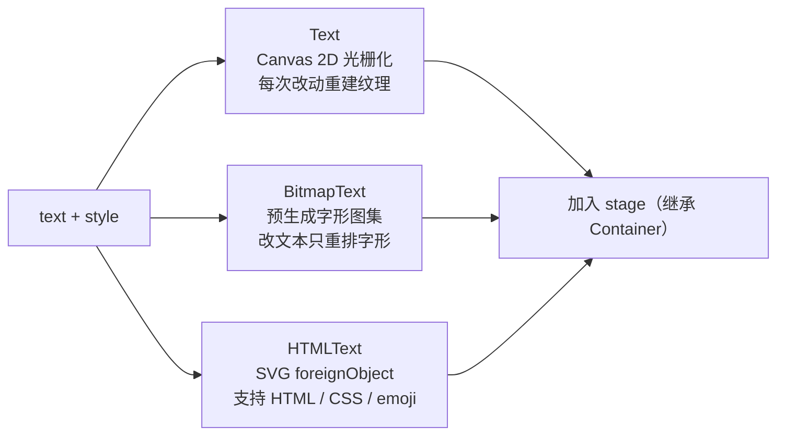

import { Canvas, Controls, Meta } from '@storybook/addon-docs/blocks';
import * as TextStories from './text.stories';

<Meta of={TextStories} name="Docs" />

# 文本

PixiJS 提供三种文本渲染器——**Text**、**BitmapText**、**HTMLText**。它们共享同一套 API：都通过 options 对象构造，都有 `.text`、`.style`、`.anchor`，都继承自 Container，因此 position、scale、rotation、tint 等变换能力与精灵一致。区别只在**用什么方式把字画到纹理上**，以及**文本或样式变化时要不要重新光栅化**——这两点决定了各自的适用场景。选渲染器的核心判断只有一句话：**样式要多丰富，文本要多频繁地变**。



| 对象 / 属性 | 默认值 | 作用 / 适用 |
| --- | --- | --- |
| `new Text({ text, style })` | — | Canvas 2D 光栅化；TextStyle 样式最丰富，每次改动重新光栅化 |
| `new BitmapText({ text, style })` | `fill` 默认 `0xffffff` | 预生成字形图集；改文本只重排字形，样式在字体生成时固化 |
| `new HTMLText({ text, style })` | — | SVG foreignObject 渲染 HTML/CSS；支持标签与 emoji，每次改动重新光栅化 |
| `text` | `''` | 文本内容，`\n` 换行 |
| `style` | — | 配置对象或样式实例；赋值或改属性都触发更新 |
| `anchor` | `(0, 0)` | 锚点（0–1 归一化），决定定位与旋转中心 |
| `resolution` | `null`（自动） | 光栅化分辨率；Text/HTMLText 跟随渲染器，BitmapText 由字体管理 |
| `TextStyle.fill` | `'black'` | 填充，支持颜色 / `FillGradient` / `FillPattern` |
| `TextStyle.fontFamily` | `'Arial'` | 字体名或回退数组 |
| `TextStyle.fontSize` | `26` | 字号（数字或 `'26px'` / `'1.6em'`） |
| `TextStyle.align` | `'left'` | 多行对齐（`left` / `center` / `right` / `justify`），单行无效 |
| `TextStyle.stroke` | `null` | 描边 `{ color, width }` |
| `TextStyle.dropShadow` | `null` | 投影 `{ color, blur, distance, angle, alpha }` |
| `TextStyle.wordWrap` | `false` | 是否换行；配合 `wordWrapWidth`（默认 `100`） |

## Text：Canvas 光栅化

Text 是默认的文本渲染器。它用浏览器 Canvas 2D API 把整段文本画成一张纹理，再像 Sprite 一样放进场景。样式最丰富——`TextStyle` 支持纯色 / 渐变 / 图案填充、描边、投影、字间距、行高、换行等——代价是**每次 `text` 或 `style` 变化都要把整张纹理重新光栅化一次**。

v8 统一用 options 对象构造（v7 的 `new Text('Hello', style)` 已废弃）：

```ts
import { Text } from 'pixi.js';

const label = new Text({
  text: 'Hello PixiJS',
  style: {
    fontFamily: 'Arial',
    fontSize: 32,
    fill: 0xffffff,
    stroke: { color: '#1f2937', width: 4 },
    dropShadow: { color: '#000000', blur: 4, distance: 6, alpha: 0.6 },
    align: 'center',
  },
  anchor: 0.5,
});
app.stage.addChild(label);
```

`style` 接受配置对象或 `TextStyle` 实例。运行时整体重赋 `label.style = {...}`，或改单个属性（`label.style.fill = 'red'`，TextStyle 的 setter 会发出 `update` 事件触发重渲染），都会重新光栅化。`anchor` 默认 `(0,0)`（左上角），设 `0.5` 改为中心。

### 样式与 TextStyle

TextStyle 常用属性（默认值见开场表）：`fill`（颜色 / `FillGradient` / `FillPattern`）、`stroke`（`{ color, width }`）、`dropShadow`（`{ color, blur, distance, angle, alpha }`）、`fontFamily`（单个名或回退数组）、`fontSize`、`fontWeight`、`align`（多行对齐）、`letterSpacing`、`lineHeight`、`wordWrap` + `wordWrapWidth`、`whiteSpace`。多行用 `\n` 分隔；`align` 只对多行有效。

下面的实例把 fill、fontSize、align、dropShadow 接到 Controls，让你实时看到 TextStyle 的影响——每次改动 Text 都会重新光栅化。

<Canvas of={TextStories.TextDemo} />
<Controls of={TextStories.TextDemo} />

| 读者操作 | 可观察证据 |
| --- | --- |
| 改「填充 fill」 | 文字颜色随即变化，纹理重建 |
| 调「字号 fontSize」 | 文字大小实时缩放 |
| 切「对齐 align」 | 三行文本从左 / 中 / 右对齐切换（单行无效） |
| 开关「投影 dropShadow」 | 出现 / 消失带模糊的投影 |
| 查看读数 | fontFamily / fontSize / align / resolution（默认自动跟随渲染器） |
| 打开 Show code | 看到该 Canvas 实际执行的 `text.ts` |

`resolution` 默认 `null` 表示自动跟随渲染器分辨率，高 DPI 屏上文字清晰；需要更锐利可显式设 `resolution: 2`。`roundPixels`（默认 `false`）置 `true` 可把位置取整，减少抗锯齿带来的边缘模糊。

## BitmapText：预生成字形图集

BitmapText 用**预生成的字形图集**渲染：先把字体（系统字体或 `.fnt`/`.xml` 文件）一次性光栅化成一组字形纹理，之后所有用该字体的 BitmapText 共享这组字形。**改 `text` 只是重新排列已有字形，不重新光栅化**——这是它最适合频繁变化文本（分数、计数器、伤害数字）的根本原因。

```ts
import { BitmapFont, BitmapFontManager, BitmapText } from 'pixi.js';

// 预装一个 ASCII 位图字体：把 Arial 的字形一次性光栅化进图集并写入全局缓存
BitmapFont.install({
  name: 'HudFont',
  style: { fontFamily: 'Arial', fontSize: 32, fill: '#ffffff' },
  chars: BitmapFontManager.ASCII, // 字符集常量在 BitmapFontManager 上
  resolution: 2,
});

const score = new BitmapText({
  text: 'SCORE 0',
  style: { fontFamily: 'HudFont', fontSize: 32, align: 'center' },
});
score.anchor.set(0.5);
app.stage.addChild(score);

// 每帧改文本——只重排已有字形，无光栅化开销
app.ticker.add(() => {
  score.text = `SCORE ${Math.floor(performance.now() / 100)}`;
});
```

`BitmapFont.install({...})`（等价 `BitmapFontManager.install`）是预装字体的入口；字符集常量 `ASCII` / `ALPHA` / `NUMERIC` / `ALPHANUMERIC` 在 `BitmapFontManager` 上。字体来源：

- **预装**：`BitmapFont.install({ name, style, chars, resolution, padding })`，从系统字体即时光栅化，适合 ASCII 范围。
- **加载文件**：`await Assets.load('fonts/Hud.fnt')`（支持 AngelCode BMFont 与 MSDF），再用文件里的字体名作 `fontFamily`。完整加载流程见「资源加载」。
- **按需自动生成**：不预装时，`new BitmapText({ style: { fontFamily: 'Arial' } })` 会在首次渲染时按需生成字体（默认 `ALPHANUMERIC` 字符集、resolution 1）。

实例上的样式受限：`fontSize` 缩放已生成的字形，`fill` / `tint` 染色，`align`、`letterSpacing` 可调；渐变填充、描边、投影等在**字体生成时**就已固化，实例改不了。BitmapText 的 `fill` 默认是 `0xffffff`（白），与 TextStyle 默认 `'black'` 不同。

下面的实例在创建时用 `BitmapFont.install` 预装一个 ASCII 字体，再用 ticker 每帧把计数器写进 `text`，演示「改文本只重排字形」的廉价更新。

<Canvas of={TextStories.BitmapTextDemo} />
<Controls of={TextStories.BitmapTextDemo} />

| 读者操作 | 可观察证据 |
| --- | --- |
| 看「计数器 running」 | 开启时 SCORE 数字每帧增长、流畅刷新——无重新光栅化代价 |
| 调「字号 fontSize」 | 字形按比例缩放（实例 fontSize 是缩放系数） |
| 改「染色 tint」 | 整体染色，字体数据不变 |
| 查看读数 | fontFamily / fontSize / tint / 当前文本 |
| 打开 Show code | 看到该 Canvas 实际执行的 `bitmap-text.ts` |

局限：完整字符集（尤其中日韩 CJK）字形数量巨大，动态生成不现实——CJK 文本请用 Text 或 HTMLText。BitmapText 的 `resolution` 由字体管理，在实例上设值无效（仅告警），要在 `BitmapFont.install` 的 `resolution` 选项里设。

## HTMLText：HTML / CSS 渲染

HTMLText 用 SVG `foreignObject` 把 HTML/CSS 渲染成纹理：支持 `<b>`、`<i>`、`<u>`、`<br/>` 等标签、`style="..."` 内联样式、emoji，以及 `tagStyles`（按标签名批量套样式）和 `cssOverrides`（注入 CSS 字符串数组）。和 Text 一样，**每次 `text` 或 `style` 变化都重新光栅化**。

```ts
import { HTMLText } from 'pixi.js';

const rich = new HTMLText({
  text: '<b>HTMLText</b> 支持 <i>标签</i> 与 <span style="color:#4f7cff">内联样式</span> 🎮',
  style: {
    fontFamily: 'Arial',
    fontSize: 28,
    fill: '#e2e8f0',
    align: 'center',
    wordWrap: true,
    wordWrapWidth: 480,
  },
  anchor: 0.5,
});
app.stage.addChild(rich);
```

HTMLText 始终按 HTML 解析内容，`<` 开头的标记会被处理：`<b>` 真的加粗、`<span style>` 真的套内联样式。不完整或非法的标签会被清理；`<br>` 会自动转成 `<br/>`，`&nbsp;` 转成 `&#160;`。需要「字面量」显示尖括号时，要么不含标签，要么自行转义。这一点与 Text 本质不同——Text 把字符串当纯文本，`<b>` 只会原样画出。

下面的实例在「内联样式」与「HTML 标签」两段内容间切换，并让你调多行对齐。

<Canvas of={TextStories.HtmlTextDemo} />
<Controls of={TextStories.HtmlTextDemo} />

| 读者操作 | 可观察证据 |
| --- | --- |
| 切「内容模式」 | 内联样式：每段不同颜色 / 字号；HTML 标签：粗体 / 斜体 / 下划线 + emoji |
| 切「对齐 align」 | 多行（含 `<br/>`）左 / 中 / 右对齐 |
| 查看读数 | 模式 / 对齐 / 字体 |
| 打开 Show code | 看到该 Canvas 实际执行的 `html-text.ts` |

跨浏览器渲染可能因 SVG / foreignObject 实现略有差异；需要像素级一致或大量动态文本时优先 Text / BitmapText。

## 最佳实践

- **按「样式复杂度 × 改动频率」选渲染器。** 样式丰富、改动少 → Text；频繁变化（计数器、伤害数字）→ BitmapText；必须用 HTML/CSS 或 emoji → HTMLText。
- **别在每帧改 Text / HTMLText 的 text。** 每次都重新光栅化整张纹理并重新上传 GPU，开销大。需要每帧更新文本就用 BitmapText——它只重排已有字形。
- **位图字体按需生成字符集。** `BitmapFont.install` 的 `chars` 只写实际用到的范围（如 `BitmapFontManager.ASCII`），别生成全量；CJK 文本交给 Text / HTMLText。
- **静态文本先设好 anchor。** 三种渲染器 anchor 默认都是 `(0,0)`（左上角），居中显示记得 `anchor.set(0.5)`。
- **共享 TextStyle 实例要小心生命周期。** 多个 Text 共用同一个 `TextStyle` 实例时，改它一处会同步更新所有引用者；但销毁样式前要确保没有 Text 还在引用它，否则会出现渲染损坏。

## 常见问题

- **文字发虚 / 不清晰**
  resolution 默认跟随渲染器，缩放显示或高 DPI 屏上可能偏糊。显式 `new Text({ ..., resolution: 2 })` 提高光栅化分辨率；BitmapText 在 `BitmapFont.install` 的 `resolution` 处设。
- **每帧改 `text` 后掉帧 / 卡顿**
  Text 与 HTMLText 每次改文本都重新光栅化整张纹理并上传 GPU。频繁更新（分数、计时）改用 BitmapText——它只重排已有字形。
- **BitmapText 报错 / 不显示「找不到字体」**
  `style.fontFamily` 必须匹配已注册的位图字体名。确认已 `BitmapFont.install`，或 `await Assets.load('xx.fnt')` 之后再创建。在渲染器初始化前加载 `.fnt` 还需 `import 'pixi.js/text-bitmap'`（默认全量包已包含）。
- **给 BitmapText 设 resolution 没反应**
  BitmapText 的 resolution 由字体管理，实例上设值只触发告警、不生效。在 `BitmapFont.install` 的 `resolution` 选项里设。
- **HTMLText 里的标签没生效 / 被吞**
  HTMLText 始终按 HTML 解析；不闭合或非法标签会被清理。确认标签合法闭合，`<br>` 会自动转为 `<br/>`。注意 HTMLText 没有「纯文本模式」——它总会解析标签，这一点和 Text 相反。
- **CJK（中文等）用 BitmapText 缺字**
  位图字体需为每个字符预生成字形，CJK 字符集过大不现实。中文等场景用 Text 或 HTMLText。

## 总结回顾

摘要：

PixiJS 的三种文本渲染器共享同一套 API（options 构造、`.text`、`.style`、`.anchor`，都继承自 Container），区别在渲染方式与重新光栅化时机。Text 用 Canvas 2D 逐实例光栅化、TextStyle 样式最丰富（fill / stroke / dropShadow / 渐变 / 换行等），每次 text / style 变化都重建纹理。BitmapText 用预生成的字形图集，所有实例共享字形，改 text 只重排不重光栅化，适合频繁变化的标签；实例样式受限（fontSize 缩放、tint 染色、align、letterSpacing），resolution 由字体管理，且不适合 CJK。HTMLText 用 SVG foreignObject 渲染 HTML/CSS，支持标签、内联样式、emoji 与 cssOverrides，每次变化也重新光栅化，且始终解析标签（与 Text 把 `<b>` 当字面量不同）。三者 anchor 默认 `(0,0)`，resolution 默认自动跟随渲染器（BitmapText 除外）。

一句话：

> 选渲染器看「样式要多丰富 × 文本要多频繁地变」：Text 样式最全，BitmapText 改文本最廉价，HTMLText 能用 HTML/CSS 与 emoji。

知识要点：

- 三种文本渲染器共享哪些 API？各自用什么方式把字画到纹理上？
- 为什么每帧改文本该用 BitmapText 而不是 Text？
- TextStyle 默认的 fontFamily / fontSize / fill / align 各是什么？
- anchor 默认值是什么，怎么改成中心？
- BitmapText 的 `style.fontFamily` 指向什么？resolution 为什么不能在实例上设？
- HTMLText 与 Text 在「标签解析」上有什么本质区别？

## 参考资料

- [PixiJS 指南：Text（Canvas）](https://pixijs.com/8.x/guides/components/scene-objects/text/canvas)
- [PixiJS 指南：BitmapText](https://pixijs.com/8.x/guides/components/scene-objects/text/bitmap)
- [PixiJS 指南：HTMLText](https://pixijs.com/8.x/guides/components/scene-objects/text/html)
- [PixiJS API：Text](https://pixijs.download/release/docs/scene.Text.html)
- [PixiJS API：TextStyle](https://pixijs.download/release/docs/scene.TextStyle.html)
- [PixiJS API：BitmapText](https://pixijs.download/release/docs/scene.BitmapText.html)
- [PixiJS API：BitmapFont](https://pixijs.download/release/docs/scene.BitmapFont.html)
- [PixiJS API：HTMLText](https://pixijs.download/release/docs/scene.HTMLText.html)
- [PixiJS v8 迁移指南](https://pixijs.com/8.x/guides/migrations/v8)
