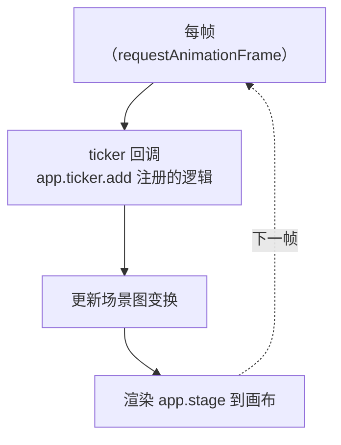

import { Canvas, Controls, Meta } from '@storybook/addon-docs/blocks';
import * as Ticker from './ticker.stories';

<Meta of={Ticker} name="Docs" />

# 渲染循环

PixiJS 的渲染循环由 `Ticker` 驱动：它基于 `requestAnimationFrame` 每帧调用你注册的回调、更新场景图变换、再把 `app.stage` 绘制到画布。`Application` 在 `init()` 后已经为你创建并启动了这个循环（`app.ticker`），你要做的只是把逐帧逻辑挂上去。本课要建立的核心直觉是：**任何「每帧推进一点」的动画，都必须乘上 delta time（`ticker.deltaTime`）**，才能在 60Hz 和 144Hz 设备上以同样速度运行。读完下面的实例你会看到：调低帧率上限时，「每帧固定加一点」的动画会变慢，而「乘 delta time」的动画速度不变。



| 属性 / 方法 | 默认值 | 用途与回查 |
| --- | --- | --- |
| `app.ticker` | `Ticker` 实例 | 驱动渲染循环；每帧先跑回调、再更新场景图并渲染 |
| `ticker.add(fn, ctx?, priority?)` | priority=`UPDATE_PRIORITY.NORMAL` | 注册逐帧回调；`fn` 收到 `Ticker` 实例 |
| `ticker.addOnce(fn, ctx?, priority?)` | — | 只在下一帧执行一次 |
| `ticker.remove(fn, ctx?)` | — | 移除回调；需传入**同一函数引用** |
| `ticker.deltaTime` | `1`（60fps 时 ≈ 1） | 帧无关增量；无量纲，= `elapsedMS × targetFPMS` |
| `ticker.deltaMS` | `16.66` | 上一帧毫秒数；受 `minFPS` 上限与 `speed` 缩放 |
| `ticker.elapsedMS` | — | 原始毫秒数；**不受** `speed` 与帧率上限影响 |
| `ticker.FPS` | ≈ 60（实测） | 只读实测帧率；不受 `speed` 影响 |
| `ticker.speed` | `1` | 时间倍率；缩放 `deltaTime` / `deltaMS` |
| `ticker.minFPS` / `maxFPS` | `10` / `0` | 帧率下限 / 上限；`maxFPS=0` 表示不限 |
| `ticker.start()` / `stop()` | — | 启停**整个**渲染循环（含渲染） |
| `UPDATE_PRIORITY` | HIGH=`25` / NORMAL=`0` / LOW=`-25` / UTILITY=`-50` | 回调执行优先级，大值先跑 |

`Ticker.targetFPMS`（静态，默认 `0.06`，即 1/16.67）是 `deltaTime` 的换算基准：一帧 16.67ms 时 `deltaTime ≈ 1`。

## 渲染循环与 Ticker

`Application` 在 `await app.init()` 完成后，`app.ticker` 就是一个可用的 `Ticker` 实例。`init` 选项 `autoStart` 默认 `true`，所以循环在 init 后立即开始——你**不需要**手动调 `render()`，只要把显示对象加进 `app.stage`，它们每帧就会被绘制（场景图结构见「场景图与容器」课）。

每一帧的管线固定为三步：

1. **ticker 回调**——所有用 `ticker.add` 注册的函数按优先级执行，你的逐帧逻辑跑在这里。
2. **更新场景图变换**——根据本帧的 `position` / `rotation` / `scale` 重算各对象的世界变换。
3. **渲染**——渲染器把 `app.stage` 绘制到画布。

把逐帧逻辑挂上去的标准写法：

```ts
import { Application } from 'pixi.js';

const app = new Application();
await app.init({ width: 800, height: 600 });

// 回调参数就是 Ticker 实例，直接读 deltaTime 做帧无关更新
app.ticker.add((ticker) => {
  shape.rotation += 0.1 * ticker.deltaTime;
});
```

`app.start()` / `app.stop()` 是 `app.ticker.start()` / `stop()` 的快捷方式，二者等价。

## 注册逐帧回调

`ticker.add(fn, context?, priority?)` 把一个函数挂到每帧执行队列里。`fn` 的参数是 `Ticker` 实例本身，所以最常用的形态是 `app.ticker.add((ticker) => { ... })`，在函数体里直接读 `ticker.deltaTime`、`ticker.deltaMS`。`context` 绑定回调里的 `this`，`priority` 控制多个回调的执行顺序（见下方）。

```ts
function spin(ticker: Ticker) {
  shape.rotation += 0.1 * ticker.deltaTime;
}

app.ticker.add(spin);        // 注册
app.ticker.remove(spin);     // 移除——必须传同一函数引用
```

几个要点：

- **移除要传同一引用。** 用箭头函数内联注册（`add(() => {...})`）后再也无法 `remove`，因为拿不到那个匿名函数。需要中途移除的逻辑，一律用具名函数。
- **`remove` 一次移除所有匹配项。** 同一函数加多次，一次 `remove` 全部清掉。
- **`addOnce`** 只在下一帧执行一次，适合「下一帧再初始化」这类延迟一帧的场景。

当多个回调并存时，`priority` 决定谁先跑。PixiJS 用 `UPDATE_PRIORITY` 常量表示：`HIGH=25`、`NORMAL=0`（默认）、`LOW=-25`、`UTILITY=-50`，值大的先执行。把必须先跑的逻辑（如物理更新）设为 `HIGH`，把只读快照、日志等设为 `UTILITY`：

```ts
import { Ticker, UPDATE_PRIORITY } from 'pixi.js';

app.ticker.add(physicsStep, undefined, UPDATE_PRIORITY.HIGH);
app.ticker.add(renderSnapshot, undefined, UPDATE_PRIORITY.UTILITY);
```

渲染发生在所有回调之后，所以无论你的回调是什么优先级，看到的都是本帧逻辑全部跑完后的结果。

## delta time：帧无关动画

这是渲染循环里最容易踩坑、也最关键的一点。如果你的动画写成「每帧加一个固定量」：

```ts
// ❌ 帧率相关：144Hz 屏上比 60Hz 快 2.4 倍
app.ticker.add(() => {
  shape.rotation += 0.05;
});
```

那么动画速度直接等于帧率：60fps 时每秒推进 `0.05 × 60 = 3` rad，144fps 时推进 `0.05 × 144 = 7.2` rad——同一份代码在高刷屏上飞快。`maxFPS` 被限制、后台标签页恢复、或一阵卡顿后，速度都会跳变。

解决办法是**乘 delta time**。`ticker.deltaTime` 是一个无量纲标量，60fps 时 ≈ `1`、30fps 时 ≈ `2`，它已经把「这帧实际过了多久」折算好了：

```ts
// ✅ 帧无关：任意帧率下都是每秒 3 rad
app.ticker.add((ticker) => {
  shape.rotation += 0.05 * ticker.deltaTime;
});
```

换算关系是 `deltaTime = elapsedMS × targetFPMS`（`targetFPMS = 0.06`）。所以 `0.05 × deltaTime` 在 60fps 下每帧 `0.05`、每秒 `3` rad；在 30fps 下每帧 `0.1`、每秒仍 `3` rad——帧数变了，但每秒推进量不变。

需要用真实时间（毫秒）计算时改用 `ticker.deltaMS`：`deltaMS` 是上一帧的毫秒数（默认基准 16.66），同样受 `speed` 缩放。要拿不受 `speed` / 帧率上限影响的原始毫秒数，用 `ticker.elapsedMS`。下面的实例把「原始」和「乘 delta」两条路径并排呈现，你能直接看到差异。

<Canvas of={Ticker.Interactive} />
<Controls of={Ticker.Interactive} />

| 读者操作 | 可观察证据 |
| --- | --- |
| 调低「帧率上限」 | 左侧红指针（不乘 delta）明显变慢，右侧绿指针（乘 deltaTime）速度不变；读数 FPS 下降、deltaTime 变大 |
| 调整「时间倍率」 | 右侧绿指针随 speed 加快 / 减慢，左侧红指针完全不动——因为 `speed` 只缩放 deltaTime |
| 打开「暂停 ticker」 | 两个指针都冻结、读数 FPS 归零——`stop()` 停的是整个渲染循环 |
| 打开 Show code | 看到该 Canvas 实际执行的 `ticker.ts`，包括 `ticker.add` 回调里两条分支 |

## 控制启停与帧率

**启停。** `ticker.stop()` 停止整个渲染循环：回调不再跑、场景图不再更新、画布也不再重绘，最后一帧停在画面上。`ticker.start()` 恢复。`Application` 的 `autoStart` 默认 `true`，init 后自动 `start()`。只想暂停「某一个动画」而保持其余内容继续渲染时，**不要**用 `stop()`——在回调里加条件跳过那段逻辑，或 `remove` 掉对应回调即可。

**帧率上限与下限。** `ticker.maxFPS`（默认 `0`，不限）设定每秒最多更新多少帧：在 60Hz 显示器上设 `30`，ticker 会隔帧才 `update`，实测 FPS ≈ 30。`ticker.minFPS`（默认 `10`）设定 `deltaTime` 的上限，用来防止卡顿或后台恢复后单帧 delta 过大导致物体「瞬移」——`deltaTime` 会被钳制到 `targetFPMS × 1000 / minFPS` 以内。两者会自动保持一致：把 `minFPS` 设到比 `maxFPS` 高时，`maxFPS` 会被顶上去（反之 `minFPS` 被压下来）。

```ts
app.ticker.maxFPS = 30;   // 省电 / 省 GPU：最多 30 帧
app.ticker.minFPS = 30;   // 防瞬移：delta 不会超过 30fps 对应值
```

**时间倍率。** `ticker.speed`（默认 `1`）整体缩放 `deltaTime` 和 `deltaMS`：设 `0.5` 即慢动作，设 `2` 即快进。因为它改的是 delta，所以只影响「乘 delta」的动画——上面实例的「时间倍率」控件就是它。

**共享 ticker。** 多个 `Application` 实例各自有独立 ticker，会各自跑一个 `requestAnimationFrame`。要让多个画布或多个子系统（如 `AnimatedSprite`、视频纹理）共用同一个循环，init 时传 `sharedTicker: true`，让 `app.ticker` 指向全局单例 `Ticker.shared`：

```ts
await app.init({ sharedTicker: true });
// 此时 app.ticker === Ticker.shared，多个实例共用一个循环
```

注意 `Ticker.shared` 默认 `autoStart = true`——第一次 `add` 就会启动；不希望它自动跑时手动 `Ticker.shared.stop()`。

## 最佳实践

- **永远乘 delta。** 凡是「每帧推进」的量都乘 `ticker.deltaTime`（无量纲）或 `ticker.deltaMS`（毫秒），不要写裸的固定增量。这是让动画在任意帧率下表现一致的唯一办法。
- **按需设 `maxFPS` 省电。** 不需要满帧的应用（如后台仪表盘、轻量动画）把 `maxFPS` 设到 30，能明显降低 GPU 占用和功耗；交互密集的游戏场景保持默认 `0`。
- **多画布共用 `sharedTicker`。** 页面上有多个 PixiJS 实例时，用 `sharedTicker: true` 共享一个 rAF 循环，比各自独立 ticker 开销更低，也更容易统一暂停。
- **回调里只做轻量计算。** `ticker.add` 的回调在主线程、每帧同步执行，耗时操作会直接拖慢帧率；重计算搬到 Worker 或分摊到多帧。

## 常见问题

- **动画在 144Hz / 高刷屏上明显变快？**
  回调里写了「每帧加固定量」而没有乘 `ticker.deltaTime`。把 `+= 0.05` 改成 `+= 0.05 * ticker.deltaTime` 即可在任意帧率下速度一致。
- **调用 `ticker.stop()` 后，连已经加进 stage 的静态内容都不更新了？**
  这是正常的——`stop()` 停的是**整个**渲染循环（回调 + 场景图更新 + 渲染），不只是你的某个动画。只想暂停某段动画时，在回调里用条件判断跳过它，或 `remove` 掉对应回调，让循环继续跑。
- **页面卡顿或从后台切回后，物体突然跳了一大段？**
  长卡顿会让单帧 delta 变得很大。`ticker.minFPS`（默认 `10`）已经把 `deltaTime` 钳制住了，通常不会真的瞬移；如果你的逻辑对跳变更敏感（如物理积分），可以再读 `ticker.elapsedMS` 自行判断是否丢弃这一帧。
- **`ticker.remove(fn)` 没有移除回调？**
  `remove` 需要传入和 `add` **完全相同的函数引用**。用内联箭头函数注册的回调拿不到引用，无法移除——改成具名函数再注册即可。

## 总结回顾

摘要：

PixiJS 用 `Ticker` 驱动渲染循环：`app.ticker` 在 `init` 后就绪，`autoStart` 默认 `true` 使循环自动开始，每帧依次执行 `add` 注册的回调、更新场景图变换、渲染 `stage`。逐帧回调用 `ticker.add(fn)` 注册、`remove(fn)` 移除，回调参数就是 `Ticker` 实例；多个回调用 `UPDATE_PRIORITY`（HIGH/NORMAL/LOW/UTILITY）排序。帧无关动画的关键是把每帧增量乘上 `ticker.deltaTime`（无量纲，60fps 时 ≈ 1）或 `ticker.deltaMS`（毫秒），否则动画速度随帧率变化。`start()` / `stop()` 控制整个循环的启停，`maxFPS` / `minFPS` 限制帧率上下限，`speed` 缩放时间，`sharedTicker` 让多个实例共用一个循环。

一句话：

> 在 PixiJS 的每帧回调里，凡是推进动画的量都要乘上 `ticker.deltaTime`——这是让动画在任意帧率下速度一致的唯一办法。

知识要点：

- 每帧管线的三步顺序是什么？`app.ticker` 什么时候就绪？
- `ticker.add` 的回调参数是什么？怎么正确移除一个回调？
- 为什么「每帧加固定量」在高刷屏上会变快？怎么修？
- `deltaTime`、`deltaMS`、`elapsedMS` 三者的区别和换算关系？
- `ticker.stop()` 停掉的是单个动画还是整个循环？只想暂停一个动画怎么办？
- `maxFPS` / `minFPS` / `speed` 分别影响什么？

## 参考资料

- [PixiJS 指南 — 渲染循环（8.x）](https://pixijs.com/8.x/guides/concepts/render-loop)
- [PixiJS API — Ticker](https://pixijs.download/release/docs/ticker.Ticker.html)
- [PixiJS API — Application（app.ticker / start / stop）](https://pixijs.download/release/docs/app.Application.html)
