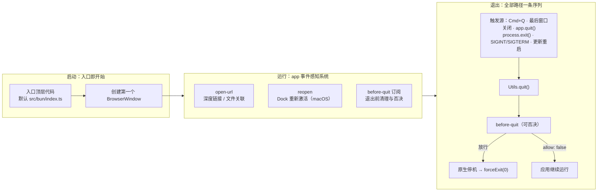

import { Canvas, Controls, Meta } from '@storybook/addon-docs/blocks';
import * as AppLifecycle from './app-lifecycle.stories';

<Meta of={AppLifecycle} name="Docs" />

# 应用生命周期

Electrobun 应用的生命周期比 Electron 简洁一档，两端各有一个关键判断：**启动端没有 ready 状态机——主进程入口文件的顶层代码就是启动点**，`new BrowserWindow()` 不需要等待任何就绪信号；**退出端所有路径（Cmd+Q、最后一个窗口关闭、`process.exit()`、终端信号、更新重启）汇聚到同一条停机序列**，`before-quit` 是整条序列里唯一能取消退出的位置。运行期对「系统如何拉起、重新激活应用」的感知靠 5 个 app 事件。本课讲清启动序、两个订阅入口的实质差异、各事件的载荷与时机、统一退出序列与优雅退出的写法；跑完课程内的观察台工程后，你能预测每种退出操作在终端打出什么。



回查时先看这组关键事实（均与 1.18.1 包内类型定义及官方 Events / Utils 文档核对过）：

| 关键事实 | 内容 | 回查要点 |
| --- | --- | --- |
| 主进程入口 | 默认 `src/bun/index.ts`，`build.bun.entrypoint` 可改 | 入口顶层代码就是启动点 |
| ready 事件 | 没有；1.18.1 的 app 事件清单里无 ready / whenReady | 创建窗口不等任何就绪信号 |
| 订阅入口 | `app.on`（handler 收 payload）/ `Electrobun.events.on`（handler 收完整事件） | 只有后者能写 `response` 否决 |
| 退出开关 | `runtime.exitOnLastWindowClosed`，默认 `true` | 常驻应用（托盘等）设 `false` |
| 退出序列 | `before-quit` → 原生停机（等待上限 5000）→ `forceExit(0)` | 清理要尽早完成，见「退出」 |
| 进程事件 | `process.on("exit")` 可用；`beforeExit` 不触发 | 兜底日志放 `exit`，别放 `beforeExit` |

## 快速上手

课程目录的 `lifecycle-observer/` 是完整可运行工程（macOS + Bun，electrobun 1.18.1）。它以 `exitOnLastWindowClosed: false` 的常驻形态运行，订阅三个生命周期事件（`open-url` / `reopen` / `before-quit`，含 `app.on` 对照订阅）并打印到终端：

```bash
cd cheatsheets/app-lifecycle/lifecycle-observer
bun install
bun start
```

窗口弹出后按清单操作，逐条核对终端输出：

| 操作 | 可观察证据 |
| --- | --- |
| 启动完成 | 终端打出「生命周期观察台已启动」 |
| 点击窗口关闭按钮 | 打出 `[close]`，但应用不退出，Dock 图标仍在 |
| 点击 Dock 图标 | 打出 `[reopen]` 并重建窗口 |
| 按 `Cmd+Q` | 两个订阅入口各打一行 before-quit 日志，随后进程退出 |
| 再次启动后在终端按 `Ctrl+C` | 同样先打 before-quit 再退出（SIGINT 路径） |

想实验否决：把 `src/bun/index.ts` 里 `before-quit` handler 中注释掉的 `event.response = { allow: false };` 打开，之后 `Cmd+Q` 将退不出去。

## 主进程入口

主进程入口是一个普通 Bun 程序的入口：进程拉起后，顶层代码从上到下同步执行，执行完（或顶层发起的异步任务挂起后）应用进入运行态。Electrobun hello-world 的全部主进程代码就是创建一个窗口：

```ts
// src/bun/index.ts —— 入口顶层代码就是启动点
import { BrowserWindow } from "electrobun/bun";

const mainWindow = new BrowserWindow({
  title: "Hello Electrobun!",
  url: "views://mainview/index.html",
  frame: { width: 800, height: 800, x: 200, y: 200 },
});
```

三个使用事实：

- **没有 ready / whenReady。** 1.18.1 的 app 事件清单里不存在就绪类事件，窗口创建不依赖任何启动信号。从 Electron 迁移时，`app.whenReady().then(...)` 里的代码直接放到入口顶层。
- **入口路径可配置。** 默认 `src/bun/index.ts`，在 `electrobun.config.ts` 的 `build.bun.entrypoint` 修改；入口文件的构建装配（views、copy）属于构建配置主题，见路线中的构建配置一课。
- **原生回调在 import 时就位。** 执行入口第一行 `import ... from "electrobun/bun"` 时，框架已注册好原生回调（退出请求、URL 打开、Dock 重新激活、`SIGINT` / `SIGTERM`）并覆写了 `process.exit`。因此 app 事件订阅放在入口顶层，就在任何退出路径之前生效。

主进程里任何 Bun 兼容的 TypeScript 都有效（官方 Bun API 页），包括顶层 `await`——启动期需要读配置、建连接时可以直接等待。

## app 事件

app 级事件都从一个共享 emitter 分发，事件对象是 `ElectrobunEvent`：`name` 是事件名、`data` 是载荷；`response` 通过 setter 写入（同时置 `responseWasSet`），`clearResponse()` 清除。包内的 `events.app.*`（`ApplicationEvents`）是这些事件的构造工厂，框架内部用它发射事件——读者主要和事件名打交道。

订阅有两条入口，差异是本课最容易踩的坑：

```ts
import { app } from "electrobun/bun"; // 命名导出
import Electrobun from "electrobun/bun"; // 默认导出带 events

// 入口一：app.on —— handler 只收到 payload（即 e.data），拿不到事件对象
app.on("open-url", (payload) => console.log(payload.url));

// 入口二：Electrobun.events.on —— handler 收到完整 ElectrobunEvent
Electrobun.events.on("before-quit", (event) => {
  event.response = { allow: false }; // 只有这条入口能写 response 否决
});
```

`app.on` 在 1.18.1 还有一个边界：它返回的退订函数在本地模式是空操作，内部包装的 handler 也未暴露，因此**经 `app.on` 的订阅没有可用的退订途径**；需要退订时改用 `Electrobun.events.on` / `off`（通道规则与[窗口事件](?path=/docs/window-events--docs)一课相同）。

事件清单（名称与载荷均与包内 `ApplicationEvents.ts` 核对）：

| 事件名 | `event.data` | 触发时机 | 可否决 | 平台 |
| --- | --- | --- | --- | --- |
| `before-quit` | `{}` | 退出序列起点，所有退出路径共用 | 是（`allow: false`） | 全平台（Linux 系统触发路径除外） |
| `open-url` | `{ url }` | URL scheme 深度链接或文件关联打开应用 | 否 | 仅 macOS |
| `reopen` | `{}` | 点击 Dock 图标重新激活应用 | 否 | 仅 macOS |
| `application-menu-clicked` | `{ id?, action, data? }` | 应用菜单项被点击 | 是 | 见[应用菜单](?path=/docs/application-menu--docs) |
| `context-menu-clicked` | `{ id?, action, data? }` | 上下文菜单项被点击 | 是 | 见[上下文菜单](?path=/docs/context-menu--docs) |

订阅时机遵循 emitter 的通用语义：事件只发给已注册的 handler，订阅之前发生的不补发。三个生命周期事件的订阅都放入口顶层。

### before-quit

`before-quit` 在退出序列最前端触发，没有载荷，是**唯一能取消退出的事件**，也是应用级清理（保存状态、落盘、注销系统资源）的主位置。两种典型写法：

```ts
import Electrobun from "electrobun/bun";

// 用法一：清理 + 放行（官方 Events 文档推荐的模式）
Electrobun.events.on("before-quit", async (event) => {
  console.log("退出前保存应用状态…");
  await saveAppState();
  await closeDatabase();
});

// 用法二：有未保存内容时否决（配合后续再次退出）
Electrobun.events.on("before-quit", (event) => {
  if (hasUnsavedChanges()) {
    event.response = { allow: false }; // 取消本次退出
    promptSaveThenQuit(); // 用户确认后再次触发退出
  }
});
```

一个必须知道的时序边界：`quit()` 发出 `before-quit` 后**立即**检查 `responseWasSet` 与 `response.allow`，随后进入原生停机。因此：

- **否决必须同步设置**——放在任何 `await` 之前。放在 `await` 之后时检查早已过去，否决无效。
- 异步清理在与停机的竞争中完成：源码停机等待的上限是 5000，清理要当作有限时间窗口对待，耗时操作（大批量落盘、网络请求）应在退出前提前做，而不是堆在 `before-quit` 里。

真实行为用观察台验证（见快速上手）：`Cmd+Q` 与 `Ctrl+C` 都会先打出 before-quit 日志再退出；打开注释掉的否决行后退出被拦下。

### open-url

`open-url` 在应用被系统以 URL 打开时触发，载荷只有 `{ url }`。两个来源共用这一个事件：

- **深度链接**：在 `electrobun.config.ts` 的 `app.urlSchemes` 注册自定义协议（如 `myapp`），用户点击 `myapp://some/path` 时系统拉起应用。
- **文件关联**：`app.fileAssociations` 注册扩展名后，双击文件、Finder「打开方式」送达的文件以 `file://` URL 到达同一事件。

```ts
import Electrobun from "electrobun/bun";

Electrobun.events.on("open-url", (event) => {
  const url = new URL(event.data.url);
  if (url.protocol === "file:") {
    console.log("打开文件:", url.pathname);
    return;
  }
  console.log("深度链接:", url.pathname, url.searchParams.get("query"));
});
```

平台与运行限制（官方 Build Configuration 文档）：目前**仅 macOS 支持**（Windows / Linux 未实现）；构建时协议写入 `Info.plist` 的 `CFBundleURLTypes`，但应用必须安装到 `/Applications`（或 `~/Applications`）注册才可靠——**dev 模式下不生效**，要验证需 `electrobun build` 后安装运行（见[构建与分发入门](?path=/docs/build-basics--docs)）；同一 scheme 被别的应用先注册时，macOS 用先安装的那个。

### reopen

`reopen` 在用户点击 Dock 图标重新激活应用时触发，载荷为空，**仅 macOS**（原生 `setAppReopenHandler` 注册；回调里框架还会把 Dock 图标重新设为可见）。典型场景是常驻应用：窗口都关了、应用还活着，点击 Dock 时重建主窗口——相当于 Electron 里 `activate` 事件承担的角色：

```ts
// 观察台工程里的实际用法：reopen 时重建主窗口
Electrobun.events.on("reopen", () => {
  console.log("[reopen] Dock 重新激活，重建窗口");
  createWindow();
});
```

`reopen` 在文档站 Events 页未列出，依据是 1.18.1 包内 `ApplicationEvents.ts` 与原生回调注册（`setAppReopenHandler`，仅 darwin）。它要生效有个前提：应用得在无窗口时继续运行，即 `runtime.exitOnLastWindowClosed: false`——否则默认行为下最后一个窗口关闭应用就退出了，轮不到 Dock 重开。常驻形态的完整组合见「最佳实践」。

## 退出

退出端的核心事实：**所有退出路径汇聚到 `Utils.quit()` 的同一条序列**。`quit()` 防重入后同步发出 `before-quit`；未被否决则停止原生事件循环、等待停机完成（源码上限 5000）、`forceExit(0)`。各触发源与例外：

| 触发源 | 经过 before-quit？ | 说明 |
| --- | --- | --- |
| `app.quit()` / `Utils.quit()` | 是 | 程序化退出的主入口；`app.quit` 就是 `Utils.quit` |
| 最后一个窗口关闭 | 是 | 需 `exitOnLastWindowClosed` 不为 `false`（默认 `true`）；含 GPU 窗口 |
| `Cmd+Q` / 应用菜单退出 / Dock 退出 | 是 | 原生 quitRequested 回调进入同一序列 |
| `process.exit()` | 是 | 被框架覆写改道 `quit()`；已在退出中则直接 `forceExit(code)` |
| `SIGINT` / `SIGTERM` | 是 | dev 终端 `Ctrl+C` 第一次即优雅退出 |
| 更新器重启 | 是 | Updater 的重启走同一生命周期，见路线中的自动更新一课 |
| 未捕获异常 | 否 | 兜底直接停机 `forceExit(1)`，不等 before-quit（源码 `uncaughtException` 处理） |
| Linux 系统发起的退出 | 否 | 官方明示 Linux 系统触发路径目前不触发 before-quit；程序化退出不受影响 |

窗口关闭为何能触发退出：框架在全局 `close` 通道的内置处理里清理窗口表，全部窗口（含 GPU 窗口）关闭后按 `exitOnLastWindowClosed` 调 `quit()`；窗口级与全局 close 的分发顺序见[窗口事件](?path=/docs/window-events--docs)。

下面的示意在浏览器里复现「触发源 → 统一序列 → 否决判定」的判定链；真实退出行为以观察台工程为准。

<Canvas of={AppLifecycle.QuitSequence} />
<Controls of={AppLifecycle.QuitSequence} />

| 读者操作 | 可观察证据 |
| --- | --- |
| 把「退出触发源」从 `Cmd+Q` 切到 `process.exit()` | 前缀步骤变为「process.exit 被框架覆写，改道 quit()」，公共停机序列不变——六条路径一条序列 |
| 打开「before-quit 否决」 | 否决判定步骤截停序列，停机步骤变灰，终点变为「应用继续运行」 |
| 再打开「用 app.on 订阅」 | handler 只收 payload 拿不到 event，否决失效，序列恢复停机路径直达进程退出 |
| 打开 Show code | 看到该 Canvas 实际执行的 `quit-sequence.ts`，判定逻辑集中在 `quitSteps()` |

与 Bun / Node 进程事件的分工（官方 Events 文档）：`process.on("exit")` 是同步、不可取消的最终钩子，在 before-quit 之后运行，适合打退出日志；`process.on("beforeExit")` 在 Electrobun 应用中**不触发**，不要把清理放那里。

dev 模式的 `Ctrl+C` 值得单独记：第一次触发优雅退出（终端保持忙，等停机完成）；再按一次强杀整个进程树（含 webview 辅助进程）；挂起时有约 10 秒的安全超时强制结束。

## 最佳实践

- 清理代码按资源归属分层：与单个窗口绑定的资源放窗口级 `close` handler（先于退出判定执行，见[窗口事件](?path=/docs/window-events--docs)）；应用级状态保存放 `before-quit`；系统级注册的注销（如[全局快捷键](?path=/docs/global-shortcut--docs)）跟随所属对象的销毁或 before-quit。要「先问用户再退」只有 before-quit 一个位置。
- 常驻应用（托盘 / 菜单栏）的标准组合：`runtime.exitOnLastWindowClosed: false` 关掉关窗即退，`reopen` 里重建主窗口，[系统托盘](?path=/docs/tray--docs)提供常驻入口，退出交给 `Cmd+Q` 或 `app.quit()`。
- 给异步清理留预算：否决同步设、清理尽早做；大体量落盘用「运行期定期保存 + 退出时只写增量」替代「退出时全量保存」，避免撞上停机等待上限。

## 常见问题

- 在 `before-quit` 里设置了 `allow: false`，退出却没有被拦住。
  先看订阅入口：`app.on` 的 handler 只收到 payload，拿不到事件对象，`response` 写不进去。否决必须用 `Electrobun.events.on("before-quit", (event) => { event.response = { allow: false }; })`。
- 把否决写在 `await` 之后，还是没拦住。
  `quit()` 发出事件后立即同步检查 `response`，异步 handler 一旦 `await` 返回，检查早已过去。把 `event.response = { allow: false }` 放在 handler 第一行、任何 `await` 之前；需要先问用户的，先否决再异步弹确认，确认后再次触发退出。
- 从 Electron 迁移，`app.whenReady()` 和 `process.on("beforeExit")` 都等不到回调。
  两者在 Electrobun 里都不存在：没有 ready 类事件，入口顶层代码就是启动点，直接把初始化写在顶层；`beforeExit` 不触发，最终兜底用 `process.on("exit")`（同步、不可取消）。
- Linux 上通过系统方式退出（如注销会话），`before-quit` 没有触发。
  官方明示的已知行为：Linux 系统发起的退出路径目前不触发 before-quit，程序化退出（`app.quit()` 等）不受影响。必须在所有路径都执行的极简清理，放 `process.on("exit")` 同步完成。
- dev 模式终端里 `Ctrl+C` 后终端一直显示忙。
  第一次 `Ctrl+C` 走优雅退出序列，要等原生停机完成；需要立即结束就再按一次 `Ctrl+C` 强杀进程树，挂起时约 10 秒后被安全超时强制结束。

## 总结回顾

摘要：

本课从两端看 Electrobun 应用的生命周期。启动端没有 ready 状态机：主进程入口（默认 `src/bun/index.ts`）顶层代码就是启动点，import `electrobun/bun` 时原生回调已就位，创建窗口不等任何信号。运行期靠 app 事件感知系统：`open-url` 承接深度链接与文件关联（仅 macOS，需构建安装后注册才生效）、`reopen` 承接 Dock 重新激活（仅 macOS，配合 `exitOnLastWindowClosed: false` 重建窗口）、`before-quit` 是清理与否决的主位置；订阅有 `app.on`（只收 payload，不可否决、不可退订）与 `Electrobun.events.on`（收完整事件，可写 `response`）两条入口。退出端所有路径——程序化退出、关最后一个窗口、系统退出、被覆写的 `process.exit()`、信号、更新重启——汇聚到 `Utils.quit()` 的同一条序列：同步发 `before-quit`、立即检查否决、原生停机（等待上限 5000）、`forceExit(0)`；未捕获异常与 Linux 系统退出是两个不经过 before-quit 的例外，兜底用 `process.on("exit")`，`beforeExit` 不触发。

一句话：

> 入口顶层代码就是启动点，所有退出路径汇聚同一条 quit() 序列；清理与「先问再退」只发生在 before-quit，否决必须用 `Electrobun.events.on` 同步设置。

知识要点：

- 主进程入口默认是什么？在哪里改？为什么不需要等待 ready 事件？
- `app.on` 与 `Electrobun.events.on` 两条订阅入口的 handler 各收到什么？哪条能否决、哪条无法退订？
- 5 个 app 事件各自的载荷、触发时机、平台限制是什么？
- 六种退出触发源里，哪些经过 `before-quit`？哪两种不经过？
- `quit()` 的停机序列分哪几步？否决判定为什么必须同步设置？
- 常驻应用（关窗不退、Dock 重开窗口）需要哪几项配置与订阅组合？
- 退出相关的兜底清理为什么放 `process.on("exit")` 而不是 `beforeExit`？

## 参考资料

- [Electrobun 文档：Events API](https://framework.blackboard.sh/electrobun/apis/events/) —— app 事件、`ElectrobunEvent` 响应机制、Shutdown Lifecycle（触发源清单、序列、与 process 事件的对比、Linux 差异、dev 模式 Ctrl+C 行为）的主要依据。
- [Electrobun 文档：Utils API](https://framework.blackboard.sh/electrobun/apis/utils/) —— `Utils.quit()` 优雅退出与 `before-quit` 取消的官方说明。
- [Electrobun 文档：Build Configuration](https://framework.blackboard.sh/electrobun/apis/cli/build-configuration/) —— `build.bun.entrypoint`、`runtime.exitOnLastWindowClosed`、`urlSchemes` / `fileAssociations` 及 macOS 注册限制。
- [Electrobun 文档：Bun API](https://framework.blackboard.sh/electrobun/apis/bun/) —— 主进程定位与「任何 Bun 兼容 TypeScript 均有效」。
- electrobun 1.18.1 包内类型定义（`dist/api/bun/index.ts` 的 `app` 导出、`dist/api/bun/events/ApplicationEvents.ts`、`dist/api/bun/core/Utils.ts` 的 `quit()` 与 `process.exit` 覆写、`dist/api/bun/core/BrowserWindow.ts` 的 `exitOnLastWindowClosed` 判定、`dist/api/bun/proc/native.ts` 的原生回调注册）：订阅入口差异、事件清单、退出序列与各触发源接线的最终依据。
