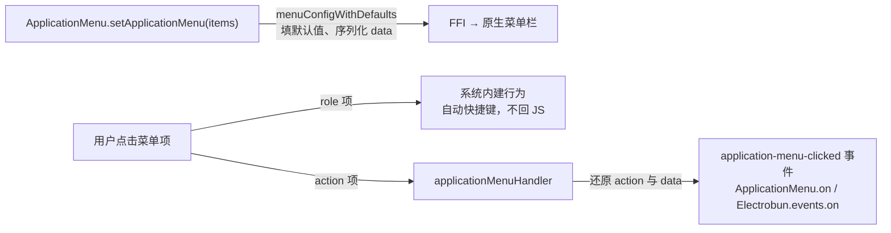

import { Canvas, Controls, Meta } from '@storybook/addon-docs/blocks';
import * as ApplicationMenuCourse from './application-menu.stories';

<Meta of={ApplicationMenuCourse} name="Docs" />

# 应用菜单

[第一个窗口](?path=/docs/first-window--docs)跑起来后，macOS 屏幕顶部还没有属于应用的菜单栏。本课讲 `ApplicationMenu`：在主进程里声明一份菜单配置，交给系统原生渲染，点击通过事件回流主进程。先建立总模型——**每个菜单项走两条互斥的路**：挂 `role` 直接接系统内建行为（Quit、Copy……自动绑定系统快捷键，不经你的代码），挂 `action` 把点击变成 `application-menu-clicked` 事件送回主进程。在此基础上展开：菜单结构与默认值、自定义项与点击载荷、角色清单、accelerator 与平台差异。macOS 是完整支持的平台，Linux 暂不支持应用菜单。



菜单项字段的缺省行为如下（均与 1.18.1 包内 `menuConfigWithDefaults` 核对过；默认值在主进程序列化时填好，整份菜单 JSON 经 FFI 交给原生层）：

| 字段 | 默认 / 兜底 | 回查要点 |
| --- | --- | --- |
| `type` | `"normal"`；`"divider"` / `"separator"` 归一为 `divider` | 分隔线两种写法等价 |
| `label` | 传入值 → 角色默认标签 → 空串 | 角色项可不写 `label`；action 项类型上必填 |
| `role` / `action` | 二选一 | 同时存在时 `role` 生效（实现里有 role 就不序列化 action） |
| `enabled` | `true`，仅显式 `false` 禁用 | 不传或 `undefined` 都可用 |
| `checked` | `false` | `true` 时项旁显示勾选框 |
| `hidden` | `false` | `true` 时隐藏该项 |
| `tooltip` | 不设 | 悬停提示文本 |
| `accelerator` | 不设 | 自定义快捷键；默认修饰键 macOS ⌘ / Windows Ctrl |
| `data` | 不设 | 随点击事件带回；一次性，见「常见问题」 |
| `submenu` | 不设 | 子项递归走同一套默认值 |

## 快速上手

复用 1.3 的 hello-world 工程（或任何 electrobun 工程），把 `src/bun/index.ts` 换成下面这份后 `bun start`：

```ts
import Electrobun, { ApplicationMenu, BrowserWindow } from "electrobun/bun";

new BrowserWindow({ title: "应用菜单", url: "views://mainview/index.html" });

ApplicationMenu.setApplicationMenu([
	// 菜单栏第一项：macOS 上这一格就是应用菜单位置，系统行为挂 role（自动绑定 ⌘Q）
	{ submenu: [{ label: "Quit", role: "quit" }] },
	{
		label: "任务",
		submenu: [
			{ label: "保存项目", action: "save-project", accelerator: "s" },
			{ type: "separator" },
			{ label: "不可用", action: "noop", enabled: false },
		],
	},
]);

// action 项的点击回到主进程；role 项不会进这个回调
Electrobun.events.on("application-menu-clicked", (e) => {
	console.log("payload:", e.data);
});
```

预期结果，逐条可核对：

- 菜单栏出现两项：第一项下拉里是 Quit；「任务」下拉里「保存项目」带 ⌘S，「不可用」灰显不可点。
- 点「保存项目」→ 终端打印 `payload: { id: …, action: 'save-project', … }`（`data` 未挂时为 `undefined`）。
- 点 Quit → 应用直接退出，终端**没有** payload 打印——role 项在原生层执行，不走事件回调。

## 菜单结构

`setApplicationMenu(items)` 接收顶层数组，**数组里每一项对应菜单栏一个标题**：

- 带 `submenu` 的项点击展开下拉，`submenu` 可继续嵌套，子项递归应用同一套默认值。
- 顶层项也可以直接带 `action`，文档注明此时它像按钮一样点击即触发，不展开下拉。
- `{ type: "divider" }` 或 `{ type: "separator" }` 插入分隔线，序列化时统一归一为 `divider`。

类型 `ApplicationMenuItemConfig` 是三个分支的联合：分隔线分支；`label` 必填 + `action` 的自定义分支；`label` 可选 + `role` 的角色分支（缺省 `label` 用角色默认标签兜底）。公共可选字段（`enabled` / `checked` / `hidden` / `tooltip` / `accelerator` / `data` / `submenu`）后两个分支都可用。

两个结构级事实：

- **整份替换，没有增量更新。** `ApplicationMenu` 模块只导出 `setApplicationMenu` 与 `on` 两个成员（依 1.18.1 包内实现）；`checked` / `enabled` 等状态变化就是重新调用一次 `setApplicationMenu` 传入整份新菜单。
- **序列化在主进程完成。** `menuConfigWithDefaults` 填默认值后，整份菜单 `JSON.stringify` 经 FFI 传给原生层；`data` 载荷此时被摘出存进主进程注册表（见下一节）。

## 自定义项与点击事件

自定义命令给菜单项一个 `action` 字符串标识，可选挂 `data` 载荷：

```ts
{ label: "保存项目", action: "save-project", data: { projectId: 42 } }
```

点击后事件名固定为 `application-menu-clicked`，两种等价订阅写法（背后是同一个事件发射器）：

```ts
import Electrobun, { ApplicationMenu } from "electrobun/bun";

// 写法一：默认导出上的 events.on（文档示例用法）
Electrobun.events.on("application-menu-clicked", (e) => console.log(e.data));

// 写法二：ApplicationMenu 模块上的 on；1.18.1 类型里回调参数是 unknown，取载荷要断言
ApplicationMenu.on("application-menu-clicked", (event) => {
	const payload = (event as { data: { action: string; data?: unknown } }).data;
	console.log(payload.action, payload.data);
});
```

回调参数是事件对象，**载荷在 `e.data` 上**，形状为 `{ id?, action, data? }`——注意自定义载荷嵌在载荷里，读法是 `e.data.data`：

- `action`：菜单项的 action 字符串，主进程据此分发命令。
- `data`：设置菜单时挂的载荷，原样带回；未挂时为 `undefined`。
- `id`：原生回调回传的数字（类型 `id?: number`）。

`data` 的传递机制（依 1.18.1 包内实现）：`setApplicationMenu` 时 `data` 被存进主进程的注册表，action 序列化成 `|EB|数据ID|action` 形式（如 `|EB|menuData_1|save-project`）随菜单下发；点击时还原出 `action` 与 `data` 再发事件，随后注册表条目被清除——**同一份菜单项的 `data` 只在第一次点击带回**，再次点击为 `undefined`。

下面的示意在浏览器里复现这条判定链：role 项与 action 项点击后分别走到哪里、事件载荷长什么样。真实原生菜单行为以课程目录的桌面范例为准。

<Canvas of={ApplicationMenuCourse.MenuClickFlowSchematic} />
<Controls of={ApplicationMenuCourse.MenuClickFlowSchematic} />

| 读者操作 | 可观察证据 |
| --- | --- |
| 「菜单形态」停在 `edit-roles`，点开 Edit 菜单，点 `Copy` | 判定路径显示「原生执行 role，不触发事件」，`e.data` 为 — |
| 切到 `custom-actions`，点「保存项目」 | 判定路径显示「触发 application-menu-clicked」，`e.data` 显示 action 与 `data: {"projectId":42}` |
| 点「自动保存」（`checked: true`） | 下拉项带 ✓ 勾选标记，点击仍触发事件并带回 action |
| 点「关闭但不保存」（`enabled: false`） | 判定路径显示「忽略」，无事件载荷 |
| 打开 Show code | 看到该 Canvas 实际执行的 `menu-click-flow.ts` |

桌面范例 `application-menu-bar.ts`（课程目录）：作为主进程入口运行后，菜单栏出现应用菜单 / 文件 / 编辑三段——Quit 挂 ⌘Q、编辑角色自动带系统快捷键、自定义项带 accelerator 与 `data`；点自定义项时终端打印事件载荷，点 Quit 直接退出且无打印。

### accelerator

`accelerator` 给自定义项指定快捷键，值是**键名字符串**，修饰键由平台默认：macOS 显示 ⌘+键，Windows 显示 Ctrl+键：

```ts
{ label: "Save Project", action: "save-project", accelerator: "s" } // macOS ⌘S，Windows Ctrl+S
```

两条边界：

- **不要给 role 项设 accelerator**：角色已自动绑定对应系统快捷键，自定义快捷键只用于 action 项（文档注明）。
- **Windows 只对简单单字符可靠**（如 `"s"` / `"n"` / `"o"`），文档注明复杂组合可能不按预期工作；macOS 完整支持自定义 accelerator。

## 角色

`role` 把菜单项直接接到系统内建行为：不写 handler，点击在原生层完成；文档注明角色自动绑定对应快捷键（如 quit 配 ⌘Q、copy/paste 配 ⌘C/⌘V）。`role` 与 `action` 互斥——实现里带 role 的项根本不会序列化 action 字段，所以角色项永远不会触发 `application-menu-clicked`。

`label` 可省略：缺省用 `roleLabelMap` 里的角色默认标签（如 `pasteAndMatchStyle` → "Paste and Match Style"）。

文档列出的 23 个常用角色（默认标签依 1.18.1 包内 `roleLabelMap`）：

| 分组 | 角色 |
| --- | --- |
| 应用 | `quit` `hide` `hideOthers` `showAll` |
| 窗口 | `minimize` `zoom` `close` `bringAllToFront` `cycleThroughWindows` `enterFullScreen` `exitFullScreen` `toggleFullScreen` |
| 编辑 | `undo` `redo` `cut` `copy` `paste` `pasteAndMatchStyle` `delete` `selectAll` |
| 语音 | `startSpeaking` `stopSpeaking` |
| 帮助 | `showHelp` |

角色清单不止这些：包内 `menuRoles.ts` 的 `roleLabelMap` 共 108 个角色，除上表外还有 `about` 与大量文本编辑类角色（按字 / 词 / 行 / 段 / 文档移动、删除、选区、大小写转换、插入等）——包内注释注明它们映射 macOS NSResponder selector，用于原生文本编辑支持。完整清单查 `dist/api/bun/core/menuRoles.ts`。

这份角色定义由 ApplicationMenu、ContextMenu、Tray 三处菜单共享：右键菜单与托盘菜单的菜单项用同一套 `role` 机制，见[上下文菜单](?path=/docs/context-menu--docs)与[系统托盘](?path=/docs/tray--docs)。

## 平台差异

| 平台 | 应用菜单 | accelerator | 角色 |
| --- | --- | --- | --- |
| macOS | 屏幕顶部菜单栏，完整支持 | 完整支持自定义组合，默认修饰键 ⌘ | 映射 NSResponder selector（包内注释） |
| Windows | 支持，accelerator 显示为 Ctrl+键 | 仅简单单字符可靠 | 支持范围文档未说明 |
| Linux | **不支持**（文档注明 Application menus are not currently supported on Linux） | — | — |

给 Linux 分发时，菜单里的功能入口需要界面内替代或托盘菜单（托盘见[系统托盘](?path=/docs/tray--docs)）。

## 最佳实践

- **系统行为挂 role，自定义命令挂 action**：Quit / Hide / 编辑类操作直接用角色，自动获得正确快捷键与原生行为；给这些项再写 action 模拟是重复劳动，还丢掉自动快捷键。应用自己的命令才设计 action 字符串，用稳定的命令名（如 `save-project`）。
- **保留一份编辑角色菜单**：文档注明 ⌘C/⌘V 等文本快捷键由角色项绑定——webview 里有文本编辑就保留 Edit 角色菜单，否则快捷键没有落脚点（见「常见问题」）。
- **菜单状态变化整份重建**：没有增量更新 API；`checked` / `enabled` 变化后重新调用 `setApplicationMenu` 传入整份菜单。重建会重新注册 `data` 载荷，顺带绕过 data 一次性清除的问题。
- **跨平台入口冗余**：Linux 无应用菜单，关键命令（退出、设置）在界面内也要有入口，不要只活在菜单栏里。

## 常见问题

- 点击 Quit / Copy 等角色菜单项，`application-menu-clicked` 回调不触发。
  正常行为：role 项由原生层直接执行，实现里根本不携带 action 字段。自定义行为必须用 `action` 项，命令分发只处理 action 即可。
- webview 输入框里 ⌘C / ⌘V / ⌘Z 不起作用。
  检查菜单里是否有 `cut` / `copy` / `paste` / `undo` 等编辑角色项——文档注明这些快捷键由角色项自动绑定。挂一份 Edit 角色菜单即可。
- 菜单项带 `data`，第二次点击回调里 `data` 变成 `undefined`。
  1.18.1 实现在点击还原 `data` 后即从注册表清除。需要每次点击都拿到同一载荷，就重建菜单（重新 `setApplicationMenu` 会重新注册），或在首次点击后把载荷缓存在主进程状态里。
- Linux 上调用 `setApplicationMenu` 没有任何效果。
  文档注明 Linux 暂不支持应用菜单；功能入口放进界面内（托盘菜单另见[系统托盘](?path=/docs/tray--docs)）。
- Windows 上 `accelerator: "shift+s"` 之类的组合键不生效。
  文档注明 Windows 仅对简单单字符 accelerator 可靠，复杂组合可能不按预期工作；组合键只有 macOS 可靠，Windows 上改用单字符，或把命令同时暴露在界面里。

## 总结回顾

摘要：

Electrobun 应用菜单是主进程声明的一份 JSON 配置：`setApplicationMenu` 填默认值（label 兜底角色标签、enabled 仅显式 false 禁用、divider/separator 归一）后整份经 FFI 交给原生渲染，整份替换、没有增量更新。菜单项走 role 或 action 两条互斥的路：role 直接连系统内建行为并自动绑定快捷键（文档常用角色 23 个，包内共 108 个映射 NSResponder 的角色）；action 项点击触发 `application-menu-clicked`，载荷 `e.data = { id?, action, data? }`，`data` 由注册表一次性带回。accelerator 只给 action 项加，macOS 完整支持、Windows 仅单字符可靠；Linux 不支持应用菜单。

一句话：

> 菜单项二选一：挂 `role` 让系统执行并自动带快捷键，挂 `action` 让点击变成 `application-menu-clicked` 事件回到主进程——两者互斥，role 项永远不进事件回调。

知识要点：

- 顶层数组的每一项对应什么？顶层项不带 submenu 而带 action 时行为如何？
- `label` / `enabled` / `checked` / `type` 的缺省行为分别是什么？
- `role` 与 `action` 同时存在时谁生效？role 项点击后发生什么？
- `application-menu-clicked` 的载荷形状是什么？自定义 `data` 在哪里读取？
- `data` 载荷为什么第二次点击拿不到？
- 常用角色有哪些分组？角色总数与映射目标是什么？
- `accelerator` 的值怎么写？默认修饰键在各平台是什么？哪些平台受限？
- 应用菜单在 macOS / Windows / Linux 的支持情况分别如何？菜单状态变化后如何更新？

## 参考资料

- [Electrobun 文档：Application Menu API](https://framework.blackboard.sh/electrobun/apis/application-menu/)
- [Electrobun 文档：Events（事件对象与 e.data 载荷的通用机制）](https://framework.blackboard.sh/electrobun/apis/events/)
- electrobun 1.18.1 包内类型定义：`dist/api/bun/core/ApplicationMenu.ts`（setApplicationMenu / on 与默认值合并）、`dist/api/bun/core/menuRoles.ts`（roleLabelMap 全量角色）、`dist/api/bun/proc/native.ts`（ApplicationMenuItemConfig 与 data 序列化）、`dist/api/bun/events/ApplicationEvents.ts`（事件载荷类型）。
